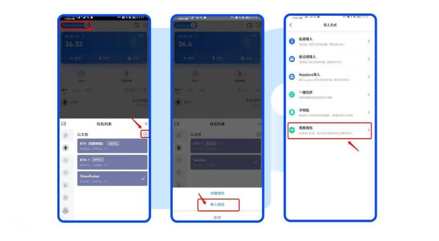

# USDT在冷钱包可以买卖吗？USDT买卖交易教程

当前投资者都会选择将资产存入冷钱包当中，冷钱包是一种离线存储加密货币的硬件设备，可以提供更高的安全性和保护资产免受网络攻击的风险。而USDT是一种基于区块链技术的稳定币，是最受欢迎的稳定币。当投资者将USDT存入冷钱包时，就会关心USDT在冷钱包可以买卖吗？USDT代币的买卖是可以在任何支持该代币的交易平台上进行的，无论将USDT存储在冷钱包还是热钱包中。接下来[**GTokenTool**](https://www.gtokentool.com)为大家详细说一说。

## USDT在冷钱包可以买卖吗？

要进行USDT的买卖交易，通常需要将USDT从冷钱包转移到一个支持交易的热钱包或交易所帐户。然后，您可以在支持USDT交易的平台上执行买卖操作。下文是在TP钱包中，USDT交易教程：

1、点击左上角选择钱包，点击【+】，点击【导入钱包】，选择【观察钱包】

<figure><figcaption></figcaption></figure>

2、在上方空白栏输入观察钱包的公钥/地址，勾选用户协议，点击【导入钱包】，至此，您已成功导入观察钱包。

<figure><figcaption></figcaption></figure>

3、点击【转账】，输入收款地址和转账金额，点击【确认】，点击【确认支付】。由于观察钱包转帐需要使用对应的冷钱包扫码签名，因此您需要打开该观察钱包对应的冷钱包进行扫码确认。

<figure><figcaption></figcaption></figure>

## 冷钱包的密码可以找回吗？

冷钱包的密码忘记是没法找回的，因为它是去中心化的。如果能记得曾经使用过的密码或者可能使用过的密码，可以使用穷举法来暴力破解。

冷钱包的密码通常是由用户自己设置和管理的，因为冷钱包的安全性和私密性是用户自己的责任。一般情况下，冷钱包的密码不可以被找回，因为冷钱包通常是离线设备，没有与任何中心化服务或机构连接，也没有“忘记密码”选项。这意味着如果忘记了冷钱包的密码，通常情况下是无法通过重置密码或找回密码的方式来访问其中的资产的。

保持冷钱包的密码和助记词的安全性至关重要，如果忘记了冷钱包的密码，唯一的办法可能是尝试使用密码提示或回想密码。如果这些方法都无法帮助找回密码，那么可能需要寻求专业的密码恢复服务，尽管这通常会涉及高昂的费用，而且成功并不保证。

**GTokenTool**提醒大家，在USDT具体的交易过程和平台可能会有所不同，因此在进行USDT交易前，建议您仔细阅读所选平台的使用说明和安全建议。确保使用安全的交易平台，并采取适当的安全措施来保护您的加密资产。务必选择可信任和受监管的加密货币交易所，并采取必要的安全措施，如启用双因素身份验证和定期检查您的帐户以确保安全。保持加密货币安全性是非常重要的，尤其是当涉及到交易和存储大量资产时。

如有不明白或者不清楚的地方，请加入官方电报群：[**https://t.me/gtokentool**](https://t.me/gtokentool)
