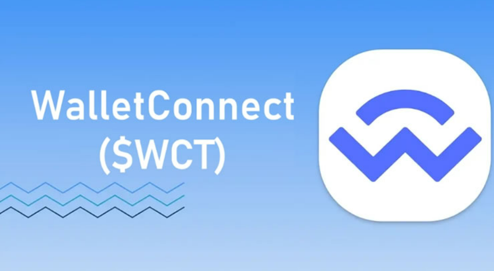

# WCT币是什么？如何参与WCT空投?

<figure><figcaption></figcaption></figure>

## 什么是 WalletConnect？

WalletConnect 是一个开源网络，通过安全且可互操作的协议将用户连接到去中心化应用程序 (dApp)。通过标准化链上交互，WalletConnect 使用户能够毫不费力地将他们的数字钱包连接到 dApp。

借助 WalletConnect，用户可以无缝购买加密货币、交易 memecoin 和收藏数字艺术品。该平台已将数百万用户安全地带入链上生态系统。

传统上，将钱包连接到区块链应用程序需要复杂的步骤，这通常会让新用户望而却步，并造成生态系统的分 裂。WalletConnect 通过提供与数百个钱包和数千个 dApp 兼容的通用连接方法简化了此过程。

WalletConnect 团队将该项目开发为一座桥梁，通过二维码扫描实现与区块链网络的互动，使区块链的使用变得简单快捷。其生态系统不断扩大，为更多用例引入应用程序。

<figure><figcaption></figcaption></figure>

WalletConnect 的主要里程碑：

* 扩展到超过 40,000 个应用程序和 600 个钱包。
* 到 2024 年将实现超过 1.5 亿个连接。
* 每日远程连接数实现稳定增长，展现出广泛的应用。
* 过渡到由第三方节点运营商支持的去中心化、无需许可的数据库。

从Shopify、Coinbase Ventures、ConsenSys、Circle Ventures 和 Haskey Group 等知名投资者处获得了 2475 万美元的资金。

## WCT币是什么？

WalletConnect Token(WCT)是WalletConnect网络的原生代币，旨在通过治理、质押和奖励等功能提升链上用户体验。随着WalletConnect生态系统的扩展，WCT逐渐变得重要，特别是通过其空投分发计划。

WCT的总供应量限定为10亿，其中27%保留给WalletConnect基金会，18.5%通过空投分发给符合条件的用户和贡献者。其余代币将分配给项目团队、奖励计划、早期支持者以及核心开发团队。

WCT旨在支持网络功能并促进生态系统的发展，所以在推出时，WCT是不可转移的。这一设计确保了代币会留在生态系统内部，发挥其作用，推动WalletConnect网络的长期稳定发展。在可转移性引入前，WalletConnect将测试所有代币功能，并避免可能因过早转移带来的潜在风险。

未来，WalletConnect基金会将开展讨论，决定是否启用WCT代币的可转移性，而这一决定将通过WCT持有者投票决定。

## WCT代币概述

WCT 代币为 WalletConnect 的链上 UX 生态系统提供支持，发挥奖励和治理机制的作用。

* 代币名称：WalletConnect
* 符号：WCT
* 总供应量：10亿WCT

**分配：**

* 核心开发：7%
* 奖励：17.5%
* 空投：18.5%
* 团队：18.5％
* 早期支持者：11.5%
* WalletConnect 基金会：27%

**特征：**

* 交易费用：虽然最初是免费的，但 WCT 持有者可以对各种服务的费用结构进行投票。
* 奖励：WCT 代币作为奖励分发，以激励参与并提高网络的安全性和效率。
* 质押：用户可以质押WCT获得奖励并参与治理。
* 治理：WCT 持有者可以对提案和变更进行投票，通过分散治理赋予社区对项目开发的控制权。

**关键要点：**

WalletConnect通过开源连接网络，简化了用户将任意加密钱包连接到去中心化应用程序的过程，所有互动均经过加密处理，可充分确保用户的账户安全。

WalletConnect网络正在向去中心化迈进。WalletConnect将推出Connect Token（WCT），它将通过激励机制和治理功能，帮助网络的用户、应用程序和钱包社区共同打造一个更美好的链上未来。

WCT将在Optimism的OP主网上发布，它既具有以太坊的安全性，又拥有OP主网的高速性。

第一季的WCT空投注册已开放至10月18日，2024年11月将进行空投资格审查。第二季及后续空投将从2025年开始。

自2018年推出以来，WalletConnect为加密社区提供了一种便捷方式，使用户能够将支持的钱包与任意区块链上的去中心化应用程序连接。根据项目数据显示，WalletConnect已为超过2300万用户提供了1.5亿次连接，涵盖600个钱包、4万个应用项目及所有区块链。

WalletConnect基金会与网络中的其他节点运营商和贡献者正在按照既定路线图前进，目标是实现一个完全开放、无许可、去中心化的WalletConnect网络。WalletConnect代币（WCT）作为网络的原生代币，具有多种用途，如费用结构、奖励机制、质押功能，以及作为WalletConnect生态系统的治理工具。

<figure><figcaption></figcaption></figure>

## 什么是 WalletConnect？

WalletConnect 是一个链上用户体验生态系统，允许用户无论是通过网页端还是应用程序端，都可以将他们的加密钱包连接到去中心化应用程序。它于2018年推出，解决了web3生态中长期存在的连接问题，成为当前链上基础设施的重要组成部分。WalletConnect通过深度链接和加密二维码的方式，将用户钱包与去中心化应用程序连接。用户只需扫描WalletConnect的二维码，即可完成钱包与dApps的连接。WalletConnect获取应用请求并将其传递至用户的钱包，用户批准后即可完成交易。在此过程中，用户的数据通过端到端加密得到保护，实现了安全的无缝交易体验。

WalletConnect网络支持多链，随着它的不断扩展，其正逐步向完全无许可模式转变。原生代币Connect Token（WCT）将在WalletConnect网络推出后，为治理、质押、奖励及费用结构等方面提供动能。

## WCT代币的用途

WCT代币具有多项功能，主要包括：

**费用**

WalletConnect尚未对应用程序或SDK使用中继服务收取费用。然而，由于提供隐私保护和抗审查服务的成本，以及WalletConnect不出售数据或对系统进行控制，因此未来可能会基于社区治理实施费用结构。

根据协议信息，费用将由应用程序和SDK支付，因为它们是连接的主要受益者。用户无需支付任何连接费用，因为WalletConnect始终确保用户体验位于首位。

**奖励**

WalletConnect将推出一个基于WCT代币的长期奖励计划。17.5%的代币供应将用于奖励分配，其中5%将在第一年发放。该计划的目标是：

* 激励用户积极参与网络活动；
* 鼓励参与者长期投入；
* 确保网络的安全性和高效运行；
* 促进WalletConnect生态的整体发展和可持续性。

奖励计划涵盖了网络中的关键部分，如节点和钱包。

**节点奖励**

节点奖励是对网络服务节点提供者的激励，基于其表现来发放奖励。服务节点负责维护网络的数据存储层，管理一个用于存储和传输网络数据的分布式数据库。通过奖励计划，服务节点将根据其运行表现和在线时间获得WCT代币。初始阶段将向服务节点发放10万个不可转移的WCT代币，后续则根据节点活动持续提供奖励。

**钱包表现奖励**

使用WalletConnect协议的钱包也可以通过良好表现获得奖励。为了参与钱包表现奖励计划，钱包需要在协议中质押一定数量的代币，并且每月完成至少10万次成功的连接和签名。钱包表现奖励可以根据社区的决议进行调整。

**质押**

WCT代币持有者可以通过质押代币参与治理并赚取奖励。质押期可以从一周到两年不等，质押时间越长，奖励越多。质押后，代币将在质押期满前锁定，期满后还有7天的等待期，之后代币才能返还给持有者。

目前已经支持手动再质押功能，WalletConnect计划未来推出自动再质押功能，方便持有者自动再质押其奖励以获得更多收益。

**治理**

为了保障项目的透明性、去中心化及社区参与，WalletConnect将推出一个由WCT代币支持的去中心化自治组织（DAO）。WCT代币持有者可以通过质押代币参与治理，提出提案并对关键问题投票，影响项目发展方向。

在治理初期，WalletConnect基金会将负责项目的管理工作。随着项目的发展，基金会将逐步将治理权移交给由社区选举的委员会，委员会将负责合作伙伴关系、技术开发等多方面的事务。

## 如何参与WCT空投注册

WalletConnect希望通过Connect Token空投来回馈用户，总供应量中有18.5%将用于多个赛季的空投分发。在第一季空投中，将发放5000万枚WCT（占总量的5%）给符合条件的用户和贡献者，剩余的空投将于后续赛季分发。在第一季，4000万枚代币（占总量的4%）将发放给用户，贡献者则会获得1%的份额。

接下来，我们来看如何注册WCT空投。

请注意，注册并不意味着你一定符合空投资格。

1.首先，访问空投页面： [https://airdrop.walletconnect.network/](https://airdrop.walletconnect.network/)

一定要核对网址的真实性，确保进入官方页面。

2.在空投页面的左下角，点击“Register Here”继续操作。

<figure><figcaption></figcaption></figure>

3.点击“Connect Now”继续下一步。

<figure><figcaption></figcaption></figure>

4.选择你的钱包或连接方式，并按照提示连接你的钱包。

建议使用支持WalletConnect协议的钱包进行连接。

<figure><figcaption></figcaption></figure>

5.完成钱包连接后，签署消息以确认你是钱包的所有者。

<figure><figcaption></figcaption></figure>

6.完成后，你的空投资料将会生成。

<figure><figcaption></figcaption></figure>

7 你还可以点击“Link GitHub”或“Add Address”来关联GitHub账户或添加其他钱包地址。

本次空投注册从2024年9月24日开始，截止到2024年10月18日。参与者将可以在2024年11月查看自己的空投资格。

## WCT空投的资格要求

WCT空投有不同的参与资格标准。满足这些要求有助于提升你获得空投奖励的机会，但并不保证你一定符合条件。

**用户活动**

用户类别的资格会根据以下几项活动进行评估：

* 通过WalletConnect协议在支持的区块链网络上连接去中心化应用。
* 通过WalletConnect协议签署的交易数量。
* 已连接钱包的整体链上活动情况。

**贡献者活动**

贡献者类别的资格评估依据以下活动：

* 对CAIP（链无关改进提案）的贡献。这类提案是针对多个区块链的技术改进，不限于某个特定链。
* 对EIP（以太坊改进提案）的贡献。这类提案是为以太坊网络提出的开发建议。
* 使用EVM开发工具包（SDK）。
* 使用非EVM SDK的项目也符合资格。
* 对链上生态系统有积极影响的开源项目也会被归入贡献者类别。

需要注意的是，本次第一季WCT空投的快照已于2024年9月1日完成，只有在此之前的活动才会被考虑在此次空投资格中。

## WCT空投是如何运作的?

WalletConnect将其总供应量的18.5%分配用于空投。第一轮空投分发了5000万个代币，依据用户过去的活动和对开源项目的贡献进行分配。参与者在2024年9月至10月期间注册，符合条件的用户现在可以查看自己的状态并领取代币。

**WalletConnect 基金会的作用**

WalletConnect 基金会成立于 2024 年，致力于构建和支持去中心化、无需许可的生态系统。该组织连接用户和开发者的利益，致力于创建一个由选择、控制和所有权定义的互联网生态系统。

Web3 目前面临的挑战（例如可用性差和访问受限）阻碍了其充分发挥潜力。通过 WalletConnect Network 和 WCT 的去中心化，该基金会整合了实用性和尖端技术，以增强平台的用户体验 (UX)。

WalletConnect 通过链接链上激励措施来优先考虑更好的用户体验，从而满足全球数字社区的需求。WCT 在过去 12 个月内实现了 240% 的增长，并鼓励进一步增长并吸引新的合作伙伴。

**WalletConnect 的工作原理**

WalletConnect 通过中继服务器基础设施运行，实现钱包和 dApp 之间的实时通信。该过程的工作原理如下：

* **启动连接：**&#x7528;户使用移动钱包扫描 dApp 提供的二维码。Reown AppKit 等集成工具或自定义解决方案可实现无缝二维码通信。
* **提供连接：**&#x4E00;旦扫描，钱包就会在几秒钟内与 dApp 建立连接。
* **安全连接：**&#x57;alletConnect 对钱包和 dApp 之间交换的所有消息进行加密，确保用户数据的私密性和安全。
* **跨区块链互操作性：**&#x57;alletConnect 支持跨多个区块链的交互，允许用户访问以太坊、Solana 等上的应用程序，而无需为每个网络提供单独的工具或钱包。

## 谁使用 WalletConnect？

WalletConnect 的广泛采用凸显了其在链上生态系统中的重要性。它为超过 3000 万访问 dApp 的用户提供了超过 1.8亿个连接。WalletConnect 已成为最广泛使用的协议之一。

**常见用户组：**

* **日常用户：**&#x5BF9;于那些管理资产或安全使用应用程序的用户来说，WalletConnect 提供了用户友好的体验，消除了技术复杂性。
* **开发人员：**&#x57;alletConnect 提供标准化的连接方法，使开发人员能够专注于构建功能，而不是管理连接性和安全性。
* **生态系统合作伙伴：**&#x57;alletConnect 兼容数百种钱包和数千种应用程序，是链上世界的重要桥梁，为跨网络用户释放无限可能。

## WalletConnect 的去中心化机制增强

WalletConnect 中继基础设施的去中心化不仅限于分布式服务器，还创建了一个无需集中实体即可运行的弹性网络。关键原则：

* **分布式节点基础设施：**&#x5F15;入节点将网络从集中式服务器转变为分散式结构。
* **无需许可的参与：**&#x4EFB;何人都可以作为节点运营商加入，无需中央批准，这符合网络在整个社区中分布的信任的核心原则。
* **安全性和弹性：**&#x53BB;中心化降低了基础设施漏洞的风险，增强了网络抵御攻击的能力，确保用户持续、安全的访问。

WalletConnect 通过创建通用连接方法简化了区块链交互，实现了跨链互操作性并使分散的互联网使用更加方便。

## 结论

作为一个重要的连接协议，WalletConnect服务了数百万用户，为去中心化应用的连接提供了便捷的渠道。通过推出WC代币，WalletConnect希望通过奖励计划和去中心化治理，让更多的用户、应用和钱包共同参与到链上生态的建设中。

如有不明白或者不清楚的地方，请加入官方电报群：[https://t.me/gtokentool](https://t.me/gtokentool)
