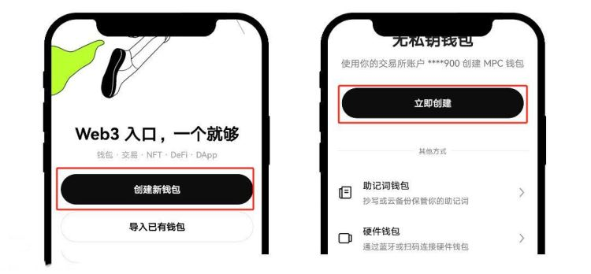

# Web3钱包怎么创建？创建Web3钱包详细教程

Web3钱包是一种数字钱包，用于存储、发送和接收加密货币和非同质化代币(NFTs)等。与传统的数字钱包相比，Web3钱包用户拥有更大的数据控制权和隐私保护，能够更直接、安全地参与去中心化网络和应用，同时提供了更加开放和灵活的数字资产管理方式。因此投资者更喜欢创建并拥有一个属于自己的Web3钱包，但很多新手还不知道Web3钱包怎么创建？其实创建还是比较简单的，主要就是先下载一个钱包应用。下面[GTokenTool](https://www.gtokentool.com)为大家详细说说创建Web3钱包详细教程。

## Web3钱包怎么创建？

Web3钱包创建还是比较简单的，主要就先下载钱包的应用软件，下文是以欧易钱包未来创建教程：

1、下载欧易官方App，切换至\[Web3钱包]，选择\[创建新钱包]，点击\[立即创建]

<figure><figcaption></figcaption></figure>

2、带你开页面后，设置密码，并备份助记词。如果你已经拥有自己的钱包，可以将助记词或私钥导入到欧易Web3钱包，以便无障碍查看并管理资产，享受丝滑的多链体验。

<figure><figcaption></figcaption></figure>

## Web3钱包密码忘记了怎么办？

Web3钱包密码忘记了可以通过密码提示进行记忆唤醒、使用备份助记词或私钥恢复或者充值密码，或者联系相关客服寻求帮助，下文是具体介绍：

1. **密码提示：**&#x6709;些钱包会提供密码提示功能，你可以尝试查看是否设置了密码提示并根据提示来回忆密码。
2. **备份助记词或私钥：**&#x5982;果你在创建钱包时有备份助记词或私钥，可以使用它们来恢复钱包或重新设置密码。通常，在创建钱包时会提示你备份这些重要信息，建议将它们保存在安全的地方。
3. **重置密码：**&#x4E00;些钱包提供了重置密码的选项。你可以尝试在钱包应用或官方网站上查找关于重置密码的信息，并按照指引进行操作。
4. **联系支持：**&#x5982;果以上方法都无法解决问题，可以联系钱包提供的客户支持或访问其官方社区寻求帮助。提供足够的身份验证信息和钱包相关信息，他们可能会提供进一步的指导或帮助你恢复钱包。

是上上常见的Web3钱包主要就是MetaMask、OKX Web3 Wallet等，这些钱包通常提供桌面版和移动版应用，用户可以根据自己的设备选择合适的版本进行安装和使用。需要注意的是，使用任何数字钱包都需要谨慎处理私钥和敏感信息，确保备份并保护好钱包的安全性。同时也要遵循钱包提供的安全建议和最佳实践，避免遭受钱包丢失或盗窃的风险。

以上就是Web3钱包怎么创建？创建Web3钱包详细教程的详细内容，如有不明白或者不清楚的地方，请加入官方电报群：[https://t.me/gtokentool](https://t.me/gtokentool)
