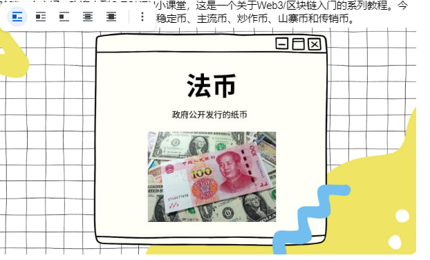
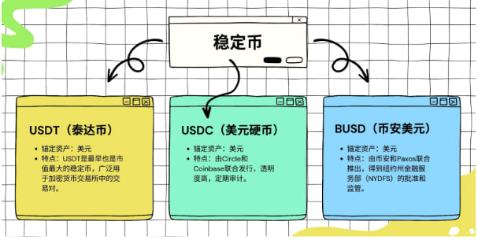
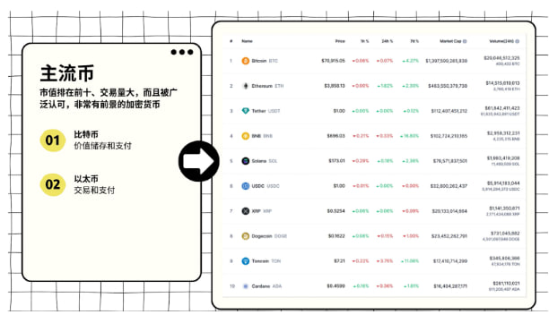
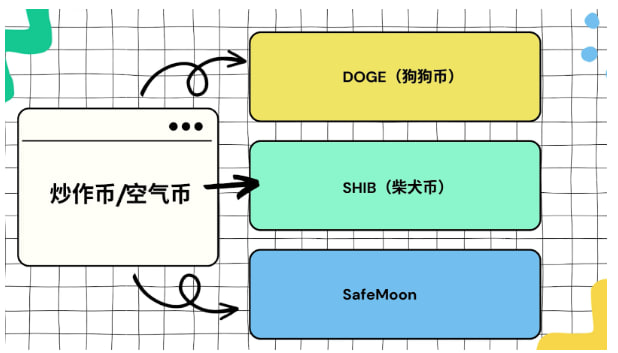
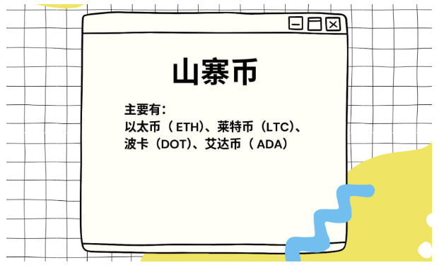
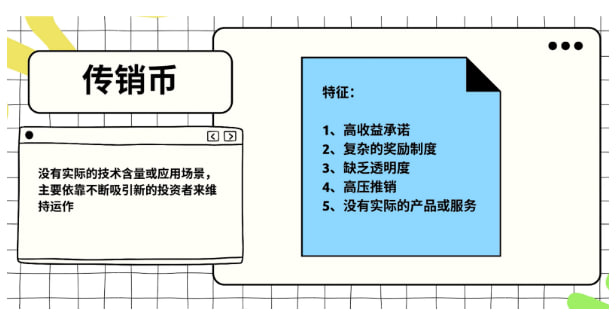
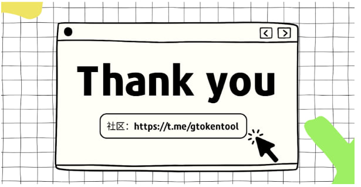

# 稳定币、主流币、炒作币/空气币、山寨币、传销币

<figure><figcaption></figcaption></figure>

哈喽，大家好，欢迎来到GTokenTool小课堂，这是一个关于Web3/区块链入门的系列教程。今天讲的是加密货币主要的5种类别，稳定币、主流币、炒作币、山寨币和传销币。

<figure><figcaption></figcaption></figure>

在介绍加密货币之前，我们先聊一下法币，法币全称是法定货币，就是由政府发行的纸币，像人名币、美元这些。

这里为什么要提到法币呢？因为在加密货币中有这样一类币，它们的价值是对标法币或者其他资产，来维持自身价值的稳定，这种就是稳定币。

\

<figure><figcaption></figcaption></figure>

我们要讲的第1个种类，稳定币，顾名思义，要的就是一个稳定。在区块链中，加密货币的价格涨跌幅度是非常大的，就比如，你给一个人转账，你转的时候是一个价格，他收到的时候又是另外一个价格，不太适合日常的交易。

稳定币就解决了这个问题，而且通过稳定币来兑换加密货币，成本会更低。所以一般是建议先将法币转换成稳定币，再用稳定币去兑换其他加密货币。

稳定币主要有哪些呢？第一个是USDT，也叫泰达币。上一期，我们也提到过，就是U。

它是目前市值最高的稳定币之一，与美元1:1恒定，而且在所有的链上都是通用的，所以是被广泛使用的一种币。然后是USDC（美元硬币）、BUSD（币安美元），它们也都是与美元1:1挂钩。

\

<figure><figcaption></figcaption></figure>

第二种,主流币, 通常是指那些市值排在前十、交易量大，而且被广泛认可，非常有前景的加密货币。

大家可以在CoinMarketCap网站查询最新的排名，目前主流币有哪些呢？第一个是BTC（比特币），然后是ETH（以太币），USDT泰达币，BNB币安币，SOL(索拉纳)，USDC（美元硬币），XRP（瑞波币），DOGE（狗狗币），TON（），ADA（艾达币）。

比特币主要的作用是价值储存和支付，它也被称为“数字黄金”，一些人会选择买来屯着，做长期投资。也可以用来做跨境转账，在区块链跨境转账，既快速成本又低。以太币作为以太坊平台的原生货币，主要是用来交易和支付。

\

<figure><figcaption></figcaption></figure>

第三种，炒作币，也叫空气币，没有什么实际的技术支持或应用场景，就是通过炒作和过度的宣传，使得价格大幅波动，并且容易受市场情绪影响。通过它的特性，可以看出风险是比较高的，建议只做短期投资考虑，做好不要投入太多。

那炒作币主要有哪些呢？DOGE（狗狗币），它是炒作币种最被大家熟知的一种。最开始是作为玩笑创建，为了讽刺比特币圈的投机氛围，但是因为马斯克等名人的支持，让它受到了非常大的关注和炒作，如今已成为市值排行前十的主流币。然后是SHIB（柴犬币）、SafeMoon等等。

\

<figure><figcaption></figcaption></figure>

第四个山寨币，比特币是第一个被开发出来的区块链货币，也是加密货币的开创者。比特币之后出现的加密货币，就都被认为是山寨币。所以它并不是一个贬义词。

山寨币主要有，以太币（ ETH）、莱特币（LTC）、波卡（DOT）、艾达币（ ADA）。

\

<figure><figcaption></figcaption></figure>

第五个传销币，传销币也叫“庞氏币”或“骗局币，听这个 名字就知道是诈骗的，所以大家要小心遇到这种。这些币一般没有什么实际的技术含量或应用场景，它就像传销一样，主要靠不断拉人入场，来维持运作。下级还有下一级，打着区块链的幌子行骗。

这种币的特征是什么呢？

1、高收益承诺：传销币通常会承诺有高额的回报，吸引投资者快速加入。

2、复杂的奖励制度：通过很多层级的推荐奖励，还有分红机制吸引更多投资者加入

3、缺乏透明度：通常项目方不公开项目的技术细节、团队背景和财务状况。

4、高压推销：利用社交媒体和其他平台进行高压推销，强调投资机会的稀缺性和紧迫性。

5、没有实际的产品或服务：传销币通常没有实际的技术基础或应用场景，主要依靠这些被骗进来的人，他们的资金流动来维持运作。

举个例子，BitConnect，是比较著名的庞氏骗局之一，用高收益的贷款计划吸引投资者，从发行以来，它的多层次传销结构就让人怀疑是庞氏骗局。市值还一度挤进过加密货币前20，但最终在2018年崩盘，投资者的损失也是非常惨重。

\

最后讲一讲加密货币和虚拟货币的区别

加密货币是基于区块链的货币，是虚拟货币的一种，

那虚拟货币，不仅仅包含加密货币，还有其他的，比如我们平时玩游戏，上面的游戏币，可以买道具或者装备，像这种也是虚拟货币

但我们在区块链中用到的基本上就只是加密货币

\
\

<figure><figcaption></figcaption></figure>

以上就是今天想分享给大家的内容，欢迎大家关注订阅，我们下期再见!

\
