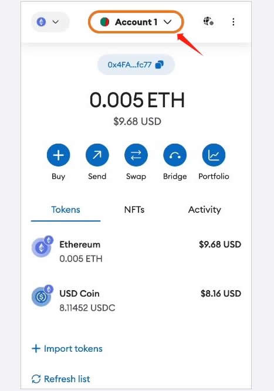

# 小狐狸钱包怎么导出私钥？小狐狸钱包导出私钥操作教程

私钥就是开启每个账户的钥匙，只要手中有私钥，就能掌握账户的一切资产，反之如果没有私钥，将失去操作钱包的权利，所以用户对于的私钥的保护是异常敏感的。小狐狸钱包是安全性价高的一款加密钱包，也深受投资者喜爱，私钥对小狐狸钱包同样拥有重要性，有的时候是需要导出私钥进行事情操作的，那么小狐狸钱包怎么导出私钥？其中步骤是比较简单的，接下来[**GTokenTool**](https://www.gtokentool.com)为大家介绍一下导出私钥的详细介绍。

## 小狐狸钱包怎么导出私钥？

小狐狸钱包导出私钥步骤是比较简单的，以下是小狐狸钱包导出私钥教程的详细步骤：

1、单击屏幕顶部的帐户选择器。

<figure><figcaption></figcaption></figure>

2、单击要导出的帐户旁边的三个垂直点。

<figure><figcaption></figcaption></figure>

3、在“账户详细信息”页面上，点击“显示私钥”。

<figure><figcaption></figcaption></figure>

4、输入您的钱包密码并点击“确认”。

<figure><figcaption></figcaption></figure>

5、单击并按住“按住以显示私钥”以显示您的私钥。

<figure><figcaption></figcaption></figure>

6、单击将私钥复制到剪贴板。确保将其保存在安全的地方。单击“完成”关闭屏幕。

<figure><figcaption></figcaption></figure>

## 小狐狸钱包主要功能是什么？

小狐狸钱包主要有3个功能，小狐狸钱包操作简单方便、齐全的功能以及安全性，是最广泛使用的以太坊加密货币钱包。

以下是功能的详细介绍：

### 1、存储储存加密货币与NFT：

Metamask支援EVM链的操作，产生的是EVM的地址，只能存取对应区块链的链上资产。加密钱包的功能之一是产生私钥，私钥可以算出公钥，公钥可以算出地址，只有对应的私钥可以动用这个地址里的加密资产。拥有一个自己掌握私钥的链上地址，就可以储存各种加密资产在里面，例如各种加密货币或NFT，地址里的资产只有拥有私钥的人可以动用，所以务必保护好私钥不要外流。

### 2、参与DeFi操作：

根据DefilLama上的数据，以太坊依然占据最主流的市场将近六成，剩下的四成中也有许多是EVM兼容链，而EVM链上的DeFi协议几乎都支援Metamask，也就是说通过小狐狸钱包，就可以前往体验目前绝大部分的DeFi世界。

### 3、支援各EVM链的加密货币钱包：

小狐狸钱包的特色之一就是支援EVM兼容的区块链，简而言之如果是EVM兼容链，就可以透过小狐狸钱包来存储与操作链上资产。

以上全部内容就是对小狐狸钱包怎么导出私钥这一问题的教程介绍。需要注意的是，加密货币钱包私钥是非常敏感的信息，一旦泄露或丢失，会造成无可挽回的损失，因此在钱包进行私钥导出过程中，需要使用安全的网络、设备等，并妥善保管好备份。总之，投资者务必要谨慎小心，遵循钱包官网给出的安全正确的操作步骤，这样才能保证账户的安全性和可用性。

如有不明白或者不清楚的地方，请加入官方电报群：[**https://t.me/gtokentool**](https://t.me/gtokentool)
