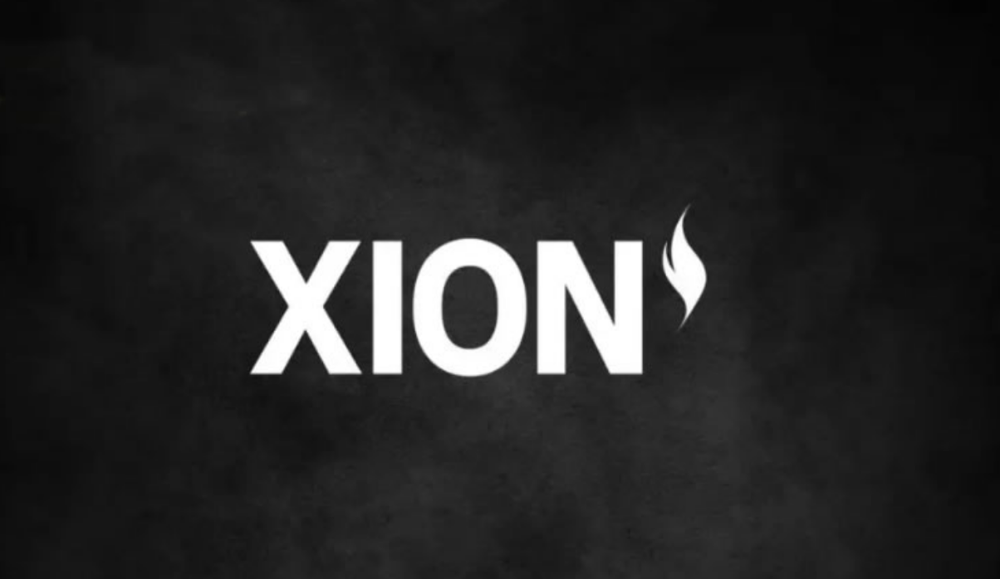

# XION币是什么？XION(XION)如何运作？

XION 于 12 月 5 日 UTC 时间 10:00 在 Bitget 上市。提现功能将于 12 月 6 日 UTC 时间 11:00 开放。许多用户评论说，由于投资者数量众多且表现稳定，XION 具有很高的增长潜力。

<figure><figcaption></figcaption></figure>

在盘前交易中，XION 的交易价格约为 4.25 美元 - 5.2 美元。该项目允许空投索赔以及对不满意结果的投诉。

## XION币是什么？

XION(XION)币是一个第1 层区块链，旨在使管理Web3 中的数字账户比以往任何时候都更轻松、更安全、更灵活，无需钱包。 XION 与其他Web3 账户的不同之处在于它的元账户。 这些账户具有高度适应性，采用模块化设计，这意味着可以根据个人用户的需求进行定制。

XION 是 Burnt 构建的第一个模块化通用抽象层。目标是促进经济自由并将权力交到用户手中。该项目采用先进的区块链和 Web3 技术，为投资者带来诸多好处，包括易于使用的账户、多样化的铭文、与多种设备兼容、低成本。

XION 与志同道合的项目联合构建和开发必要的基础设施、产品和工具，向众多用户推广 Web3 和加密货币的普及。XION 拥有生态系统中许多知名的名字，例如 Circle、Axelar、Checkout.com、Injective、Tech Crunch……

XION 已成立 XION 基金会，这是一个致力于指导和维护 XION 生态系统核心价值的非营利组织。XION 基金会的使命是监督网络的扩展，确保 XION 成为一个开放的区块链，支持开发人员构建可访问的 Web3 应用程序。

XION 基金会的最终目标是建立所有用户都能自由安全地参与的去中心化互联网。

该项目的主要发展目标包括：

* 支持开发者基于XION构建基础设施和应用程序
* 监督社区激励计划和空投
* 资助可扩展且可访问的区块链系统的研究和开发
* 支持生态系统内的开源公共产品
* 鼓励核心开发流程
* 管理赠款和授权计划，以表彰对网络的有意义的贡献

该项目还宣布使用 XION 代币作为支持权益证明 (PoS) 网络的实用代币。该代币旨在提供安全性，鼓励参与、协作和发展，同时确保生态系统内的去中心化和持续弹性。

4 月 1 日，Burnt 在最新一轮融资中成功募集 2500 万美元，参与投资的有 Animoca Brands、Multicoin Capital、Golden Tree、Laser Digital、Mechanism Capital 等多家大型投资基金……此前，该调用平台在测试网启动后已从 Circle Ventures、HashKey、Animoca Brands、Multicoin Capital 等多家投资机构募集 1100 万美元……

## 谁创立了 XION (XION)？

XION 由 Burnt 创建，该公司致力于通过区块链和 Web3 技术促进社会的金融和创作自由。Burnt 的使命不仅是创造尖端的数字工具，而且还要打破目前限制人们参与加密空间能力的障碍。Burnt 与分享其愿景的组织整合并合作，以构建使Web3 与社会相关且可访问所需的工具、产品和基础设施。

## 哪些风险投资支持 XION（XION）？

XION 已经从区块链行业的顶级风险投资公司和投资者那里筹集了超过 3600 万美元 。这些大牌支持者包括 Animoca Brands、Circle Ventures、Multicoin、Valor、Hashkey、Spartan、Mechanism、Figment、Stateless Ventures、Coinlist Seed、Injective、Alliance DAO 等。该项目还吸引了 Polygon 联合创始人 Sandeep Nailwal 等个人投资者。

## XION 代币信息

* 代币名称：XION
* 符号：XION

XION 在 Bitget 上市前

XION 是 Bitget 预售市场的一部分，该平台允许用户在代币上市进行现货交易之前直接交易代币。立即加入，享受最佳体验！

开始时间：11月12日07:00（UTC）

Bitget 盘前交易提供灵活的交易活动，提供两种付款方式：

* 硬币支付：采用“货 到 付 款”方式，如果卖家未能交货，则托管将被没收。
* USDT支付：一种新的选择，交易按照最后一分钟的平均指数价格以USDT结算。

要参与 Bitget 预售市场，请按照以下步骤操作：

步骤1：

进入Bitget(官方注册 官方下载)官网地址。

第 2 步：

对于制造商：

选择所需的代币并点击“发布订单”。

选择买入或卖出，输入价格和数量，查看详细信息，然后确认。

对于接受者：

选择所需的代币，选择“买入”或“卖出”，选择挂单，输入数量，然后确认。

## XION 的特点

XION 解决了以下问题：

* 简化区块链上的买卖流程：投资者可以使用信用卡或借记卡直接在区块链上付款，将复杂流程减少 95%。
* 0% gas 费：平台·完全免除 gas 费，让用户可以即时与链上应用交互。适合资金较少的新手交易者。
* Web3 钱包加密：XION 完全加密链上钱包，消除浏览器插件，帮助用户仅使用电子邮件创建 MPC 钱包。该项目设计了简单、用户友好的操作来吸引新人，并不断改进以“留住”长期投资者。
* 移动支持：平台支持桌面和移动设备之间的自由切换，确保生态系统中每个应用程序的UI/UX性能和安全。
* USDC 定价：在 Circle 的支持下，XION 使用 USDC 作为主要货币。该项目帮助新参与者以熟悉的法定货币轻松了解资产和产品的价值。
* 从头开始抽象密码学：XION 诞生的目标是从头开始抽象密码学的复杂性。这包括使用易于理解的术语、简化技术语言……以提高 Web3 对每个人的可访问性。
* 提高可靠性：该平台通过 Web2、Web3 领域的合作伙伴关系建立信任并吸引社区，例如 Animoca、CircleVentures、Checkout.com、Stytch……
* 降低复杂性：由于没有 gas 费、抽象钱包和直接银行卡支付流程，XION 大大降低了新用户的复杂性，并且消除了传统入职培训的需要。

## XION 的用例

代币化游戏：该项目可以与代币化游戏整合，以创造稀缺性并提高代币价值。参与者可以销毁自己持有的代币，以获得游戏中的额外好处，例如特殊物品或新能力。 去中心化金融（DeFi）：应用于去中心化金融行业的平台，用于提高协议的安全性和稳定性。具体来说，DeFi 使用XION 创建流动性池，解决多重债务。 Web3应用：该项目融入Web3应用程序，增加用户互动，并创建独家内容、基于代币记录的功能等新功能。

## XION (XION) 如何运作

以下是 XION 的主要功能：

1. 通用抽象层

XION 的通用抽象层旨在简化用户与 dApp 和区块链网络的交互。通常，当有人想要与区块链交互时，他们必须了解不同的区块链网络、代币和钱包。这可能会让刚接触该领域的人感到困惑。

通用抽象层将区块链操作的复杂性隐藏在幕后，让用户专注于他们想要做的事情，而不是如何去做。例如，用户不必担心交易发生在哪个特定的区块链上，而是可以轻松安全地进行交易，而无需了解技术细节。

2. 元账户

XION 最具革命性的功能之一是其元账户，这是一种新型用户账户，旨在与去中心化应用程序配合使用，而无需深入了解区块链技术。元账户允许用户使用熟悉的方法（如电子邮件）登录，并在多个设备上使用同一个账户。对于那些不是技术专家的人来说，这意味着他们仍然可以访问 dApp，而无需了解私钥、gas 费用或钱包管理。

Meta 帐户也是为了安全性和灵活性而构建的。它们支持限时会话和可自定义的帐户规则，这意味着用户可以设置交易限额甚至定期付款。如果用户丢失了其中一种身份验证方法（例如电话或电子邮件），他们仍然可以恢复他们的 Meta 帐户。这使得 XION 的 Meta 帐户成为新用户和老用户更安全、更方便的选择。

3. 签名设备抽象

XION 技术的另一个独特方面是签名设备抽象。传统上，当用户与区块链交互时，他们需要使用私钥签署交易——这是一个复杂的过程，可能会让初学者望而生畏。签名设备抽象允许用户安全地签署交易，而无需担心管理这些私钥。

相反，此功能允许用户通过更熟悉的方法登录并与 Web3 应用程序交互。用户可以跨设备进行交互，这使得人们可以更轻松地在手机、平板电脑或计算机上使用 Web3，而无需管理多个私钥或钱包。

4. 参数化费用层

参数化费用层是一项使支付 交易费用更简单、更灵活的功能。通常，每笔区块链交易都需要支付费用，通常以该网络的原生加密货币支付（例如以太坊上的 ETH 或 Polygon 上的 MATIC）。对于没有这些代币的新用户来说，这可能具有挑战性。

借助 XION 的参数化费用层，开发人员可以创建应用程序，用户可以使用不同的代币支付费用，甚至在某些情况下根本不支付费用（称为“无 gas 交易”）。例如，如果有人使用基于 XION 构建的去中心化消息应用程序，他们可以发送消息而无需拥有用于支付交易费用的特定代币。该系统使新用户更容易、更经济地开始使用 Web3 应用程序。

5. 抽象互操作性

抽象互操作性是 XION 的另一个核心功能。 Web3 当前的一个限制是不同的区块链通常独立运行，用户无法轻松地在一个地方与多个网络交互。XION 通过让用户能够无缝地跨多个链交互来解决此问题。

例如，用户可以在不同的区块链之间发送资产或数据，而无需为每个区块链设置单独的账户或钱包。这种互操作性使 XION 的技术非常灵活和实用，允许用户参与各种区块链生态系统，而不受单个网络的限制。抽象互操作性意味着无论用户是在玩游戏、访问社交媒体应用程序还是转移资产，他们都不必担心切换网络或管理多个钱包。

如有不明白或者不清楚的地方，请加入官方电报群：[https://t.me/gtokentool](https://t.me/gtokentool)
