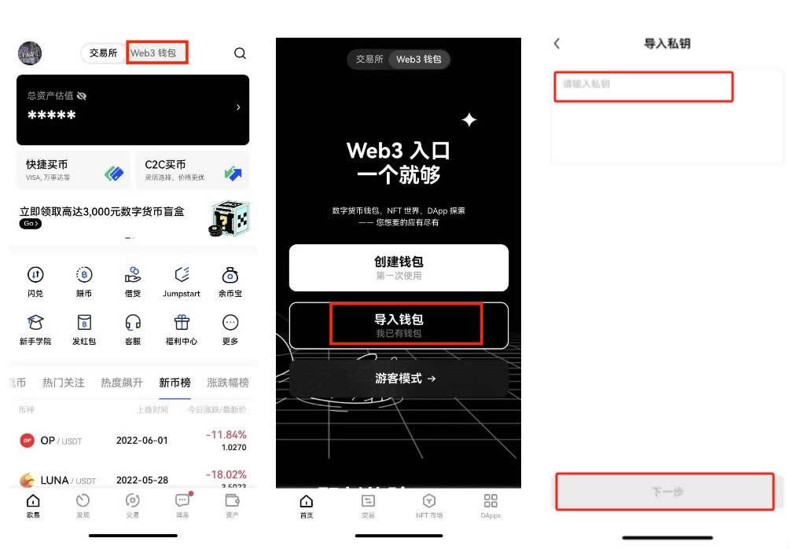
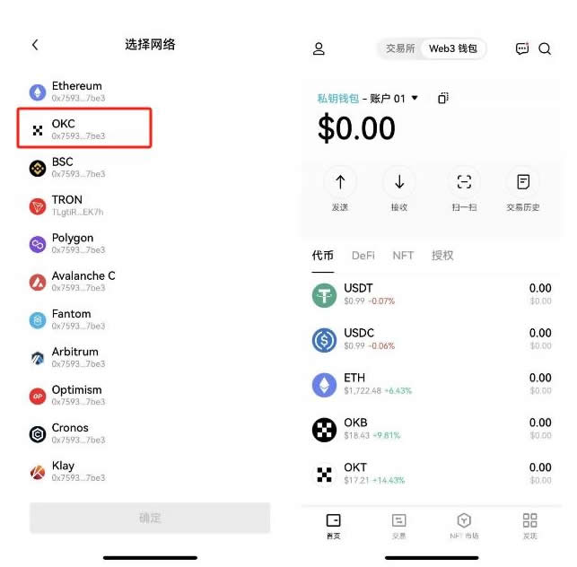
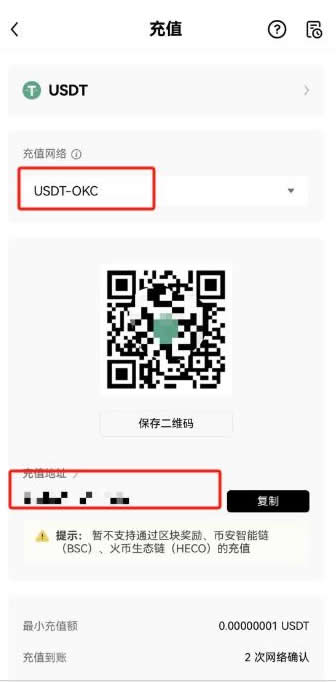
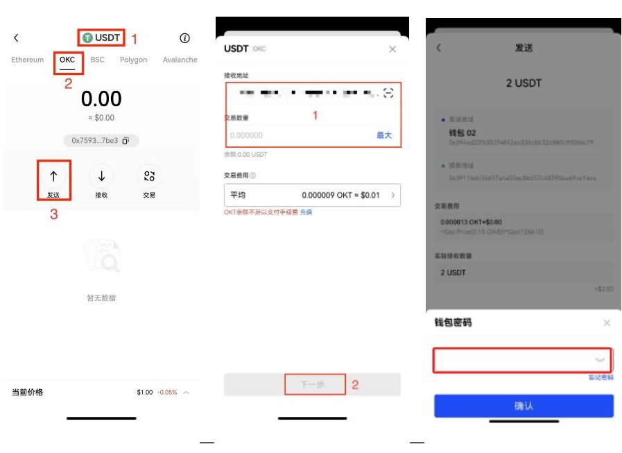

# 虚拟币转错链怎么找回操作教程？虚拟币转错了可以起诉吗？

虚拟市场的扩大，离不开虚拟货币的流通，自然也离不开虚拟货币转账问题。常见的转账错误就是地址复制错误，同样也有另一个错误就是链选择错误。虚拟币转错链依旧是一个棘手的问题，但基于转账操作的不熟练，新手转错连也时常发生，那么究竟虚拟币转错链怎么找回？转错连链可以通过第三方平台去找回，但并不一定会成功。接下来[**GTokenTool**](https://www.gtokentool.com)为大家详细说说，帮助大家更好的保管好自己的虚拟资产。

## 虚拟币转错链怎么找回？

虚拟币转错链的找回过程可能复杂且具有挑战性，但通过确认转账详情、联系交易所或钱包提供商、导入私钥到兼容钱包、使用跨链桥工具以及寻求社区和专业帮助，有一定机会找回转错链的代币。下文以在欧易向第三方平台提币选错了链为例，详细说一下怎么找回 教程：

1、打开欧易APP(点击注册)（没有APP的请点击下载），点击中间图标选择【Web3钱包】—【导入钱包】—选择【私钥】—输入或粘贴私钥点击【下一步】。

<figure><figcaption></figcaption></figure>

2、选择【OKC】网络—按要求完成导入。

<figure><figcaption></figcaption></figure>

3、打开欧易 APP，点击【资产】—【充值】—选择币种【USDT】—选择【USDT-OKC】—【复制地址】。

<figure><figcaption></figcaption></figure>

4、点击欧易首页选择【Web3钱包】—选择【USDT】、【OKC】链，点击【发送】—粘贴上一步复制的地址到【接收地址】、【数量】—点击【下一步】，按要求输入【钱包密码】并完成操作，即可找回转错链的资产。

<figure><figcaption></figcaption></figure>

## 虚拟币转错了可以起诉吗？

虚拟币(加密货币)转错地址后，是否可以起诉取决于多个因素，包括司法管辖区的法律、交易的具体情况以及相关方的行为。

不同国家和地区对虚拟币的法律框架不同，某些国家可能有明确的法律来处理虚拟币相关的纠纷，而有些国家可能尚未明确规定。如果交易是通过加密货币交易所进行的，交易所有时会提供帮助追回错误交易的服务，具体取决于交易所的政策和能力。

如果是由于个人失误导致的转账错误，追回的难度较大。如果涉及诈·骗行为，可能通过刑事诉讼或民事诉讼来追讨损失。虚拟币交易是不可逆的，但区块链具有透明和可追踪的特性，可以查找虚拟币的流向。然而，追踪到地址的持有者并追回虚拟币往往很困难，特别是在去中心化的环境中。

能够确定接收错误转账的地址的持有者，可以尝试通过民事诉讼要求返还，成功的前提是能够证明对方不当得利，并且能够确定对方身份。如果转账错误是由于诈·骗·行为导致的，可以向警方报案，尝试通过刑事诉讼追回损失，警方可能会根据证据进行调查。

某些加密货币交易所或平台可能提供仲裁服务，帮助解决转账错误问题。如果转账涉及交易所或钱包，及时联系平台的客服寻求帮助，某些情况下，平台可能会协助冻结错误转账的资金。

如有不明白或者不清楚的地方，请加入官方电报群：[**https://t.me/gtokentool**](https://t.me/gtokentool)
