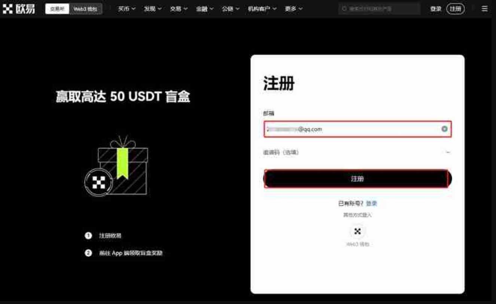
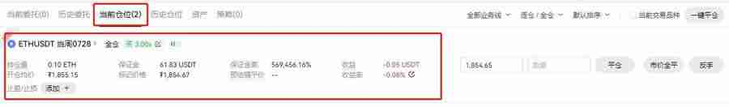

# 以太坊合约交易合法吗？以太坊合约具体玩法操作教程

以太坊合约交易时为了满足投资需求衍生出的一种新的交易方式，它是指通过以太坊区块链上的智能合约进行的交易和操作。但是以太坊等加密货币本身合法性就备受争议，而这些衍生品的合法性更是备受关注，毕竟投资者进行交易时还是需要确保安全的。那么以太坊合约交易合法吗？就目前资料分析来看，以太坊合约交易本身是不违法的，但具体取决于国家和地区的规定的。下面[GTokenTool](https://www.gtokentool.com)为大家详细说说。

## 以太坊合约交易合法吗？

以太坊合约交易在法律层面上并没有被明确禁止，在许多国家，使用以太坊智能合约进行合法的交易和金融活动是被允许的，只要遵守当地的法律和监管要求。例如，在美国、欧洲和新加坡等地区，加密货币和智能合约活动已被纳入监管范围。

加密货币和智能合约的法律环境不断变化，国家和地区可能会更新或调整相关法规。需要定期关注法律和监管动态，以确保合规。在一些国家，智能合约和加密货币的法律状态可能尚未明确，存在法律灰色地带。在这些情况下，参与相关活动可能存在一定的法律风险。

以太坊作为一种数字货币，本身并不是骗 局，但需要注意的是，有些人可能会利用以太坊的名义进行骗 局活动。因此，在进行以太坊合约交易时，保持警惕，避免成为骗 局的受害者。以太坊是一种去中心化的数字货币，使用以太坊区块链技术运行，在大多数国家/地区合法。以太坊通过其区块链技术与其他数字货币区分开来，该技术允许执行智能合约，使它成为开发去中心化应用程序的理想平台‌。

## 以太坊合约交易怎么玩？

玩以太坊合约交易可以在欧易、币安等交易所内进行，但其步骤相对比较复杂，投资者需要提前了解相应的步骤。下面就是在欧易交易所玩以太坊合约的具体教程：

1、打开欧易OKX交易所官网(官方注册 官方下载)，在首页输入邮箱，点击“注册”，向右滑动滑块，完成拼图进行验证，然后输入邮箱收到的验证码，验证码有效时间为10分钟

<figure><figcaption></figcaption></figure>

2、而后输入手机号，点击“立即验证”，输入手机收到的六位数字验证码，有效时间同样为10分钟

<figure><figcaption></figcaption></figure>

3、选择居住国家/地区，勾选服务条款、《风险与合规披露》及隐私政策与声明

<figure><figcaption></figcaption></figure>

4、创建密码需要符合长度为 8-32 个字符、1 个小写字母、1 个大写字母、1 个数字、1 个符号，如：!@ # $ %等条件

<figure><figcaption></figcaption></figure>

5、登录账号后，找到首页的“用户中心”图标，进入身份认证页面

<figure><figcaption></figcaption></figure>

6、可根据不同需求进行不同等级认证(注意：视频认证需在APP上进行操作)

<figure><figcaption></figcaption></figure>

7、进行交易前需要拥有USDT，可在C2C买币进行交易，根据需求选择合适商家，点击“购买”，而后根据提示进行付款、等待商家放币(若是长时间没有收到币种，可联系客服进行处理)

<figure><figcaption></figcaption></figure>

8、如果想要进行合约交易，需要将账户模式开通并设置为单币种保证金模式或跨币种保证金模式。

<figure><figcaption></figcaption></figure>

9、您可继续进行合约设置，个性化选择交易单位，下单模式。

<figure><figcaption></figcaption></figure>

10、您可自定义设置交易模式和看板模式，此处选择专业布局。

<figure><figcaption></figcaption></figure>

11、永续合约分为USDT保证金永续合约，币本位保证金永续合约，这里以USDT保证金永续合约为例。将我们的数字资产从资金账户划转到交易账户，如已完成则无须进行额外划转操作。

<figure><figcaption></figcaption></figure>

12、在交易页面点击币对右侧的下拉按钮，在搜索框输入币种，在保证金交易处选择永续，选择币种对应的币本位/U本位合约。此处以U本位合约为例

<figure><figcaption></figcaption></figure>

13、选择账户模式、委托类型，输入价格、数量，点击买入开多(看涨)或卖出开空(看空)。未成交的委托挂单可单击撤单撤销委托。此处以开空为例。

<figure><figcaption></figcaption></figure>

14、挂单成交后，可在持仓界面中可查看订单的相关数据，例如保证金、收益、收益率、预估强平价等。

<figure><figcaption></figcaption></figure>

15、您可在持仓界面设置止盈止损，还可选择平仓，输入平仓价格和平仓数量确定平仓，或选择市价全平完成平仓操作。

<figure><figcaption></figcaption></figure>

16、永续合约分为USDT保证金永续合约，币本位保证金永续合约，这里以USDT保证金永续合约为例。

17、同样，将我们的数字资产从资金账户划转到交易账户，如已完成则无须进行额外划转操作。

<figure><figcaption></figcaption></figure>

18、在交易页面点击币对右侧的下拉按钮，在搜索框输入币种，在保证金交易处选择永续，选择币种对应的币本位/U本位合约。此处以U本位合约为例

<figure><figcaption></figcaption></figure>

19、选择账户模式、委托类型，输入价格、数量，点击买入开多(看涨)或卖出开空(看空)。未成交的委托挂单可单击撤单撤销委托。此处以开空为例。

<figure><figcaption></figcaption></figure>

20、挂单成交后，可在持仓界面中可查看订单的相关数据，例如保证金、收益、收益率、预估强平价等。

<figure><figcaption></figcaption></figure>

21、您可在持仓界面设置止盈止损，还可选择平仓，输入平仓价格和平仓数量确定平仓，或选择市价全平完成平仓操作。

<figure><figcaption></figcaption></figure>

如有不明白或者不清楚的地方，请加入官方电报群：[**https://t.me/gtokentool**](https://t.me/gtokentool)
