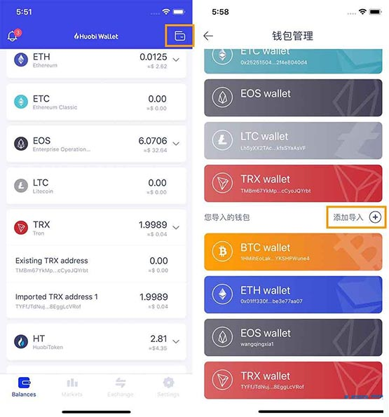

# 一文搞清楚火币钱包导入TRX波场账户详细教程

火币钱包如何导入TRX波场账户? 众所周知，波场主网上线至今运行稳定，也有了非常不错的活跃及热度。基于以上因素，火币钱包团队加速技术研发进度，在最短时间，支持了波场主链。那么，火币钱包如何导入TRX波场账户?

1. 打开火币钱包，在首页点击右上角“钱包”按钮，进入“钱包管理”页;

<figure><figcaption></figcaption></figure>

2. 点击“添加导入”，在导入钱包页，输入安全密码;

<figure><figcaption></figcaption></figure>

3. 选择“TRX”;

<figure><figcaption></figcaption></figure>

4. 导入助记词或者私钥;

<figure><figcaption></figcaption></figure>

5. 导入完成后，会收到导入成功的提示。如果提示导入失败，请确认助记词或私钥是否正确;

<figure><figcaption></figcaption></figure>

6、在钱包管理页会看到成功导入的 TRX 钱包账户;

<figure><figcaption></figcaption></figure>

如有不明白或者不清楚的地方，请加入官方电报群：[https://t.me/gtokentool](https://t.me/gtokentool)
