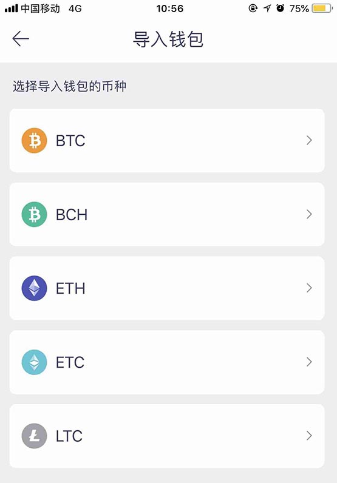

# 一文详细了解火币钱包是如何导入私钥？

什么是钱包私钥？作为管理和使用加密货币最关键的东西，私钥对所有数字货币用户而言具有所有权，拥有私钥才能支配相应的加密资产。简言之就是，如果丢失私钥你的资产就会面临丢失的风险。

私钥是由加密算法生成的一个64位十六进制的字符组成，就像这样：5KYZdUEo39z3FPrtuX2QbbwGnNP5zTd7yyr2SC 1j299sBCnWjss私钥的生成方式是完全随机的，随机生成这样的字符串会有 16 的 64 次方种可能，即： 2 的 256 次方， 一个钱包只有一个私钥并且不能修改，正常情况下你所生成的私钥与他人正好相同的概率几乎为零。但是私钥的这种形式存储和记忆起来太复杂，于是就有了助记词工具。

## 火币钱包如何导入私钥?

这里以导入BTH私钥为例:

1.点击 “导入钱包" 页中“ETH”币种，跳转至”导入ETH钱包“页。

<figure><figcaption></figcaption></figure>

2.点击顶部下方中间“私钥”按钮，输入ETH钱包的私钥地址。

<figure><figcaption></figcaption></figure>

3.点击开始导入。

当出现弹窗显示“导入钱包成功!”时，导入成功;

如出现“私钥错误!请重新导入!”则需要您重新输入私钥。

<figure><figcaption></figcaption></figure>

<figure><figcaption></figcaption></figure>

注: 请检查输入的私钥地址是否为ETH钱包私钥。

## 什么是明文私钥?

明文私钥，就是未加密的私钥。拥有私钥，就拥有对钱包内资产的所有权和控制权。

不同于部分加密后的私钥文件Keystore，只要密码强度足够,即使黑客得Keystore, 破解难度也足够大。

存储在钱包中的私钥，实际上完全独立，可由钱包软件生成并管理的，无需区块链或者网络连接。

用户的钱包地址就是由私钥通过椭圆曲线加密生成公钥, 进而生成的以0x开头的42位地址，而私钥是一串 64位 16 进制的哈希值字符串。

如有不明白或者不清楚的地方，请加入官方电报群：[**https://t.me/gtokentool**](https://t.me/gtokentool)
