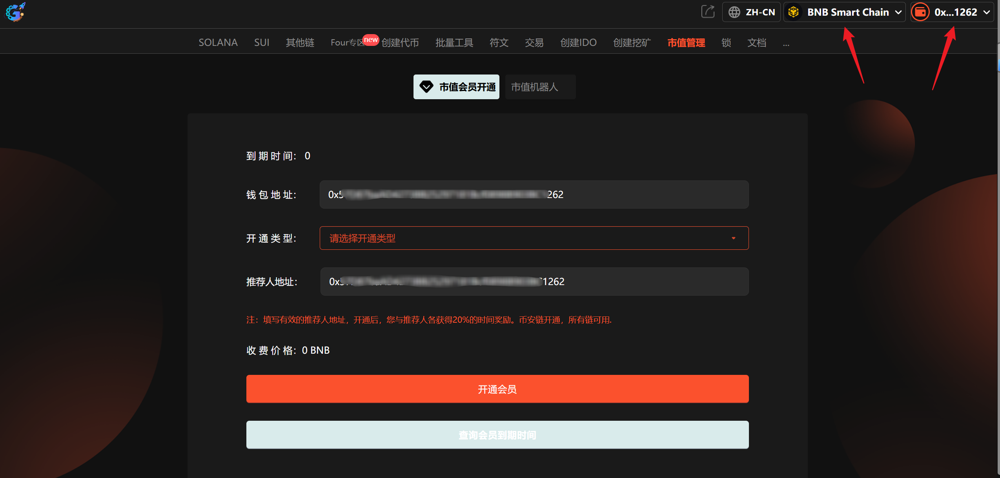
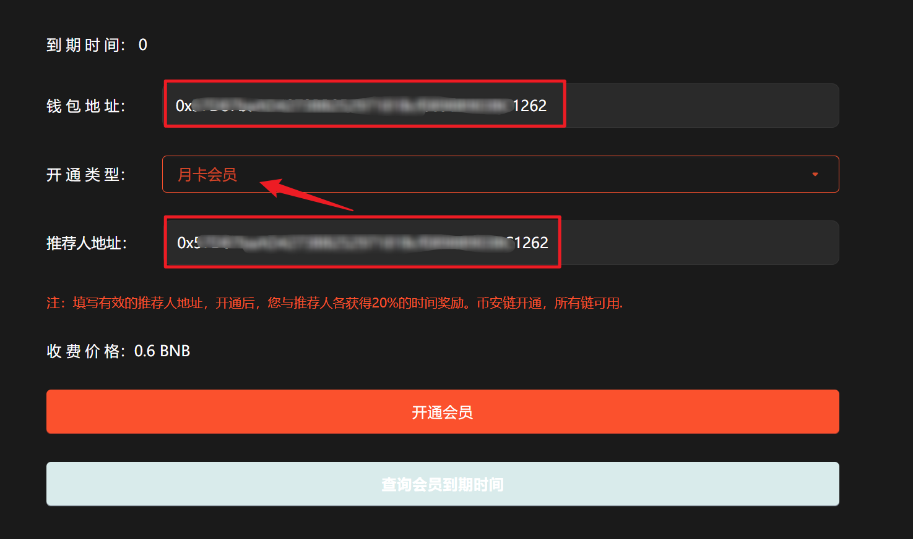
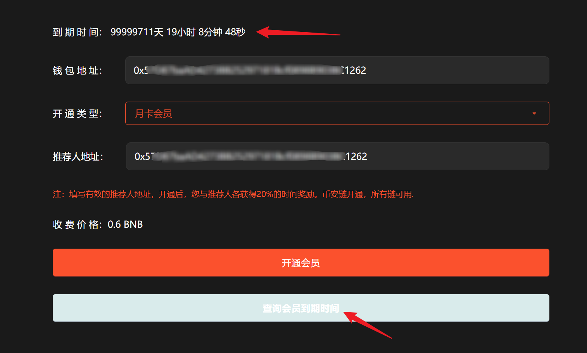

# 1️⃣ 市值会员

## 操作步骤

提示：请先安装小狐狸钱包插件，教程：[https://docs.gtokentool.com/fu-zhu-xin-xi/metamask-installation](https://docs.gtokentool.com/fu-zhu-xin-xi/metamask-installation)

### (1) 连接钱包

进入创建页面：[https://www.gtokentool.com/bot](https://www.gtokentool.com/bot)，点击右上角，切换到主网，并连接小狐狸钱包。

完成后，会看到 “链名称” 和 您的“钱包地址” ，如下图：

<figure><figcaption></figcaption></figure>

### (2) 输入信息

假设开通一个月卡，输入如下：

* **钱包地址：**&#x9ED8;认为连接钱包地址
* **开通类型：**&#x6708;卡会员
* **推荐人地址：**&#x8F93;入推荐人地址

点击“`开通会员`”按钮。

<figure><figcaption></figcaption></figure>

### (3) 完成

在小狐狸钱包上，支付gas费，就完成了。

点击“`查询会员到期时间`”，会显示会员剩余时间。

<figure><figcaption></figcaption></figure>

## 常见问题 FAQ

### Q: 开通市值会员有什么用？

**A:** 可免费使用市值机器人，多链通用。

### Q: 开通后立即生效吗？

**A:** 支付上链确认后立即生效。

### Q: 会员时长多久？

**A:** 按月计算，到期自动失效。

### Q: 会员功能有次数限制吗？

**A:** 没有次数限制，开通即免费使用市值机器人。

如有不明白或者不清楚的地方，请加入官方电报群：[https://t.me/gtokentool](https://t.me/gtokentool)
