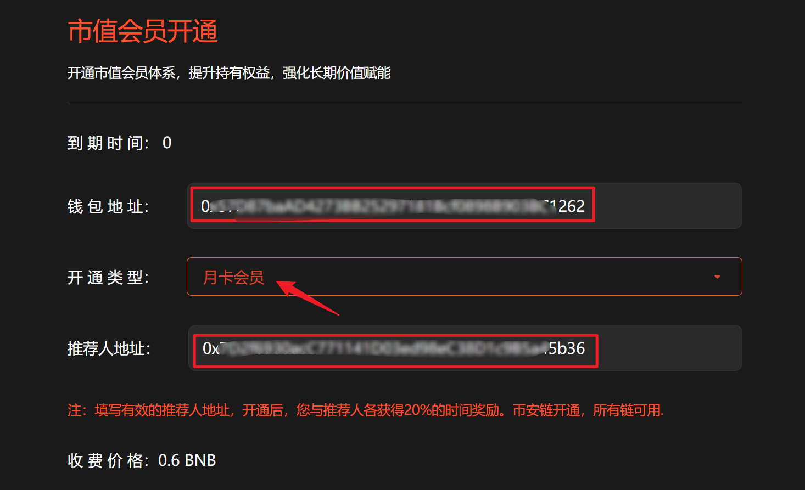
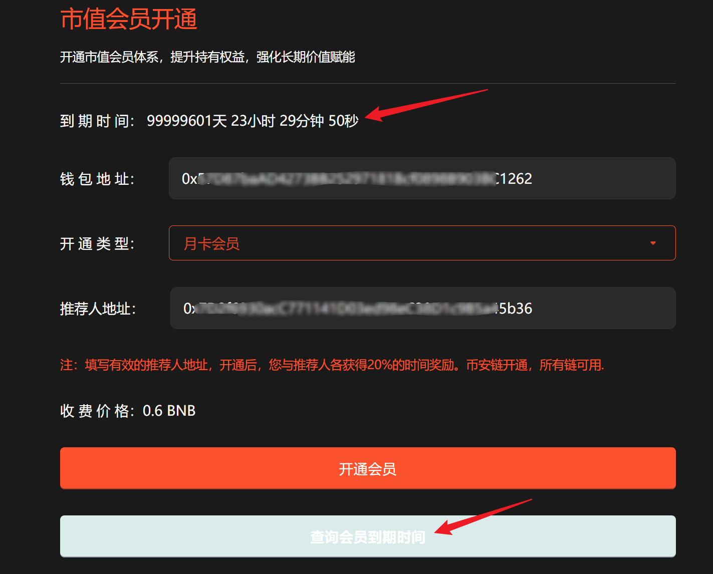

# 1️⃣ 市值会员

## 操作步骤

提示：请先安装小狐狸钱包插件，教程：[https://docs.gtokentool.com/fu-zhu-xin-xi/metamask-installation](https://docs.gtokentool.com/fu-zhu-xin-xi/metamask-installation)

### (1) 连接钱包

进入创建页面：[https://www.gtokentool.com/bot](https://www.gtokentool.com/bot)，点击右上角，切换到主网，并连接小狐狸钱包。

完成后，会看到 “链名称” 和 您的“钱包地址” ，如下图：

<figure><figcaption>
连接钱包并选择BSC链
</figcaption></figure>

### (2) 输入地址信息

假设开通一个月卡，输入如下：

* **钱包地址：**&#x9ED8;认为连接钱包地址
* **开通类型：**&#x6708;卡会员
* **推荐人地址：**&#x8F93;入推荐人地址

点击“`开通会员`”按钮。

<figure><figcaption>
输入地址信息
</figcaption></figure>

### (3) 完成

在小狐狸钱包上，支付gas费，就完成了。

点击“`查询会员到期时间`”，会显示会员剩余时间。

<figure><figcaption>
查询会员到期时间
</figcaption></figure>

## ❓常见问题 FAQ

### Q: 开通市值会员有什么用？

**A:** 可免费使用市值机器人，多链通用。

### Q: 开通后立即生效吗？

**A:** 支付上链确认后立即生效。

### Q: 会员时长多久？

**A:** 按月计算，到期自动失效。

### Q: 会员功能有次数限制吗？

**A:** 没有次数限制，开通即免费使用市值机器人。

### 🤝 连接 GTokenTool 

* **💬 Telegram社群**：[点击加入官方群组](https://t.me/gtokentool)
* **🐦 Twitter (X)**：[关注我们获取最新动态](https://x.com/gtokentool)
* **📚 官方文档**：[查看 Gitbook 文档](https://docs.gtokentool.com/)
* **💻 开源代码**：[访问 GitHub 仓库](https://github.com/Gtokentool/docs/blob/master/SUMMARY.md)
* **📺 视频教程**：[订阅 YouTube 频道](https://www.youtube.com/@GTokenTool)

> ⚠️ 风险提示与免责声明
>
> GTokenTool 保留随时全权酌情因任何理由修改、变更或取消此公告的权利，无需事先通知。
>
> 以上信息内容仅供参考，GTokenTool 对本平台上的任何虚拟资产、产品或促销活动不做任何推荐或保证。虚拟资产的价格波动很大，投资交易虚拟资产将面临巨大风险。**请谨慎投资。**
