# 2️⃣ 市值机器人

## 市值机器人视频教程



## 市值机器人支持以下链及Swap

* ETH：Uniswap V2、Uniswap V3
* BSC：PancakeSwap V2、PancakeSwap V3、FOUR
* ARB：Uniswap V2、Uniswap V3
* BASE：Uniswap V2、Uniswap V3
* Polygon：QuikSwap V2、Uniswap V2、Uniswap V3

## 市值机器人介绍 

市值机器人（Market Cap Bot） 是一种基于人工智能（AI）和金融数据分析的工具，主要用于实时监控、分析和预测股票、加密货币或其他金融资产的市值变化。它通过自动化数据处理和算法模型，帮助投资者、交易员和机构用户快速获取市场动态，辅助投资决策。

## 市值机器人具体操作流程

### 1. 连接钱包

市值机器人：[https://robotv2.gtokentool.com/#/marketbot](https://robotv2.gtokentool.com/#/marketbot)

进入市值机器人页面，点击右上角连接钱包（选择小狐狸钱包），然后选择公链，我用 BSC 测试网演示。注意连接钱包内的网络要与选择的公链一致，以免出现不必要的损失。

<mark style="color:purple;">非会员费用：0.0001 BNB，不同链收费不同，以实际标注为准。</mark>点击”`解锁会员权益`“可跳转至会员开通页面。

<figure>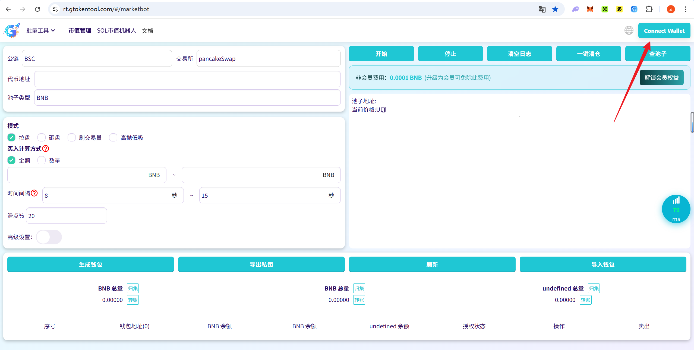<figcaption></figcaption></figure>

<figure>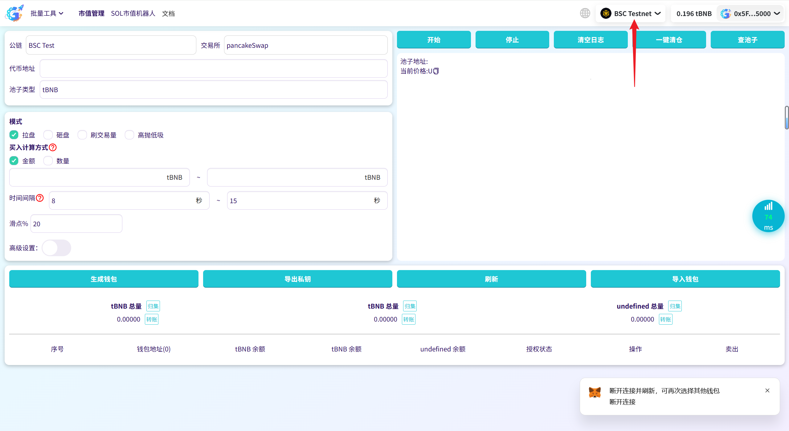<figcaption></figcaption></figure>

### 2. 基础配置

选择交易所，输入代币地址，并选择或输入对应的池子类型。选择 PancakeSwap V3 还需要选择对应的池子费用级别。

<figure>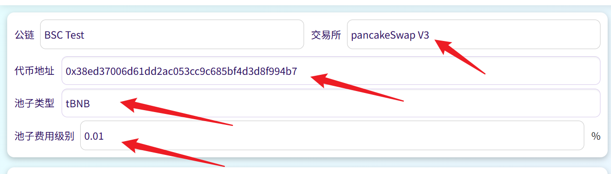<figcaption></figcaption></figure>

配置好后，点击“`查池子`”，确认池子信息是否正确。若查池子失败，请检查池子信息是否有误。

<figure>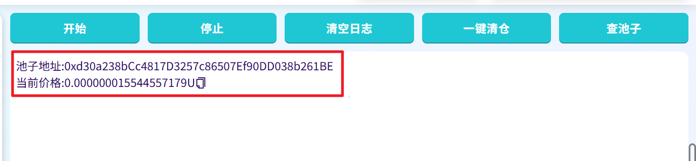<figcaption></figcaption></figure>

### 3. 选择交易模式并配置参数

这里有四种模式可以选择：拉盘、砸盘、刷交易量、高抛低吸。

#### 拉盘模式：

* **买入计算方式：**&#x91D1;额、数量（两边输入一样数值就是固定值）
* **时间间隔：**&#x9ED8;认 8\~15 秒，可自行修改
* **滑点：**&#x5FC5;填，根据自己的需求设置
* **高级设置：**&#x975E;必填
  * **钱包使用方式：**&#x987A;序、随机
  * **目标价格：**&#x8FBE;到目标价格时停止程序（<mark style="color:purple;">拉盘模式目标价格必须大于当前价格</mark>）
  * **gasLimit**
  * **gasPrice**
  * **钱包同时交易：**&#x591A;钱包同时买入卖出（<mark style="color:purple;">拉盘模式只支持一键买入，买入计算方式必须选择金额</mark>），可设置执行次数（默认一次）

若使用钱包同时交易，需先点击”`授权`“，再点击“`一键买入`”。

<figure>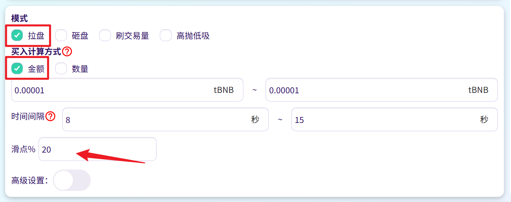<figcaption></figcaption></figure>

#### 砸盘模式 ：

* **卖出计算方式：**&#x767E;分比、金额、数量（两边输入一样数值就是固定值）
* **时间间隔：**&#x9ED8;认 8\~15 秒，可自行修改
* **滑点：**&#x5FC5;填，根据自己的需求设置
* **高级设置：**&#x975E;必填
  * **钱包使用方式：**&#x987A;序、随机
  * **目标价格：**&#x8FBE;到目标价格时停止程序（<mark style="color:purple;">砸盘模式目标价格必须小于当前价格</mark>）
  * **gasLimit**
  * **gasPrice**
  * **钱包同时交易：**&#x591A;钱包同时买入卖出（<mark style="color:purple;">砸盘模式只支持一键卖出，卖出计算方式必须选择数量或百分比</mark>），可设置执行次数（默认一次）

若使用钱包同时交易，需先点击”`授权`“，再点击“`一键卖出`”。

<figure>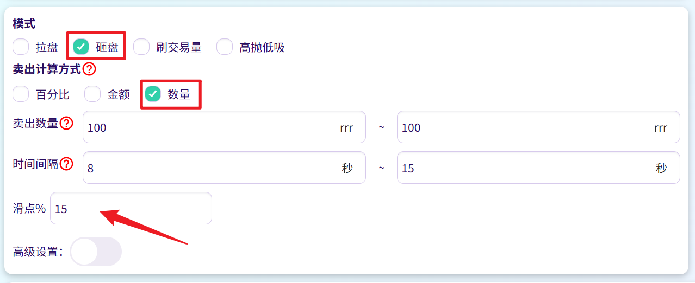<figcaption></figcaption></figure>

#### 刷交易量模式：

* **买入概率：**&#x8F93;入后卖出概率自动算出（买入概率为40%，卖出概率就是60%）
* **买入计算方式：**&#x91D1;额、数量（两边输入一样数值就是固定值）
* **卖出计算方式：**&#x767E;分比、金额、数量（两边输入一样数值就是固定值）
* **时间间隔：**&#x9ED8;认 8\~15 秒，可自行修改
* **最低价格：**&#x5728;执行过程中，当前价格比最低价格低，停止执行，默认是0（非必填）
* **最高价格：**&#x5728;执行过程中，当前价格比最高价格高，停止执行，默认无穷大（非必填）
* **滑点：**&#x5FC5;填，根据自己的需求设置
* **高级设置：**&#x975E;必填
  * **钱包使用方式：**&#x987A;序、随机
  * **gasLimit**
  * **gasPrice**
  * **钱包同时交易：**&#x591A;钱包同时买入卖出（<mark style="color:purple;">刷交易量模式不支持</mark>），可设置执行次数（默认一次）

<figure>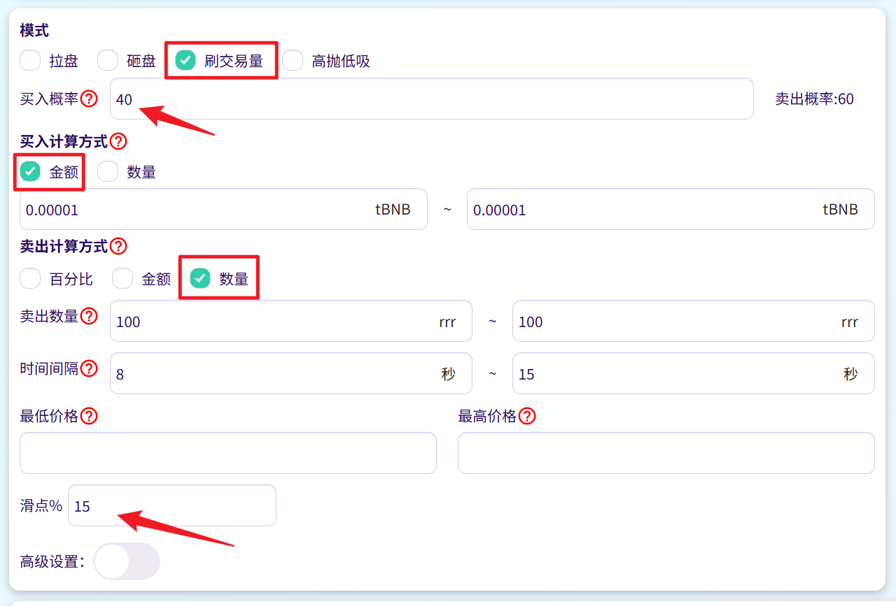<figcaption></figcaption></figure>

#### 高抛低吸模式：

* **买入计算方式：**&#x91D1;额、数量（两边输入一样数值就是固定值）
* **卖出计算方式：**&#x767E;分比、金额、数量（两边输入一样数值就是固定值）
* **时间间隔：**&#x9ED8;认 8\~15 秒，可自行修改
* **最低价格：**&#x4F4E;于某个价格开始吸货买入，用于市值管理价格托底
* **最高价格：**&#x9AD8;于某个价格开始抛售，用于市值管理最高价格限制
* **滑点：**&#x5FC5;填，根据自己的需求设置
* **高级设置：**&#x975E;必填
  * **钱包使用方式：**&#x987A;序、随机
  * **gasLimit**
  * **gasPrice**
  * **钱包同时交易：**&#x591A;钱包同时买入卖出（<mark style="color:purple;">高抛低吸模式不支持</mark>），可设置执行次数（默认一次）

<figure>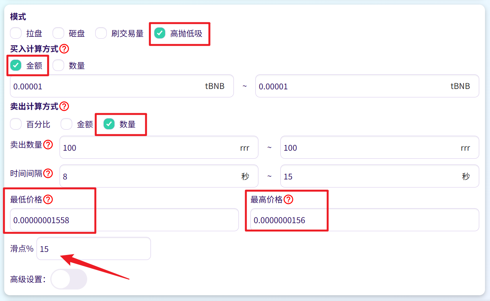<figcaption></figcaption></figure>

### 4. 导入钱包

点击“`导入钱包`”，输入钱包私钥，点击“`导入`”。

<figure>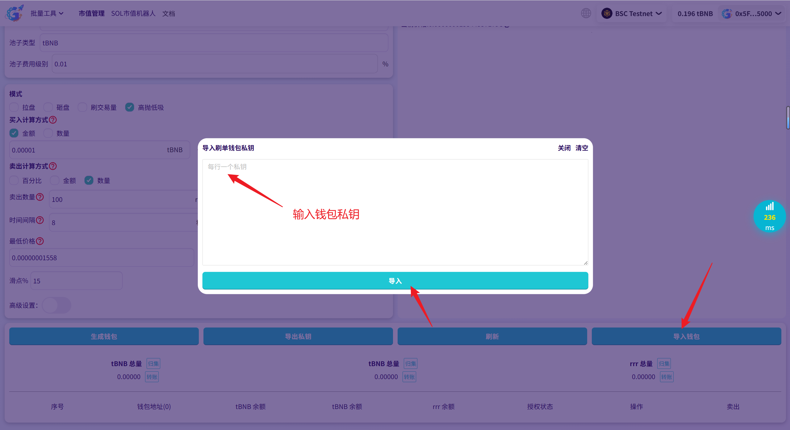<figcaption></figcaption></figure>

导入成功后，下方会显示钱包余额、底池代币余额以及代币余额。若没有显示，点击“刷新”获取最近钱包余额。<mark style="color:purple;">建议每次交易之前刷新一次，以免因余额不足导致交易失败。</mark>

<figure>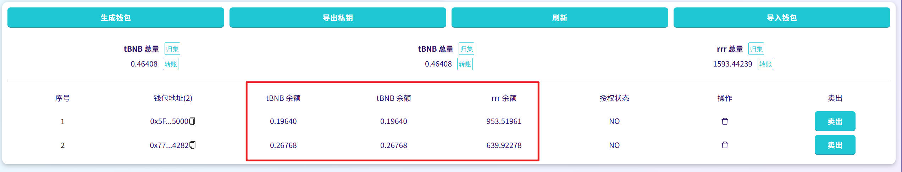<figcaption></figcaption></figure>

### 5. 开始交易

点击“`开始`”，开始执行交易。没有设置目标价格或者打开钱包同时交易，需要自己手动点击“`停止`”去停止交易。交易成功后，会显示交易哈希。点击哈希可以跳转到对应的区块链浏览器，查看具体的交易情况。

#### 拉盘模式：

<figure>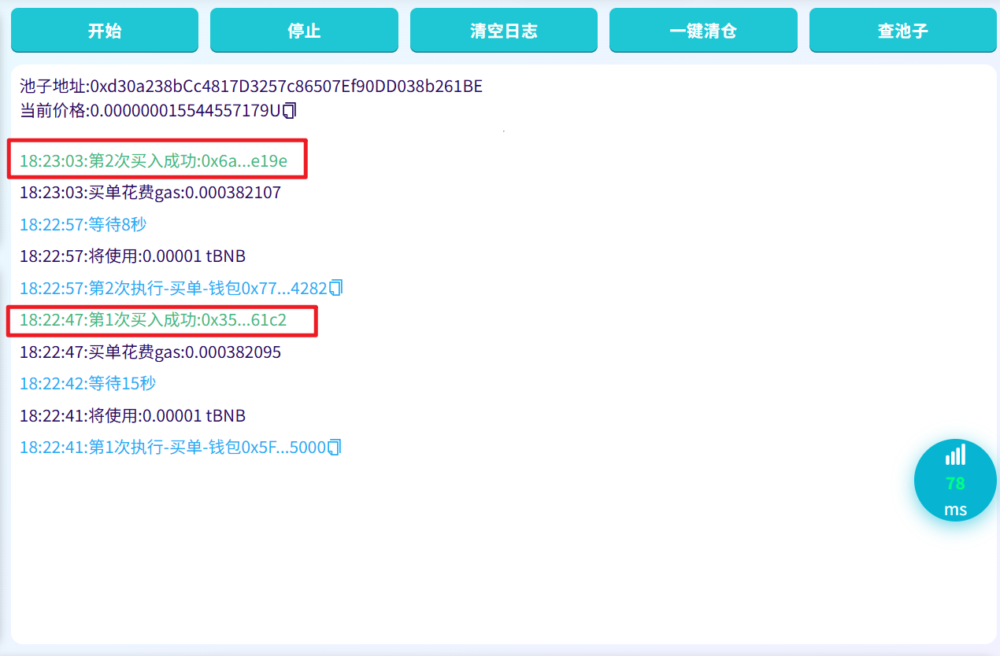<figcaption></figcaption></figure>

点击“`刷新`”，可以查看是否买入成功。

<figure>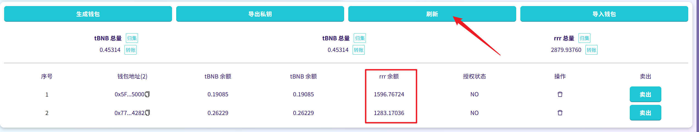<figcaption></figcaption></figure>

#### 砸盘模式：

<figure>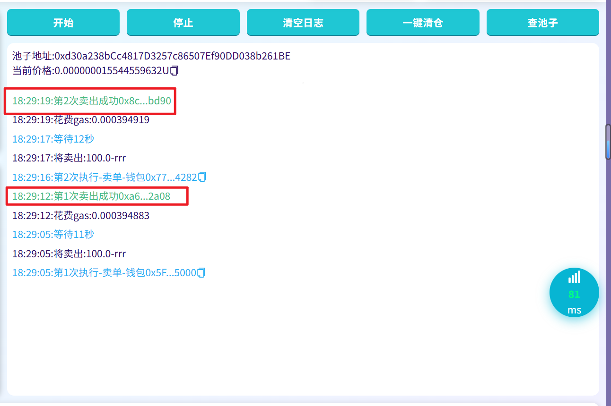<figcaption></figcaption></figure>

点击“`刷新`”，可以查看是否卖出成功。

<figure>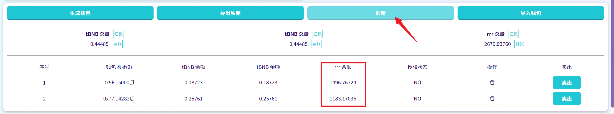<figcaption></figcaption></figure>

#### 刷交易量模式：

<figure>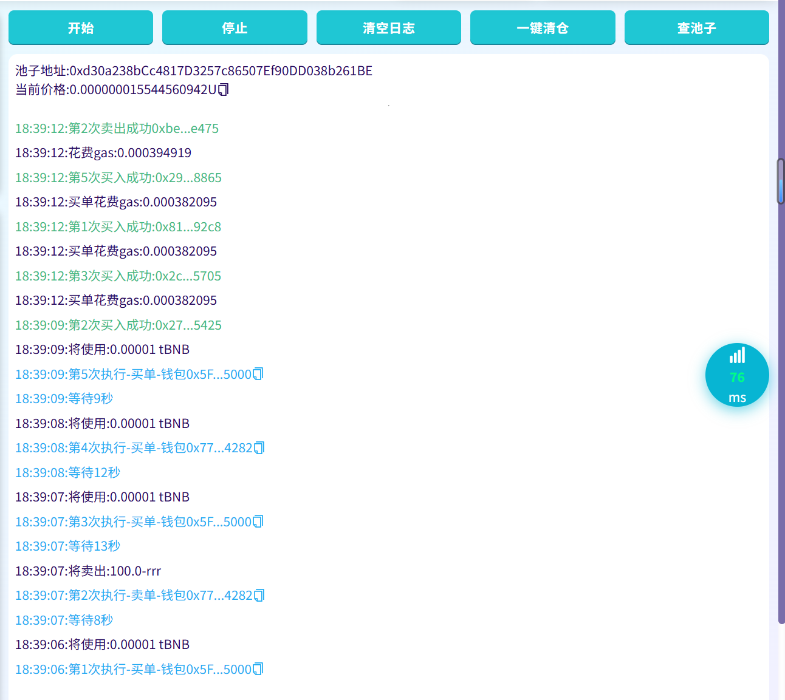<figcaption></figcaption></figure>

点击“`刷新`”，可以查看是否交易成功。

<figure>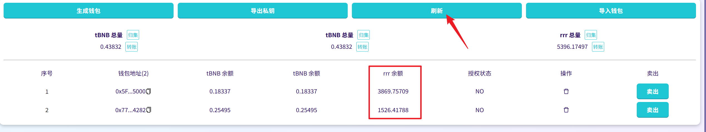<figcaption></figcaption></figure>

#### 高抛低吸模式：

<figure>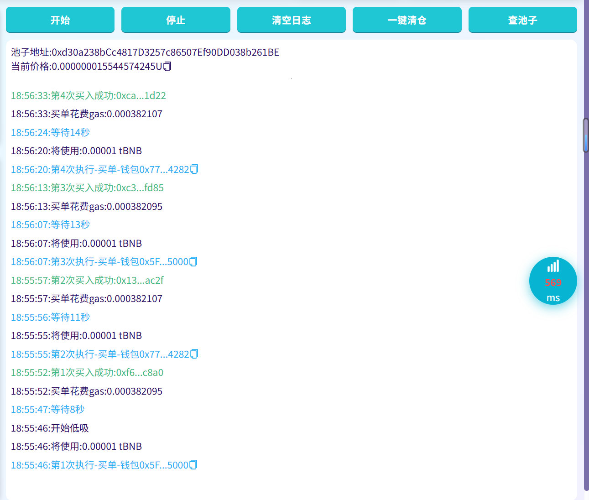<figcaption></figcaption></figure>

点击“`刷新`”，可以查看是否交易成功。

<figure>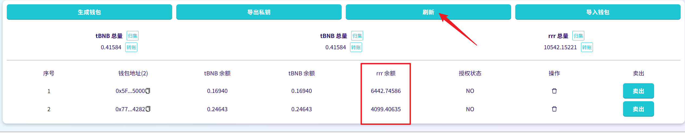<figcaption></figcaption></figure>

### 6. 其他功能

#### 生成钱包：

点击“`生成钱包`”，输入生成钱包数量，点击“`确定`”。<mark style="color:purple;">注意：生成钱包会覆盖已存在的钱包，并无法找回。请务必保存好已存在的钱包私钥。免费使用。</mark>

<figure>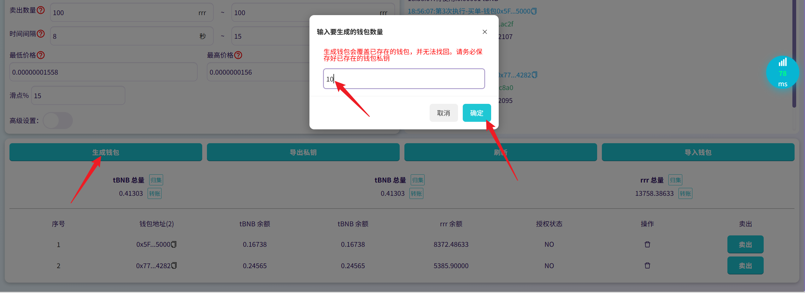<figcaption></figcaption></figure>

生成成功后，点击“`导出私钥`"。<mark style="color:purple;">请务必确认钱包信息是否下载完整，以免造成不必要的损失。</mark>

<figure>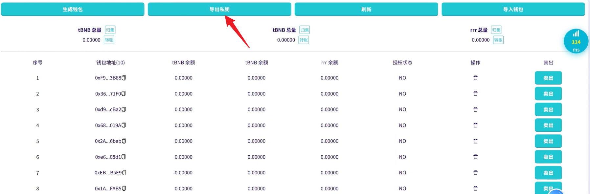<figcaption></figcaption></figure>

#### 转账：

点击对应代币边上的`转账`按钮，可以连接钱包内的代币转给每个钱包。<mark style="color:purple;">每次转账费用0.02 BNB，由连接钱包支付，会员也需收费。</mark>

<figure>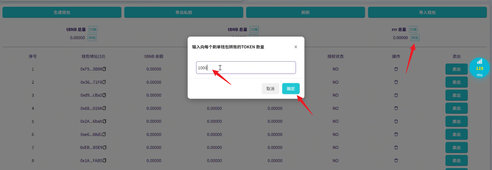<figcaption></figcaption></figure>

转账成功后会弹出成功提示，也可以点击”`刷新`“查看转账情况。

<figure>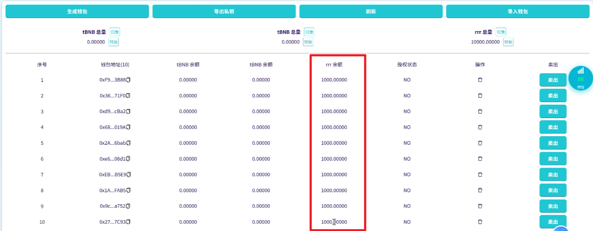<figcaption></figcaption></figure>

#### 单钱包卖出：

点击对应钱包后的`卖出`按钮，可以单独卖出钱包内的所有代币。<mark style="color:purple;">费用与砸盘模式一致，会员免费。</mark>

<figure>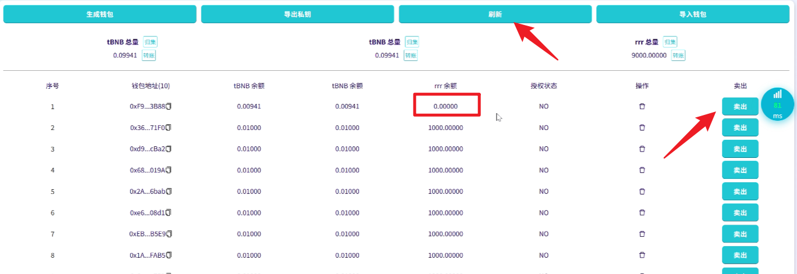<figcaption></figcaption></figure>

#### 一键清仓：

点击”`一键清仓`“，可以卖出所有钱包内的代币。<mark style="color:purple;">费用与砸盘模式一致，会员免费。</mark>

<figure>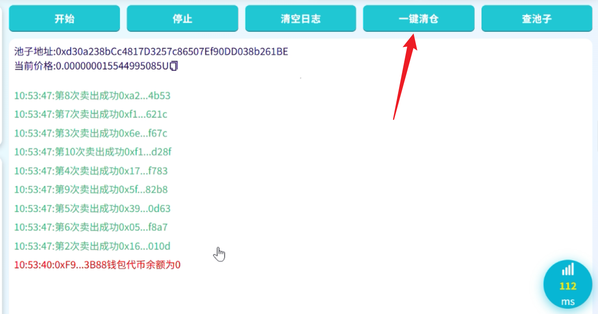<figcaption></figcaption></figure>

#### 归集：

点击对应代币边上的归集按钮，可以将所有钱包内的代币归集到指定钱包。<mark style="color:purple;">免费使用。</mark>

<figure>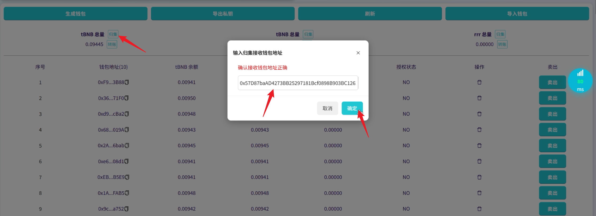<figcaption></figcaption></figure>

## 市值机器人-常见问题

### 1. 批量买入/卖出的钱包，会被识别为夹子或者机器人吗？

不会，夹子以及机器人利用的是抢跑区块的原理，很容易判断。而市值管理系统的所有买卖都是正常的交易，不会被识别为机器人。

### 2. 平台会拿到你的私钥吗？

绝对不可能，你的私钥不会存储在平台上，所有操作都是基于前端执行的，请放心使用。

### 3. 最多可以导入多少钱包？

为了确保操作的稳定性和流畅性，一次性导入的钱包数量最好低于100个。

### 4. 不同链转账费用?

* BSC: 0.02 BNB
* Arbitrum: 0 ETH
* Ethereum: 0 ETH
* Base: 0.005 BSAE
* Polygon: 0 POL

### 5. 不同链非会员费用？

* BSC: 0.0001 BNB
* Arbitrum: 0.00003 ETH
* Ethereum: 0.00003 ETH
* Base: 0.00003 BSAE
* Polygon: 0.01 POL

### 6. 有哪些常见报错？

* 有Gas但底池代币不足

<figure>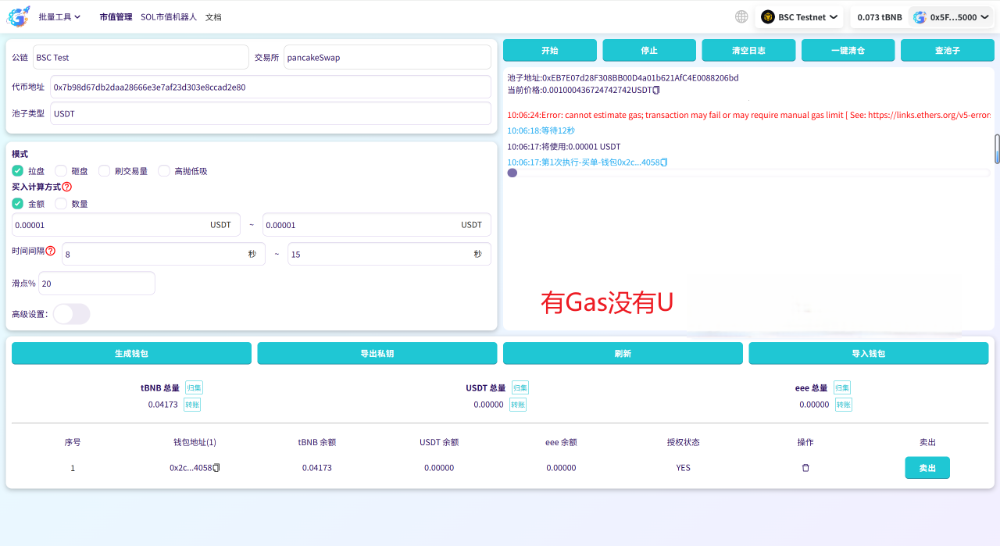<figcaption></figcaption></figure>

* 底池代币充足但Gas不足

<figure>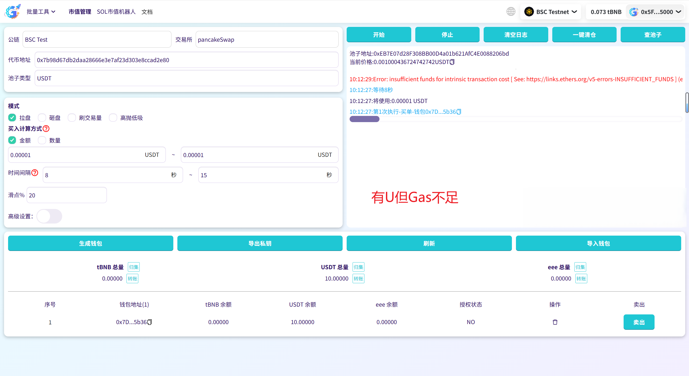<figcaption></figcaption></figure>

* Gas 和底池代币均不足

<figure>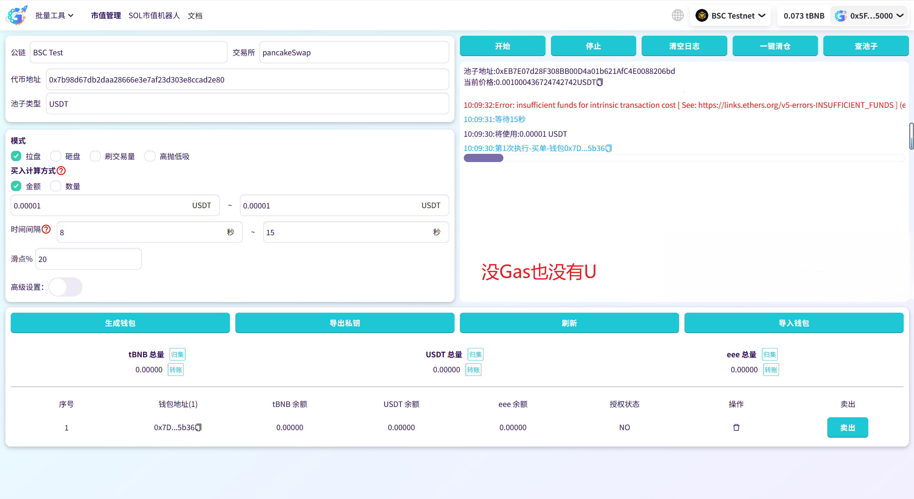<figcaption></figcaption></figure>

如有不明白或者不清楚的地方，请加入官方电报群：[https://t.me/gtokentool](https://t.me/gtokentool)
