# 🟩 PancakeSwap薄饼添加/移除流动性教程

## PancakeSwap薄饼介绍

PancakeSwap的诞生源于Uniswap的成功。Uniswap是以太坊生态系统中最大的去中心化交易所，采用了创新的自动做市商模型。然而，随着以太坊网络的拥堵和交易费用的上升，许多用户和项目开始寻找替代方案。Binance智能链作为一个高性能、低成本的区块链平台，成为了一个理想的选择。PancakeSwap就是在这样的背景下应运而生的。

## PancakeSwap添加流动性

### 1、连接钱包

访问PancakeSwap官网：[https://pancakeswap.finance/?chain=bsc](https://pancakeswap.finance/?chain=bsc) ,点击右上角连接钱包

<figure><figcaption></figcaption></figure>

此时会跳出提示，选择Metamask，右上角会出现钱包地址

<figure><figcaption></figcaption></figure>

<figure><figcaption></figcaption></figure>

### 2、添加流动性(加池子)

在菜单栏找到“赚取”，然后选择“农场/流动性”

<figure><figcaption></figcaption></figure>

在打开的新页面里，选择“我的持仓”或者直接进入链接：[https://pancakeswap.finance/liquidity/positions](https://pancakeswap.finance/liquidity/positions)

<figure>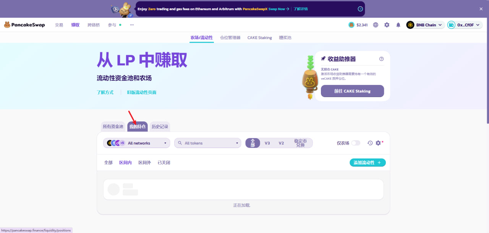<figcaption></figcaption></figure>

此时在右边可以看到添加流动性的按钮

<figure>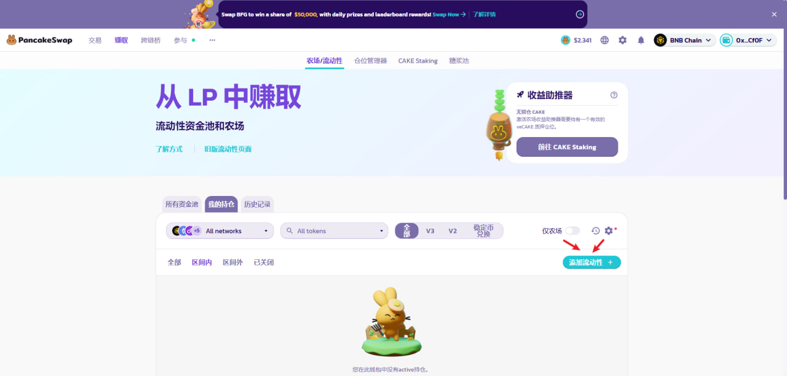<figcaption></figcaption></figure>

然后会看到两个代币对提示框，在两个选择您想要添加流动性的交易对中的两个代币

<figure>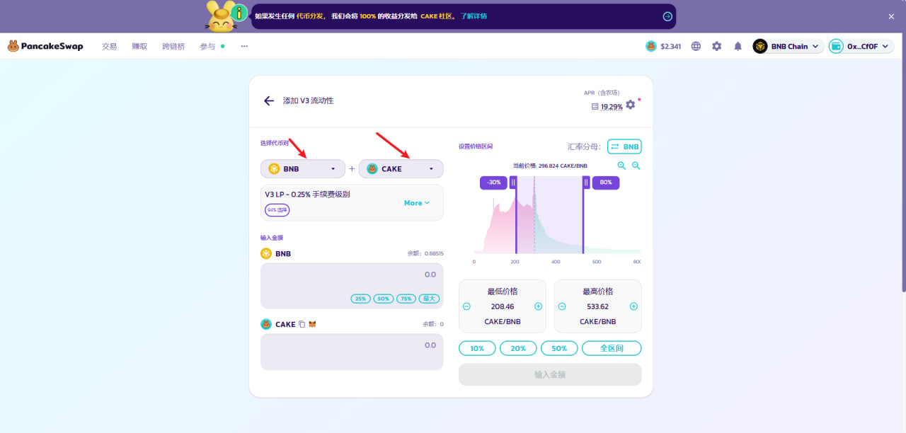<figcaption></figcaption></figure>

一般来说，左边选择BNB或者USDT，右边搜索选择你自己的代币

<figure><figcaption></figcaption></figure>

我选择的交易对：USDT-GToken。选择好交易对之后，记得选择“添加V2流动性”，这一步非常重要请谨记。V3流动性只适合标准币，除此之外，必须都加V2的流动性

<figure>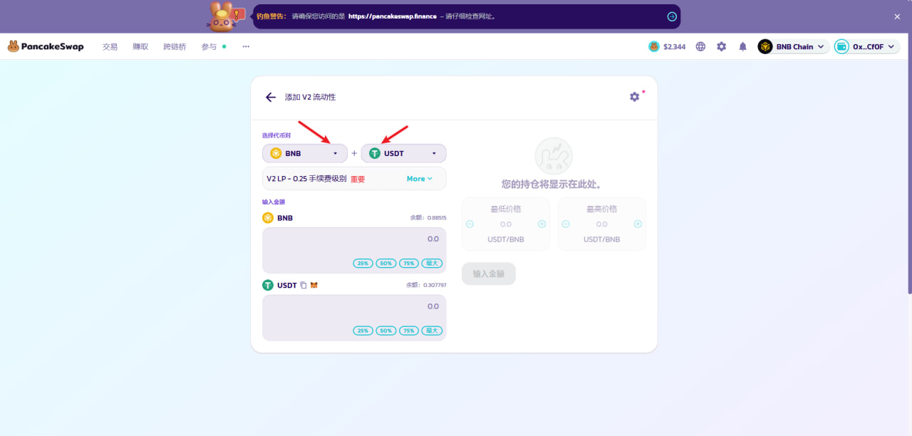<figcaption></figcaption></figure>

之后，我们根据自己的需求，填写注入流动性资金池的代币数量。两个代币数量的比例，决定了代币的初始价格。例如，我添加1000usdt和1000个GToken，说明代币的上线价格是1U

<figure>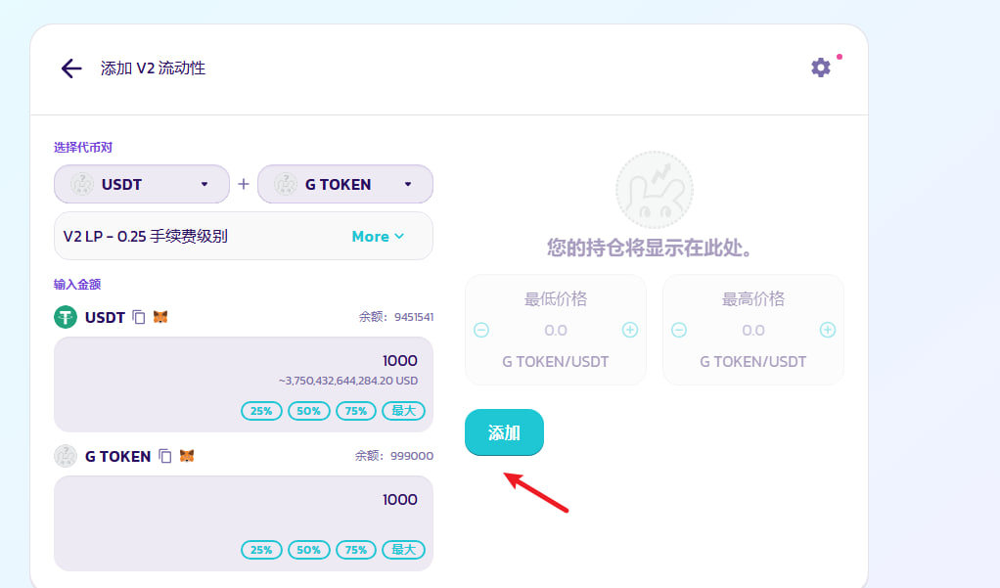<figcaption></figcaption></figure>

然后依次授权USDT和你自己发行的代币

<figure>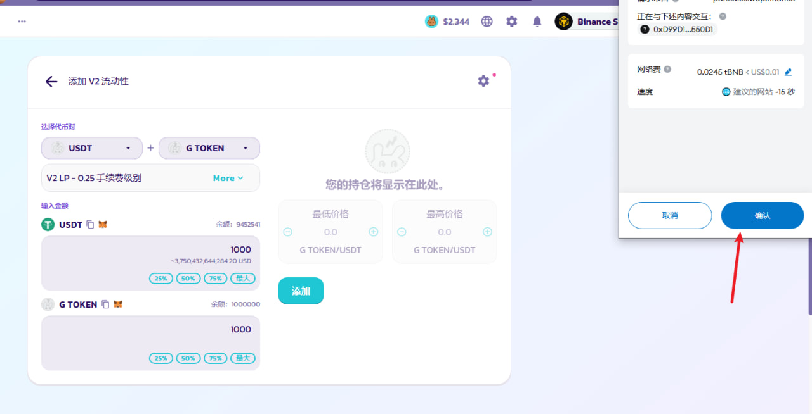<figcaption></figcaption></figure>

授权成功后点击“添加”，完成后，返回上一页，就能看到池子信息

<figure>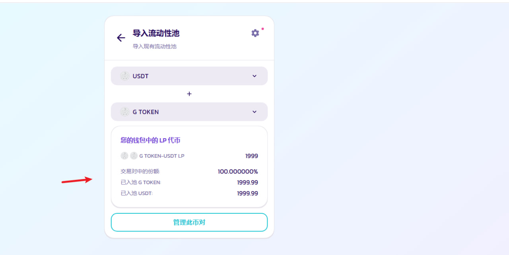<figcaption></figcaption></figure>

## PancakeSwap移除出流动性（撤池子）

在流动性页面找到自己的流动性，点击管理此币对

<figure>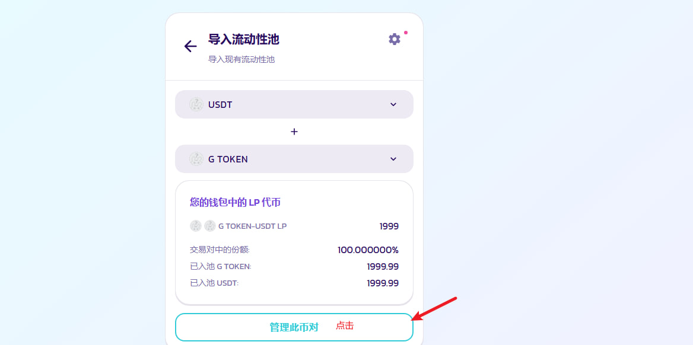<figcaption></figcaption></figure>

跳转到一个新的页面，点击“移除”

<figure>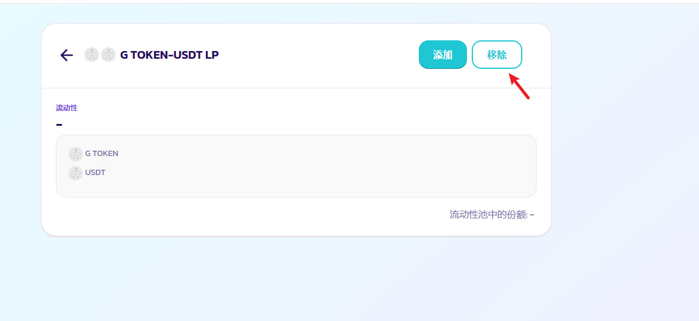<figcaption></figcaption></figure>

选择撤出流动性比例，选择50%就是撤出一半的流动性。选择最大，就是移除100%流动性

<figure>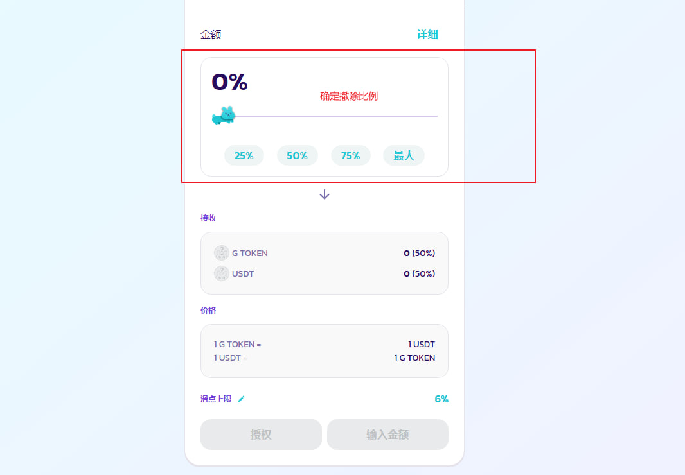<figcaption></figcaption></figure>

添好了撤出的流动性比例之后，点击授权，小狐狸钱包批准

<figure>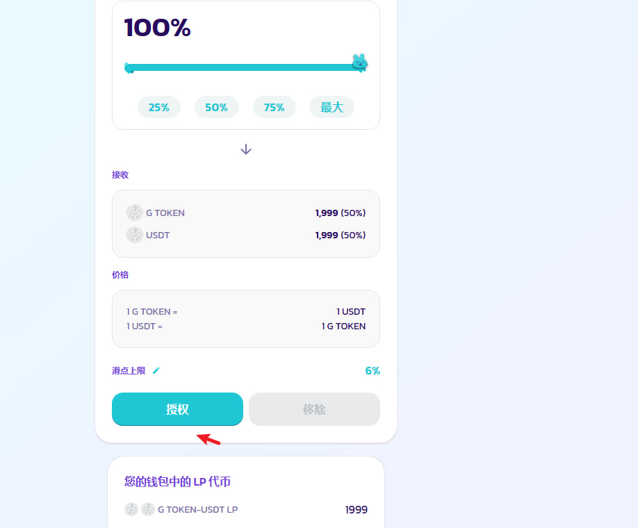<figcaption></figcaption></figure>

<figure>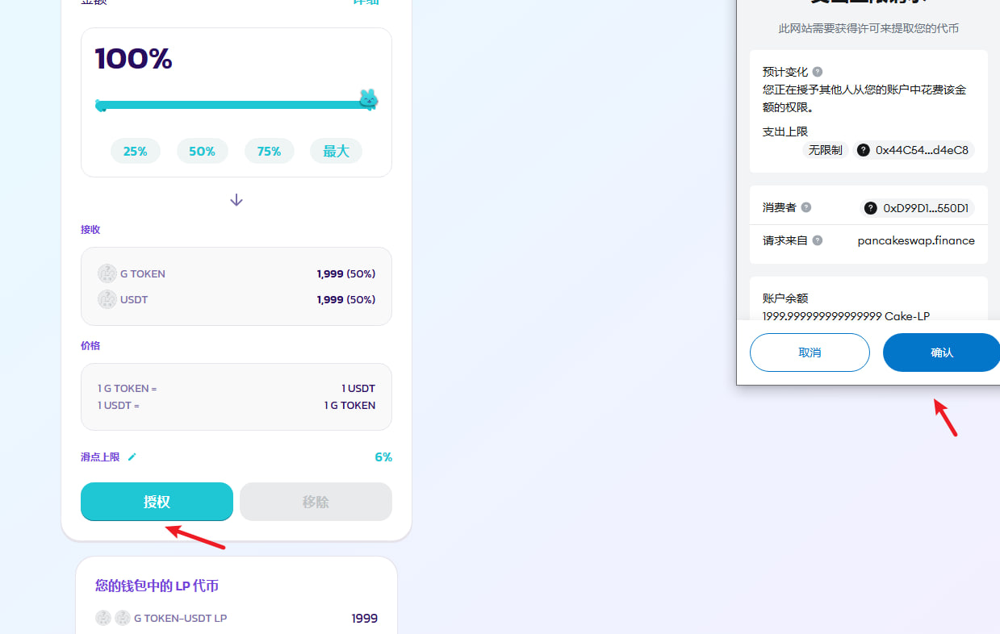<figcaption></figcaption></figure>

再点击移除，小狐狸钱包逐步确认，就可以将流动性全部移除了

<figure>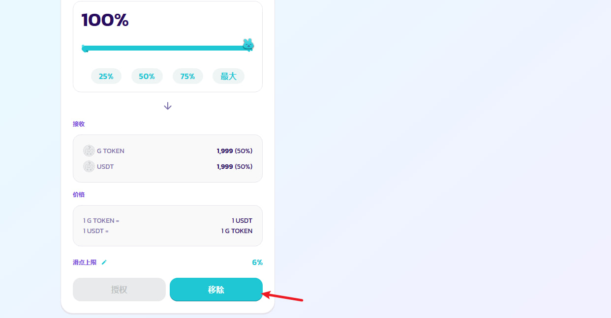<figcaption></figcaption></figure>

<figure>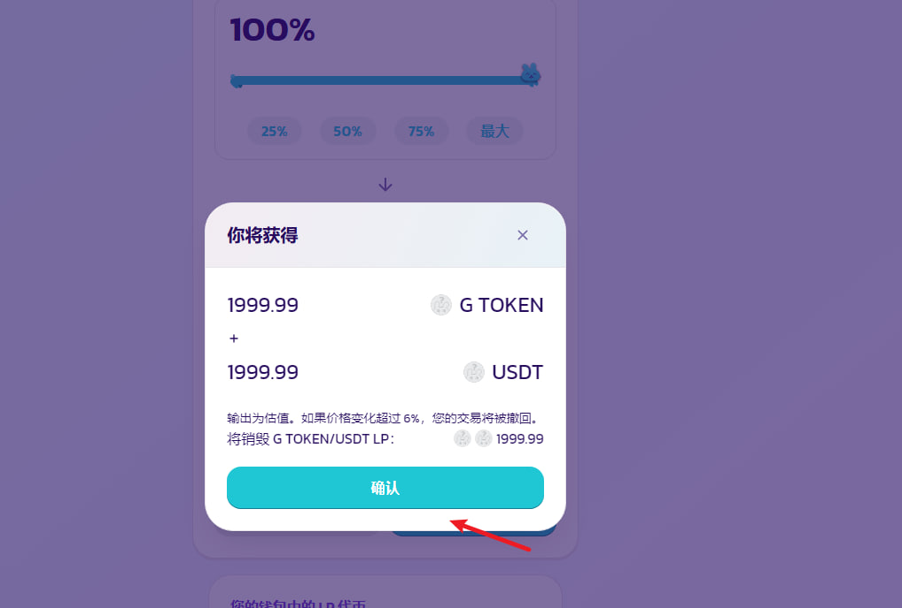<figcaption></figcaption></figure>

<figure>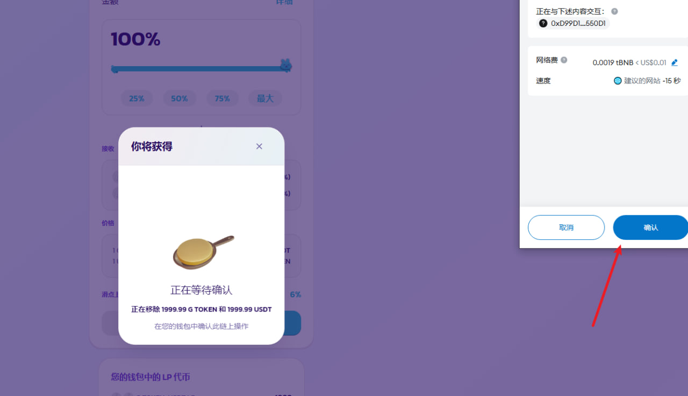<figcaption></figcaption></figure>

<figure>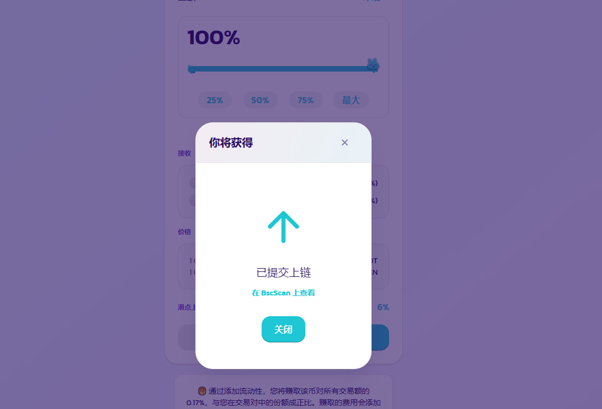<figcaption></figcaption></figure>

回到流动性页面，已经没有流动性信息了

<figure>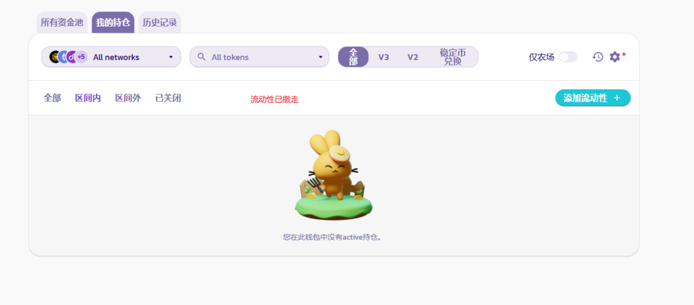<figcaption></figcaption></figure>

## 疑问解答 

**1）第一次加池要加多少币？加多少钱？**

* 答：没有要求，可以根据你的代币经济学和价格需求，添加适当比例的代币。一般来说，要求池子尽量大于300U或1个BNB

**2）交易时提示流动性不足，是什么意思？**

* **答：**&#x8BF4;明池子里的流动性不够。薄饼有规定，单次交易的数量/金额，一般不能超过池子里的25%。假设你池子里有100U和100个币，如果你买币，不能买超过25个。如果你卖币，也不能卖超过25U。以此类推，池子越大，交易越顺畅

**3）撤池子能把别人加的池子撤走吗？**

* **答：**&#x4E0D;能。撤池子，只能撤出自己的流动性比例。假设自始至终只有你一个人加池子，那你撤出100%，就可以把池子全撤走。假设也有其他人在加池子，那他们的流动性你是撤不走的

**4）能不能直接往池子里转币？**

* **答：坚决不能。**&#x5982;果你想让池子变大，只能在薄饼以加流动性的方式增大池子，千万不能直接往池子地址里转币，不然会被套利机器人把池子掏走

**5）V2和V3有什么区别？**

* **答：**&#x5E26;功能/机制的币，只能加V2。目前V3的池子只支持标准币。

如有不明白或者不清楚的地方，请加入官方电报群：[**https://t.me/gtokentool**](https://t.me/gtokentool)
