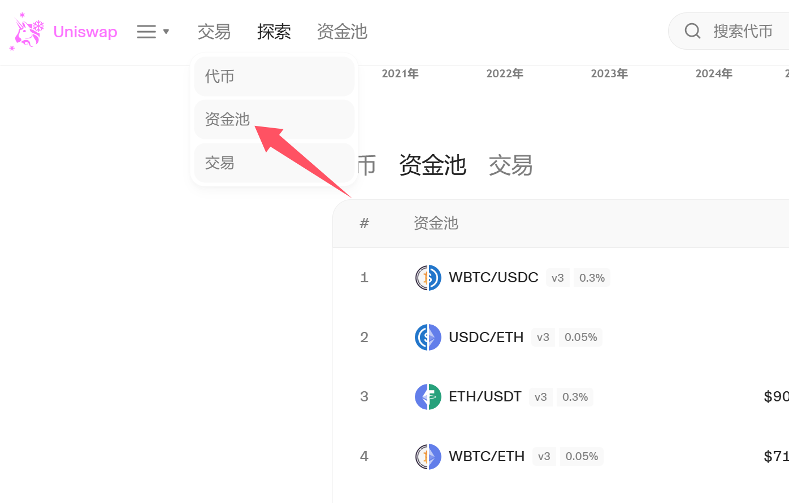

# 🟧 Uniswap V2添加流动性教程

## Uniswap v2介绍

Uniswap是迄今为止使用频率最高、使用范围最广、最受用户欢迎的产品。相较于第一代产品，V2在性能、功能和用户体验等方面进行了全面优化。V2支持更多的代币交易对，提供了更加丰富的交易功能，同时也增强了系统的安全性和稳定性。

V2采用AMM（自动做市商）机制进行交易。用户可以将自己的代币存入流动性池，获得相应的流动性提供者（LP）代币作为回报。流动性池中的代币按照特定的比例进行配对，形成交易对。当用户进行交易时，Uniswap V2会根据流动性池中的代币比例和交易价格，自动计算交易双方的收益和损失，并完成交易。

## Uniswap V2添加流动性教程

### 1.打开Uniswap加池页面

网址：[https://app.uniswap.org/pool ](https://app.uniswap.org/pool)

点击资金池

<figure><figcaption></figcaption></figure>

连接钱包

<figure><figcaption></figcaption></figure>

### 2.选择V2资金池

<figure><figcaption></figcaption></figure>

### 3.创建资金池

打开V2的页面中，可以看到已添加的流动性（如果之前没有加过流动性，就显示：未找到流动性），增加V2流动性或创建配对

<figure><figcaption></figcaption></figure>

* 创建配对：创建一个新的流动性资金池（交易对），我们一般是要选这个
* 导入资金池：导入已有的流动性资金池
* 添加V2流动性：即某个代币已经有了资金池的基础上，我们继续增加池子流动性

### 4.选择代币并设定价格比例

在已添加加池页面里，通过合约地址查找代币，并使其与ETH配对。

<figure><figcaption></figcaption></figure>

选择ETH与FERC这个代币配对，上面输入ETH的数量，下面输入FERC的数量

<figure><figcaption></figcaption></figure>

### 5.授权并确认

确定好代币数量与比例之后，点击批准，然后会跳出钱包让你确认。之后在点击供应，钱包再确认一次，将ETH和代币支付到池子里，就算是完成了。

## 常见问题

**什么是流动资金池？**

它们是锁定在智能合约中以促进流动性的代币池。 通常，流动资金池的功能是允许交易者交易其数字资产，同时获得其资产持有量的回报。

**什么是Uniswap V2？**

Uniswap V2是Uniswap V1的迭代和改进。 它包括以下功能；

ERC20 / ERC20对 价格神谕 Flash掉期 核心/助手架构 技术改进 可持续发展之路 测试网和启动详细信息

**Uniswap V2和V1之间的区别？**

Uniswap V2只是对V1的改进。 Uniswap V1建立在以太坊区块链上，而V2是一个单独的区块链。

取消掉期的V1要求流动性提供者为其添加到池中的每个代币在ETH中存入同等价值。 而Unswap V2正在实施ERC-20 / ERC-20流动性存款。

**您如何计算资产池流动性？**

用X \* Y = K确定池中的流动性。 X，Y和K分别代表ETH，ERC-20令牌和常量的值。 上面的等式代表了ETH / ERC-20代币的供求关系，并用它来平衡集合代币的价格。

如有不明白或者不清楚的地方，请加入官方电报群：[**https://t.me/gtokentool**](https://t.me/gtokentool)
