# 便捷冻结教程

## 📌 核心摘要

* **功能定位**：Solana链上**代币冻结权限执行工具**。这是一个去中心化的DApp工具，**不依赖任何中心化后台或特定身份**。只要钱包持有代币的**冻结权限**，即可通过连接钱包，直接对链上账户进行冻结或解冻操作。
* **核心逻辑（认权不认人）**：
  * **交互方式**：用户无需输入或导入私钥，只需通过浏览器插件（如Phantom）**连接**已持有冻结权限的钱包。
  * **功能闭环**：
    * **批量冻结**：支持一次性处理多个恶意地址。
    * **智能筛选**：查询并筛选“未冻结”地址，一键加入待处理列表。
    * **解除冻结**：支持将地址从黑名单移除，恢复交易权限。
* **关键前置条件**：
  * 必须拥有**具备冻结权限的钱包**。
  * 确保该连接钱包内有足够的 **SOL** 支付Gas费。

## 准备事项 

1. 一台电脑或者一部手机
2. Solana 钱包（[幻影钱包Phantom安装教程](https://docs.gtokentool.com/solana/auxiliary-tutorial/phantom-wallet-installation)）
3. 代币地址以及要拉黑的钱包地址
4. 请确保连接钱包有足够的 SOL&#x20;

## Solana便捷冻结具体操作流程

### 1. 连接钱包

进入Solana便捷冻结页面：[https://sol.gtokentool.com/zh-CN/airdropSection/ConvenientFreeze](https://sol.gtokentool.com/zh-CN/airdropSection/ConvenientFreeze)，右上角点击连接钱包并选择 Main 网络，这里用测试网演示。

<figure>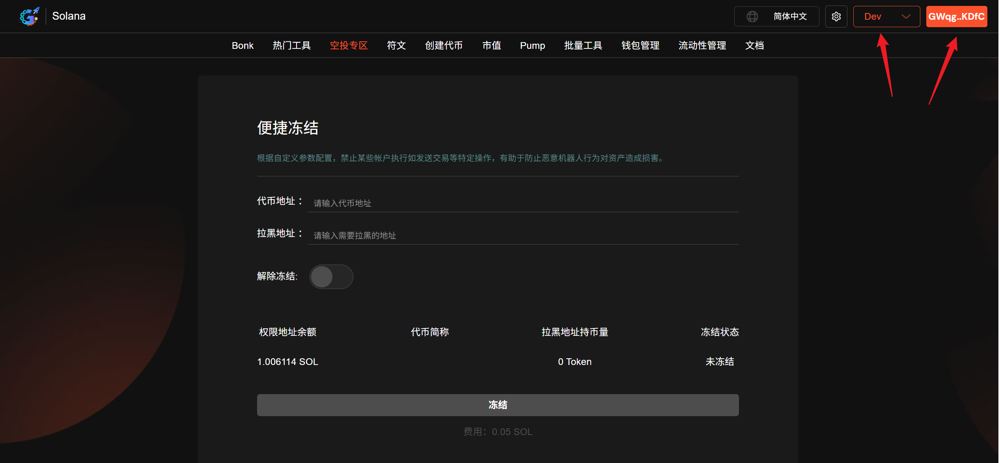<figcaption></figcaption></figure>

### 2. 输入代币地址

输入代币地址后，会显示代币简称以及权限地址是否与连接钱包相符。

<figure>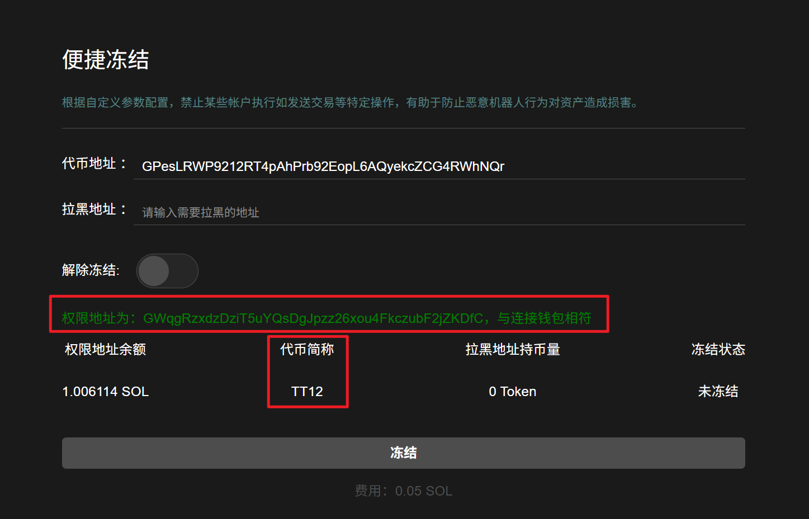<figcaption></figcaption></figure>

### 3. 输入要拉黑的地址

输入要拉黑的地址后，会显示拉黑地址的持币量以及冻结状态。

<figure>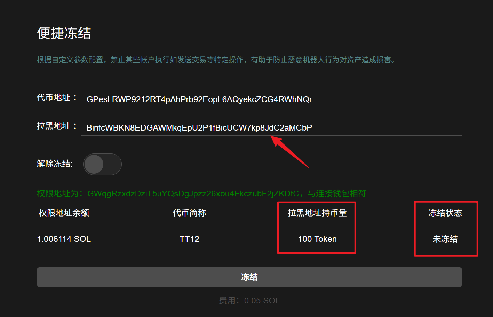<figcaption></figcaption></figure>

### 4. 点击“冻结”

弹出钱包后点击"确认“，冻结成功后会弹出成功提示，冻结状态也会变成`已冻结`。

<figure>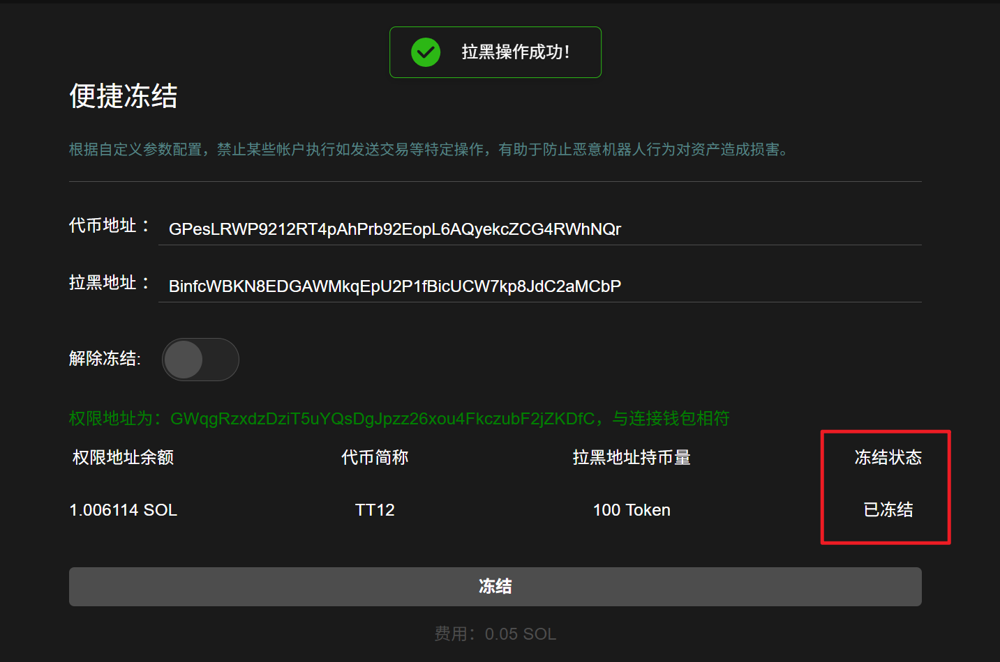<figcaption></figcaption></figure>

### 5. 解除冻结

若需要解除冻结，打开“`解除冻结`”开关，点击下方“`解除冻结`”按钮。

<figure>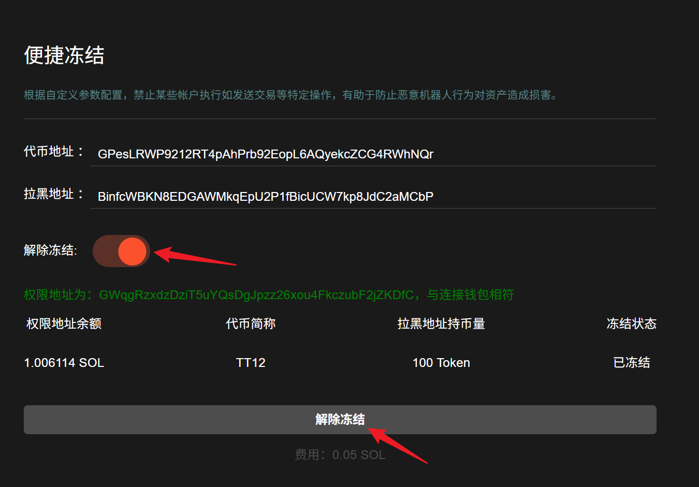<figcaption></figcaption></figure>

弹出钱包后点击"确认“，解除成功后会弹出成功提示，冻结状态也会变回`未冻结`。

<figure>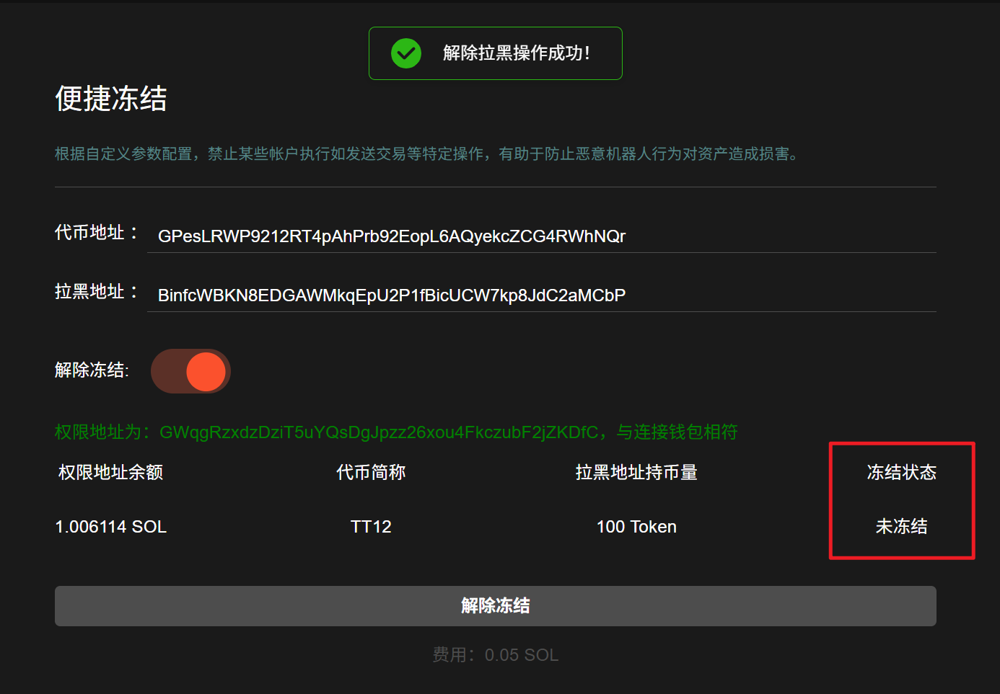<figcaption></figcaption></figure>

### 6. 批量冻结

有批量冻结需求的话，可以打开`批量冻结`的开关。

<figure>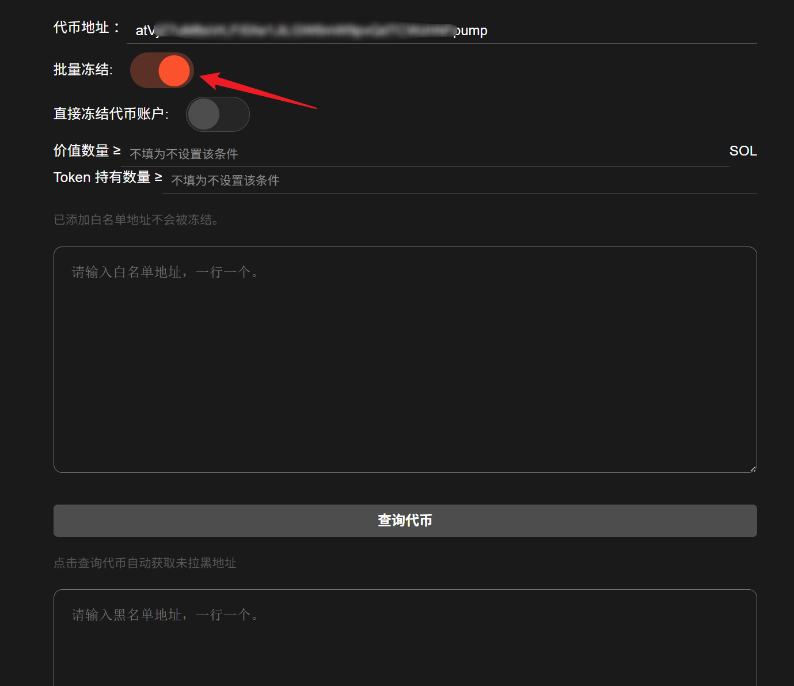<figcaption></figcaption></figure>

可以设置冻结的条件，添加白名单。

<figure>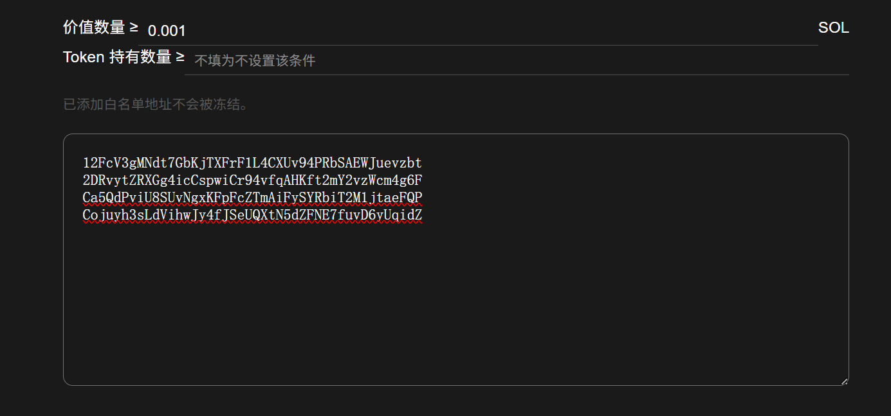<figcaption></figcaption></figure>

点击“`查询代币`”，可以快速检测到代币的持有地址并填入下方。

<figure>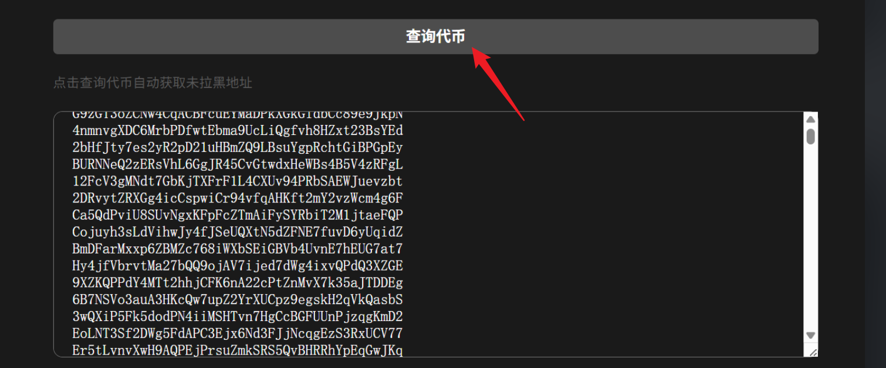<figcaption></figcaption></figure>

若检测到异常地址也可以直接一键提取出来。

<figure>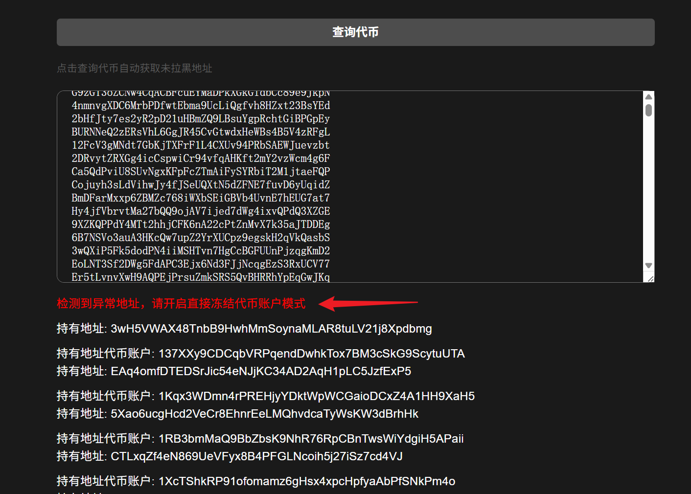<figcaption></figcaption></figure>

<figure>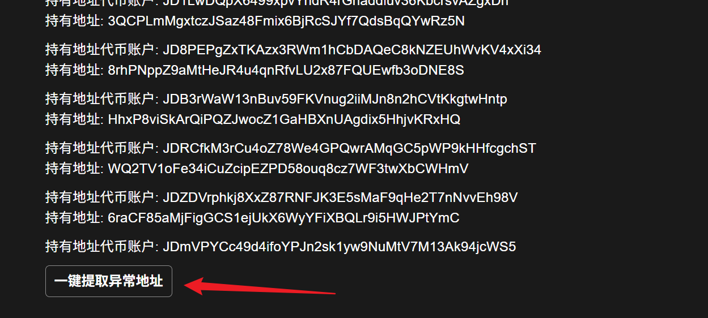<figcaption></figcaption></figure>

检测到异常地址时开启`直接冻结代币账户`，其他时候不要开启。

<figure>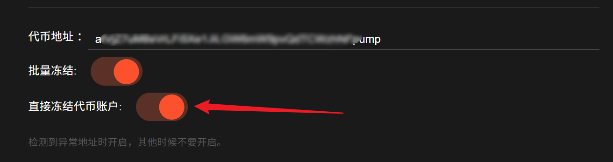<figcaption></figcaption></figure>

然后就可以点击下方的`批量冻结`按钮了，钱包弹出后点击确认。

## 常见问题 FAQ

### Q: 什么是便捷冻结功能？

**A:** 根据自定义参数配置，禁止某些帐户执行如发送交易等特定操作，有助于防止恶意机器人行为对资产造成损害。支持批量冻结，可进行条件筛选冻结账户，还可批量添加白名单。

### Q: 谁有权限冻结账户？

**A:** 只有持有代币 Freeze 权限的账户才能执行冻结操作。

### Q: 被冻结的账户还能接收代币吗？

**A:** 可以，冻结只限制转出和交易，不影响接收。

### Q: 冻结账户后如何解冻？

**A:** 持有 Freeze 权限的账户可以随时在这个功能页面发起解冻操作。

### Q: 冻结账户会影响代币的正常流通吗？

**A:** 只影响被冻结的账户，不会影响整体代币流通。

### 🤝 连接 GTokenTool 

* **💬 Telegram社群**：[点击加入官方群组](https://t.me/gtokentool)
* **🐦 Twitter (X)**：[关注我们获取最新动态](https://x.com/gtokentool)
* **📚 官方文档**：[查看 Gitbook 文档](https://docs.gtokentool.com/)
* **💻 开源代码**：[访问 GitHub 仓库](https://github.com/Gtokentool/docs/blob/master/SUMMARY.md)
* **📺 视频教程**：[订阅 YouTube 频道](https://www.youtube.com/@GTokenTool)

> ⚠️ 风险提示与免责声明
>
> GTokenTool 保留随时全权酌情因任何理由修改、变更或取消此公告的权利，无需事先通知。
>
> 以上信息内容仅供参考，GTokenTool 对本平台上的任何虚拟资产、产品或促销活动不做任何推荐或保证。虚拟资产的价格波动很大，投资交易虚拟资产将面临巨大风险。**请谨慎投资。**
