# Solana自动冻结教程

## 📌 核心摘要

* **功能定位**：Solana链上**资产安全防护工具**。它是黑名单功能的升级版，通过自定义参数配置，自动拦截或禁止特定账户执行交易，旨在防止恶意机器人攻击或异常行为导致的资产损失。
* **核心逻辑（权限控制）**：**监控与执行分离**。
  * **监控对象**：指定的代币合约或其所属钱包（需配置私钥）。
  * **防御机制**：一旦检测到符合“黑名单”特征的操作，立即触发**冻结/禁止交易**指令。
* **关键前置条件**：
  * 必须拥有**被监控代币的钱包私钥**（用于授权冻结操作）。
  * 确保**跟踪钱包**内有足够的 **SOL** 和代币，以及少量 **USDC**（用于支付Gas及应对潜在滑点）。

## 准备事项 

1. 一台电脑或者一部手机
2. Solana 钱包（[幻影钱包Phantom安装教程](https://docs.gtokentool.com/solana/auxiliary-tutorial/phantom-wallet-installation)）
3. 要进行监控的代币所属的钱包私钥
4. 要监控的代币
5. 请确保跟踪钱包有足够的 SOL 和代币，少量的 USDC

## Solana自动冻结具体操作流程

### 1. 连接钱包

进入Solana自动冻结页面：[https://sol.gtokentool.com/zh-CN/airdropSection/AutoFreeze](https://sol.gtokentool.com/zh-CN/airdropSection/AutoFreeze)，右上角点击连接钱包并选择 Main 网络。

<figure>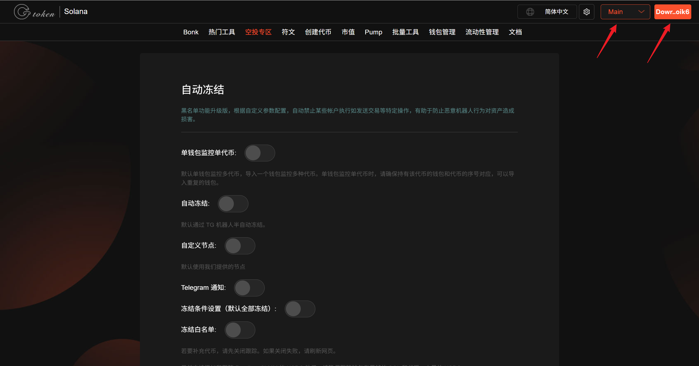<figcaption>
连接钱包并选择Main网络
</figcaption></figure>

### 2. 单钱包监控单代币（可选）

默认单钱包监控多代币，导入一个钱包监控多种代币。单钱包监控单代币时，请确保持有该代币的钱包和代币的序号对应，可以导入重复的钱包。

### 3. 自动冻结（可选）

默认通过 TG 机器人半自动冻结。

### 4. 自定义节点（可选）

打开后输入自己的 HTTP节点。

### 5. 打开“Telegram 通知”

根据[设置自动冻结播报教程](https://docs.gtokentool.com/solana/airdrop-section/set-up-auto-freeze-broadcasts-tutorial)设置跟卖播报，填写群ID。

<figure>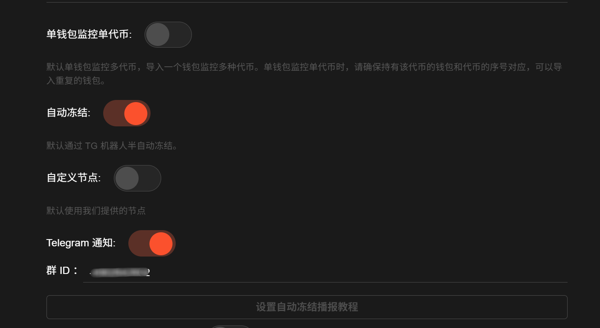<figcaption>
开启自动冻结并设置自动冻结播报
</figcaption></figure>

### 6. 触发条件设置（可选）

默认全部触发，可对USDC买入数量和代币买入数量进行条件设置。

<figure>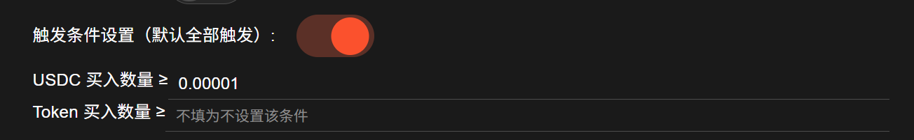<figcaption>
设置触发条件
</figcaption></figure>

### 7. 冻结白名单（可选）

已添加白名单地址不会被冻结。

### 8. 新增代币

点击“`新增代币`”，添加需要监控的代币。


若要补充代币，请先关闭跟踪。如果关闭失败，请刷新网页。
\
目前支持添加和跟踪 Raydium CLMM 的 USDC 池子和 PumpFun Swap 的 SOL 池子，请确保跟踪钱包有足够的 SOL 和代币，少量的 USDC。


添加成功后，下面的表格里可以看到代币的信息。

<figure>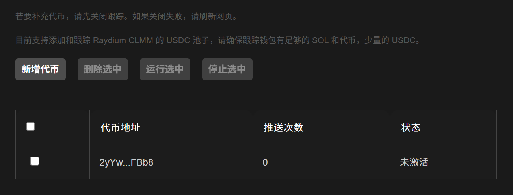<figcaption>
添加代币效果
</figcaption></figure>

### 9. 导入钱包

点击“`导入钱包`”，添加代币所属的钱包。<mark style="color:purple;">注意：导入钱包的顺序要与监控的代币一致。</mark>

导入成功后，可以看到钱包内SOL余额以及基础代币余额。可以点击“`刷新钱包`”获取当前钱包余额，<mark style="color:purple;">建议每次使用前刷新一次</mark>。也可点击`删除`按钮删除对应的钱包，或者点击“`全部删除`”按钮删除全部钱包。

<figure>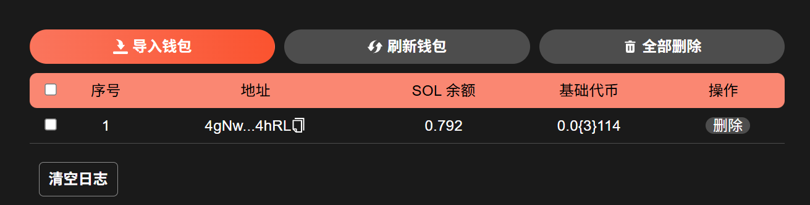<figcaption>
导入钱包效果
</figcaption></figure>

### 10. 选择要监控的代币并点击“运行选中”

先勾选钱包，再选择要监控的代币，最后点击“`运行选中`”。

<figure>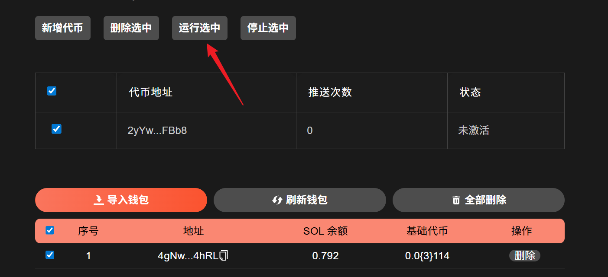<figcaption>
勾选代币和钱包，点击“运行选中”
</figcaption></figure>

点击“`运行选中`”后，下面的日志会显示代币已监控。

<figure>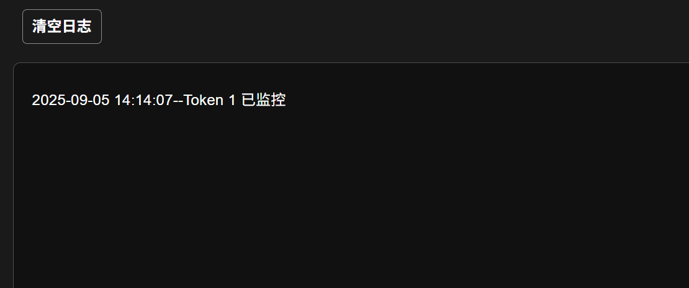<figcaption>
日志提示代币已监控
</figcaption></figure>

代币的状态也会变成“激活”状态。

<figure>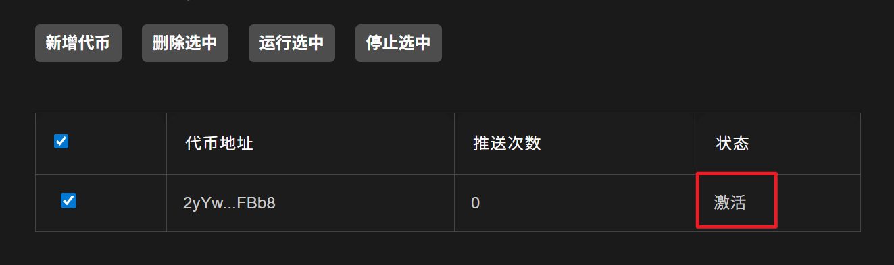<figcaption>
代币状态激活
</figcaption></figure>

### 11. 等待其他人的买入操作，机器人会发送信息提醒

可以在日志中查看到监控情况。

<figure>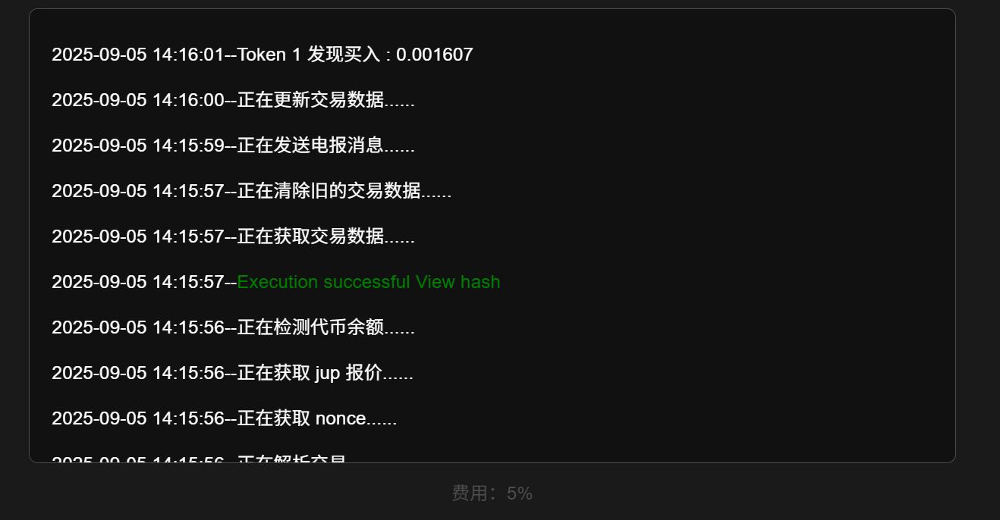<figcaption>
交易日志
</figcaption></figure>

同时，Telegram 中的机器人也会发送信息。

<figure>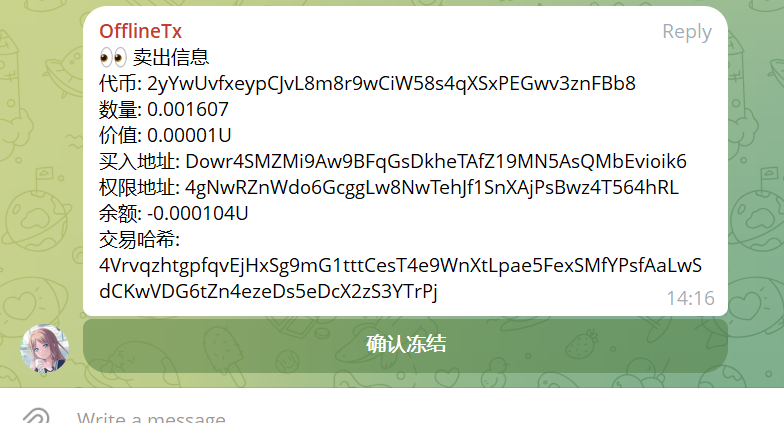<figcaption>
电报播报
</figcaption></figure>

### 12. 取消监控

若要补充代币或者修改触发条件，请先关闭跟踪。点击“`停止选中`”可以关闭监控。日志中会显示代币已取消监控。代币状态会变回未激活。

<figure>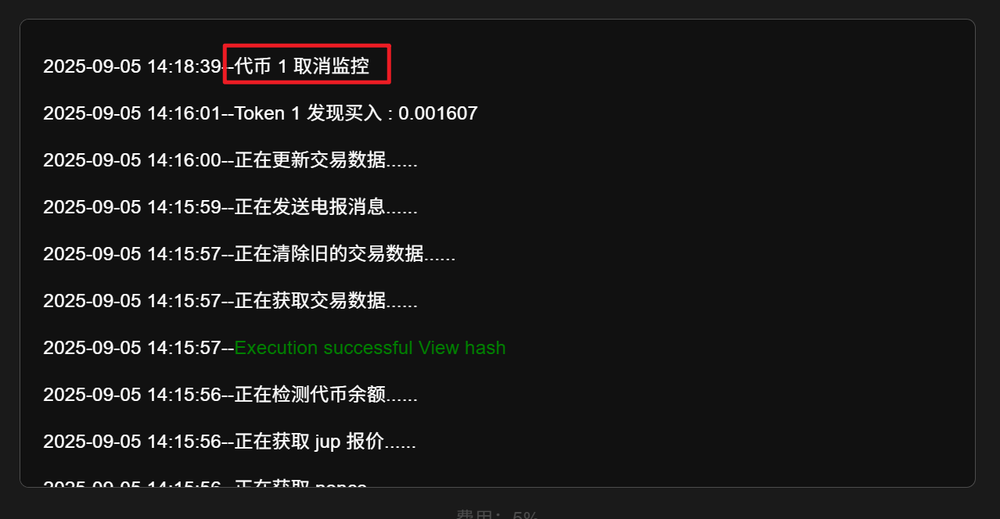<figcaption>
日志提示取消监控
</figcaption></figure>

<figure>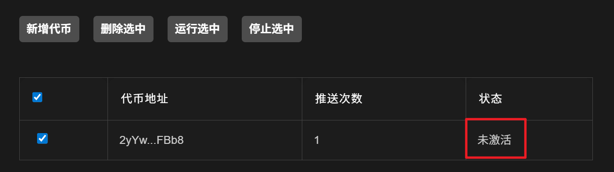<figcaption>
代币状态未激活
</figcaption></figure>

## ❓常见问题 FAQ

### Q: 自动冻结是怎么收费的？

**A:** 每笔收取5%的手续费。

### Q: 自动冻结支持那些DEX？

**A:** 目前支持 Raydium CLMM 的 USDC 底池和 PumpFun Swap 的 SOL 底池。

### Q: 自动冻结怎么设置 Telegram 播报？

**A:** 根据[设置自动冻结播报教程](https://docs.gtokentool.com/solana/airdrop-section/solana-auto-freeze-tutorial)可以设置 Telegram 播报。

### 🤝 连接 GTokenTool 

* **💬 Telegram社群**：[点击加入官方群组](https://t.me/gtokentool)
* **🐦 Twitter (X)**：[关注我们获取最新动态](https://x.com/gtokentool)
* **📚 官方文档**：[查看 Gitbook 文档](https://docs.gtokentool.com/)
* **💻 开源代码**：[访问 GitHub 仓库](https://github.com/Gtokentool/docs/blob/master/SUMMARY.md)
* **📺 视频教程**：[订阅 YouTube 频道](https://www.youtube.com/@GTokenTool)

> ⚠️ 风险提示与免责声明
>
> GTokenTool 保留随时全权酌情因任何理由修改、变更或取消此公告的权利，无需事先通知。
>
> 以上信息内容仅供参考，GTokenTool 对本平台上的任何虚拟资产、产品或促销活动不做任何推荐或保证。虚拟资产的价格波动很大，投资交易虚拟资产将面临巨大风险。**请谨慎投资。**
