# Solana跟卖机器人教程

## 📌 核心摘要

* **功能定位**：Solana链上**自动化卖出工具**。核心逻辑是**监控指定合约的买入行为**，一旦检测到有人买入，立即触发**用户自己的钱包**进行自动卖出。
* **执行机制**：**监控目标（合约）与执行钱包（用户）分离**。
  * **监控对象**：目标代币的**合约地址**。
  * **执行对象**：你**自己**的钱包（需导入私钥），机器人将操作此钱包进行卖出。
* **关键前置条件**：必须准备**目标代币的合约地址**（用于监控）和**你自己的钱包私钥**（用于执行卖出），并确保钱包内有足够的 SOL 和代币，少量的 USDC（用于支付 Gas 和交易）。

## 准备事项 

1. 一台电脑或者一部手机
2. Solana 钱包（[幻影钱包Phantom安装教程](https://docs.gtokentool.com/solana/auxiliary-tutorial/phantom-wallet-installation)）
3. 要监控的代币合约地址
4. 执行卖出的钱包私钥
5. 请确保执行卖出的钱包内有足够的 SOL 和代币，少量的 USDC（用于支付 Gas 和交易）

## Solana跟卖机器人具体操作流程

### 1. 连接钱包

进入Solana跟卖机器人页面：[https://sol.gtokentool.com/zh-CN/airdropSection/ReTran](https://sol.gtokentool.com/zh-CN/airdropSection/ReTran)，右上角点击连接钱包并选择 Main 网络。

<figure>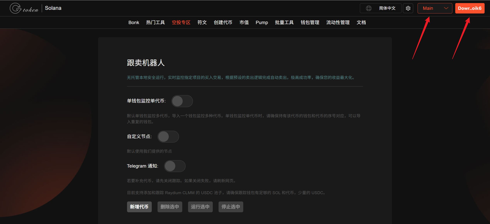<figcaption></figcaption></figure>

### 2. 模式一：单钱包监控单代币

#### 1. 打开“单钱包监控单代币”

#### 2. 自定义节点（可选）

打开后输入自己的 HTTP节点。

#### 3. 打开“Telegram 通知”

根据[设置跟卖播报教程](https://docs.gtokentool.com/solana/airdrop-section/set-up-follow-up-selling-broadcasts-tutorial)设置跟卖播报，填写群ID。

<figure>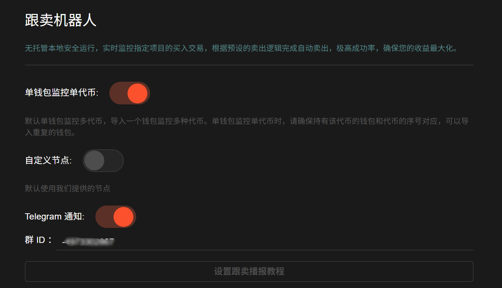<figcaption></figcaption></figure>

#### 4. 触发条件设置（可选）

由于交易所本身收取费用，因此实际设置值要比期望值小一点。

默认全部触发，可对USDC买入数量和代币买入数量进行条件设置。

<figure>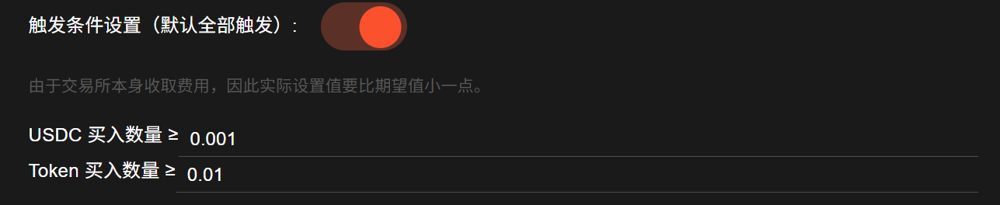<figcaption></figcaption></figure>

#### 5. 新增代币

点击“`新增代币`”，添加需要监控的代币。


若要补充代币，请先关闭跟踪。如果关闭失败，请刷新网页。
\
目前支持添加和跟踪 Raydium CLMM 的 USDC 池子，请确保跟踪钱包有足够的 SOL 和代币，少量的 USDC。


<figure>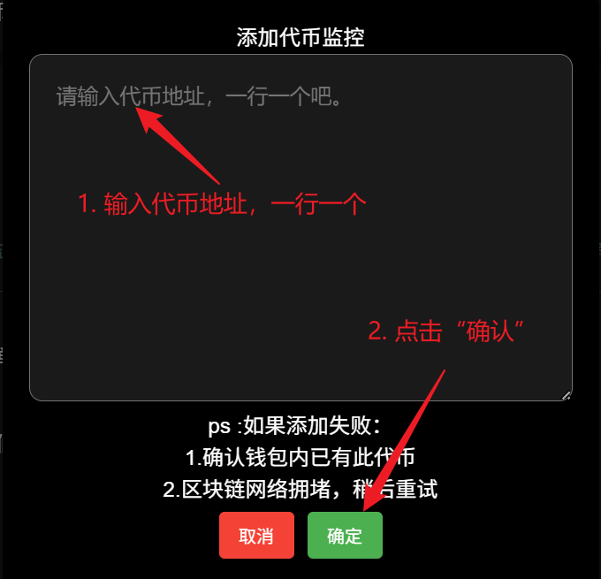<figcaption></figcaption></figure>

添加成功后，下面的表格里可以看到代币的信息。

<figure>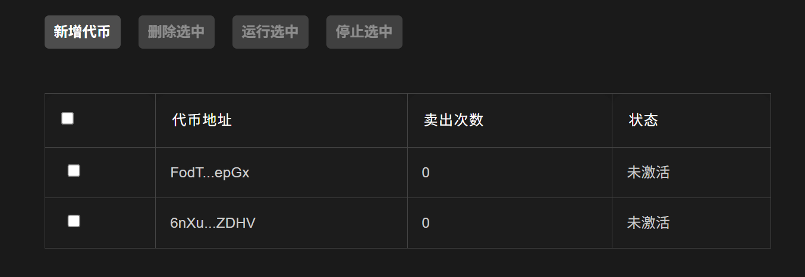<figcaption></figcaption></figure>

#### 6. 导入钱包

点击“`导入钱包`”，添加代币所属的钱包。<mark style="color:purple;">注意：导入钱包的顺序要与监控的代币一致。</mark>

<figure>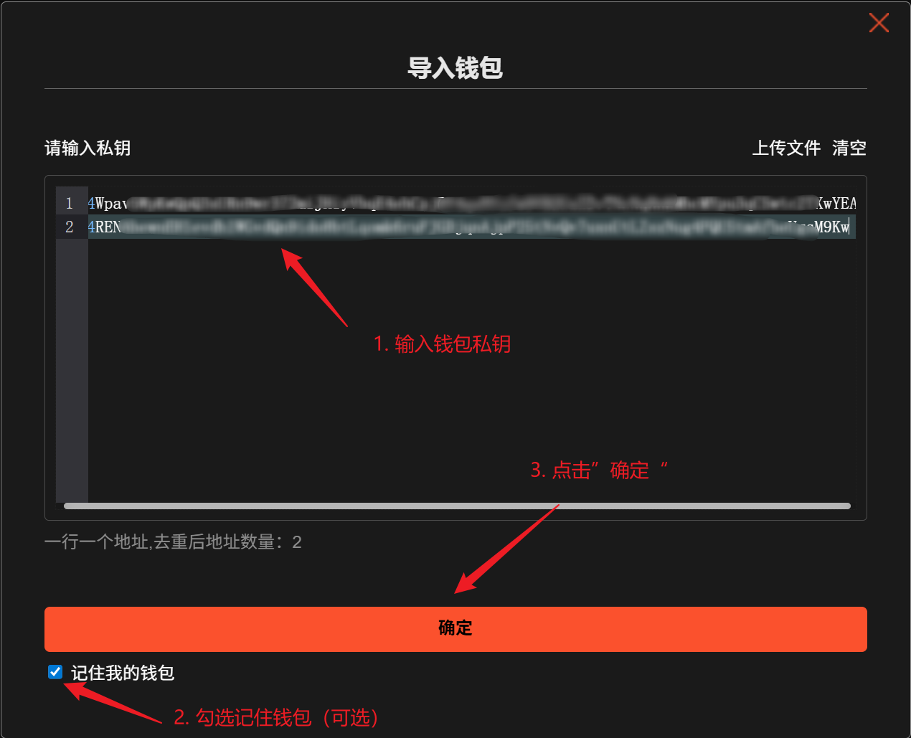<figcaption></figcaption></figure>

导入成功后，可以看到钱包内SOL余额以及基础代币余额。可以点击“`刷新钱包`”获取当前钱包余额，<mark style="color:purple;">建议每次使用前刷新一次</mark>。也可点击`删除`按钮删除对应的钱包，或者点击“`全部删除`”按钮删除全部钱包。

<figure>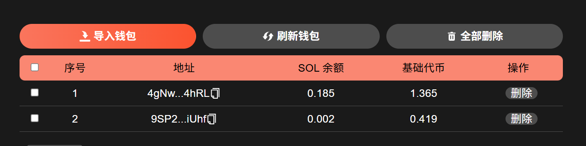<figcaption></figcaption></figure>

#### 7. 选择要监控的代币并点击“运行选中”

先勾选钱包，再选择要监控的代币，最后点击“`运行选中`”。

<figure>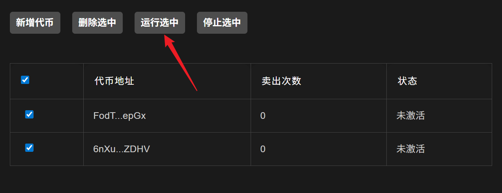<figcaption></figcaption></figure>

点击“`运行选中`”后，下面的日志会显示代币已监控。

<figure>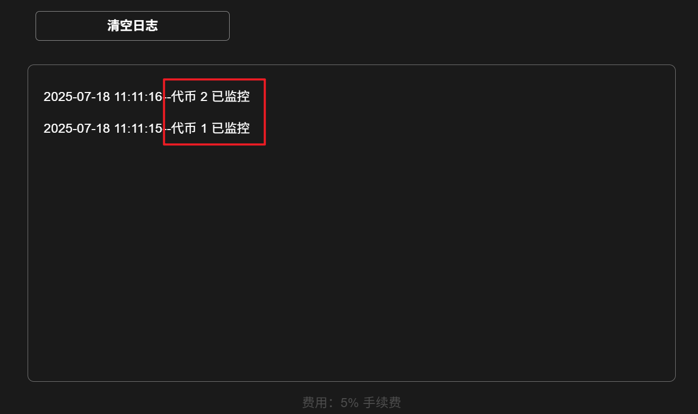<figcaption></figcaption></figure>

代币的状态也会变成“激活”状态。

<figure>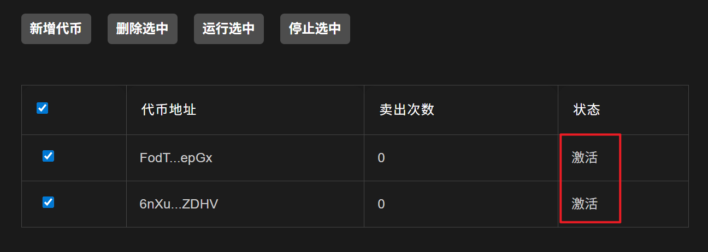<figcaption></figcaption></figure>

#### 8. 等待其他人的买入操作，机器人会自动卖出代币

可以在日志中查看到交易哈希，复制哈希值后可在[区块链浏览器](https://solscan.io/)上查看交易记录。

<figure>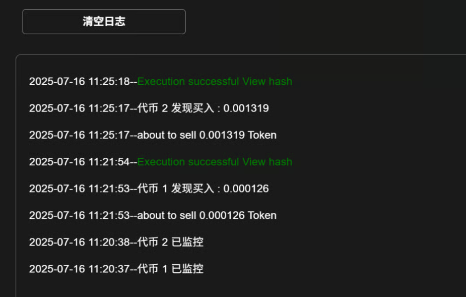<figcaption></figcaption></figure>

同时，Telegram 中的机器人也会发送卖出信息。

<figure>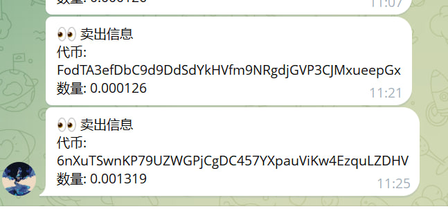<figcaption></figcaption></figure>

### 3. 模式二：单钱包监控多代币

#### 1. 关闭“单钱包监控单代币”

#### 2. 自定义节点（可选）

打开后输入自己的 HTTP节点。

#### 3. 打开“Telegram 通知”

根据[设置跟卖播报教程](https://docs.gtokentool.com/solana/airdrop-section/set-up-follow-up-selling-broadcasts-tutorial)设置跟卖播报，填写群ID。

<figure>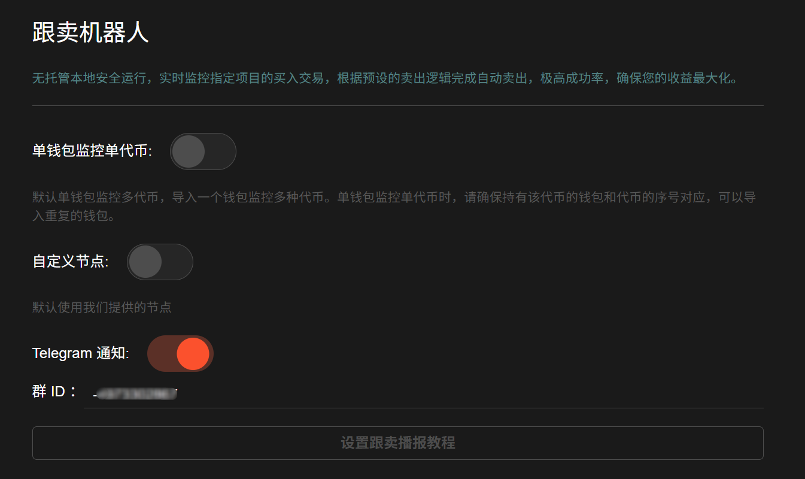<figcaption></figcaption></figure>

#### 4. 触发条件设置（可选）

由于交易所本身收取费用，因此实际设置值要比期望值小一点。

默认全部触发，可对USDC买入数量和代币买入数量进行条件设置。

<figure><figcaption></figcaption></figure>

#### 5. 新增代币

点击“`新增代币`”，添加需要监控的代币。


若要补充代币，请先关闭跟踪。如果关闭失败，请刷新网页。
\
目前支持添加和跟踪 Raydium CLMM 的 USDC 池子，请确保跟踪钱包有足够的 SOL 和代币，少量的 USDC。


<figure><figcaption></figcaption></figure>

添加成功后，下面的表格里可以看到代币的信息。

<figure>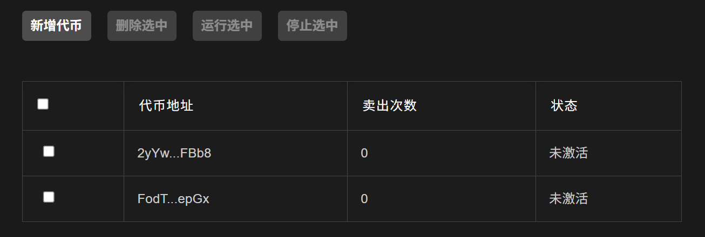<figcaption></figcaption></figure>

#### 6. 导入钱包

点击“`导入钱包`”，添加代币所属的钱包。<mark style="color:purple;">注意：导入钱包的顺序要与监控的代币一致。</mark>

<figure><figcaption></figcaption></figure>

导入成功后，可以看到钱包内SOL余额以及基础代币余额。可以点击“`刷新钱包`”获取当前钱包余额，<mark style="color:purple;">建议每次使用前刷新一次</mark>。也可点击`删除`按钮删除对应的钱包，或者点击“`全部删除`”按钮删除全部钱包。

<figure>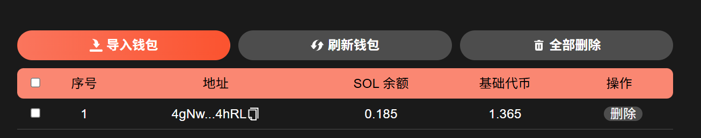<figcaption></figcaption></figure>

#### 7. 选择要监控的代币并点击“运行选中”

先勾选钱包，再选择要监控的代币，最后点击“`运行选中`”。

<figure>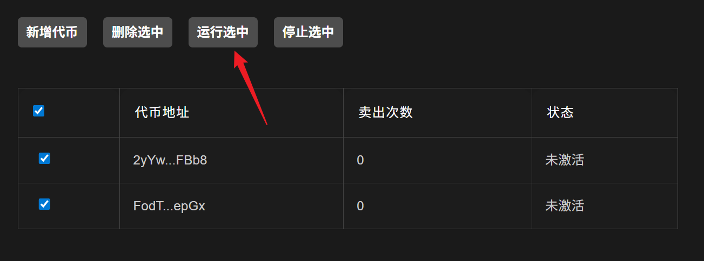<figcaption></figcaption></figure>

点击“`运行选中`”后，下面的日志会显示代币已监控。

<figure><figcaption></figcaption></figure>

代币的状态也会变成“激活”状态。

<figure>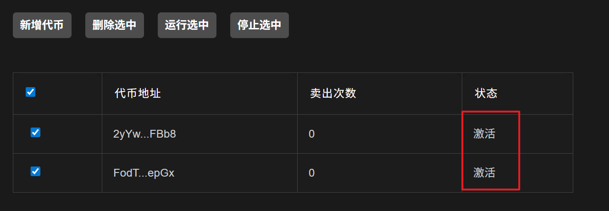<figcaption></figcaption></figure>

#### 8. 等待其他人的买入操作，机器人会自动卖出代币

可以在日志中查看到交易哈希，复制哈希值后可在[区块链浏览器](https://solscan.io/)上查看交易记录。

<figure>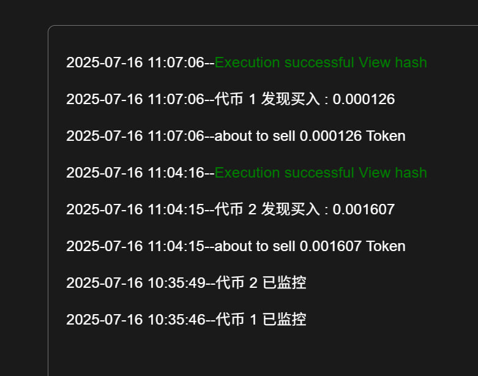<figcaption></figcaption></figure>

同时，Telegram 中的机器人也会发送卖出信息。

<figure>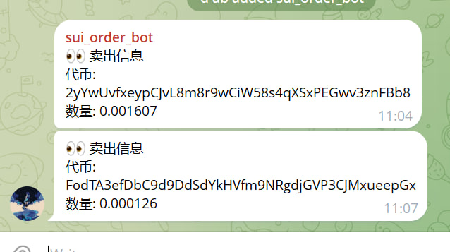<figcaption></figcaption></figure>

### 4. 取消监控

若要补充代币或者修改触发条件，请先关闭跟踪。点击“`停止选中`”可以关闭监控。日志中会显示代币已取消监控。代币状态会变回未激活。

<figure>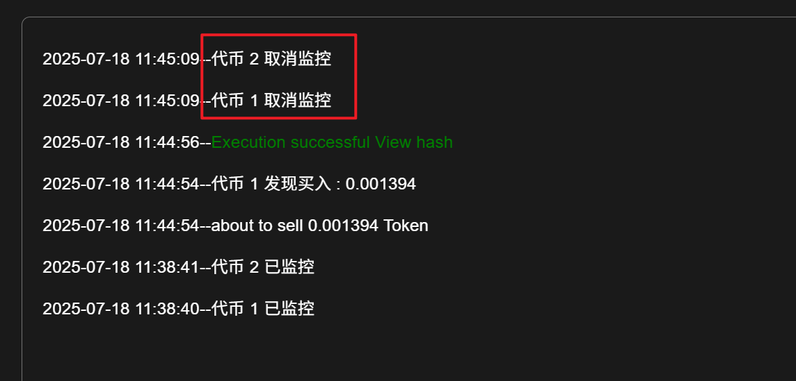<figcaption></figcaption></figure>

<figure>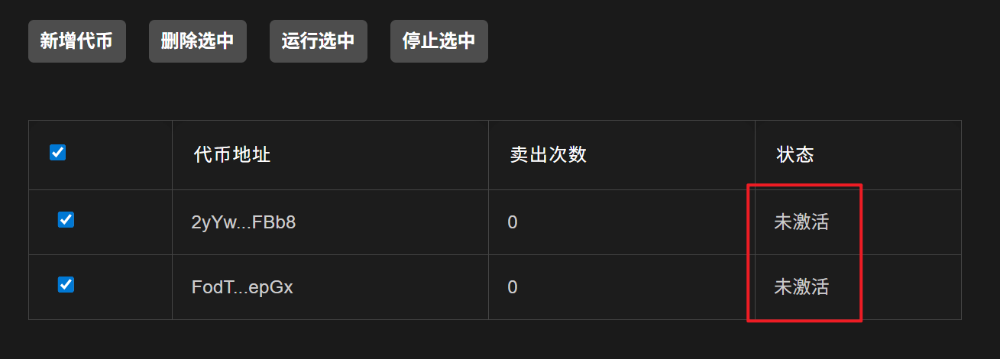<figcaption></figcaption></figure>

## 常见问题 FAQ

### Q: 跟卖机器人是怎么收费的？

**A:** 每笔收取5%的手续费。

### Q: 跟卖机器人支持那些DEX？

**A:** 目前支持 Raydium CLMM 的 USDC 底池和 PumpFun Swap 的 SOL 底池。PumpFun Swap 池子目前只能播报，不能跟卖。

### Q: 跟卖机器人怎么设置 Telegram 播报？

**A:** 根据[设置跟卖播报教程](https://docs.gtokentool.com/solana/airdrop-section/set-up-follow-up-selling-broadcasts-tutorial)可以设置 Telegram 播报。

### 🤝 连接 GTokenTool 

* **💬 Telegram社群**：[点击加入官方群组](https://t.me/gtokentool)
* **🐦 Twitter (X)**：[关注我们获取最新动态](https://x.com/gtokentool)
* **📚 官方文档**：[查看 Gitbook 文档](https://docs.gtokentool.com/)
* **💻 开源代码**：[访问 GitHub 仓库](https://github.com/Gtokentool/docs/blob/master/SUMMARY.md)
* **📺 视频教程**：[订阅 YouTube 频道](https://www.youtube.com/@GTokenTool)

> ⚠️ 风险提示与免责声明
>
> GTokenTool 保留随时全权酌情因任何理由修改、变更或取消此公告的权利，无需事先通知。
>
> 以上信息内容仅供参考，GTokenTool 对本平台上的任何虚拟资产、产品或促销活动不做任何推荐或保证。虚拟资产的价格波动很大，投资交易虚拟资产将面临巨大风险。**请谨慎投资。**
