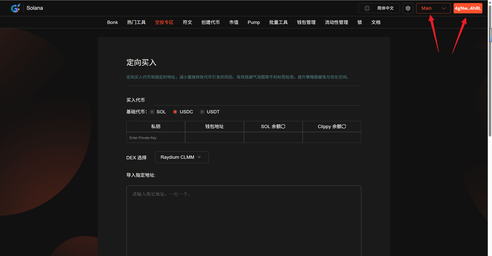
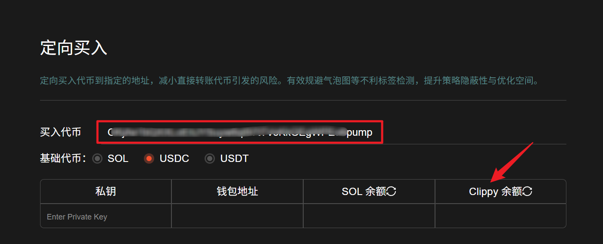
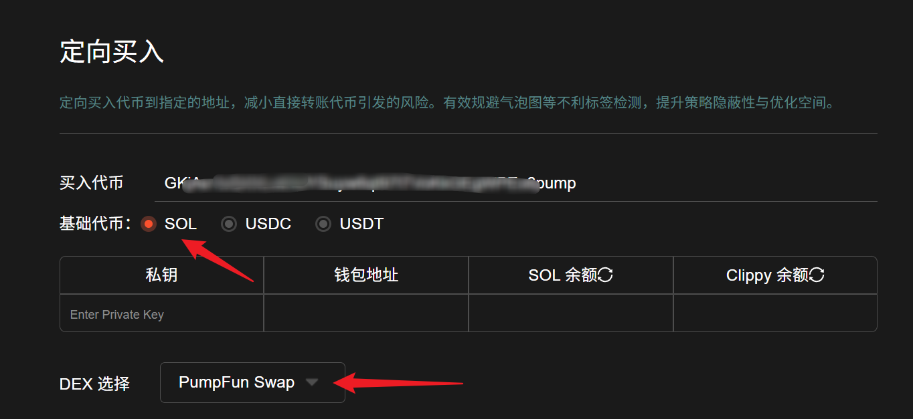
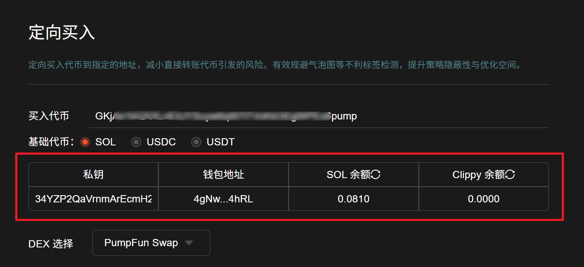
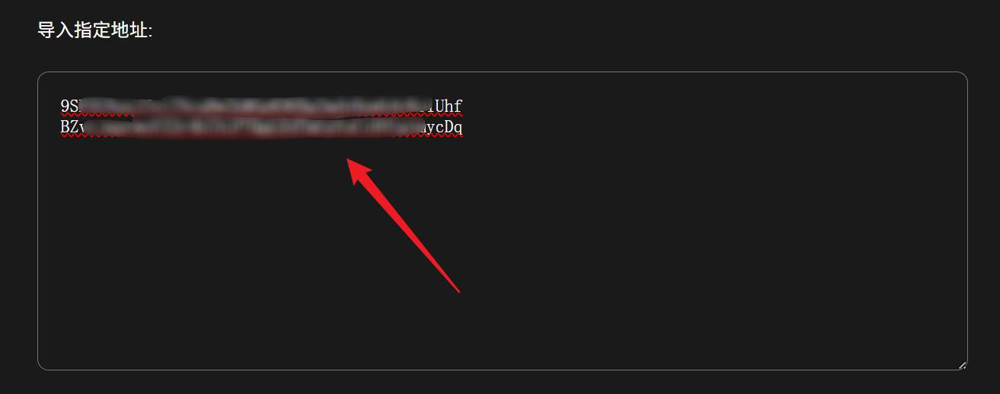
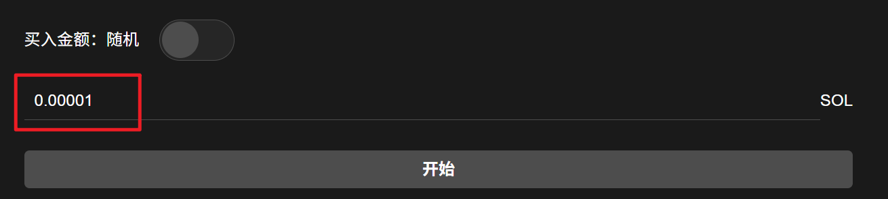
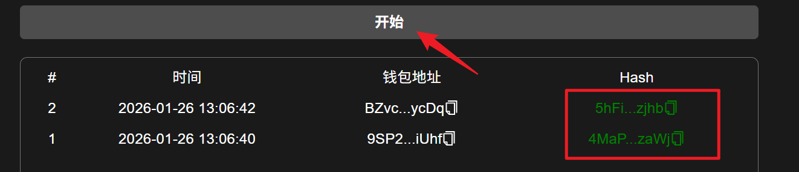

# 定向买入教程

## 📌 核心摘要

* **功能定位**：Solana链上**隐蔽式定向建仓工具**。它通过模拟正常的市场买入行为，将代币精准分发到指定地址，从而替代高风险的“直接转账”模式。
* **核心价值（规避检测）**：
  * **去关联化**：解决了项目方或早期参与者直接转账导致&#x7684;**“气泡图关联”**&#x95EE;题，避免链上分析工具将其标记为“内部人员”或“老鼠仓”。
  * **伪装交易**：使目标地址的持币来源看起来像是在公开市场正常买入的，极大提升了持币策略的**隐蔽性**与安全性。
* **操作前置条件**：
  * **硬件与软件**：电脑或手机，且已安装 **Phantom** 等Solana钱包插件。
  * **关键数据**：准备好**代币地址**（买什么）和**接收地址**（发给谁）。
  * **资金准备**：确保**操作钱包**（执行买入的钱包）和**接收钱包**（接收代币的钱包）内均有足够的 **SOL** 用于支付Gas费和滑点。

## 准备事项 

1. 一台电脑或者一部手机
2. Solana 钱包（[幻影钱包Phantom安装教程](https://docs.gtokentool.com/solana/auxiliary-tutorial/phantom-wallet-installation)）
3. 买入代币地址以及指定钱包地址
4. 请确保导入钱包有足够的余额

## Solana定向买入具体操作流程

### 1. 连接钱包

进入Solana定向买入页面：[https://sol.gtokentool.com/zh-CN/airdropSection/buyToDesignatedAddress](https://sol.gtokentool.com/zh-CN/airdropSection/buyToDesignatedAddress) ,右上角点击连接钱包并选择 Main 网络。

<figure><figcaption>
连接钱包并选择Main网络
</figcaption></figure>

### 2. 输入买入代币地址

输入买入代币地址后，下面的表格里会显示代币简称。

<figure><figcaption>
输入买入代币地址
</figcaption></figure>

### 3. 选择对应的DEX以及基础代币

确保DEX和基础代币选择正确，否则可能导致交易失败。

<figure><figcaption>
选择对应DEX以及基础代币
</figcaption></figure>

### 4. 导入付款钱包私钥

钱包导入成功后，可以看到钱包地址、SOL余额以及要买入代币的余额。点击表格内刷新图标可以获取最新余额。<mark style="color:purple;">全部费用由导入钱包支付。</mark>

<figure><figcaption>
导入付款钱包私钥
</figcaption></figure>

### 5. 导入指定地址

导入指定地址，一行一个。

<figure><figcaption>
导入指定地址
</figcaption></figure>

### 6. 设置买入金额

可设置随机金额或者固定金额。

<figure><figcaption>
设置买入金额
</figcaption></figure>

### 7. 点击”开始“

开始后，下方可查看交易日志。成功后可复制哈希去查看交易详情。

<figure><figcaption>
日志显示哈希
</figcaption></figure>

## ❓常见问题 FAQ

### Q: 定向买入是什么功能？

**A:** 定向买入代币到指定的地址，减小直接转账代币引发的风险。有效规避气泡图等不利标签检测，提升策略隐蔽性与优化空间。

### Q: 定向买入支持那些 DEX？

**A:** 目前Solana链绝大多数DEX均支持（Raydium AMM、Raydium CPMM、Raydium CLMM、Bonk、PumpFun、 PumpFun Swap、BoopFun、Moonit、Meteora(Believe)、Orca）。

### Q: 定向买入费用是怎么收取的？

**A:** 每笔收取0.0001 SOL，由导入的钱包支付。

### 🤝 连接 GTokenTool 

* **💬 Telegram社群**：[点击加入官方群组](https://t.me/gtokentool)
* **🐦 Twitter (X)**：[关注我们获取最新动态](https://x.com/gtokentool)
* **📚 官方文档**：[查看 Gitbook 文档](https://docs.gtokentool.com/)
* **💻 开源代码**：[访问 GitHub 仓库](https://github.com/Gtokentool/docs/blob/master/SUMMARY.md)
* **📺 视频教程**：[订阅 YouTube 频道](https://www.youtube.com/@GTokenTool)

> ⚠️ 风险提示与免责声明
>
> GTokenTool 保留随时全权酌情因任何理由修改、变更或取消此公告的权利，无需事先通知。
>
> 以上信息内容仅供参考，GTokenTool 对本平台上的任何虚拟资产、产品或促销活动不做任何推荐或保证。虚拟资产的价格波动很大，投资交易虚拟资产将面临巨大风险。**请谨慎投资。**
