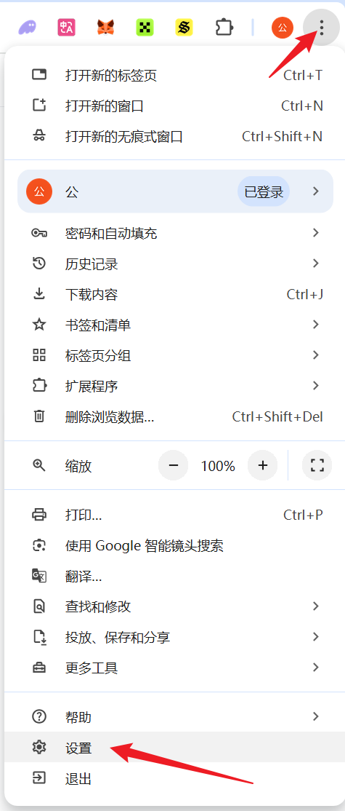
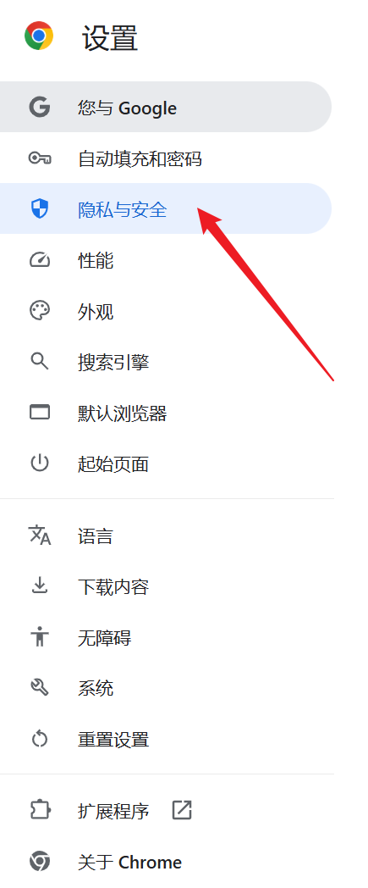
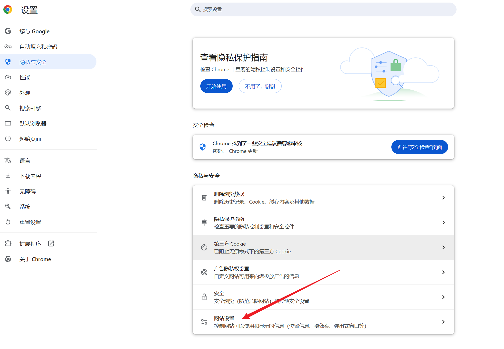
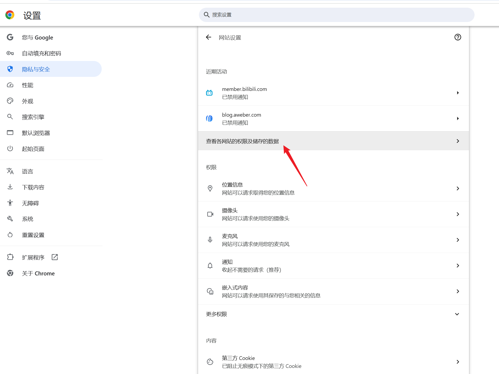
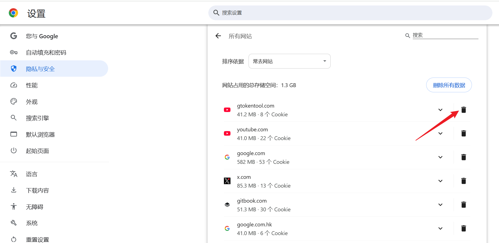

# 谷歌浏览器清除缓存教程

## 谷歌浏览器清除缓存流程

### 1. 打开谷歌浏览器设置

<figure><figcaption></figcaption></figure>

### 2. 选择“隐私与安全”

<figure><figcaption></figcaption></figure>

### 3. 选择“网站设置”

<figure><figcaption></figcaption></figure>

### 4. 点击“查看各网站的权限及储存的数据”

<figure><figcaption></figcaption></figure>

### 5. 点击清除按钮

<figure><figcaption></figcaption></figure>

[ _**GTokenTool | 创建代币、批量空投和做市机器人等Solana工具集**_](https://sol.gtokentool.com)

**安全、开源，给Solana用户带来最便利的一站式体验。**

GTokenTool社群:

Telegram：[**https://t.me/gtokentool**](https://t.me/gtokentool)

Twitter:  [**https://x.com/gtokentool**](https://x.com/gtokentool)

Gitbook：[**https://docs.gtokentool.com/**](https://docs.gtokentool.com/)

Github：[**https://github.com/Gtokentool/docs/blob/master/SUMMARY.md**](https://github.com/Gtokentool/docs/blob/master/SUMMARY.md)

YouTube：[**https://www.youtube.com/@GTokenTool**](https://www.youtube.com/@GTokenTool)\
\
\
<mark style="color:purple;background-color:orange;">**GTokenTool**</mark>_<mark style="color:purple;background-color:orange;">保留随时全权酌情因任何理由修改、变更或取消此公告的权利，无需事先通知。以上信息内容仅供参考，GTokenTool对本平台上的任何虚拟资产、产品或促销活动不做任何推荐或保证。虚拟资产的价格波动很大，投资交易虚拟资产将面临巨大风险。请谨慎投资。</mark>_
