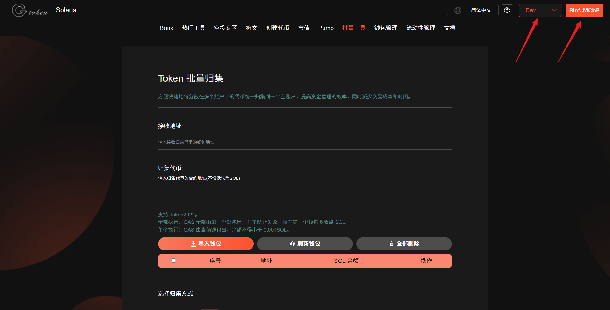
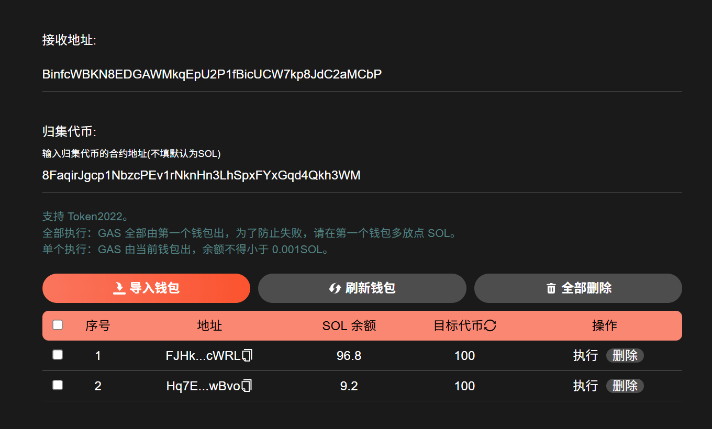
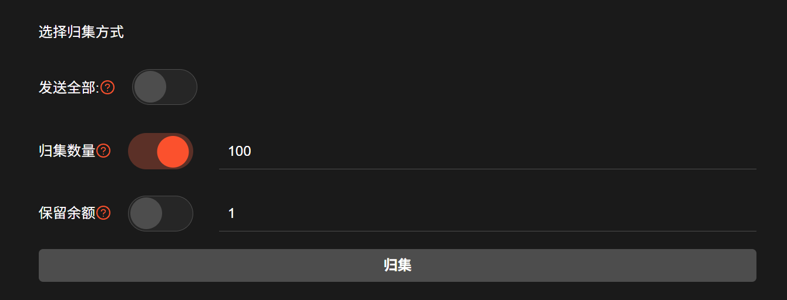
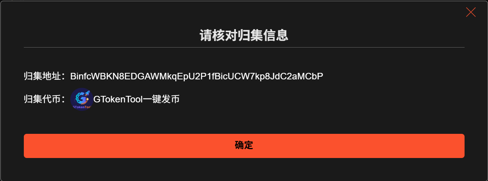
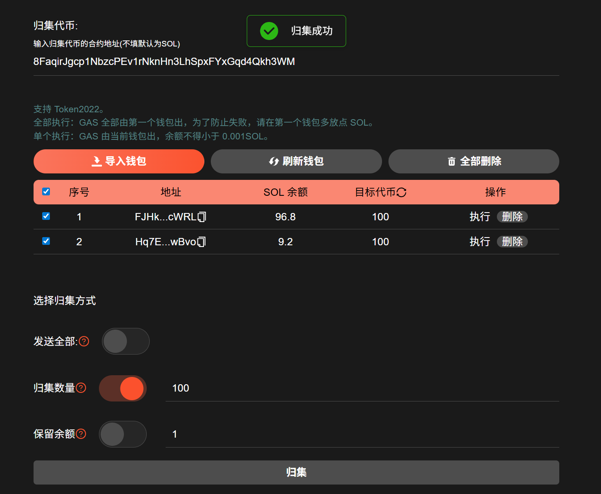
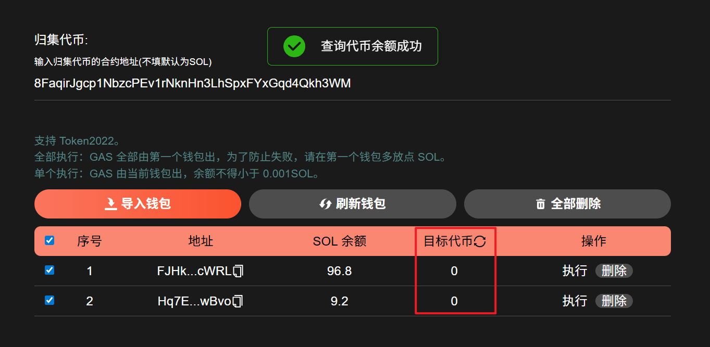

# Solana批量归集教程

钱包批量归集是一种将多个钱包或账户中的资金集中到一个指定钱包或账户中的操作，主要目的是提高资金管理的效率和安全性。

## 视频演示



## Solana批量归集教程

### 1. 连接钱包

批量归集：[https://sol.gtokentool.com/zh-CN/batchTool/gather](https://sol.gtokentool.com/zh-CN/batchTool/gather)

选择 Main 网络并点击“`Connect`”连接钱包，这里使用测试网演示。

<figure><figcaption></figcaption></figure>

### 2. 填写信息

<figure><figcaption></figcaption></figure>

**接收地址：**&#x63A5;收归集代币的钱包地址。

**归集代币：**&#x8981;归集的代币地址，不填默认归集SOL。

**导入钱包：**&#x5BFC;入要归集的钱包私钥。

导入钱包后显示钱包地址，SOL余额，归集代币的数量，操作中可执行、可删除，如果余额显示不正确，请刷新钱包。

### 3. 选择归集方式

确认信息正确后下面选择归集方式。

**选择归集方式：**&#x53D1;送全部、归集固定数量、保留固定数量。

如果关闭“`发送全部`”，您可以设置“`归集金额`”或“`保留余额`”，但不能同时设置两者。


全部执行：GAS 全部由第一个钱包出，为了防止失败，请在第一个钱包多放点 SOL。
\
单个执行：GAS 由当前钱包出，余额不得小于 0.001 SOL。


<figure><figcaption></figcaption></figure>

### 4. 点击“归集”并确认归集信息

设置好后，勾选钱包，点击“`归集`”。

_<mark style="color:purple;">**点击归集会让你确认收款地址，链上行为不可逆，一定要仔细检查。**</mark>_

<figure><figcaption></figcaption></figure>

点击“`确定`”后，归集成功会有提示显示“归集成功”。

<figure><figcaption></figcaption></figure>

你也可以点击目标代币边上的刷新图标刷新代币，检查是否归集成功。

<figure><figcaption></figcaption></figure>

## 常见问题：

### 1. 为什么会归集失败？

如果要转账的地址内的SOL余额不足，也有可能会失败，确保每个钱包都有点SOL，因为每次转账都需要gas。如果Solana区块链刚好卡住了，也会导致部分钱包失败。

### 2. 归集后为什么没反应？

可能是链卡住了，导入钱包那里会自动更新钱包余额的。

### 3. 我的私钥输入后会不会不安全？

你的私钥不会存储在平台上，所有操作都是基于前端执行的，请放心使用。

### 4. 为什么我的代币没有转过去？

批量归集代币只适用于SPL代币。

[_**GTokenTool | 创建代币、批量空投和做市机器人等Solana工具集**_](https://sol.gtokentool.com)

**安全、开源，给Solana用户带来最便利的一站式体验。**

GTokenTool社群:

Telegram：[**https://t.me/gtokentool**](https://t.me/gtokentool)

Twitter:  [**https://x.com/gtokentool**](https://x.com/gtokentool)

Gitbook：[**https://docs.gtokentool.com/**](https://docs.gtokentool.com/)

Github：[**https://github.com/Gtokentool/docs/blob/master/SUMMARY.md**](https://github.com/Gtokentool/docs/blob/master/SUMMARY.md)

YouTube：[**https://www.youtube.com/@GTokenTool**](https://www.youtube.com/@GTokenTool)\
\
\
<mark style="color:purple;background-color:orange;">**GTokenTool**</mark>_<mark style="color:purple;background-color:orange;">保留随时全权酌情因任何理由修改、变更或取消此公告的权利，无需事先通知。以上信息内容仅供参考，GTokenTool对本平台上的任何虚拟资产、产品或促销活动不做任何推荐或保证。虚拟资产的价格波动很大，投资交易虚拟资产将面临巨大风险。请谨慎投资。</mark>_
