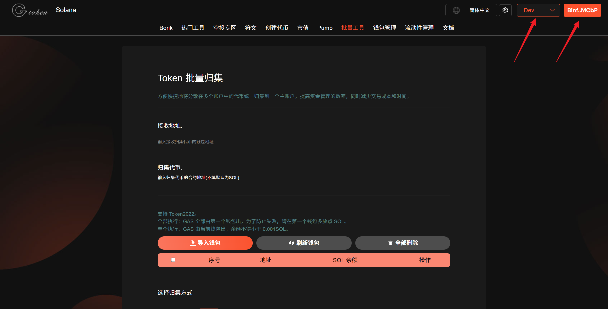
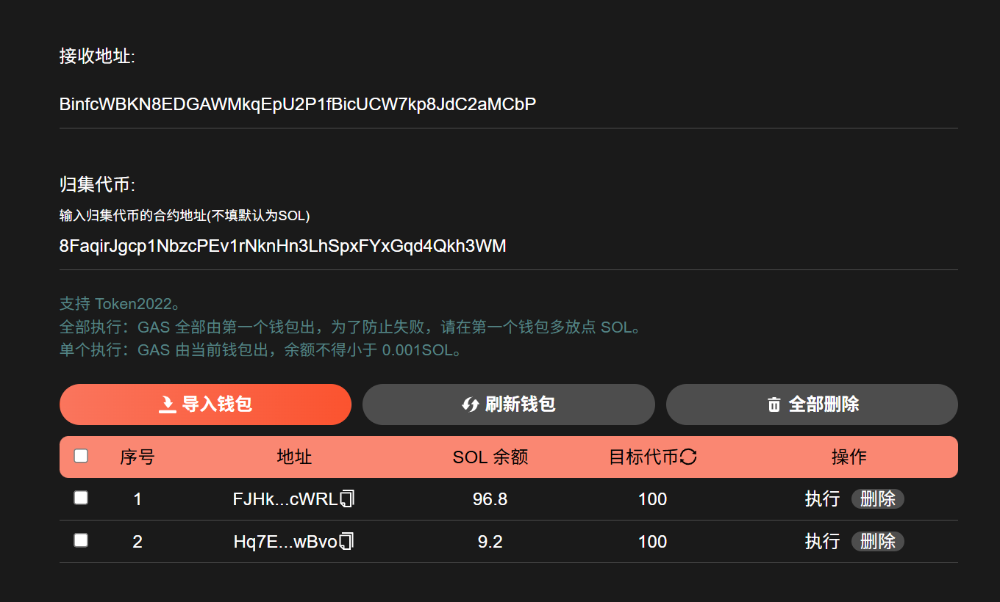
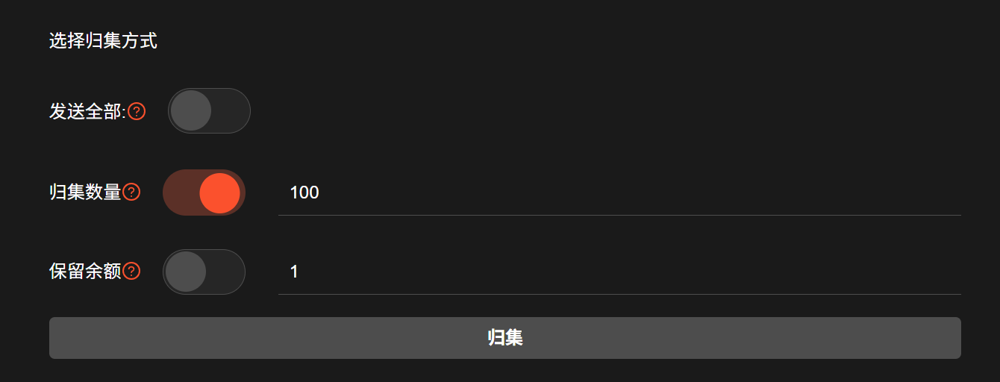
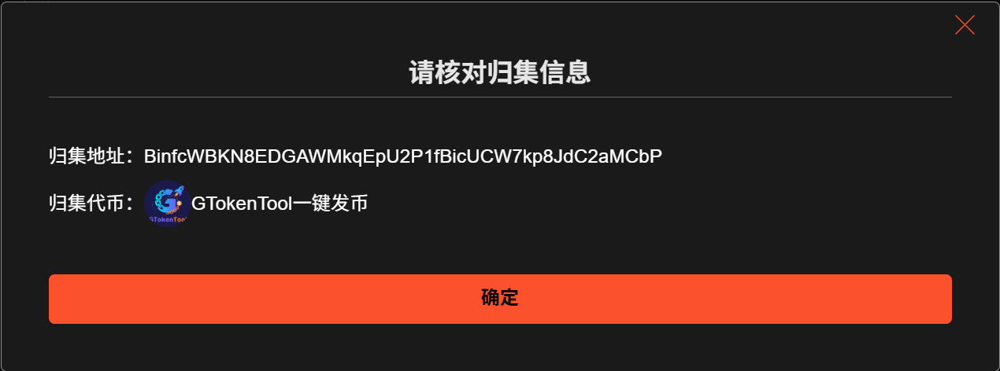
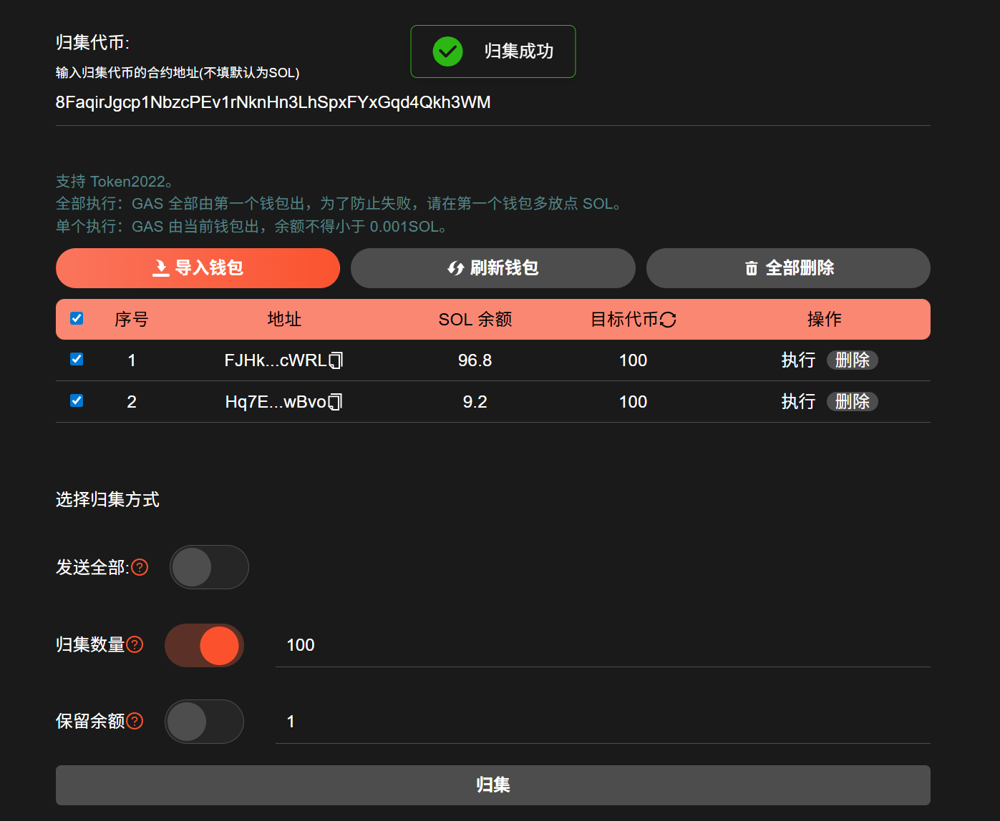
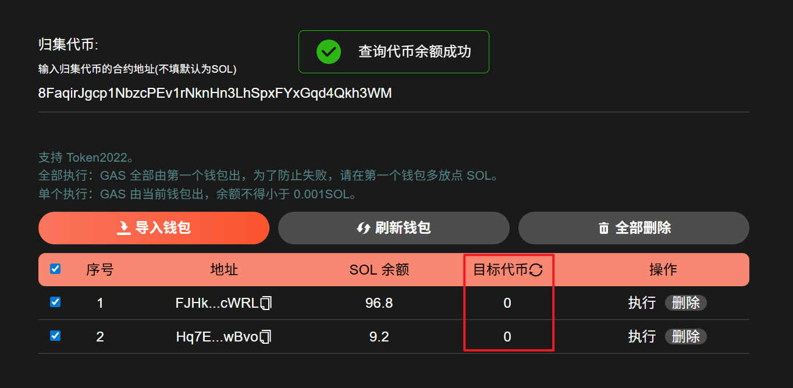

# Solana批量归集教程

## 📌核心摘要

* **平台背景（Solana生态）**：专为 **Solana** 区块链设计的高效资金管理工具，针对拥有多个分散钱包的用户（如项目方、空投猎人、做市商）提供资金回收解决方案。
* **核心功能（多对一归集）**：支持**将多个钱包或账户中的零散资金（SOL/SPL代币）集中转移到一个指定的主钱包**。通过自动化批量操作，替代繁琐的手动转账，实现资金的快速回笼。
* **战略价值（提升效率与安全）**：旨在**提高资金管理的效率和安全性**。通过归集，用户可以统一管理资产，减少分散钱包的维护成本与安全风险，是 Solana 链上资金盘点的必备工具。

## 视频演示



## Solana批量归集教程

### 1. 连接钱包

批量归集：[https://sol.gtokentool.com/zh-CN/batchTool/gather](https://sol.gtokentool.com/zh-CN/batchTool/gather)

选择 Main 网络并点击“`Connect`”连接钱包，这里使用测试网演示。

<figure><figcaption>
连接钱包并选择网络
</figcaption></figure>

### 2. 填写归集信息

<figure><figcaption>
填写归集信息
</figcaption></figure>

**接收地址：**&#x63A5;收归集代币的钱包地址。

**归集代币：**&#x8981;归集的代币地址，不填默认归集SOL。

**导入钱包：**&#x5BFC;入要归集的钱包私钥。

导入钱包后显示钱包地址，SOL余额，归集代币的数量，操作中可执行、可删除，如果余额显示不正确，请刷新钱包。

### 3. 选择归集方式

确认信息正确后下面选择归集方式。

**选择归集方式：**&#x53D1;送全部、归集固定数量、保留固定数量。

如果关闭“`发送全部`”，您可以设置“`归集金额`”或“`保留余额`”，但不能同时设置两者。


全部执行：GAS 全部由第一个钱包出，为了防止失败，请在第一个钱包多放点 SOL。
\
单个执行：GAS 由当前钱包出，余额不得小于 0.001 SOL。


<figure><figcaption>
选择归集方式
</figcaption></figure>

### 4. 点击“归集”并确认归集信息

设置好后，勾选钱包，点击“`归集`”。

_<mark style="color:purple;">**点击归集会让你确认收款地址，链上行为不可逆，一定要仔细检查。**</mark>_

<figure><figcaption>
核对归集信息
</figcaption></figure>

点击“`确定`”后，归集成功会有提示显示“归集成功”。

<figure><figcaption>
归集成功提示
</figcaption></figure>

你也可以点击目标代币边上的刷新图标刷新代币，检查是否归集成功。

<figure><figcaption>
刷新代币余额
</figcaption></figure>

## ❓常见问题 FAQ

### Q: 为什么会归集失败？

**A:** 如果要转账的地址内的SOL余额不足，也有可能会失败，确保每个钱包都有点SOL，因为每次转账都需要gas。如果Solana区块链刚好卡住了，也会导致部分钱包失败。

### Q: 归集后为什么没反应？

**A:** 可能是链卡住了，导入钱包那里会自动更新钱包余额的。

### Q: 我的私钥输入后会不会不安全？

**A:** 你的私钥不会存储在平台上，所有操作都是基于前端执行的，请放心使用。

### Q: 为什么我的代币没有转过去？

**A:** 批量归集代币只适用于SPL代币。

### Q: 是否支持归集时自定义接收地址？

**A:** 可以。你可手动输入接收地址。

### 🤝 连接 GTokenTool 

* **💬 Telegram社群**：[点击加入官方群组](https://t.me/gtokentool)
* **🐦 Twitter (X)**：[关注我们获取最新动态](https://x.com/gtokentool)
* **📚 官方文档**：[查看 Gitbook 文档](https://docs.gtokentool.com/)
* **💻 开源代码**：[访问 GitHub 仓库](https://github.com/Gtokentool/docs/blob/master/SUMMARY.md)
* **📺 视频教程**：[订阅 YouTube 频道](https://www.youtube.com/@GTokenTool)

> ⚠️ 风险提示与免责声明
>
> GTokenTool 保留随时全权酌情因任何理由修改、变更或取消此公告的权利，无需事先通知。
>
> 以上信息内容仅供参考，GTokenTool 对本平台上的任何虚拟资产、产品或促销活动不做任何推荐或保证。虚拟资产的价格波动很大，投资交易虚拟资产将面临巨大风险。**请谨慎投资。**
