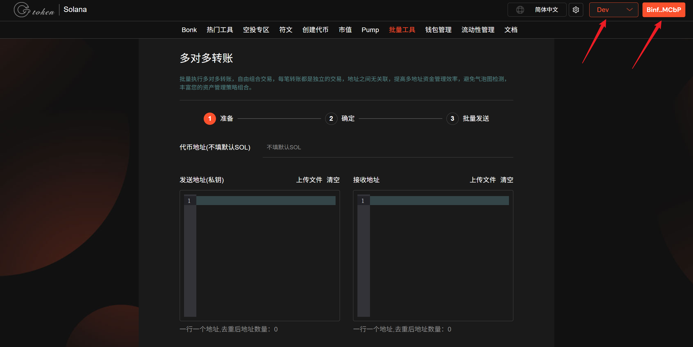
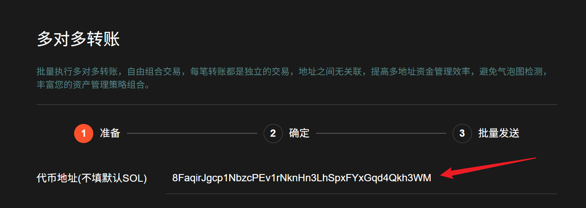
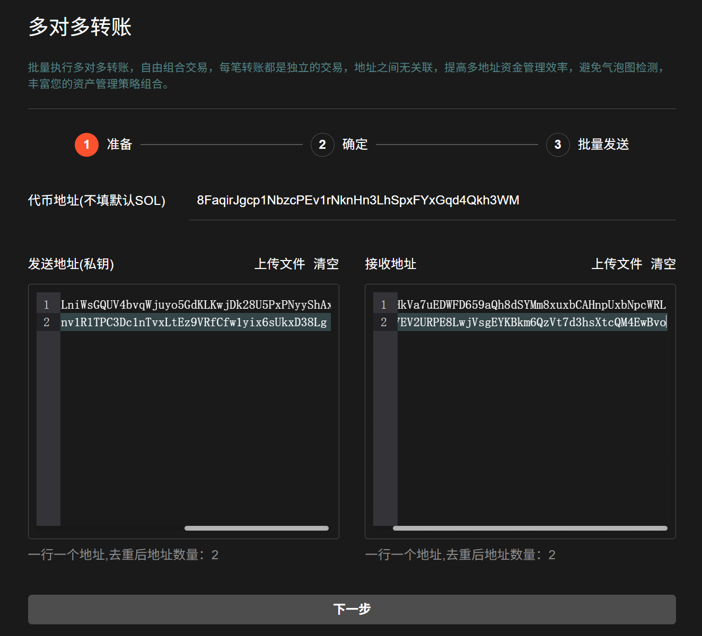
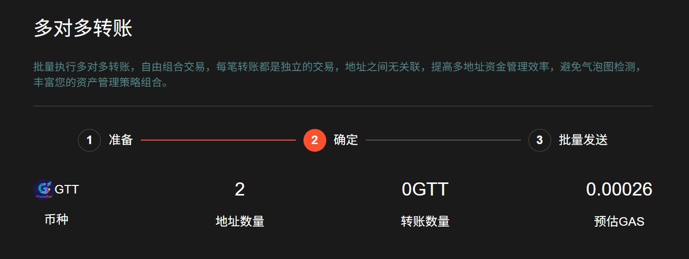
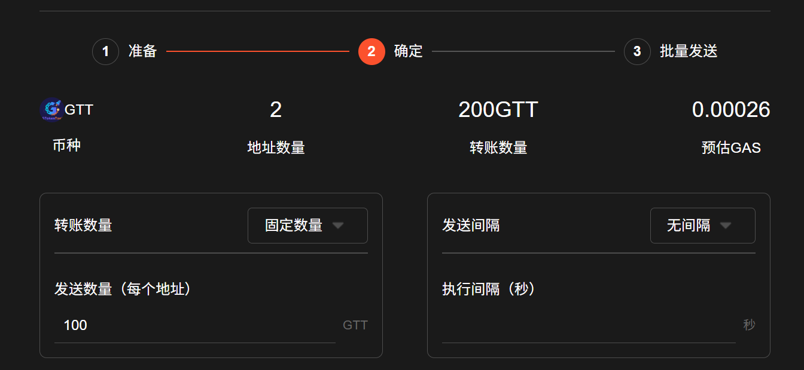
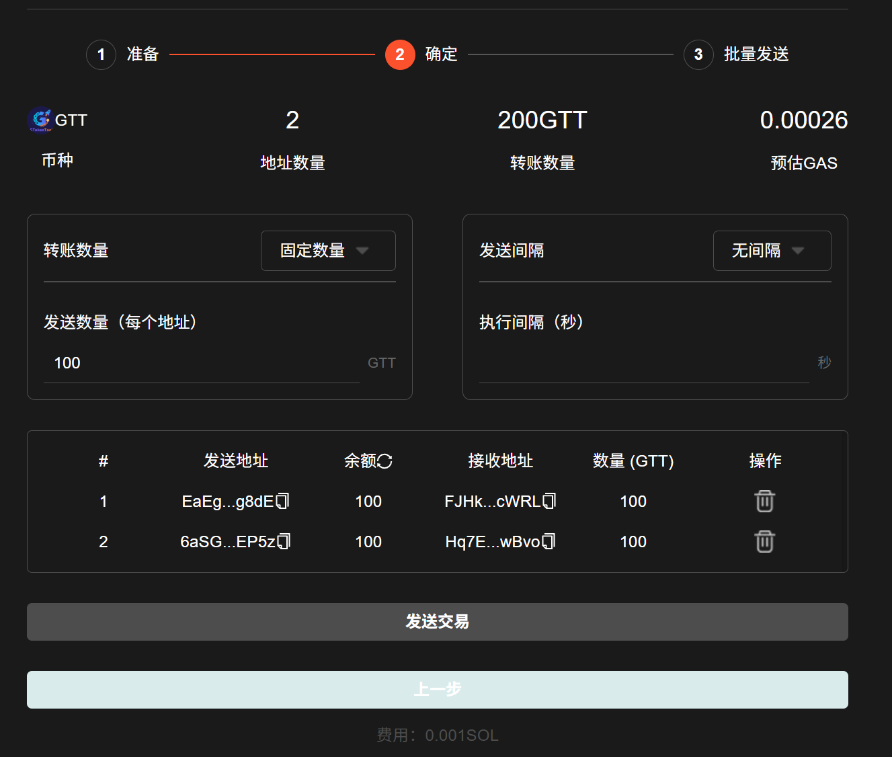
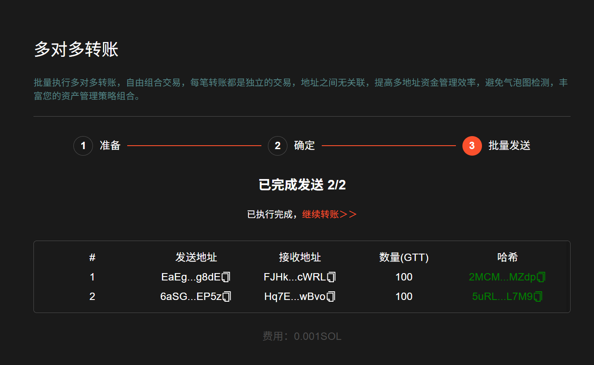

# Solana多对多转账教程


批量处理多个钱包资金定向转移，提升资金管理效率，配合 [批量转账](https://sol.gtokentool.com/zh-CN/batchTool/batchTransfer/SOL)，安全快捷规避多地址气泡图追踪。

使用批量转账（一转多）后，再进行对多对转账，避免气泡图追踪。同时转账后空地址还可回收账户租金。

[批量转账-->>](https://sol.gtokentool.com/zh-CN/batchTool/batchTransfer/SOL)   [租金回收-免费领取Solana教程-->>](https://sol.gtokentool.com/zh-CN/walletManagement/rentRecovery)


## 📌核心摘要

* **平台背景（Solana生态）**：专为 **Solana** 区块链设计的高级资金管理工具，针对需要复杂资金流转路径的用户（如做市商、大户）提供多对多转账解决方案。
* **核心功能（多对多定向转移）**：支持**批量处理多个钱包的定向资金转移**，并可与“一传多”批量转账配合使用。通过构建复杂的交易网络，打破单一的资金流向，有效提升资金管理的灵活性与效率。
* **战略价值（规避追踪与租金回收）**：旨在**规避“气泡图”等链上分析工具的关联追踪**，增强资金流转的隐私性与安全性。同时，支持在转账后自动**回收空地址的账户租金（Rent）**，实现资金利用最大化。

## 视频演示



## 准备事项

1. 一台电脑或者一部手机
2. Solana 钱包（[幻影钱包Phantom安装教程](https://docs.gtokentool.com/solana/huan-ying-qian-bao-phantom-an-zhuang-jiao-cheng)）
3. 要转出地址的私钥信息
4. 要接收地址的钱包地址
5. 确保转出地址有 SOL 用于支付转账 GAS

## 操作步骤

### 一、准备

多对多转账：[https://sol.gtokentool.com/zh-CN/batchTool/batchTransfer/ManyToManyTransfer](https://sol.gtokentool.com/zh-CN/batchTool/batchTransfer/ManyToManyTransfer)

进入 GTokenTool对多对转账页面，右上角支持切换语言，选择 Main 网络并连接钱包，这里使用测试网演示。

<figure><figcaption>
连接钱包并选择网络
</figcaption></figure>

#### 1、填入代币地址，不填默认为转账SOL。

<figure><figcaption>
输入代币地址
</figcaption></figure>

#### 2、填发送地址（私钥）和接收地址（公钥）

可手动输入或者上传文件，请注意网络环境安全，请仔细核对避免出错。

* 手动输入：在表格或其他地方复制私钥后粘贴即可，每行一个。
* 上传文件：支持 Excel 类型，每行一个地址。

<figure><figcaption>
填写发送地址和接收地址
</figcaption></figure>

#### 3、确认所填信息无误，点击“`下一步`”。

### 二、确定

#### 1、显示代币信息，转账地址数量，转账数量，预估GAS。

<figure><figcaption>
代币信息显示
</figcaption></figure>

#### 2、转账数量和时间间隔

转账数量（五种选择：固定数量、全部余额、保留固定数量、随机数量、自定义）（必填）

时间间隔（三种选择：无间隔、固定间隔、随机间隔）（选填）

<figure><figcaption>
设置转账数量和时间间隔
</figcaption></figure>

#### 3、复核每笔转账相关数据，然后点击“`发送交易`”。

转账前请刷新余额，确保钱包内有足够的代币。

_<mark style="color:purple;">**链上数据不可逆。错误的接收地址将导致资金无法找回，请务必核实无误。**</mark>_

<figure><figcaption>
复核发送信息
</figcaption></figure>

### 三、发送交易

对多对转账地址越多，耗时越久，请耐心等待。执行过程中请勿刷新。

执行完成后，状态栏会显示执行结果和转账 HASH，复制可去链上搜索查看具体信息。

<figure><figcaption>
交易哈希显示
</figcaption></figure>

_<mark style="color:green;">使用便捷工具提升批量交易速度</mark>_

[_<mark style="color:green;">批量转账-->></mark>_ ](https://sol.gtokentool.com/zh-CN/batchTool/batchTransfer/SOL)    [_<mark style="color:green;">批量归集-->></mark>_](https://sol.gtokentool.com/zh-CN/batchTool/gather)


<mark style="color:red;">安全提醒：</mark>

1. 保护私钥：GTokenTool只在本地计算并用于签署交易，绝不收集或上传您的私钥或敏感信息。
2. 小额钱包推荐：建议使用小额钱包进行操作，避免存放大额资金。
3. 安全复制私钥：复制私钥时，请打乱顺序并分段复制，以防止剪贴板数据被恶意软件监控。
4. 官方不索要私钥：GTokenTool绝不会要求您提供私钥信息，请保持警惕。


## ❓常见问题 FAQ

### Q: 什么是多对多批量转账？

**A:** 多对多批量转账是指从多个来源地址向多个目标地址转账，适合大规模资金分发。

### Q: 转账地址和接收地址怎么导入？

**A:** 支持通过文件上传或手动粘贴导入，支持文件类型:Excel/CSV。

### Q: 是否可以设置每一对的转账金额？

**A:** 可以。你可以为每对地址配置不同的转账金额，或设定统一金额让系统批量执行。转账数量选择自定义可以单独设置每个地址的转账金额。

### Q: 操作是否安全？会保存我的私钥吗？

**A:** 不会。所有私钥只用于本地签名交易，不会上传或保存至任何服务器，保障用户资产安全。

### Q: 多对多适用于哪些场景？

**A:** 适用于项目方或机构在多个地址中发放薪资、空投、分红、批量返还等复杂资产分发场景。

### 🤝 连接 GTokenTool 

* **💬 Telegram社群**：[点击加入官方群组](https://t.me/gtokentool)
* **🐦 Twitter (X)**：[关注我们获取最新动态](https://x.com/gtokentool)
* **📚 官方文档**：[查看 Gitbook 文档](https://docs.gtokentool.com/)
* **💻 开源代码**：[访问 GitHub 仓库](https://github.com/Gtokentool/docs/blob/master/SUMMARY.md)
* **📺 视频教程**：[订阅 YouTube 频道](https://www.youtube.com/@GTokenTool)

> ⚠️ 风险提示与免责声明
>
> GTokenTool 保留随时全权酌情因任何理由修改、变更或取消此公告的权利，无需事先通知。
>
> 以上信息内容仅供参考，GTokenTool 对本平台上的任何虚拟资产、产品或促销活动不做任何推荐或保证。虚拟资产的价格波动很大，投资交易虚拟资产将面临巨大风险。**请谨慎投资。**
