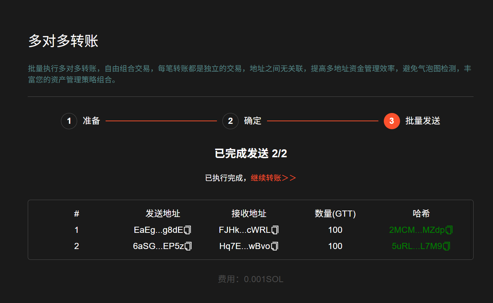

# Solana多对多转账教程


批量处理多个钱包资金定向转移，提升资金管理效率，配合 [批量转账](https://sol.gtokentool.com/zh-CN/batchTool/batchTransfer/SOL)，安全快捷规避多地址气泡图追踪。

使用批量转账（一转多）后，再进行对多对转账，避免气泡图追踪。同时转账后空地址还可回收账户租金。

[批量转账-->>](https://sol.gtokentool.com/zh-CN/batchTool/batchTransfer/SOL)   [租金回收-免费领取Solana教程-->>](https://sol.gtokentool.com/zh-CN/walletManagement/rentRecovery)


## 视频演示



## 如何使用 Solana 多对多转账工具

1. 选择要进行多对多转账的代币
2. 导入需要转出地址的私钥
3. 导入接收地址的钱包地址
4. 批量设置转账数量
5. 设置多对多每次转账的发起间隔时间
6. 复核每笔转账相关数据
7. 确认发送转账开始执行

## 准备事项

1. 一台电脑或者一部手机
2. Solana 钱包（[幻影钱包Phantom安装教程](https://docs.gtokentool.com/solana/huan-ying-qian-bao-phantom-an-zhuang-jiao-cheng)）
3. 要转出地址的私钥信息
4. 要接收地址的钱包地址
5. 确保转出地址有 SOL 用于支付转账 GAS

## 操作步骤

### 一、准备

多对多转账：[https://sol.gtokentool.com/zh-CN/batchTool/batchTransfer/ManyToManyTransfer](https://sol.gtokentool.com/zh-CN/batchTool/batchTransfer/ManyToManyTransfer)

进入 GTokenTool对多对转账页面，右上角支持切换语言，选择 Main 网络并连接钱包，这里使用测试网演示。

<figure><figcaption></figcaption></figure>

#### 1、填入代币地址，不填默认为转账SOL。

<figure><figcaption></figcaption></figure>

#### 2、填发送地址（私钥）和接收地址（公钥）（可手动输入或者上传文件，请注意网络环境安全，请仔细核对避免出错）。

* 手动输入：在表格或其他地方复制私钥后粘贴即可，每行一个。
* 上传文件：支持 Excel 类型，每行一个地址。

<figure><figcaption></figcaption></figure>

#### 3、确认所填信息无误，点击“`下一步`”。

### 二、确定

#### 1、显示代币信息，转账地址数量，转账数量，预估GAS。

<figure><figcaption></figcaption></figure>

#### 2、转账数量（五种选择：固定数量、全部余额、保留固定数量、随机数量、自定义）（必填）

时间间隔（三种选择：无间隔、固定间隔、随机间隔）（选填）

<figure><figcaption></figcaption></figure>

#### 3、复核每笔转账相关数据，然后点击“`发送交易`”。

转账前请刷新余额，确保钱包内有足够的代币。

_<mark style="color:purple;">**链上数据不可逆。错误的接收地址将导致资金无法找回，请务必核实无误。**</mark>_

<figure><figcaption></figcaption></figure>

### 三、发送交易

对多对转账地址越多，耗时越久，请耐心等待。执行过程中请勿刷新。

执行完成后，状态栏会显示执行结果和转账 HASH，复制可去链上搜索查看具体信息。

<figure><figcaption></figcaption></figure>

_<mark style="color:green;">使用便捷工具提升批量交易速度</mark>_

[_<mark style="color:green;">批量转账-->></mark>_ ](https://sol.gtokentool.com/zh-CN/batchTool/batchTransfer/SOL)    [_<mark style="color:green;">批量归集-->></mark>_](https://sol.gtokentool.com/zh-CN/batchTool/gather)

## <mark style="color:red;">安全提醒：</mark>

1. 保护私钥：GTokenTool只在本地计算并用于签署交易，绝不收集或上传您的私钥或敏感信息。
2. 小额钱包推荐：建议使用小额钱包进行操作，避免存放大额资金。
3. 安全复制私钥：复制私钥时，请打乱顺序并分段复制，以防止剪贴板数据被恶意软件监控。
4. 官方不索要私钥：GTokenTool绝不会要求您提供私钥信息，请保持警惕。

[_**GTokenTool | 创建代币、批量空投和做市机器人等Solana工具集**_](https://sol.gtokentool.com)

**安全、开源，给Solana用户带来最便利的一站式体验。**

GTokenTool社群:

Telegram：[**https://t.me/gtokentool**](https://t.me/gtokentool)

Twitter:  [**https://x.com/gtokentool**](https://x.com/gtokentool)

Gitbook：[**https://docs.gtokentool.com/**](https://docs.gtokentool.com/)

Github：[**https://github.com/Gtokentool/docs/blob/master/SUMMARY.md**](https://github.com/Gtokentool/docs/blob/master/SUMMARY.md)

YouTube：[**https://www.youtube.com/@GTokenTool**](https://www.youtube.com/@GTokenTool)\
\
\
<mark style="color:purple;background-color:orange;">**GTokenTool**</mark>_<mark style="color:purple;background-color:orange;">保留随时全权酌情因任何理由修改、变更或取消此公告的权利，无需事先通知。以上信息内容仅供参考，GTokenTool对本平台上的任何虚拟资产、产品或促销活动不做任何推荐或保证。虚拟资产的价格波动很大，投资交易虚拟资产将面临巨大风险。请谨慎投资。</mark>_
