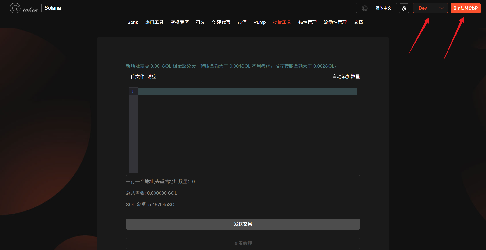
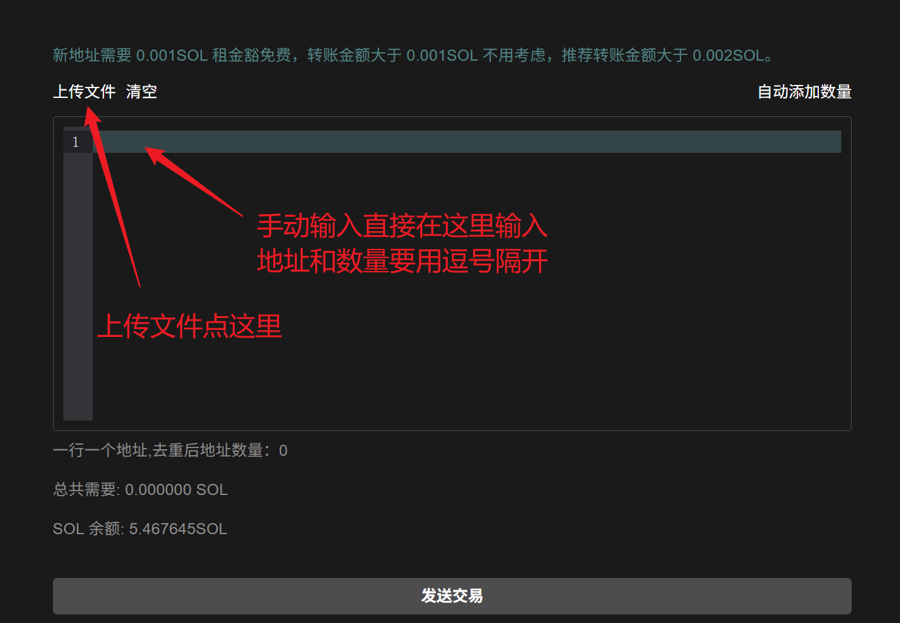
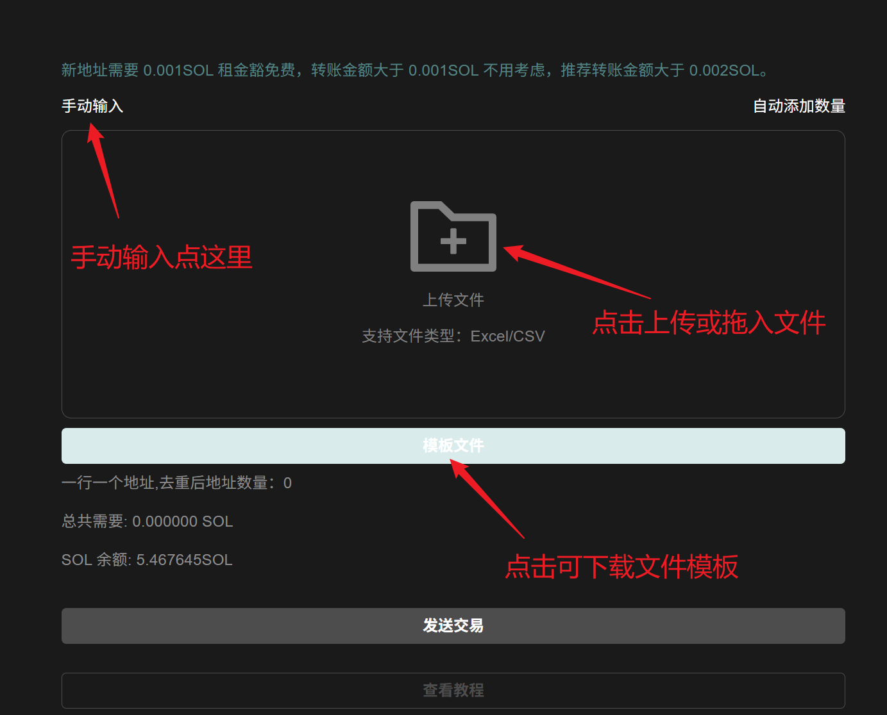
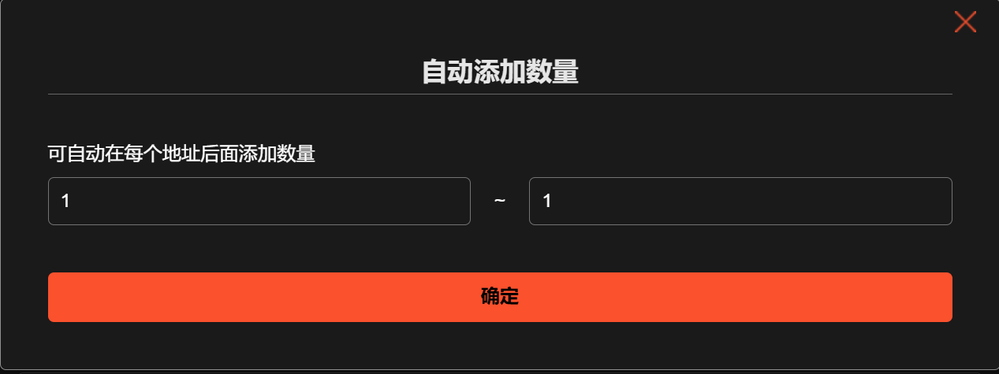
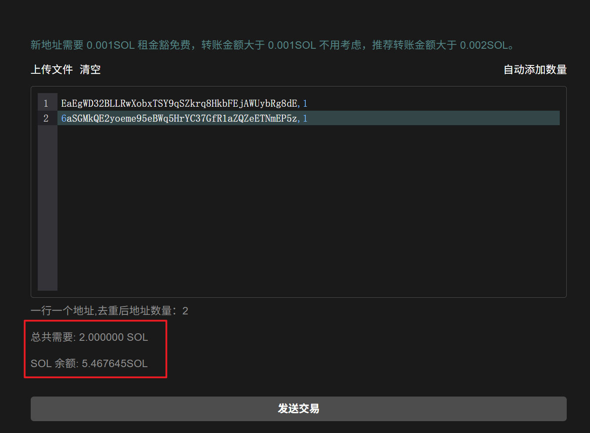
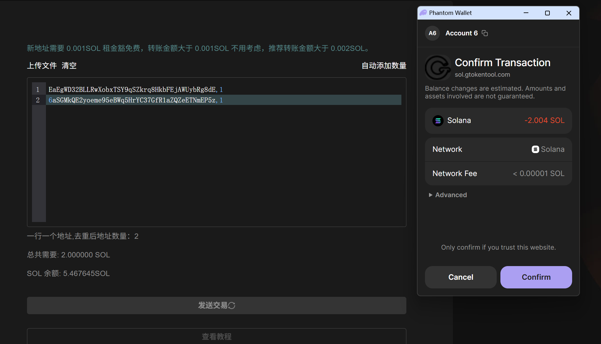
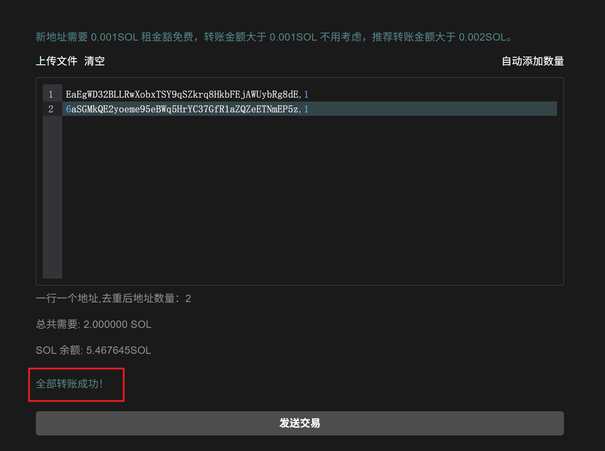

# Solana批量转账SOL教程

**GTokenTool** 的 **Solana 批量转账SOL** 工具主要用于将 SOL 高效分发至多个目标地址，旨在简化大规模转账流程。该工具具备**自动化执行、支持多地址导入、操作零门槛**等特点，用户仅需一次签名即可完成成百上千笔交易。相比手动操作，其优势在于**极低的手续费损耗与极速的上链效率**，并能通过智能校验确保资金精准送达，大幅降低人工误操作风险。它特别适用于需要发放社区空投、结算员工工资或进行多钱包资金调配的 **Solana 项目方、社区主理人及资管团队**，是提升财务管理效率的必备神器。

## 📌核心摘要

* **平台背景（Solana生态）**：专为 **Solana** 高性能区块链设计的高效资金管理工具，针对需要频繁进行资金分发的用户（如项目方空投、做市商资金调配）提供解决方案。
* **核心功能（批量转账）**：支持**批量发送 SOL 及其他 SPL 代币**。通过聚合交易技术，实现“一次交易发送到多个钱包”，极大简化了繁琐的单笔转账流程。
* **技术优势（高效与低成本）**：利用 Solana 链的低手续费与高吞吐量特性，确保批量转账的**即时确认**与**极低成本**。有效解决了传统逐笔转账效率低下、Gas 费高的问题，是 Solana 链上资金分发的最优解。

## 批量转账SOL视频操作教程



## 工具介绍

GTokenTool Sol批量转账/空投工具一次签名转19个地址，100个地址只需签名6次。具有自动去重功能，市面上最好用的批量转账/空投工具。

## 准备事项

1. 一台电脑或者一部手机
2. Solana 钱包（[幻影钱包Phantom安装教程](https://docs.gtokentool.com/solana/auxiliary-tutorial/phantom-wallet-installation)）
3. 要进行批量转账的代币
4. 接收转账的钱包地址
5. 一些 SOL 用于支付转账 GAS

## 批量转账SOL操作流程

### 1. 进入批量转账SOL页面

进入批量转账SOL页面：[https://sol.gtokentool.com/zh-CN/batchTool/batchTransfer/SOL](https://sol.gtokentool.com/zh-CN/batchTool/batchTransfer/SOL)

右上角选择 Main 网络并连接钱包，这里使用测试网演示。

<figure><figcaption>
连接钱包并选择网络
</figcaption></figure>

### 2. 输入地址

可以输入（在输入框中输入要转账的地址以及数量，用英文逗号隔开），也可以导入文件。

<figure><figcaption>
手动输入地址
</figcaption></figure>

<figure><figcaption>
上传地址文件
</figcaption></figure>

### 3. 添加数量

输入地址后，点击自动添加数量。输入转账金额。

<figure><figcaption>
自动已添加数量
</figcaption></figure>

输入金额后，下方可以看到总的转账金额以及钱包余额。

<figure><figcaption>
转账总金额
</figcaption></figure>

### 4. 确认信息无误后，点击“发送交易”


**注意：**&#x56E0;为SOLANA交易哈希长度限制问题，本平台采用20个钱包一笔交易，弹一次钱包，如果导入了四十个钱包，也就是弹两次如下图钱包，弹出钱包点击确认就完成了。


<figure><figcaption>
钱包确认
</figcaption></figure>

页面会出现“全部转帐成功！”小提示，表示发送成功，可以去[SOLANA官方浏览器](https://solscan.io/)查看。

<figure><figcaption>
转账成功提示
</figcaption></figure>

## ❓常见问题 FAQ

### Q: 地址填写正常，余额充足，但显示操作失败？

**A:** 节点网络问题，换个节点或者刷新网络。

### Q: 每个地址可以转不同数量吗？

**A:** 可以。你可以为每个地址设置不同的转账数量，也可以设置统一的金额分发给所有目标地址。

### Q: 如何导入接收地址？

**A:** 你可以手动输入地址，也可以上传 CSV 文件导入目标地址列表（支持地址+金额格式），系统会自动识别并展示预览。

### 🤝 连接 GTokenTool 

* **💬 Telegram社群**：[点击加入官方群组](https://t.me/gtokentool)
* **🐦 Twitter (X)**：[关注我们获取最新动态](https://x.com/gtokentool)
* **📚 官方文档**：[查看 Gitbook 文档](https://docs.gtokentool.com/)
* **💻 开源代码**：[访问 GitHub 仓库](https://github.com/Gtokentool/docs/blob/master/SUMMARY.md)
* **📺 视频教程**：[订阅 YouTube 频道](https://www.youtube.com/@GTokenTool)

> ⚠️ 风险提示与免责声明
>
> GTokenTool 保留随时全权酌情因任何理由修改、变更或取消此公告的权利，无需事先通知。
>
> 以上信息内容仅供参考，GTokenTool 对本平台上的任何虚拟资产、产品或促销活动不做任何推荐或保证。虚拟资产的价格波动很大，投资交易虚拟资产将面临巨大风险。**请谨慎投资。**
