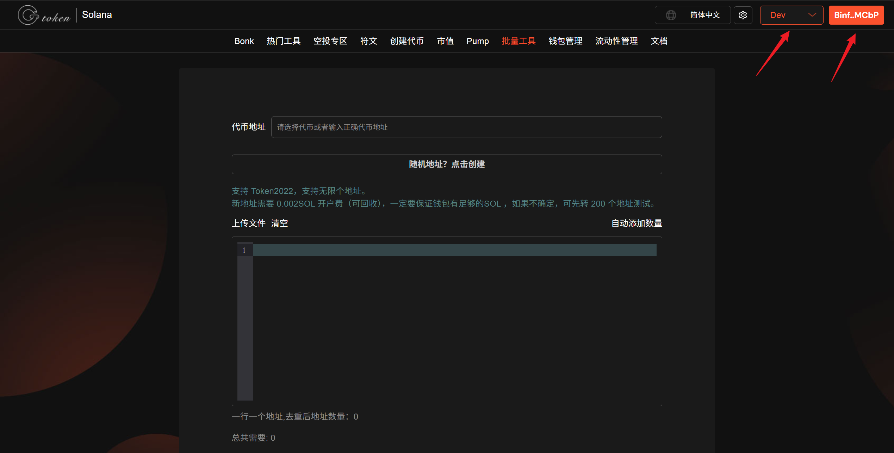
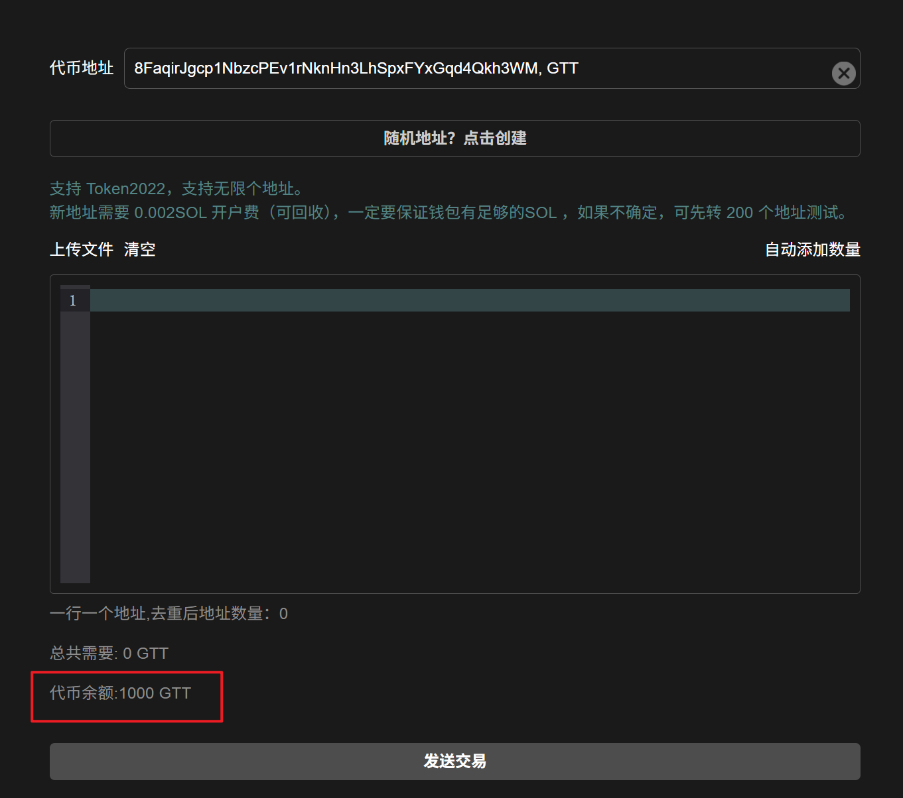
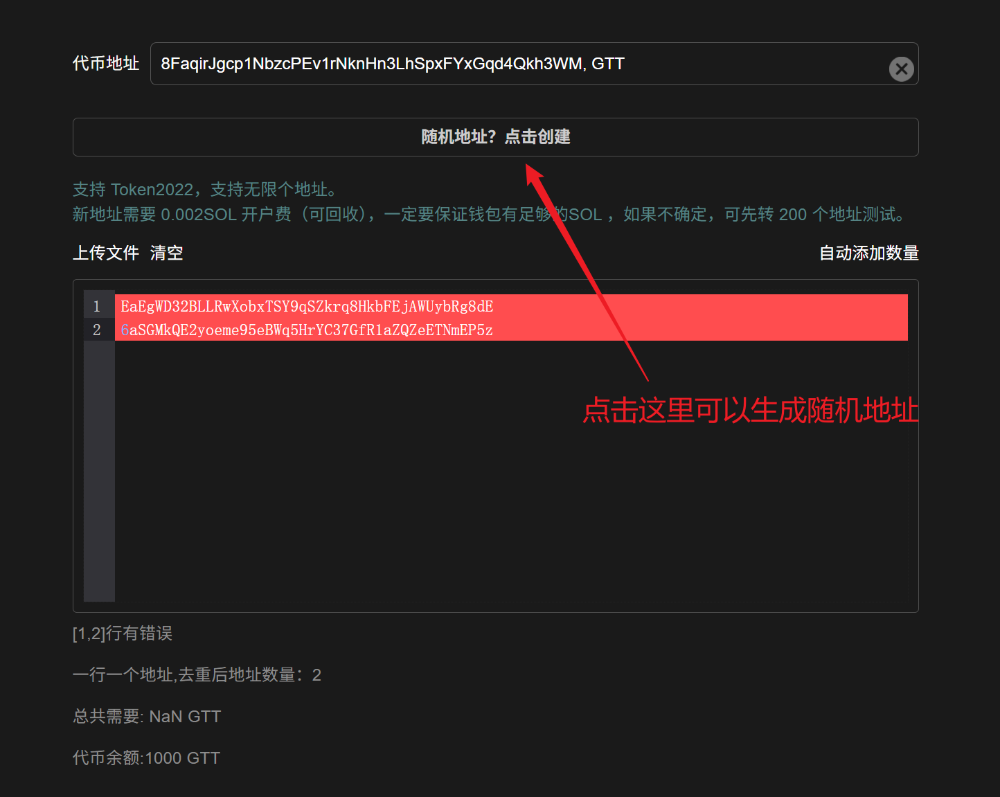
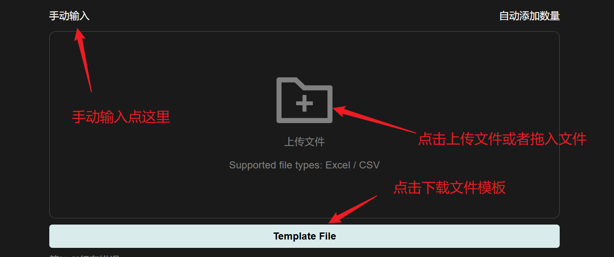
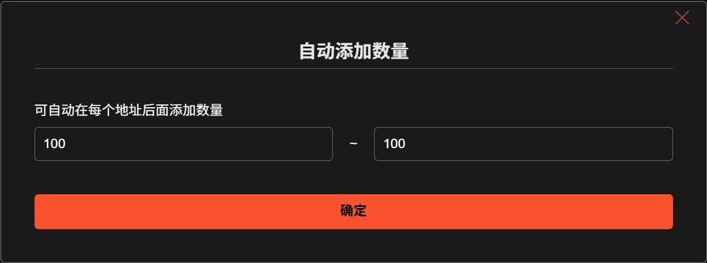
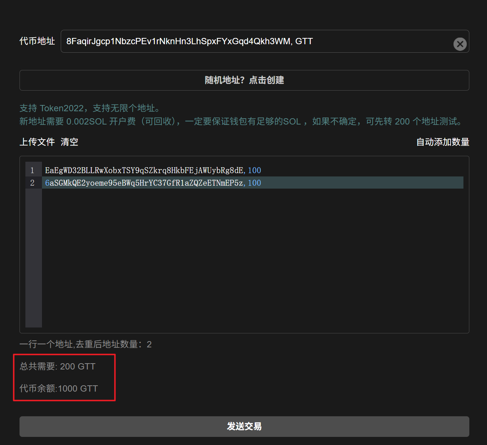
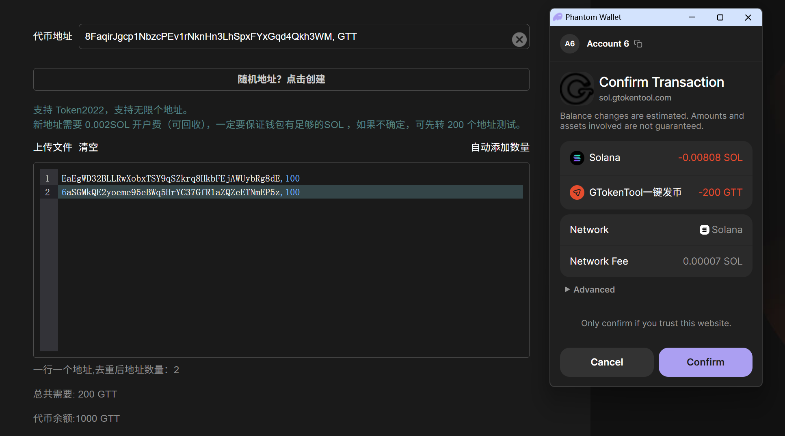
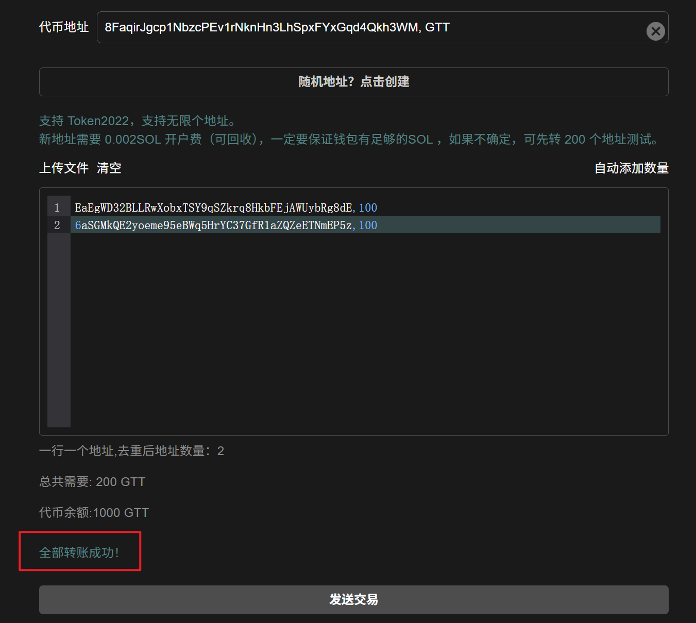

# Solana批量转代币教程

## 批量转账视频操作教程



## 工具介绍

GTokenTool Sol批量转账/空投工具一次签名转380个地址，1000个地址只需签名3次。具有自动去重功能，市面上最好用的批量转账/空投工具。

## 准备事项

1. 一台电脑或者一部手机
2. Solana 钱包（[幻影钱包Phantom安装教程](https://docs.gtokentool.com/solana/auxiliary-tutorial/phantom-wallet-installation)）
3. 要进行批量转账的代币
4. 接收转账的钱包地址
5. 一些 SOL 用于支付转账 GAS

## 注意事项

<mark style="color:purple;">你的私钥不会存储在平台上，所有操作都是基于前端执行的，请放心使用。如果你比较担心，可以使用新的钱包操作。</mark>

## 批量转代币操作流程

### 1.  进入批量转代币页面

批量转代币页面：[https://sol.gtokentool.com/zh-CN/batchTool/batchTransfer/Token](https://sol.gtokentool.com/zh-CN/batchTool/batchTransfer/Token) ，

右上角选择 Main 网络并连接钱包，这里使用测试网演示。

<figure><figcaption></figcaption></figure>

### 2. 选择代币&#x20;

&#x20;首先，我们连接钱包后，选择或输入你需要批量转账的代币。

<mark style="color:blue;">支持SPL Token 2022手续费类型的代币。</mark>

选择完代币，下面可以看到代币的余额。

<figure><figcaption></figcaption></figure>

### 3. 输入钱包地址

在输入框中输入要转账的地址或者点击“`随机地址？点击创建`”，用英文逗号隔开（<mark style="color:purple;">最多不超过20个地址</mark>）。

<figure><figcaption></figcaption></figure>

如果选择上传文件导入地址，可点击“`上传文件`”，导入钱包地址文件。

<figure><figcaption></figcaption></figure>

### 4. 添加数量

点击“`自动添加数量`”，输入转账金额。

<figure><figcaption></figcaption></figure>

输入后，可以在下面看到要转账的总金额。

<figure><figcaption></figcaption></figure>

### 5. 发送交易&#x20;

此时我们确认一下空投的数据信息是否准确，确认无误后，点击“`发送交易`”，此时会弹出钱包，点击确认即可。

<figure><figcaption></figcaption></figure>

转账成功后，下面会显示“全部转账成功！”。

<figure><figcaption></figcaption></figure>

## 常见问题：

### 1. 输入框内格式正确点击发送交易后显示操作失败？

节点网络问题，换个节点或者刷新网络。\

[_**GTokenTool | 创建代币、批量空投和做市机器人等Solana工具集**_](https://sol.gtokentool.com)

**安全、开源，给Solana用户带来最便利的一站式体验。**

GTokenTool社群:

Telegram：[**https://t.me/gtokentool**](https://t.me/gtokentool)

Twitter:  [**https://x.com/gtokentool**](https://x.com/gtokentool)

Gitbook：[**https://docs.gtokentool.com/**](https://docs.gtokentool.com/)

Github：[**https://github.com/Gtokentool/docs/blob/master/SUMMARY.md**](https://github.com/Gtokentool/docs/blob/master/SUMMARY.md)

YouTube：[**https://www.youtube.com/@GTokenTool**](https://www.youtube.com/@GTokenTool)\
\
\
<mark style="color:purple;background-color:orange;">**GTokenTool**</mark>_<mark style="color:purple;background-color:orange;">保留随时全权酌情因任何理由修改、变更或取消此公告的权利，无需事先通知。以上信息内容仅供参考，GTokenTool对本平台上的任何虚拟资产、产品或促销活动不做任何推荐或保证。虚拟资产的价格波动很大，投资交易虚拟资产将面临巨大风险。请谨慎投资。</mark>_
