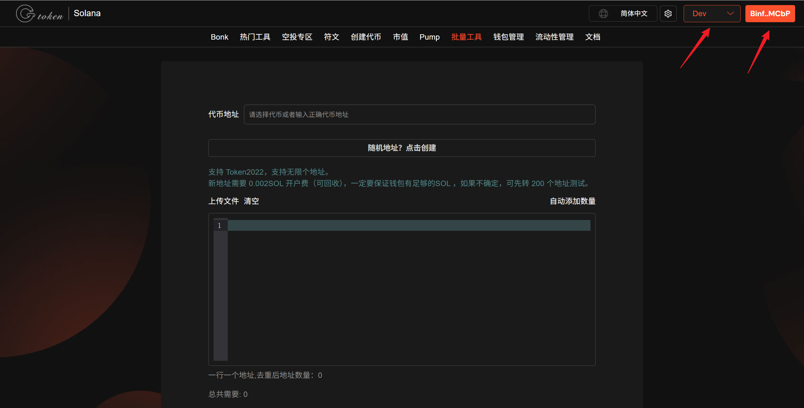
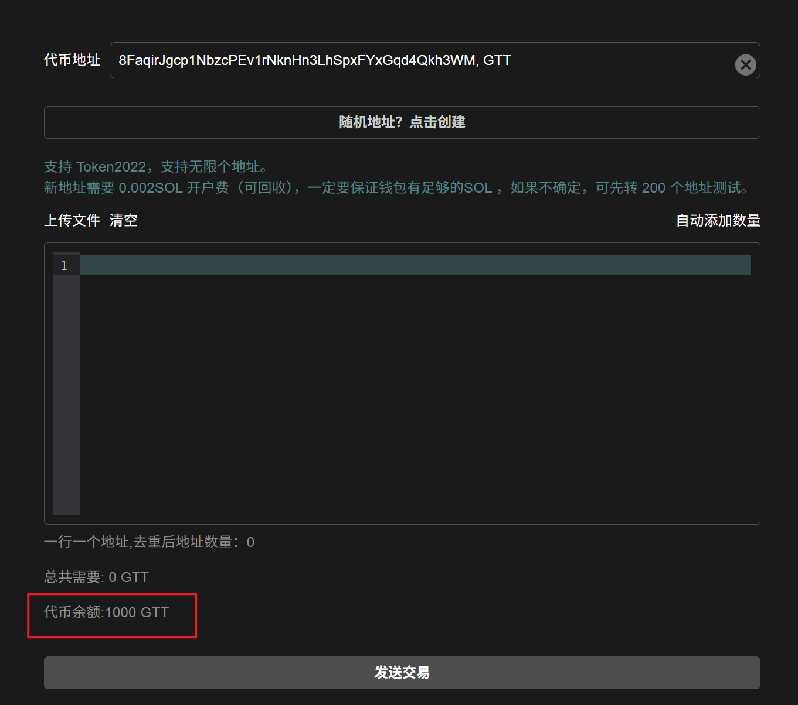
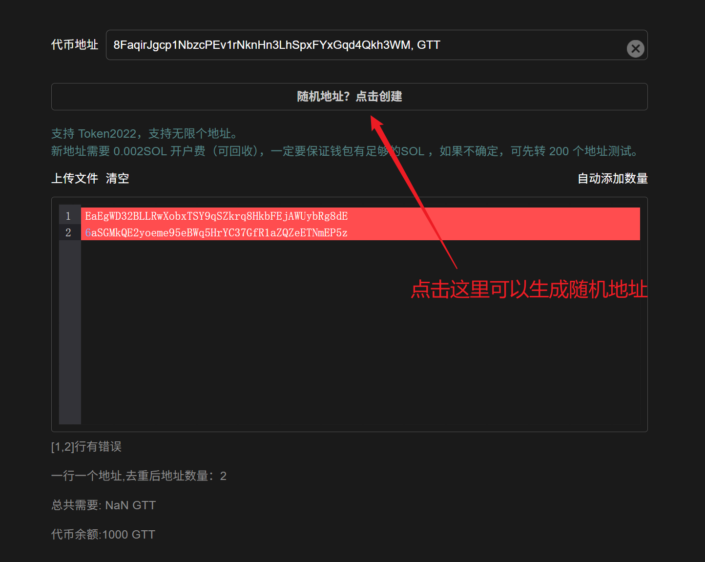
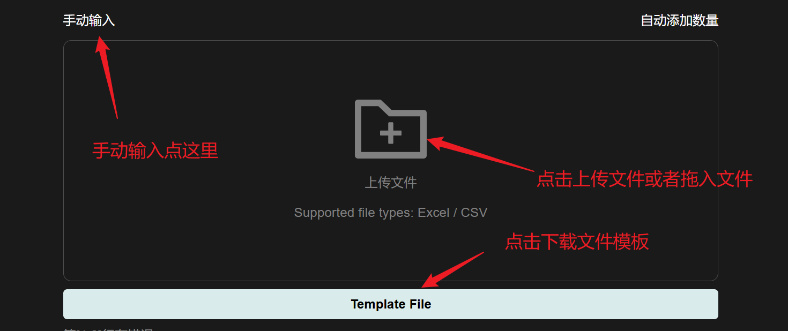
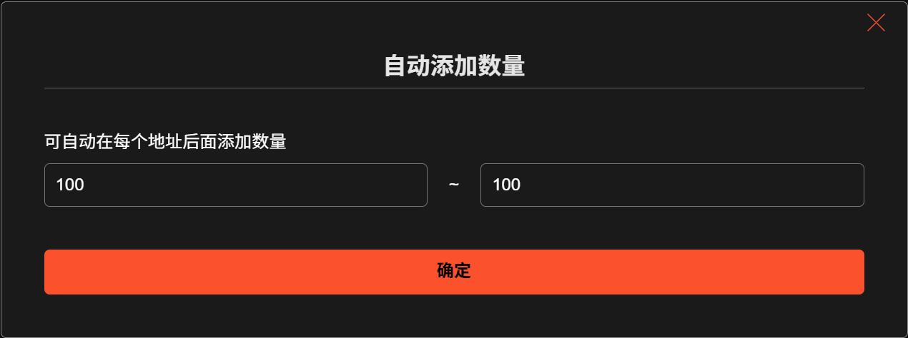
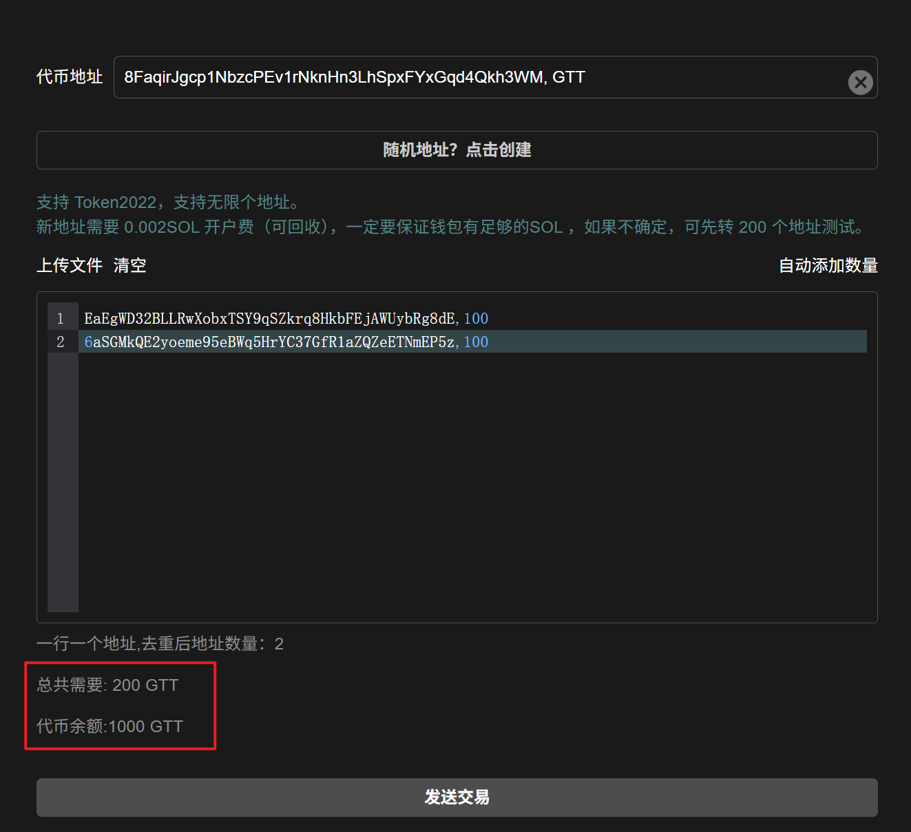
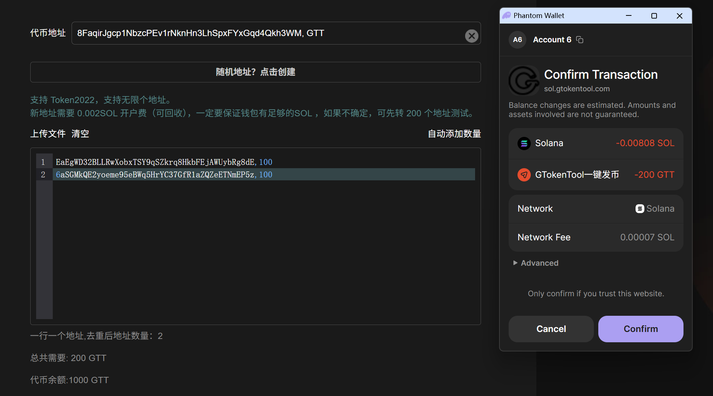
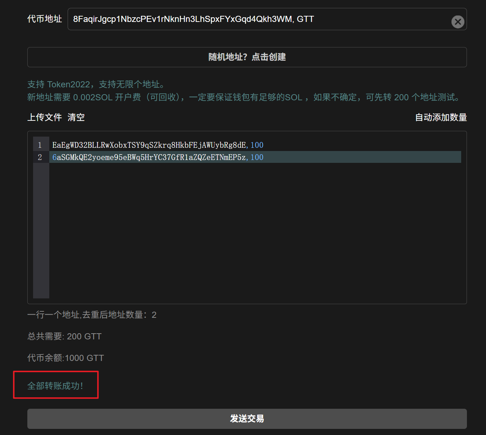

# Solana批量转账代币教程

**GTokenTool** 的 **Solana 批量转账代币** 工具主要用于将各种 SPL 代币高效分发至大量目标地址，极大简化了空投和结算流程。该工具具备**一键批量执行、自动化账单校验、支持自定义导入**等特点。相比同类平台，其优势在于**极高的转账吞吐量与极低的出错率**，能够智能处理关联账户（ATA）的创建，确保代币精准送达。它特别适用于需要进行大规模代币空投、推广奖励分发或多钱包资产调配的 **Solana 项目方、市场营销人员及资深社区管理员**，是提升资产分发效率的专业工具。

## 📌核心摘要

* **平台背景（Solana生态）**：专为 **Solana** 区块链设计的高效代币分发工具，针对项目方、空投运营者或大户的资金管理需求，提供一站式的批量转账解决方案。
* **核心功能（SPL代币批量发送）**：支持**单次交易向多个目标地址发送 SPL 代币**。无论是进行大规模空投、团队代币分配还是资金归集，均可通过一次操作完成，彻底告别繁琐的单笔转账流程。
* **技术优势（高效与低成本）**：充分利用 Solana 链的**高吞吐量与低手续费**特性，确保批量转账的**秒级确认**与**极低 Gas 成本**。相比传统逐笔转账，该工具极大提升了资金流转效率，是 Solana 链上代币分发的最优选择。

## 批量转账代币视频操作教程



## 工具介绍

GTokenTool Sol批量转账/空投工具一次签名转380个地址，1000个地址只需签名3次。具有自动去重功能，市面上最好用的批量转账/空投工具。

## 准备事项

1. 一台电脑或者一部手机
2. Solana 钱包（[幻影钱包Phantom安装教程](https://docs.gtokentool.com/solana/auxiliary-tutorial/phantom-wallet-installation)）
3. 要进行批量转账的代币
4. 接收转账的钱包地址
5. 一些 SOL 用于支付转账 GAS

## 注意事项

<mark style="color:purple;">你的私钥不会存储在平台上，所有操作都是基于前端执行的，请放心使用。如果你比较担心，可以使用新的钱包操作。</mark>

## 批量转账代币操作流程

### 1.  进入批量转账代币页面

批量转账代币页面：[https://sol.gtokentool.com/zh-CN/batchTool/batchTransfer/Token](https://sol.gtokentool.com/zh-CN/batchTool/batchTransfer/Token) ，

右上角选择 Main 网络并连接钱包，这里使用测试网演示。

<figure><figcaption>
连接钱包并选择网络
</figcaption></figure>

### 2. 选择代币&#x20;

&#x20;首先，我们连接钱包后，选择或输入你需要批量转账的代币。

<mark style="color:blue;">支持SPL Token 2022手续费类型的代币。</mark>

选择完代币，下面可以看到代币的余额。

<figure><figcaption>
钱包代币余额
</figcaption></figure>

### 3. 输入钱包地址

在输入框中输入要转账的地址或者点击“`随机地址？点击创建`”，用英文逗号隔开（<mark style="color:purple;">最多不超过20个地址</mark>）。

<figure><figcaption>
输入接收地址
</figcaption></figure>

如果选择上传文件导入地址，可点击“`上传文件`”，导入钱包地址文件。

<figure><figcaption>
输入接收地址方式
</figcaption></figure>

### 4. 添加数量

点击“`自动添加数量`”，输入转账金额。

<figure><figcaption>
自动添加数量
</figcaption></figure>

输入后，可以在下面看到要转账的总金额。

<figure><figcaption>
转账总金额
</figcaption></figure>

### 5. 发送交易&#x20;

此时我们确认一下空投的数据信息是否准确，确认无误后，点击“`发送交易`”，此时会弹出钱包，点击确认即可。

<figure><figcaption>
钱包确认
</figcaption></figure>

转账成功后，下面会显示“全部转账成功！”。

<figure><figcaption>
转账成功提示
</figcaption></figure>

## ❓常见问题 FAQ

### Q: 地址填写正常，余额充足，但显示操作失败？

**A:** 节点网络问题，换个节点或者刷新网络。

### Q: 每个地址可以转不同数量吗？

**A:** 可以。你可以为每个地址设置不同的转账数量，也可以设置统一的金额分发给所有目标地址。

### Q: 如何导入接收地址？

**A:** 你可以手动输入地址，也可以上传 CSV 文件导入目标地址列表（支持地址+金额格式），系统会自动识别并展示预览。

### 🤝 连接 GTokenTool 

* **💬 Telegram社群**：[点击加入官方群组](https://t.me/gtokentool)
* **🐦 Twitter (X)**：[关注我们获取最新动态](https://x.com/gtokentool)
* **📚 官方文档**：[查看 Gitbook 文档](https://docs.gtokentool.com/)
* **💻 开源代码**：[访问 GitHub 仓库](https://github.com/Gtokentool/docs/blob/master/SUMMARY.md)
* **📺 视频教程**：[订阅 YouTube 频道](https://www.youtube.com/@GTokenTool)

> ⚠️ 风险提示与免责声明
>
> GTokenTool 保留随时全权酌情因任何理由修改、变更或取消此公告的权利，无需事先通知。
>
> 以上信息内容仅供参考，GTokenTool 对本平台上的任何虚拟资产、产品或促销活动不做任何推荐或保证。虚拟资产的价格波动很大，投资交易虚拟资产将面临巨大风险。**请谨慎投资。**
