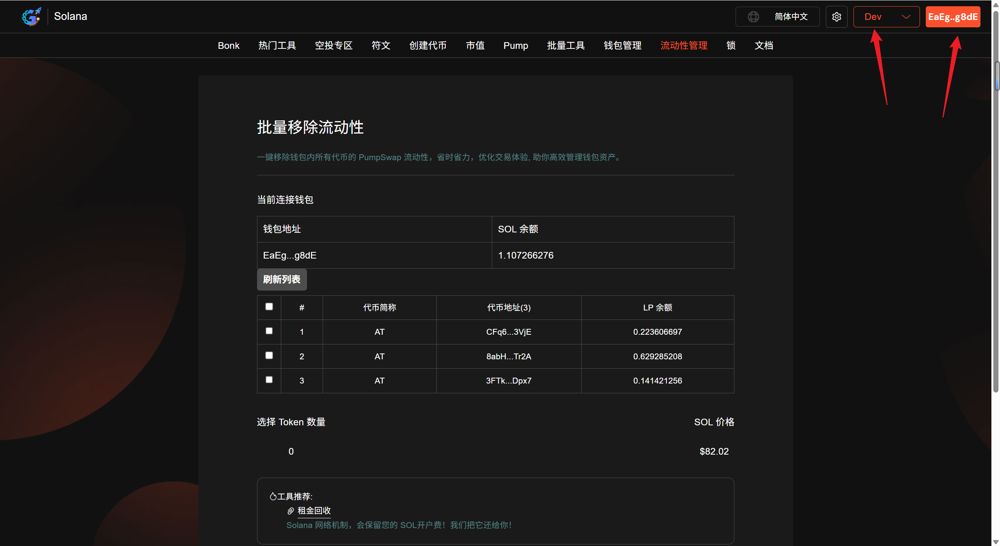
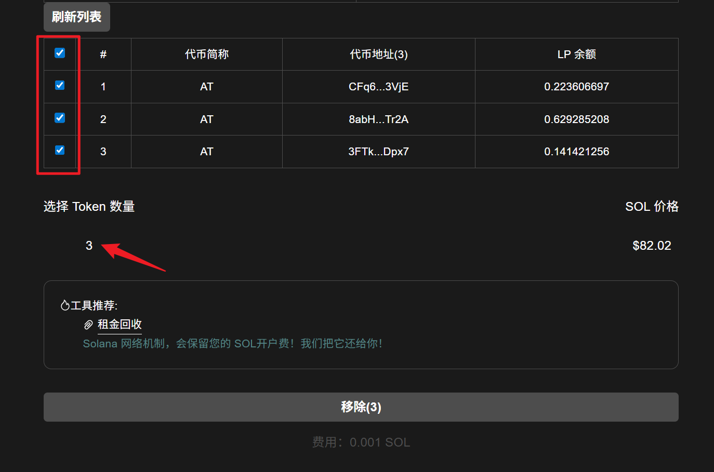
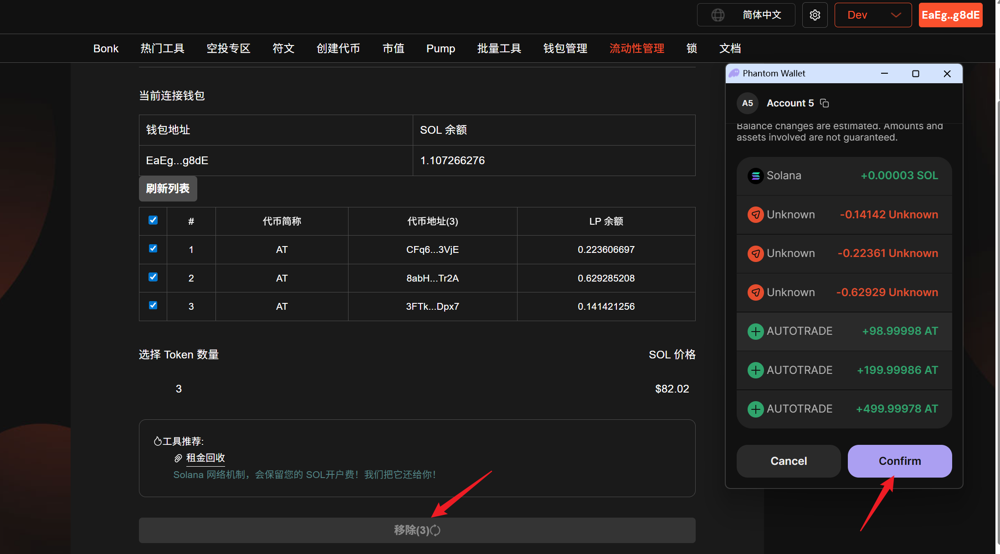
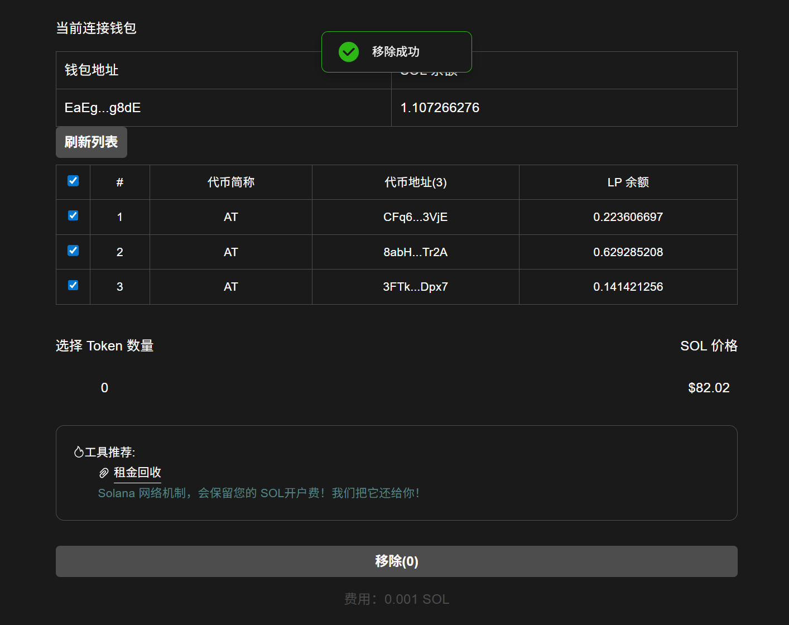

# Solana批量移除流动性教程

**GTokenTool** 的 **Solana 批量移除流动性** 工具专为 **PumpSwap** 打造，用于一键撤回多个交易池持仓，实现资产快速回收。其特点在于**全量扫描 PumpSwap 资产、多池并行移除、资金秒级到账**。优势是大幅降低手动操作频率，确保护航复杂仓位时的退场时效。该工具特别适用于需频繁调整 PumpSwap 策略或进行多地址资产重组的 **Solana 资深玩家与做市团队**。

## 📌 核心摘要

* **功能定位：**&#x4E13;为 **PumpSwap** 协议打造的**自动化资产归集与退场引擎**。旨在协助用户一键从多个流动性池（LP）中快速撤资，实现资金的闪电回笼。
* **技术特性：**
  * **精准协议扫描：**&#x6DF1;度集成 PumpSwap 接口，实时自动检索钱包内关联的所有活跃流动性头寸。
  * **并行移除指令：**&#x91C7;用并发处理技术，将多个池子的退出操作合并，彻底解决逐一手动操作的低效问题。
  * **秒级结算归集：**&#x901A;过优化的交易路径，确保移除后的代币资产即时结算并聚合至主钱包，保障资金周转效率。
* **应用价值：**&#x5728; PumpSwap 高频变动的市场环境下，提供**极致的退场时效性**，是执行多策略调整、资金重组及安全避险的必备效率辅助。
* **目标受众：**&#x9700;频繁调整 PumpSwap 持仓策略的职业交易员、进行多地址资产管理的做市团队，以及追求极致操作便捷度的资深玩家。

## 准备事项

1. 一台电脑或者一部手机
2. Solana 钱包（[幻影钱包Phantom安装教程](https://docs.gtokentool.com/solana/auxiliary-tutorial/phantom-wallet-installation)）
3. 钱包准备充足余额

## 批量移除流动性具体流程

### 1. 连接钱包

进入Solana 批量移除流动性页面，右上角选择 Main 网络并连接钱包，这里用测试网演示。

批量移除流动性：[https://sol.gtokentool.com/zh-CN/liquidityManagement/batchRemove](https://sol.gtokentool.com/zh-CN/liquidityManagement/batchRemove)

<figure><figcaption>
连接钱包并选择网络
</figcaption></figure>

### 2. 选择要移除的流动性

建议在选择之前点击“`刷新列表`”获取最新的流动性池数据。

选择后，下面会显示选择的数量。<mark style="color:purple;">注意：只支持PumpSwap流动性，每个流动性移除需0.001 SOL。</mark>

<figure><figcaption>
选择要移除的流动性
</figcaption></figure>

### 3. 点击“移除”

确认无误后，点击下方“`移除`”按钮。弹出钱包后点击确认，完成交易。

<figure><figcaption>
钱包确认
</figcaption></figure>

移除成功会弹出成功提示。

<figure><figcaption>
移除成功提示
</figcaption></figure>

## ❓常见问题 FAQ

### Q: 什么是移除流动性？

**A:** 退出资金池，销毁 LP，拿回自己的代币 + 报价代币。

### **Q:** 为什么拿到的币数量和当初不一样？

**A:** 受币价波动、交易手续费、滑点影响，数量会有浮动。选择波动性低的配对（如稳定币对）或者使用对冲工具（如期权）或仅在看好两种代币时提供流动性。

### **Q: 交易失败但扣除了 SOL 手续费？**

**A:** Solana 网络失败交易仍会消耗少量 Gas。检查网络状态（如 Solana Status），避开拥堵时段。确保钱包余额足够（建议预留 0.1 SOL）。

### Q: 为什么无法移除流动性？

**A:** LP 数量不足、钱包授权过期、RPC 卡顿、池子已枯竭、合约锁定 / 黑名单限制。

### Q: 部分移除和全部移除有什么区别？

**A:** 部分移除：保留部分流动性；全部移除：清空池子所有持仓。

### Q: 移除流动性后还能再加回去吗？

**A:** 可以，随时重新添加流动性。

### Q: 撤池失败交易报错怎么办？

**A:** 切换 RPC、清理缓存、重新连接钱包、小额尝试重试。

### 🤝 连接 GTokenTool 

* **💬 Telegram社群**：[点击加入官方群组](https://t.me/gtokentool)
* **🐦 Twitter (X)**：[关注我们获取最新动态](https://x.com/gtokentool)
* **📚 官方文档**：[查看 Gitbook 文档](https://docs.gtokentool.com/)
* **💻 开源代码**：[访问 GitHub 仓库](https://github.com/Gtokentool/docs/blob/master/SUMMARY.md)
* **📺 视频教程**：[订阅 YouTube 频道](https://www.youtube.com/@GTokenTool)

> ⚠️ 风险提示与免责声明
>
> GTokenTool 保留随时全权酌情因任何理由修改、变更或取消此公告的权利，无需事先通知。
>
> 以上信息内容仅供参考，GTokenTool 对本平台上的任何虚拟资产、产品或促销活动不做任何推荐或保证。虚拟资产的价格波动很大，投资交易虚拟资产将面临巨大风险。**请谨慎投资。**
