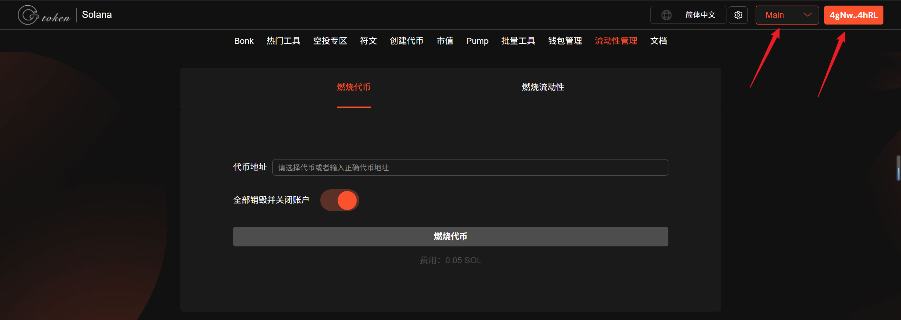
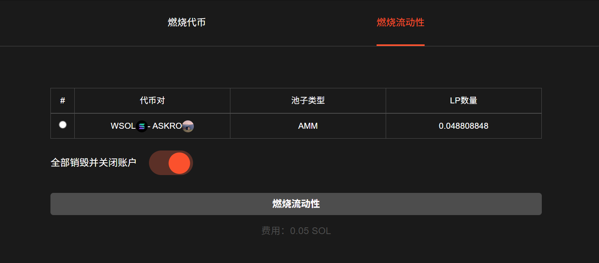
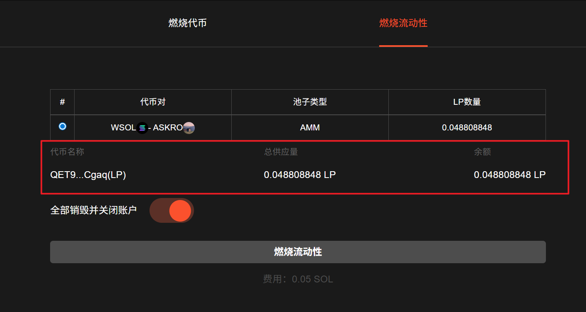
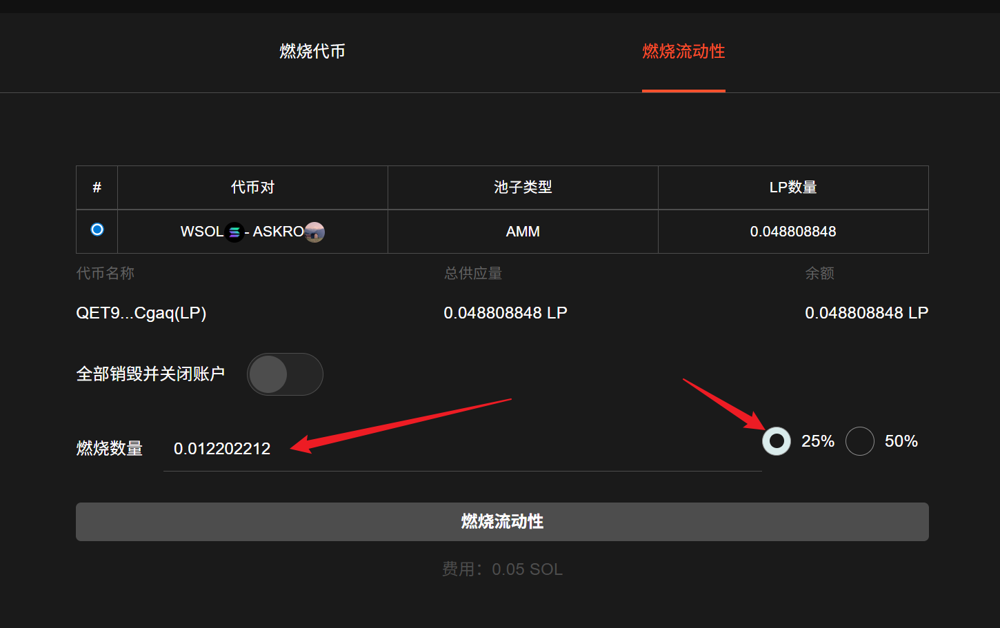
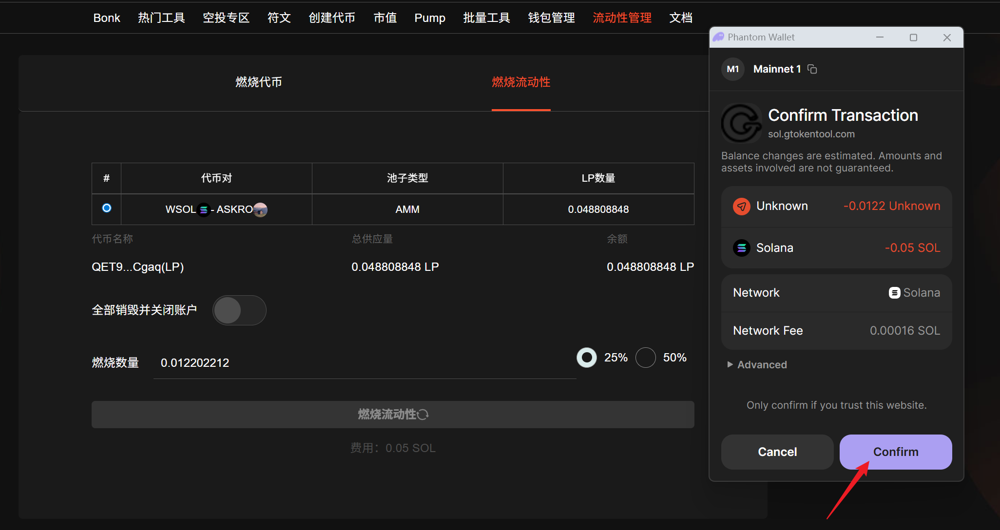

# Solana燃烧流动性池教程

## 准备事项

1. Solana 钱包（[幻影钱包Phantom安装教程](https://docs.gtokentool.com/solana/auxiliary-tutorial/phantom-wallet-installation)）
2. 钱包最少准备 0.1 SOL (Raydium官方将收取0.4 SOL)

## Solana燃烧流动性池步骤

### 1. 连接钱包

进入 GTokenTool 燃烧流动性池页面，右上角选择 Main 网络，连接好钱包。

燃烧流动性池地址：[https://sol.gtokentool.com/zh-CN/liquidityManagement/burnToken](https://sol.gtokentool.com/zh-CN/liquidityManagement/burnToken)

<figure><figcaption></figcaption></figure>

### 2. 切换至燃烧流动性

这里会显示当前钱包内的所有流动性池。

<figure><figcaption></figcaption></figure>

### 3. 选择流动性

可以查看当前钱包的池子份额。

<figure><figcaption></figcaption></figure>

### 4. 选择或填写要燃烧的流动性比例

关闭全部销毁并关闭账户后，可以选择要燃烧的比例或数量。

<figure><figcaption></figcaption></figure>

### 5. 点击“燃烧流动性”，完成燃烧流动性

<figure><figcaption></figcaption></figure>

[_**GTokenTool | 创建代币、批量空投和做市机器人等Solana工具集**_](https://sol.gtokentool.com)

**安全、开源，给Solana用户带来最便利的一站式体验。**

GTokenTool社群:

Telegram：[**https://t.me/gtokentool**](https://t.me/gtokentool)

Twitter:  [**https://x.com/gtokentool**](https://x.com/gtokentool)

Gitbook：[**https://docs.gtokentool.com/**](https://docs.gtokentool.com/)

Github：[**https://github.com/Gtokentool/docs/blob/master/SUMMARY.md**](https://github.com/Gtokentool/docs/blob/master/SUMMARY.md)

YouTube：[**https://www.youtube.com/@GTokenTool**](https://www.youtube.com/@GTokenTool)\
\
\
<mark style="color:purple;background-color:orange;">**GTokenTool**</mark>_<mark style="color:purple;background-color:orange;">保留随时全权酌情因任何理由修改、变更或取消此公告的权利，无需事先通知。以上信息内容仅供参考，GTokenTool对本平台上的任何虚拟资产、产品或促销活动不做任何推荐或保证。虚拟资产的价格波动很大，投资交易虚拟资产将面临巨大风险。请谨慎投资。</mark>_
