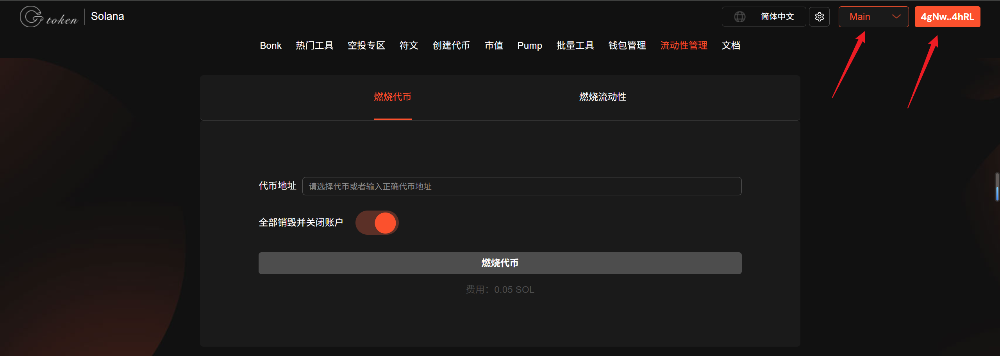
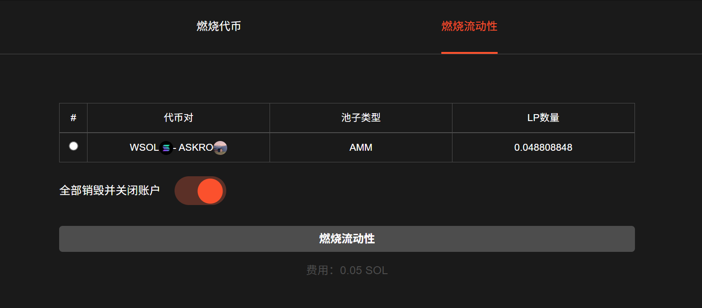
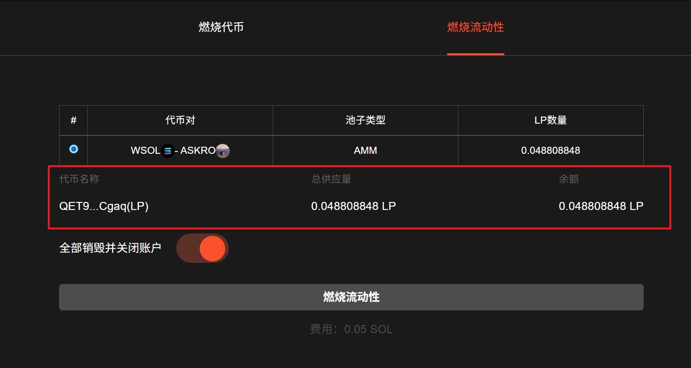
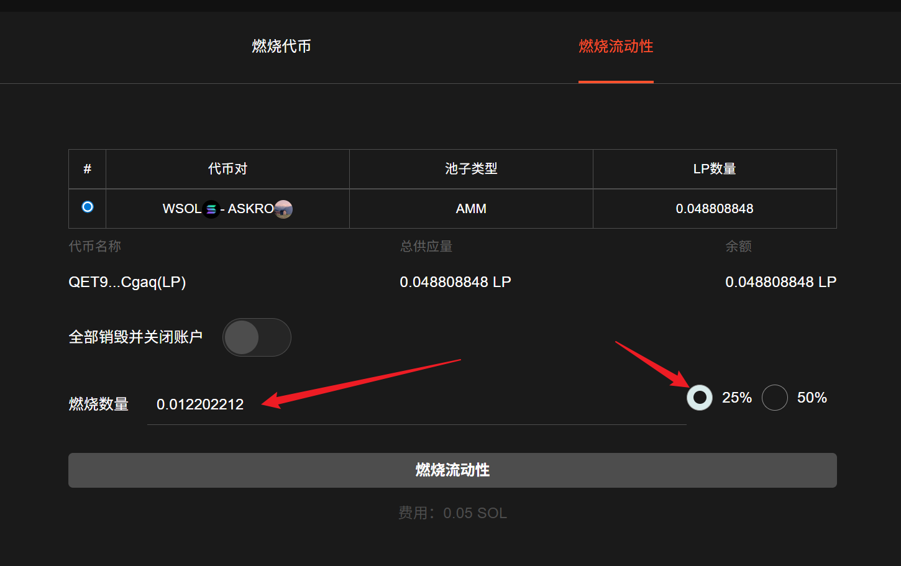
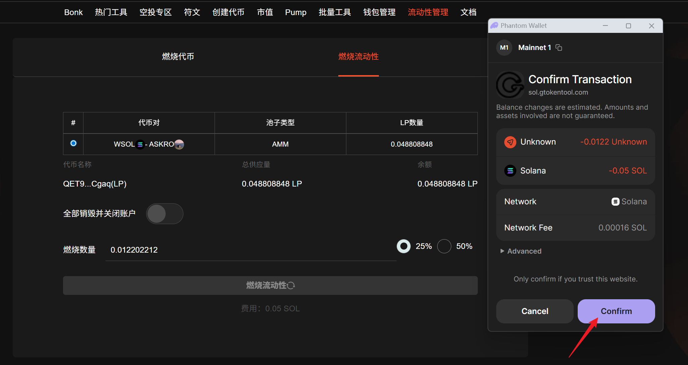

# Solana燃烧流动性池教程

## 📌 核心摘要

* **功能定位：**&#x53;olana 生态高效的**流动性风险控制与信用增强工具**。支持项目方通过永久销毁（Burn）流动性代币（LP Tokens），向市场传递“永不撤池”的强有力安全信号。
* **技术特性：**
  * **极致极简交互：**&#x9488;对 Raydium 等主流 DEX 进行深度适配，将复杂的链上燃烧指令简化为一键式操作，极大提升管理效率。
  * **实时上链存证：**&#x786E;保每一笔流动性销毁操作均在区块浏览器可查，为项目提供不可篡改的“去中心化信任背书”。
  * **策略动态调整：**&#x52A9;项目方快速调整流动性深度，优化资产通缩逻辑，提升链上代币的持有信心。
* **应用价值：**&#x901A;过锁定底池流动性，有效规避 Rug Pull 风险担忧，是**项目建立社区共识与长效运营**的核心基础设施。
* **目标受众：**&#x9700;进行流动性锁定的 Solana 项目方、追求极致透明度的运营团队以及寻求安全资产评估的资深投资者。

## 准备事项

1. Solana 钱包（[幻影钱包Phantom安装教程](https://docs.gtokentool.com/solana/auxiliary-tutorial/phantom-wallet-installation)）
2. 钱包最少准备 0.1 SOL (Raydium官方将收取0.4 SOL)

## Solana燃烧流动性池步骤

### 1. 连接钱包

进入 GTokenTool 燃烧流动性池页面，右上角选择 Main 网络，连接好钱包。

燃烧流动性池地址：[https://sol.gtokentool.com/zh-CN/liquidityManagement/burnToken](https://sol.gtokentool.com/zh-CN/liquidityManagement/burnToken)

<figure><figcaption>
连接钱包并选择网络
</figcaption></figure>

### 2. 切换至燃烧流动性

这里会显示当前钱包内的所有流动性池。

<figure><figcaption>
切换至燃烧流动性
</figcaption></figure>

### 3. 选择流动性

可以查看当前钱包的池子份额。

<figure><figcaption>
选择流动性
</figcaption></figure>

### 4. 选择或填写要燃烧的流动性比例

关闭全部销毁并关闭账户后，可以选择要燃烧的比例或数量。

<figure><figcaption>
填写燃烧数量
</figcaption></figure>

### 5. 点击“燃烧流动性”，完成燃烧流动性

<figure><figcaption>
钱包确认
</figcaption></figure>

## ❓常见问题 FAQ

### Q: 什么是燃烧流动性？

**A:** 销毁 LP 代币，让对应池子的**流动性永久锁死、无法撤回**。

### Q: 燃烧 vs 移除流动性区别？

**A:** 移除 = 销毁 LP，退回本金；燃烧 = 销毁 LP，不退回任何资产。

### Q: 燃烧后池子还能交易吗？

**A:** 能。池子正常交易，只是没人能撤池。

### Q: 燃烧后能恢复吗？

**A:** 不可逆。LP 销毁后永久消失。

### Q: 为什么要燃烧？

**A:** 防项目方**撤池跑路**、提升**代币可信度**、稳定价格。

### Q: 哪些池子支持燃烧？

**A:** 主要支持**Raydium、Meteora**标准 LP。

### Q: 怎么查是否燃烧成功？

**A:** 链上浏览器看**LP 余额为 0**、**Owner 为黑洞地址**。

### Q: 燃烧会影响价格吗？

**A:** **不直接影响**。但**锁仓利好**常提升市场信心。

### 🤝 连接 GTokenTool 

* **💬 Telegram社群**：[点击加入官方群组](https://t.me/gtokentool)
* **🐦 Twitter (X)**：[关注我们获取最新动态](https://x.com/gtokentool)
* **📚 官方文档**：[查看 Gitbook 文档](https://docs.gtokentool.com/)
* **💻 开源代码**：[访问 GitHub 仓库](https://github.com/Gtokentool/docs/blob/master/SUMMARY.md)
* **📺 视频教程**：[订阅 YouTube 频道](https://www.youtube.com/@GTokenTool)

> ⚠️ 风险提示与免责声明
>
> GTokenTool 保留随时全权酌情因任何理由修改、变更或取消此公告的权利，无需事先通知。
>
> 以上信息内容仅供参考，GTokenTool 对本平台上的任何虚拟资产、产品或促销活动不做任何推荐或保证。虚拟资产的价格波动很大，投资交易虚拟资产将面临巨大风险。**请谨慎投资。**
