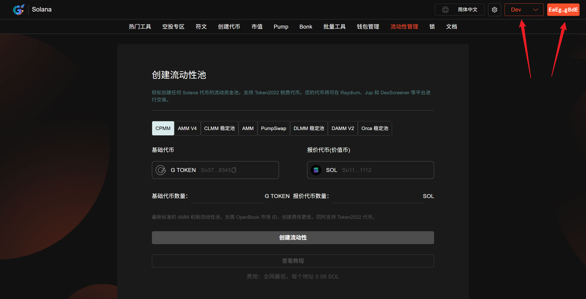
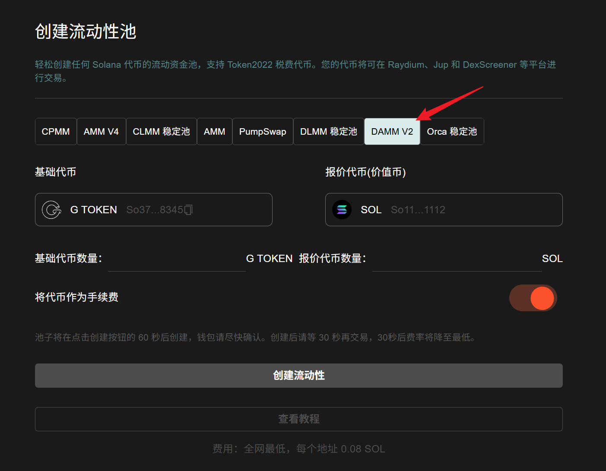
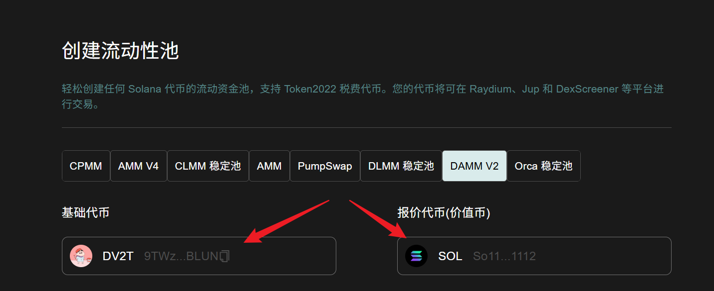
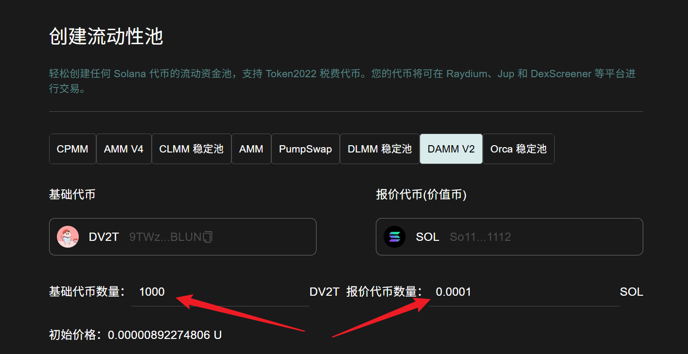
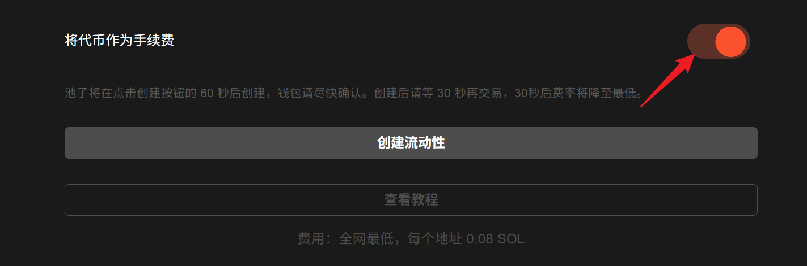
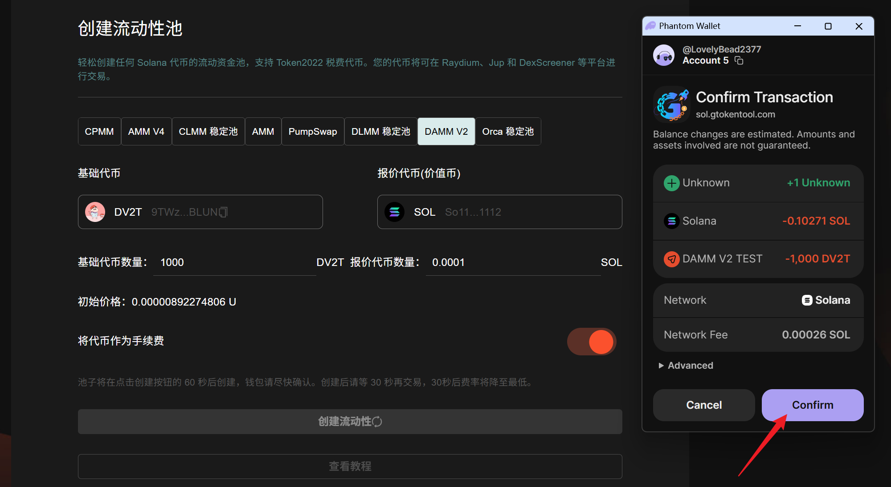
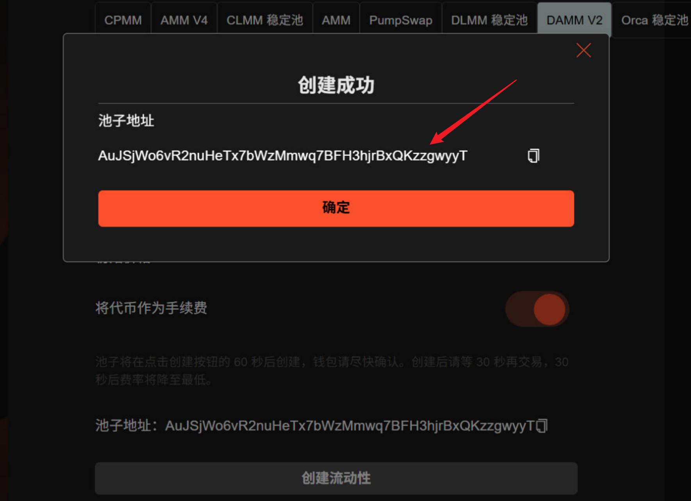

# Meteora DAMM V2 创建流动性教程

**GTokenTool** 的 **Solana Meteora DAMM V2 创建流动性** 工具主要用于在 Meteora V2 协议上部署自动化动态做市持仓。该工具具备**算法自动调优、多策略金库接入、资金高效聚合**等特点。其优势在于通过动态费率机制最大化收益，并能有效应对不同市场阶段的波动。它特别适用于追求自动化资产增值、需降低管理成本的 **Solana 长期持有者、DeFi 收益农民及初创项目方**。

## 📌 核心摘要

* **功能定位：**&#x57FA;于 **Meteora V2** 协议的**自动化动态流动性配置引擎**。旨在协助用户在 Solana 链上快速部署具备自适应调节能力的动态做市持仓。
* **技术特性：**
  * **算法自动调优：**&#x5185;置智能算法，能够根据市场波动实时优化流动性分布，实现资金利用率的自动化最大化。
  * **多策略金库接入：**&#x652F;持无缝对接多种策略金库（Vaults），允许用户根据风险偏好灵活选择动态收益模型。
  * **动态费率机制：**&#x5229;用 V2 协议的动态费率特性，在市场高波动时期捕获更高收益，同时在平稳期维持交易吸引力。
* **应用价值：**&#x901A;过**减少手动调仓频率与自动化资本聚合**，该工具大幅降低了高阶 DeFi 交互的门槛，是实现长效、稳健资产增值的核心基础设施。
* **目标受众：**&#x5BFB;求被动收益最大化的 Solana 长期持有者、需高效管理流动性的初创项目方，以及追求自动化策略执行的 DeFi 收益农民。

## DAMM V2 流动性池介绍

**DAMM V2（Dynamic Automated Market Maker V2）** 是 Solana 生态 Meteora 推出的新一代动态做市流动性池，专为新币发行与 LP 优化设计，核心是**动态费率 + NFT 仓位 + 灵活锁仓 + 稳定币收佣**，主打防狙击、稳开盘、提升 LP 体验。

## 准备事项 

1. 一台电脑或者一部手机
2. Solana 钱包（[幻影钱包Phantom安装教程](https://docs.gtokentool.com/solana/auxiliary-tutorial/phantom-wallet-installation)）
3. 钱包最少准备 **0.11 SOL**
4. 要创建流动性池的代币

## Solana 创建 Meteora DAMM V2池子教程 

### 1. 连接钱包 

进入 GTokenTool 创建流动性页面，右上角选择 Main 网络并连接钱包，这里用测试网演示。

创建流动性池： [https://sol.gtokentool.com/zh-CN/liquidityManagement/CreatePool](https://sol.gtokentool.com/zh-CN/liquidityManagement/CreatePool)

<figure><figcaption>
连接钱包并选择网络
</figcaption></figure>

### 2. 选择池子类型

GTokenTool 支持用户创建AMM池、 AMM V4池、CPMM 池、 CLMM 稳定池、PumpSwap池、 DLMM 稳定池、DAMM V2池和 Orca 稳定池，我们在这里选择 DAMM V2池。

<figure><figcaption>
选择池子类型
</figcaption></figure>

### 3. 选择要创建流动性池的交易对 

* **基础代币：**&#x586B;写您创建的还没有任何价值的代币。
* **报价代币：**&#x5177;有市场价值的代币，通常是 SOL 、 USDC 、 USDT或 USD1。

<figure><figcaption>
选择交易对
</figcaption></figure>

### 4. 具体参数填写 

* **基础代币数量：**&#x586B;写你创建的代币数量，想填多少填多少，不要超过实际拥有量。
* **报价代币数量：**&#x586B;写价值币的数量，不要超过实际拥有数量。

填好后，初始价格会自动计算好。

<figure><figcaption>
具体参数填写
</figcaption></figure>

### 5. 将代币作为手续费（可选）

<figure><figcaption>
将代币作为手续费
</figcaption></figure>

### 6. 点击“创建流动性”

池子将在点击创建按钮的 60 秒后创建，钱包请尽快确认。<mark style="color:purple;">创建后请等 30 秒再交易，30秒后费率将降至最低。</mark>

<figure><figcaption>
钱包确认
</figcaption></figure>

创建成功后会弹出池子地址。

<figure><figcaption>
创建成功池子地址显示
</figcaption></figure>

## ❓常见问题 FAQ

### Q: 什么是 DAMM V2？

**A:** 动态自动做市商（恒定乘积 AMM），适合新项目 /meme 币，**支持单币、反狙击、动态费率**。

### Q: 要设置价格区间吗？

**A:** ❌ **不用手动选区间**，填**基础代币数量 + 报价代币数量**即可。

### Q: 能锁流动性吗？

**A:** ✅ 支持**永久锁仓**或**线性解锁**，锁仓仍可领手续费。

### Q: 收益来自哪里？

**A: 交易手续费**（动态）+ 内置挖矿。

### Q: 池子参数能改吗？

**A:** ❌ 初始价格、费率、锁仓规则**上链不可改**。

### 🤝 连接 GTokenTool 

* **💬 Telegram社群**：[点击加入官方群组](https://t.me/gtokentool)
* **🐦 Twitter (X)**：[关注我们获取最新动态](https://x.com/gtokentool)
* **📚 官方文档**：[查看 Gitbook 文档](https://docs.gtokentool.com/)
* **💻 开源代码**：[访问 GitHub 仓库](https://github.com/Gtokentool/docs/blob/master/SUMMARY.md)
* **📺 视频教程**：[订阅 YouTube 频道](https://www.youtube.com/@GTokenTool)

> ⚠️ 风险提示与免责声明
>
> GTokenTool 保留随时全权酌情因任何理由修改、变更或取消此公告的权利，无需事先通知。
>
> 以上信息内容仅供参考，GTokenTool 对本平台上的任何虚拟资产、产品或促销活动不做任何推荐或保证。虚拟资产的价格波动很大，投资交易虚拟资产将面临巨大风险。**请谨慎投资。**
