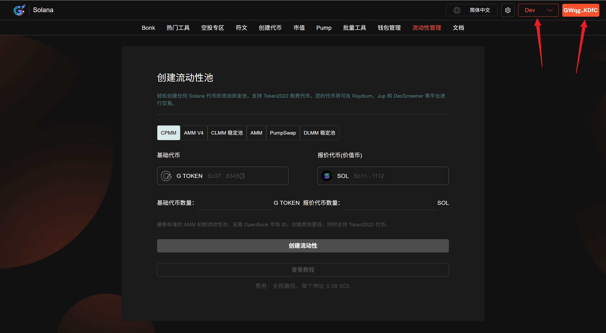
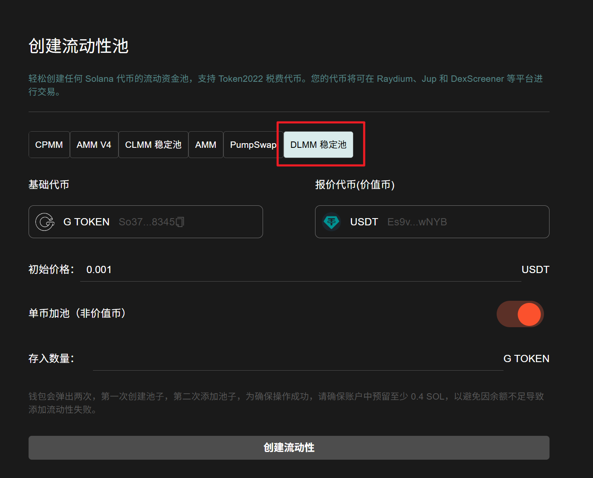
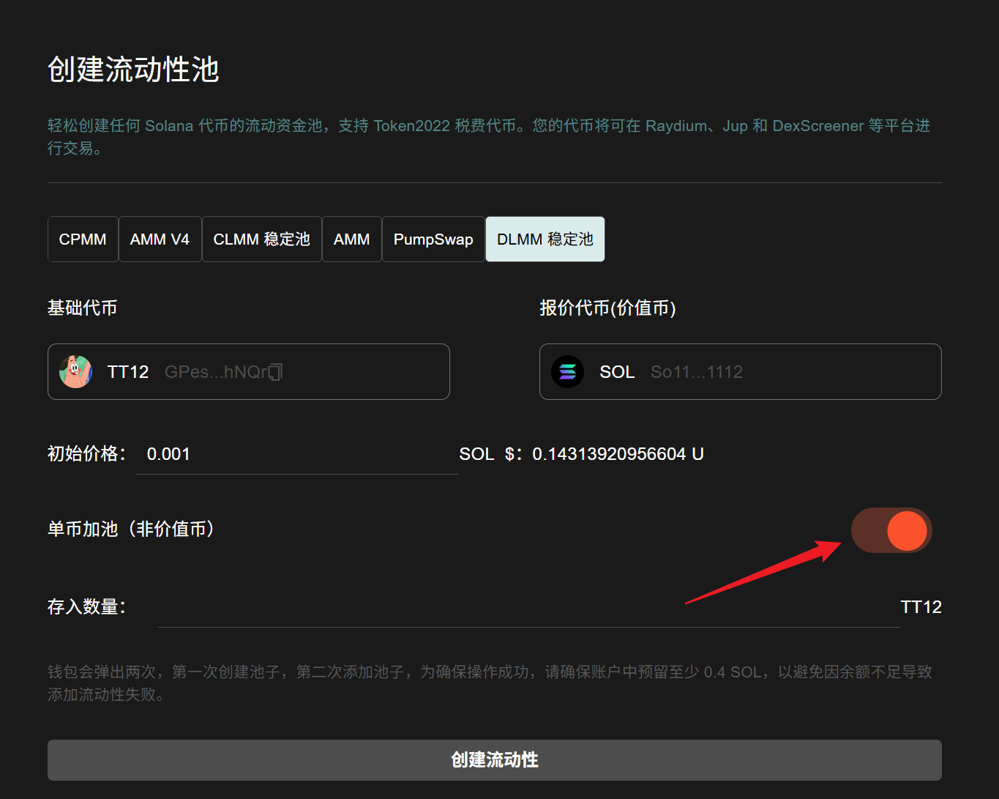
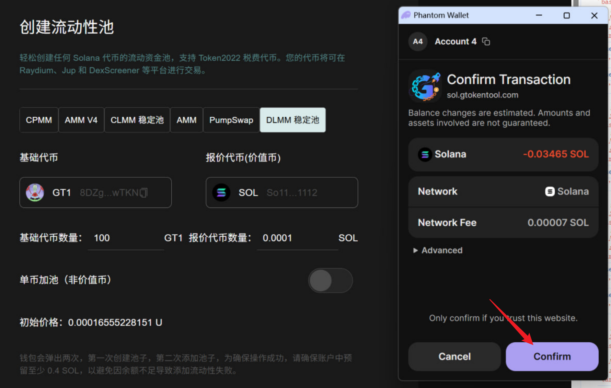
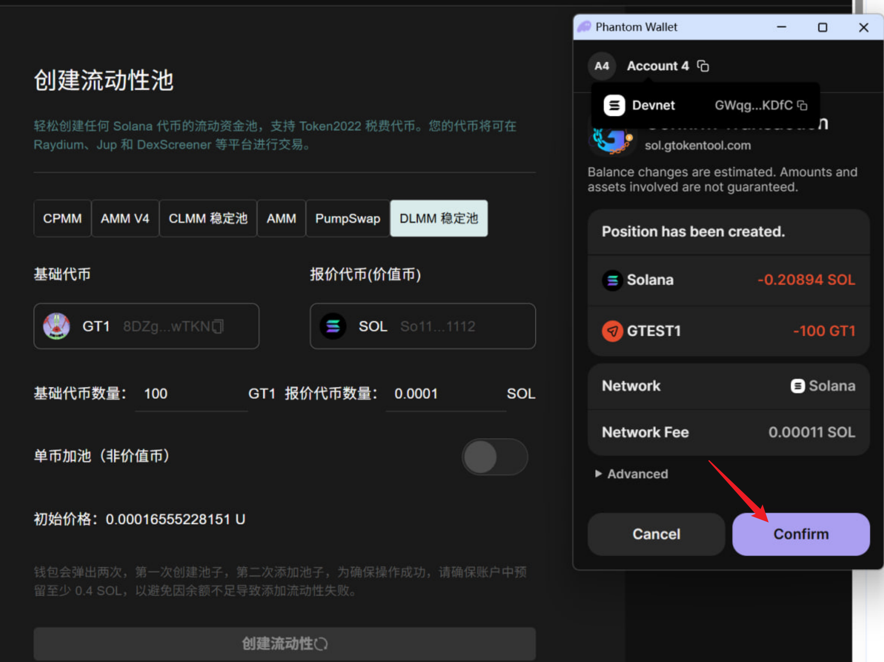
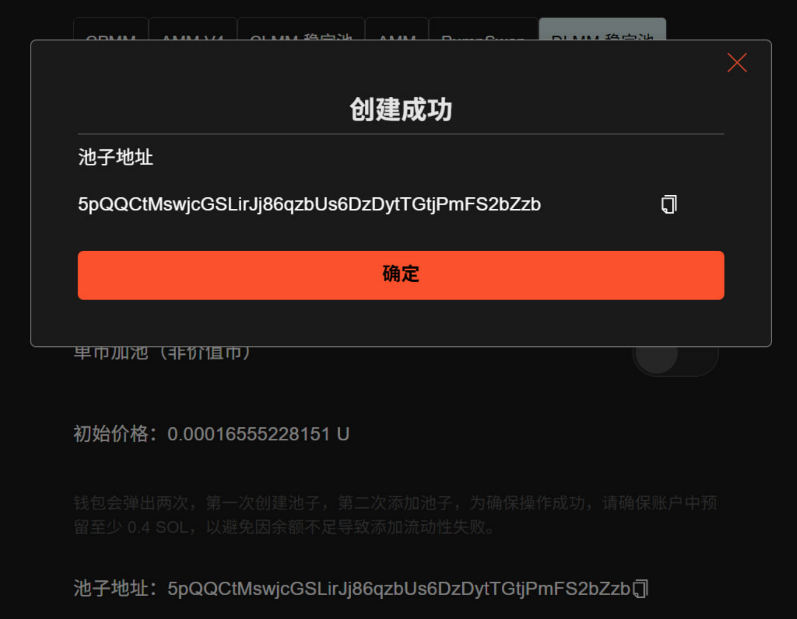
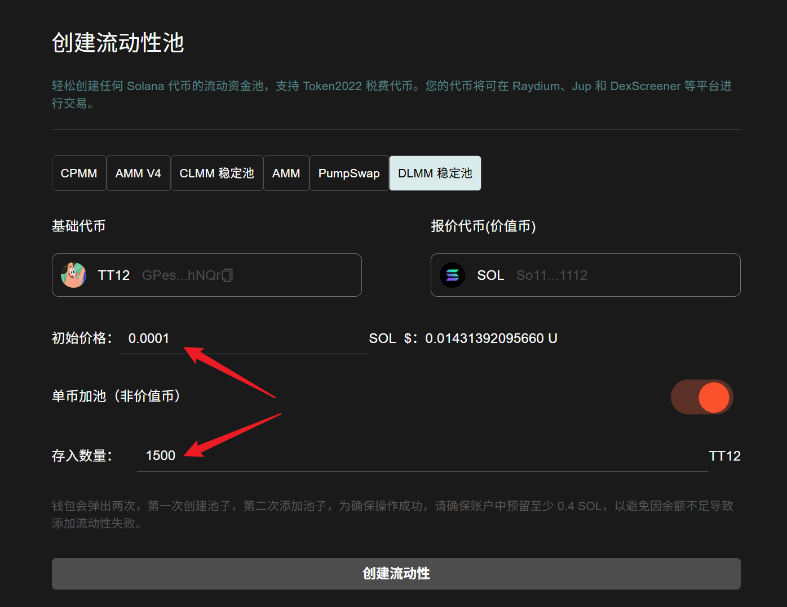
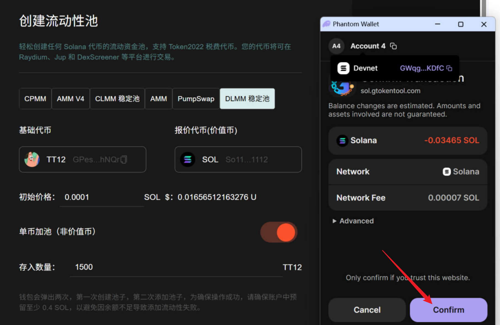
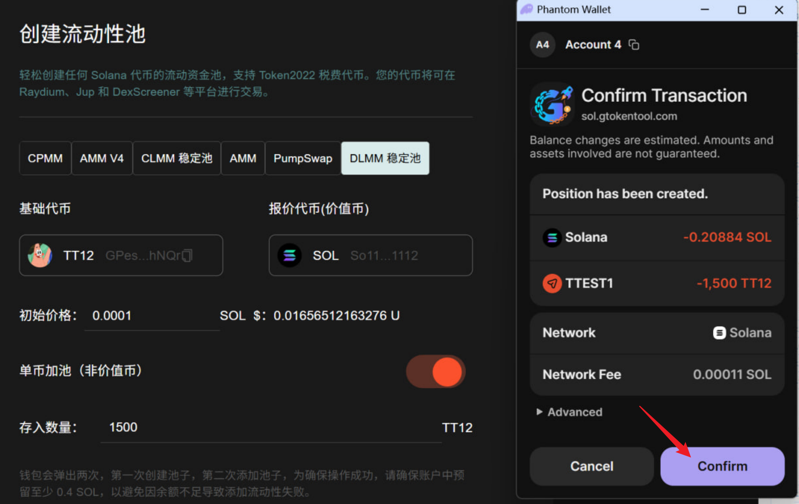
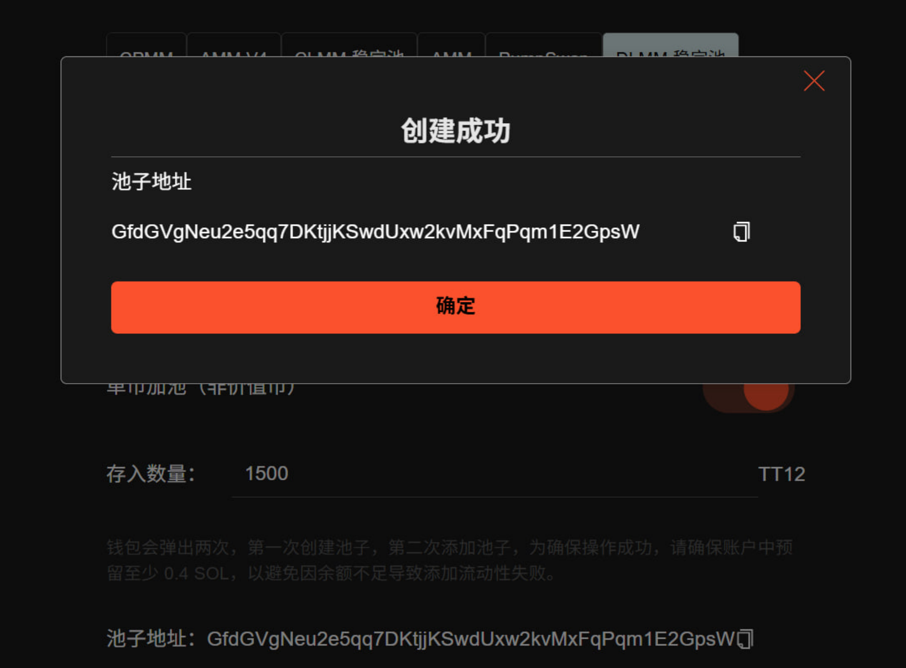

# Meteora DLMM 创建流动性教程

## Meteora DLMM 流动性池介绍

Meteora DLMM（Dynamic Liquidity Management Module）是 Solana 生态中基于动态流动性管理机制的去中心化交易协议，其流动性池设计旨在解决传统 AMM（如恒定乘积模型）中流动性利用率低、滑点高的问题，核心特点是通过**动态调整流动性分布**优化资本效率，尤其适合波动较大的加密资产交易场景。

## 准备事项

1. 一台电脑或者一部手机
2. Solana 钱包（[幻影钱包Phantom安装教程](https://docs.gtokentool.com/solana/auxiliary-tutorial/phantom-wallet-installation)）
3. 钱包最少准备 **0.24 SOL**
4. 要创建流动性池的代币

## Solana 创建 Meteora DLMM 池子教程

### 1. 连接钱包

进入 GTokenTool 创建流动性页面，右上角选择 Main 网络并连接钱包，这里用测试网演示。

创建流动性池： [https://sol.gtokentool.com/zh-CN/liquidityManagement/CreatePool](https://sol.gtokentool.com/zh-CN/liquidityManagement/CreatePool)

<figure><figcaption></figcaption></figure>

### 2. 选择池子 

GTokenTool 支持用户创建AMM池、 AMM V4 池、CPMM 池、 CLMM 稳定池、PumpSwap池和 DLMM 稳定池，我们在这里选择 DLMM 稳定池。

<figure><figcaption></figcaption></figure>

### 3. 选择要创建流动性池的交易对 

* **基础代币：**&#x586B;写您创建的还没有任何价值的代币。
* **报价代币：**&#x5177;有市场价值的代币，通常是 SOL 、 USDC 或 USDT。

<figure><figcaption></figcaption></figure>

### 4. 选择加池模式 

GTokenTool 为您提供了两种加池模式（默认为单币加池）：

* **双币加池：**&#x540C;时加入用户创建的代币和价值币。
* **单币加池：**&#x53EA;添加用户创建的代币。

<figure><figcaption></figcaption></figure>

### 5. 双币加池参数填写

* **初始价格：**&#x8BBE;置池子的初始价格。
* **存入数量：**&#x8BBE;置存入价值币（比如USDT）的数量，<mark style="color:purple;">系统会自动为你计算出需要存入的基础代币数量</mark>。如果弹出钱包爆红，可能是你的代币数量太少，可以减少存入数量再次尝试。
* **钱包预留余额估算：** 钱包余额需要大于（Meteora 官方收取 + 服务费用 0.23 SOL，入池数量，预留0.01 SOL）的总和。

<figure><figcaption></figcaption></figure>

### 6. 双币加池效果展示

参数填写好后，点击“`创建流动性`”。钱包会弹出两次，第一次创建池子，第二次添加池子，钱包弹出后，点击“`确认`”。

<figure><figcaption></figcaption></figure>

<figure><figcaption></figcaption></figure>

创建成功效果展示：

<figure><figcaption></figcaption></figure>

### 7. 单币加池参数填写

* **单币加池：**&#x6253;开单币加池开关。
* **初始价格：**&#x8BBE;置池子的初始价格。
* **存入数量：**&#x8BBE;置存入基础代币的数量，不需要存入价值币（比如USDT）。
* **钱包预留余额估算：**  钱包余额需要大于（Meteora 官方收取 + 服务费用 0.23 SOL，预留0.01 SOL）的总和。

<mark style="background-color:$warning;">**温馨提示：**</mark><mark style="background-color:$warning;">单币加池代币是无法卖出的，只能买入。如果你希望代币可以卖出，需要往池子里加入价值币才行，通过我们的</mark>[<mark style="background-color:$warning;">市值机器人</mark>](https://sol.gtokentool.com/zh-CN/market/jupMarket)<mark style="background-color:$warning;">买入一笔就行。</mark>

<figure><figcaption></figcaption></figure>

### 8. 单币加池效果展示

参数填写好后，点击“`创建流动性`”。钱包会弹出两次，第一次创建池子，第二次添加池子，钱包弹出后，点击“`确认`”。

<figure><figcaption></figcaption></figure>

<figure><figcaption></figcaption></figure>

创建成功效果展示：

<figure><figcaption></figcaption></figure>

[_**GTokenTool | 创建代币、批量空投和做市机器人等Solana工具集**_](https://sol.gtokentool.com/)

**安全、开源，给Solana用户带来最便利的一站式体验。**

GTokenTool社群:

Telegram：[**https://t.me/gtokentool**](https://t.me/gtokentool)

Twitter: [**https://x.com/gtokentool**](https://x.com/gtokentool)

Gitbook：[**https://docs.gtokentool.com/**](https://docs.gtokentool.com/)

Github：[**https://github.com/Gtokentool/docs/blob/master/SUMMARY.md**](https://github.com/Gtokentool/docs/blob/master/SUMMARY.md)

YouTube：[**https://www.youtube.com/@GTokenTool**](https://www.youtube.com/@GTokenTool)&#x20;

<mark style="color:purple;background-color:orange;">**GTokenTool**</mark>_<mark style="color:purple;background-color:orange;">保留随时全权酌情因任何理由修改、变更或取消此公告的权利，无需事先通知。以上信息内容仅供参考，GTokenTool对本平台上的任何虚拟资产、产品或促销活动不做任何推荐或保证。虚拟资产的价格波动很大，投资交易虚拟资产将面临巨大风险。请谨慎投资。</mark>_


