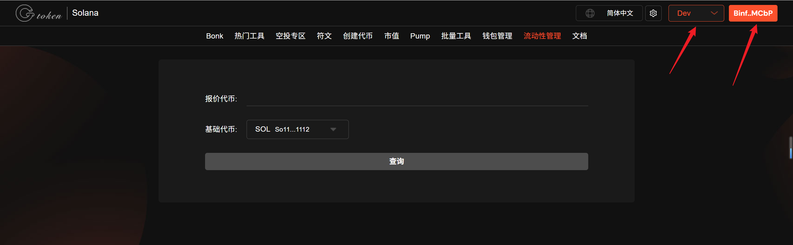
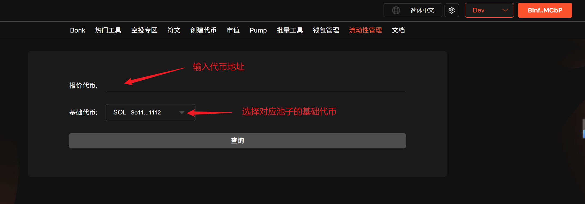
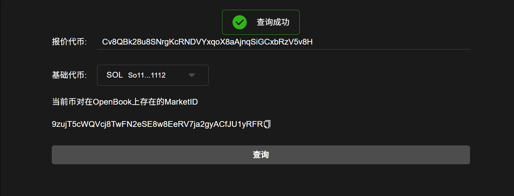

# 🔍 OpenBook Market ID查询教程

OpenBook Market ID 是 Solana 区块链上 OpenBook 去中心化交易所（DEX） 中某个特定交易市场的唯一标识符。它类似于传统市场中用于区分不同交易对的代码，帮助用户或开发者精准定位到某个交易对（如 SOL/USDC、BTC/USDT 等）的流动性池。

考虑到用户在[创建OpenBook Market ID](https://docs.gtokentool.com/solana/openbook-shi-chang-id-chuang-jian-jiao-cheng)时，没保存ID就关闭了页面，以至于后面不好找，所以，[GTokenTool](https://www.gtokentool.com)就开了这款工具来查询市场ID，下面是具体的使用步骤。

## OpenBook市场ID查询教程

OpenBook Market ID查询：[https://sol.gtokentool.com/zh-CN/liquidityManagement/searchId](https://sol.gtokentool.com/zh-CN/liquidityManagement/searchId)

### 1. 访问OpenBook市场ID查询

进入页面后，点击连接钱包，并选择 Main 网络节点，这里使用测试网演示。

<figure><figcaption></figcaption></figure>

### 2. 输入代币地址并选择对应的基础代币

<figure><figcaption></figcaption></figure>

### 3. 点击查询，等待几秒钟，就可以复制您的ID

<figure><figcaption></figcaption></figure>


不管你是在GTokenTool生成的ID，还是在其他平台创建的市场ID，都可以通过这个工具查询。


[_**GTokenTool | 创建代币、批量空投和做市机器人等Solana工具集**_](https://sol.gtokentool.com/)

**安全、开源，给Solana用户带来最便利的一站式体验。**

GTokenTool社群:

Telegram：[**https://t.me/gtokentool**](https://t.me/gtokentool)

Twitter: [**https://x.com/gtokentool**](https://x.com/gtokentool)

Gitbook：[**https://docs.gtokentool.com/**](https://docs.gtokentool.com/)

Github：[**https://github.com/Gtokentool/docs/blob/master/SUMMARY.md**](https://github.com/Gtokentool/docs/blob/master/SUMMARY.md)

YouTube：[**https://www.youtube.com/@GTokenTool**](https://www.youtube.com/@GTokenTool)&#x20;

<mark style="color:purple;background-color:orange;">**GTokenTool**</mark>_<mark style="color:purple;background-color:orange;">保留随时全权酌情因任何理由修改、变更或取消此公告的权利，无需事先通知。以上信息内容仅供参考，GTokenTool对本平台上的任何虚拟资产、产品或促销活动不做任何推荐或保证。虚拟资产的价格波动很大，投资交易虚拟资产将面临巨大风险。请谨慎投资。</mark>_
