# OpenBook市场ID创建教程

## OpenBook市场ID创建视频演示



Raydium上线代币市场之前，需要创建OpenBook Market ID，但是Raydium官方提供的链接创建需要花费 3-4 SOL。这成本使得我们对Solana发行代币望而却步。

基于这个需求，GTokenTool开发出了低成本创建市场ID的工具，成本全网最低。

## 什么是 OpenBook Market ID？


OpenBook Market ID 是 OpenBook 平台上交易对的唯一标识符，它是 Solana 去中心化订单簿协议的重要组成部分。每个 Market ID 都是特定代币对（例如 SOL/USDC 或自定义代币与 SOL 的配对）的参考点，关联所有交易、订单和流动性。

## 为什么需要 OpenBook Market ID？

1. **启用交易**

没有 Market ID，您的代币无法与其他资产配对，在 OpenBook 支持的平台上进行交易。

2. **流动性池**

Market ID 允许您创建流动性池，主要是在 RaydiumV4 的池子创建流动性，这是代币价格发现和用户参与的关键。

3. **提升可见性**

创建 Market ID 后，您的代币对可以在 Solana 区块链浏览器和 DEX 上被追踪，从而提供更高的透明度和可访问性。

## ID成本为什么不一样？

OpenBook 市场ID的价格，取决于多种参数，包括事件队列长度、请求队列长度、Orderbook队列长度等。你可以不需要理解这些词汇，但需要知道的是：ID创建价格越高，你的代币交易就丝滑，越不容易出问题。

当你通过Raydium创建ID时，它会自动帮助你设置最佳的条件参数。但是通过GTokenTool的工具进行ID创建，我们会给予你多种参数选择，以便你可以降低自己的ID创建费用。

这些参数影响，可能集中在：多笔交易同时发生时可能产生的拥堵问题、代币价格波动较大时造成的滑点异常等等，这些因素就会导致一些用户在交易时出现失败的情况。

但总的来看，市值低于500,000 美元的代币，应该没什么问题。如果你希望自己的项目可以长期发展，我们鼓励你选择最好的ID配置。

## 准备事项

1.准备设备，一台电脑或手机

2.Solana 钱包（[幻影钱包Phantom安装教程](https://docs.gtokentool.com/solana/auxiliary-tutorial/phantom-wallet-installation)）

3.钱包内最少准备0.55个SOL

4.要创建OpenBook市场ID的代币

5.准备好翻墙软件（VPN/加速器），保证网络通畅

## OpenBook市场ID创建步骤

### 1. 连接钱包

进入代币列表页面（[https://sol.gtokentool.com/zh-CN/Token/management](https://sol.gtokentool.com/zh-CN/Token/management)），并且连接好钱包，选择 Main 网络节点，这里使用测试网演示。

<figure>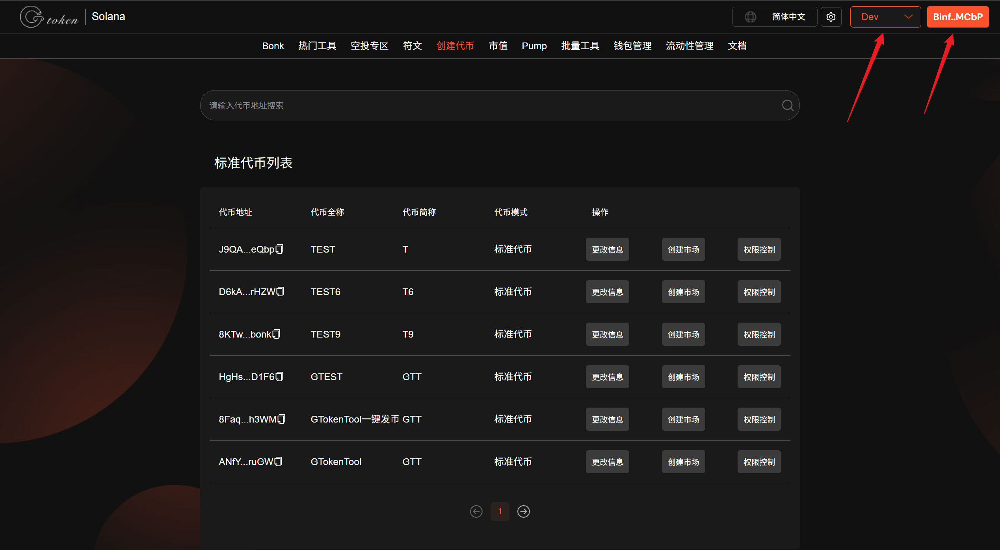<figcaption></figcaption></figure>

### 2. 选择要创建市场ID的代币

选择你要创建市场ID的代币，点击“`创建市场`”进入创建市场ID页面。也可以从`流动性管理`进入创建市场ID页面。

<figure>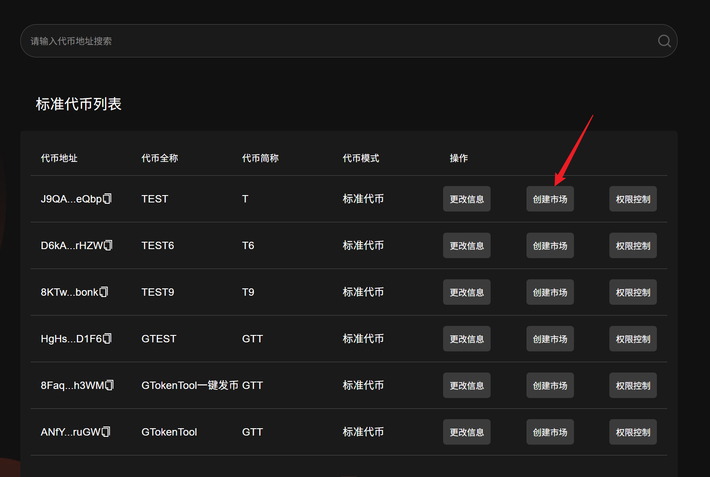<figcaption></figcaption></figure>

从`管理代币`页面进入`创建市场ID`页面会自动填写目标代币地址，若从`流动性管理`进入[创建市场ID](https://sol.gtokentool.com/zh-CN/liquidityManagement/createMarket)页面需要自行填写目标代币地址。

<figure>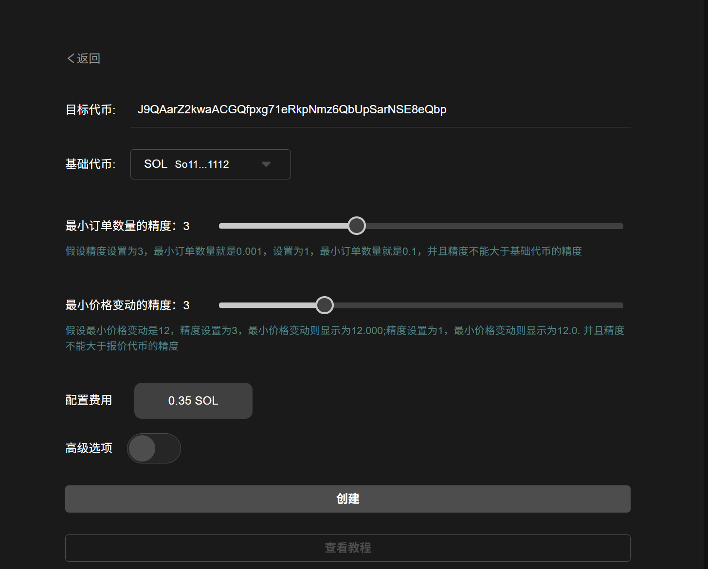<figcaption></figcaption></figure>

### 3. 选择需要的基础代币

<figure>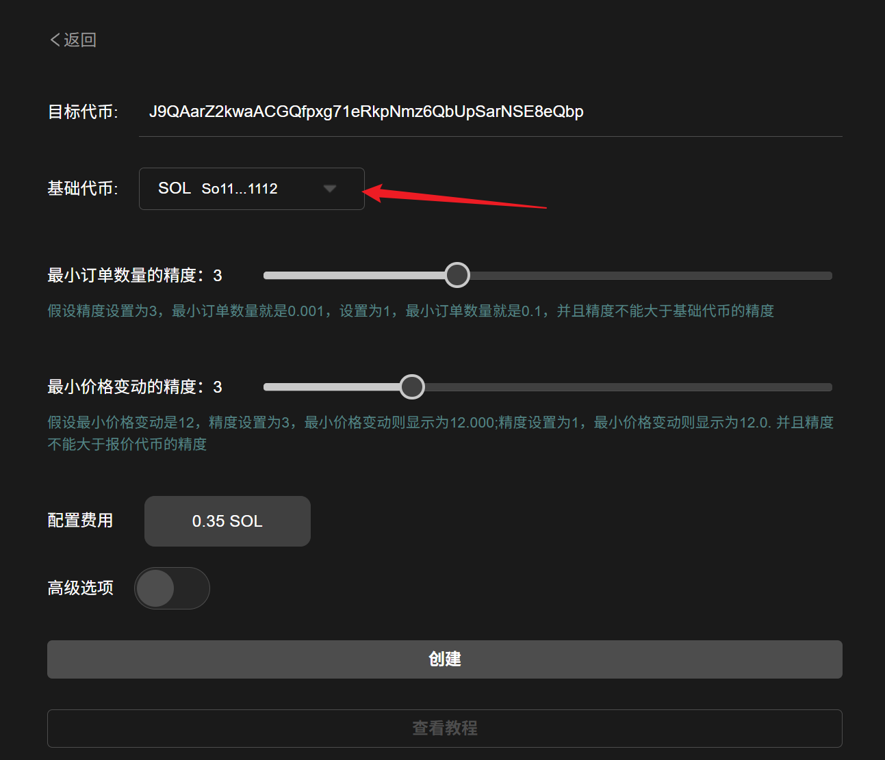<figcaption></figcaption></figure>

### 4. 设置最小订单数量和最小价格变动的精度

<figure>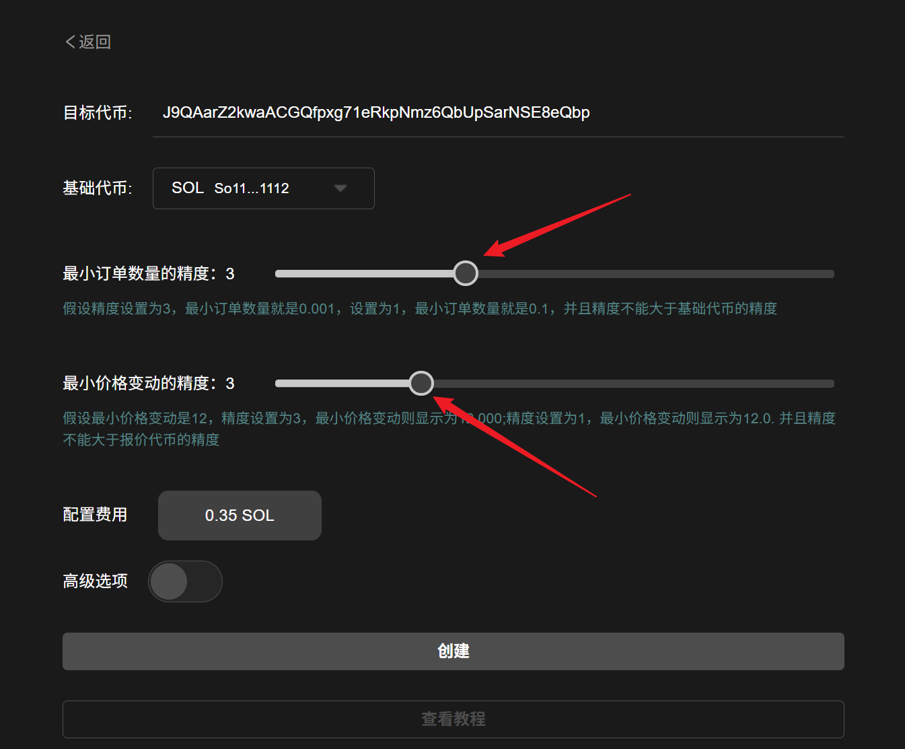<figcaption></figcaption></figure>

**最小订单数量的精度：**&#x8BA2;单簿中的`最小订单数量精度`。假如填2，那最小交易量就是0.01。假如填4，最小交易量就是0.0001。以此类推，这个事实上是精度小数位。

**最小价格变动的精度：**&#x6700;小价格显示/变动的`小数位数`。假如填3，代币价格以3位小数显示，如11.123。假如填5，最小代币价格以5位小数显示，如11.12345。


**提示：**

最小订单数量的精度**不能大于**基础代币的小数位数，即：如果你的币精度是5，这里只能填1\~5，注意自己的代币精度。

最小价格变动的精度**不能大于**报价代币的小数位数，即：Sol的精度是9，你可以填1\~9。但是USDC的精度是6，你就只能填1\~6，注意报价代币的精度。


<mark style="background-color:blue;">**“最小订单数量的精度”+“最小价格变动的精度”不能大于报价代币的小数位数：**</mark><mark style="background-color:blue;">即，两个数字相加最大不能超过9。</mark>

最小订单数量的精度和最小价格变动的精度可以根据代币供应量来配置，下面是建议值：

| 代币供应量 | 最小订单数量的精度 |   最小价格变动的精度  |
| :---: | :-------: | :----------: |
|  100K |    0.01   |    0.0001    |
|   1M  |    0.1    |    0.00001   |
|  10M  |     1     |   0.000001   |
|  100M |     10    |   0.0000001  |
|   1B  |    100    |  0.00000001  |
|  10B  |    1000   |  0.000000001 |
|  100B |   10000   | 0.0000000001 |

### 5. 设置配置参数

有默认的费用的配置，也可以点击配置详情自己配置，但新手不建议进行此操作，以防出现不可预知的问题。

<figure>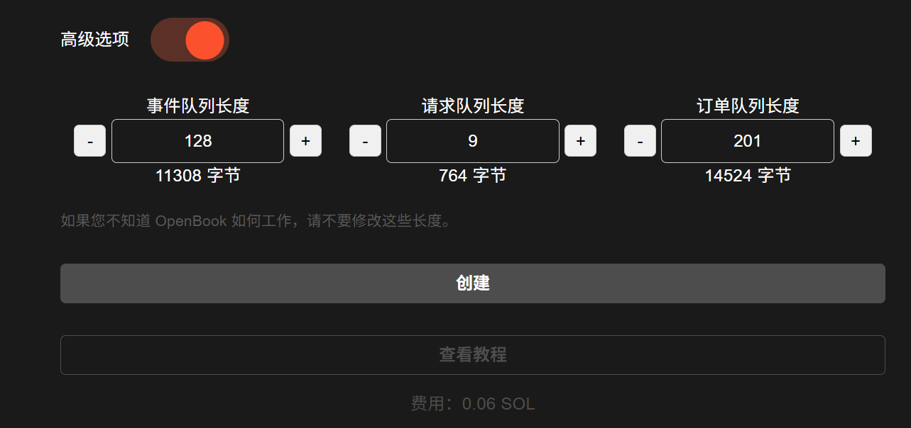<figcaption></figcaption></figure>

以下是针对您的市场ID的不同价格指定的输入：

|    #   | 0.29 SOL | 1.4 SOL | 2.7 SOL |
| :----: | :------: | :-----: | :-----: |
| 事件队列长度 |    128   |   1400  |   2978  |
| 请求队列长度 |     9    |    63   |    63   |
| 订单队列长度 |    201   |   450   |   909   |

### 6. 点击“创建”

填写完所有参数后，就可以创建市场ID了。创建ID需要钱包确认两次，第一次是创建代币账户，第二次是创建市场ID，所以大家记得点击第一步之后，不要立即关闭页面。

当我们点击“`创建`”时，钱包会第一次弹出。

<figure>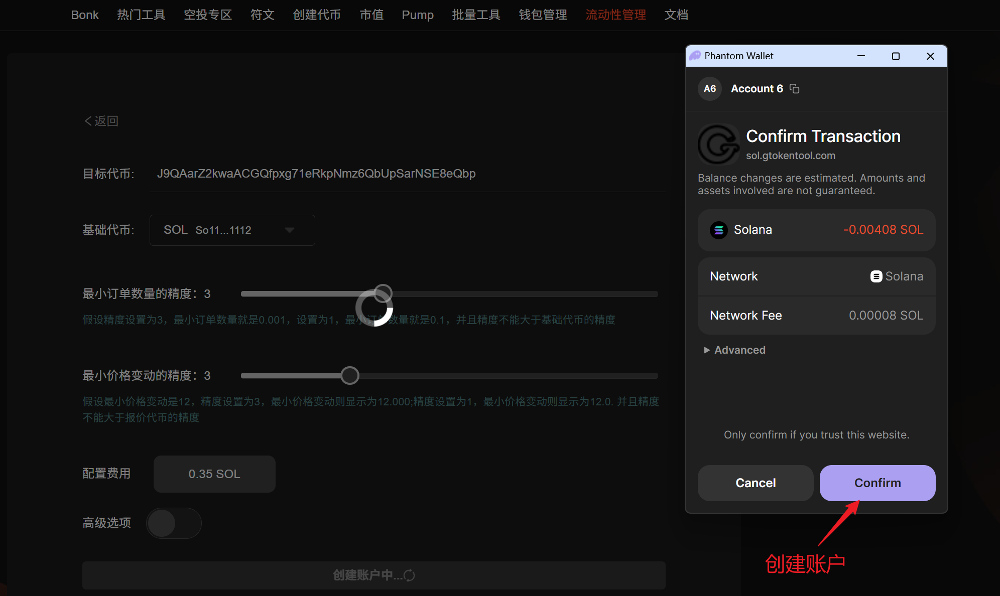<figcaption></figcaption></figure>

<figure>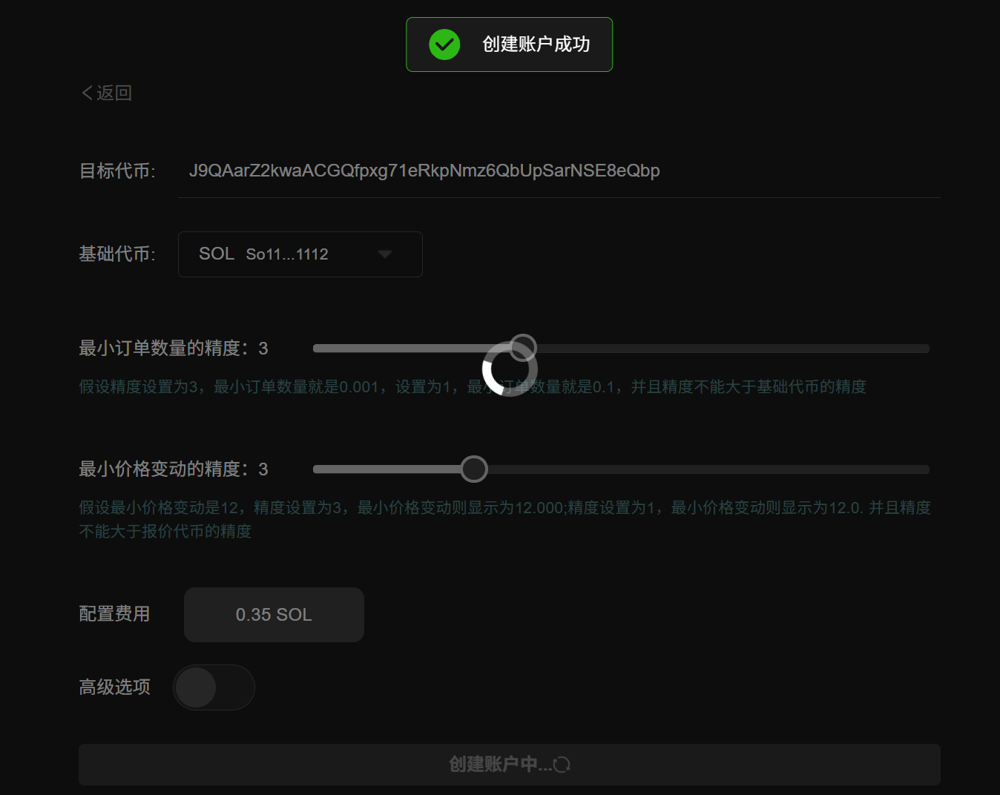<figcaption></figcaption></figure>

点击“`Confirm`"后，钱包会第二次弹出。

<figure>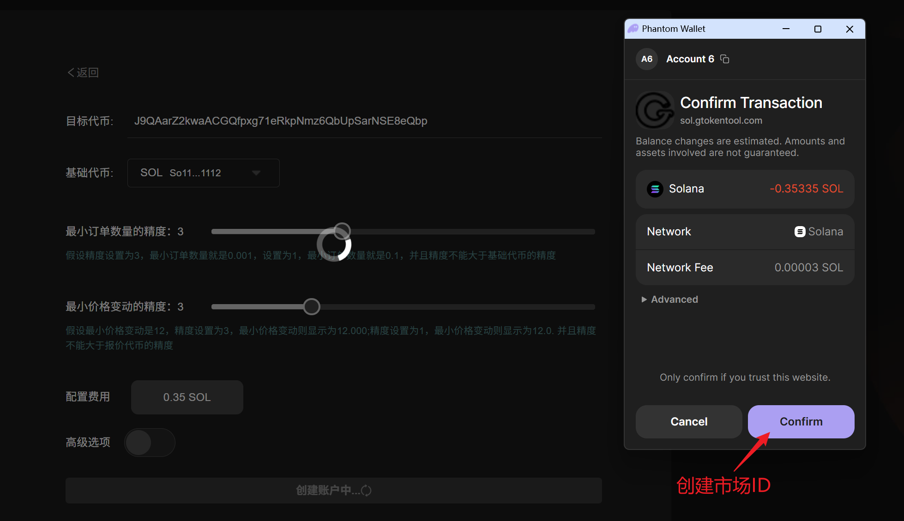<figcaption></figcaption></figure>

之后等待几秒钟后ID就会创建成功。

<figure>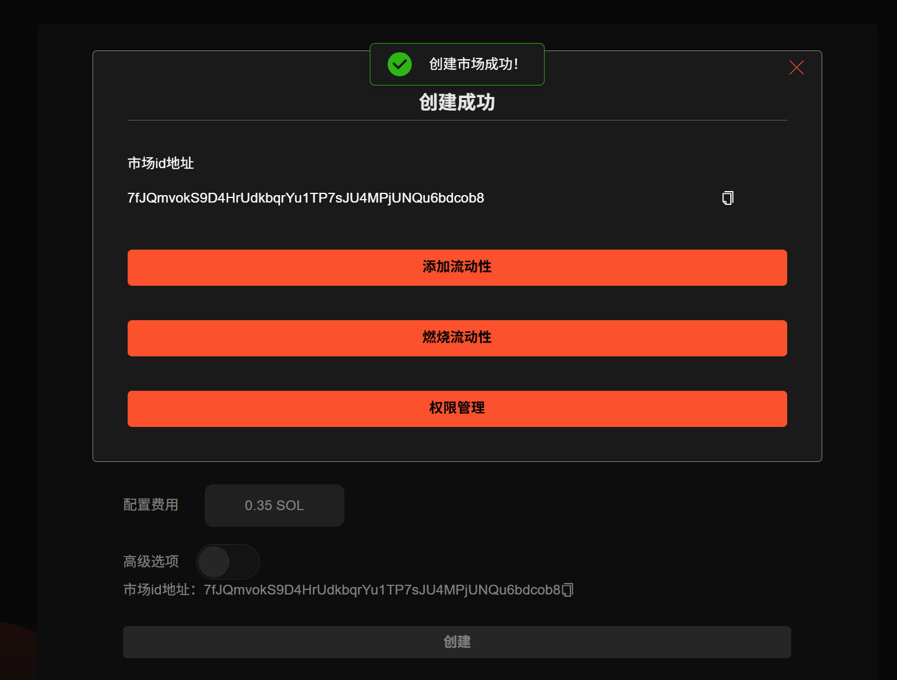<figcaption></figcaption></figure>

之后可以将ID复制下来，去Raydium加池子了。

如果没有保存ID, 可以在[Solscan浏览器](https://solscan.io/)的交易记录里查到，在哈希详情里就能看到自己的ID。

<figure>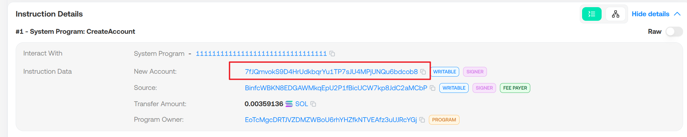<figcaption></figcaption></figure>

也可以通过我们的[查询市场ID](https://sol.gtokentool.com/zh-CN/liquidityManagement/searchId)功能查询。

## 常见问题 

### 1. 在GTokenTool上创建OpenBook ID安全吗？

GTokenTool每月有数千名活跃用户。此外，虽然该工具创建了您的市场 ID，但它无法访问任何内容。也就是说，它只负责调用协议来创建 OpenBook Market。 此外，该工具从不要求访问我们钱包内的私钥、NFT 或代币。换句话说，我们所有的资产都将是安全的。

### 2. 创建成功的OpenBook ID没有及时保存怎么办？

如果创建成功了，创建好的市场ID信息都在链上，如果页面没有及时保存市场ID，可以使用其[查询市场ID](https://sol.gtokentool.com/zh-CN/liquidityManagement/searchId)功能。[OpenBook ID查询教程-->>](https://docs.gtokentool.com/solana/liu-dong-xing-guan-li/openbook-market-id-cha-xun-jiao-cheng)

### 3. Raydium加池子创建为什么需要OpenBook Market ID？

为了提高流动性的利用率，Raydium的AMM与OpenBook市场整合，OpenBook订单簿可以共享AMM的资金池和做市商的流动性。任何OpenBook GUI上的用户都可以根据Raydium AMM的流动性进行交易。因此，当在Raydium上创建一个新的流动性池时，用户或项目将首先需要创建并提供一个OpenBook市场ID。

### 4. 创建OpenBook ID 的 3-4 SOL的花费在哪些地方？

当创建一个新的OpenBook时，需要在Solana链上创建事件队列、请求队列、买卖订单队列，这些队列都是一个单独的Solana PDA账户，由于Solana的经济模型规定，创建账户空间需要支付一定的SOL代币作为租金使用，所以需要为这些队列支付昂贵的租金。

### 5. 如何减少更多的空间支出？

可以通过改变事件队列长度来减少费用支出，按照OpenBook官方合约的最小要求，可以减少对列长度，租金最低可降到0.3 SOL左右。

### 6. 使用减少的队列有什么影响？

使用比平常低 5 倍价格创建 OpenBook Market 是很棒的事情。但是需要考虑风险问题，如果你的项目是一个长期并且交易量很大的项目，不建议节省 3 SOL 的开支，如果你打算创建一个短期的，市值不超过 100 万美元的meme项目，或者仅用来做一些测试，那么使用低成本方案完全没有问题 。

[_**GTokenTool | 创建代币、批量空投和做市机器人等Solana工具集**_](https://sol.gtokentool.com)

**安全、开源，给Solana用户带来最便利的一站式体验。**

GTokenTool社群:

Telegram：[**https://t.me/gtokentool**](https://t.me/gtokentool)

Twitter:  [**https://x.com/gtokentool**](https://x.com/gtokentool)

Gitbook：[**https://docs.gtokentool.com/**](https://docs.gtokentool.com/)

Github：[**https://github.com/Gtokentool/docs/blob/master/SUMMARY.md**](https://github.com/Gtokentool/docs/blob/master/SUMMARY.md)

YouTube：[**https://www.youtube.com/@GTokenTool**](https://www.youtube.com/@GTokenTool)\
\
\
<mark style="color:purple;background-color:orange;">**GTokenTool**</mark>_<mark style="color:purple;background-color:orange;">保留随时全权酌情因任何理由修改、变更或取消此公告的权利，无需事先通知。以上信息内容仅供参考，GTokenTool对本平台上的任何虚拟资产、产品或促销活动不做任何推荐或保证。虚拟资产的价格波动很大，投资交易虚拟资产将面临巨大风险。请谨慎投资。</mark>_
