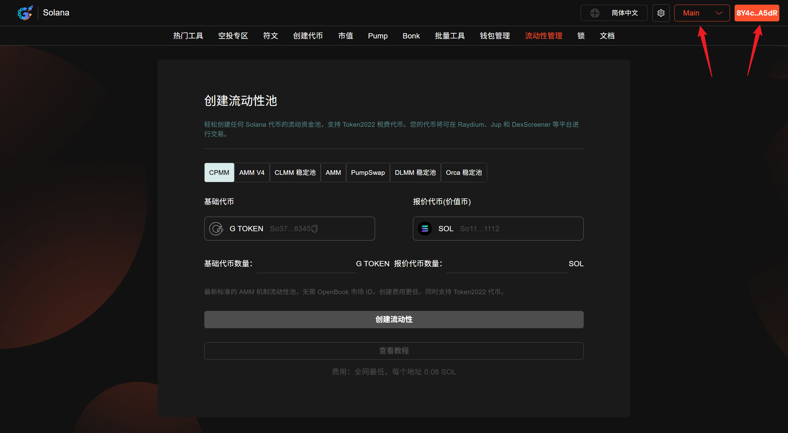
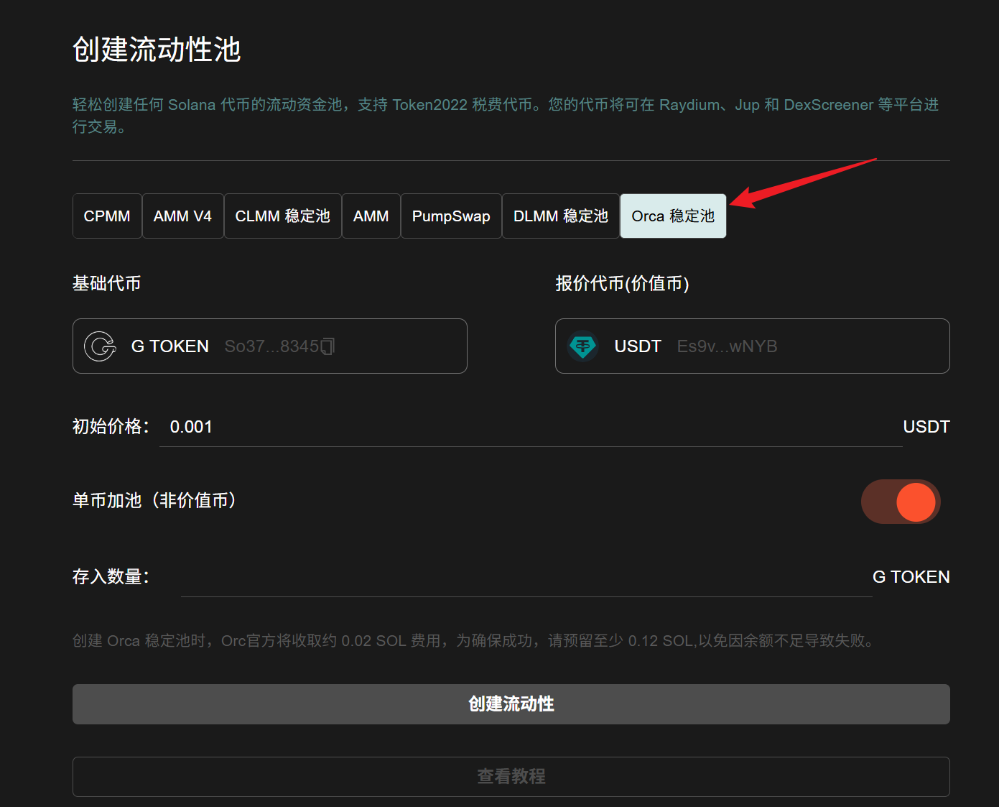
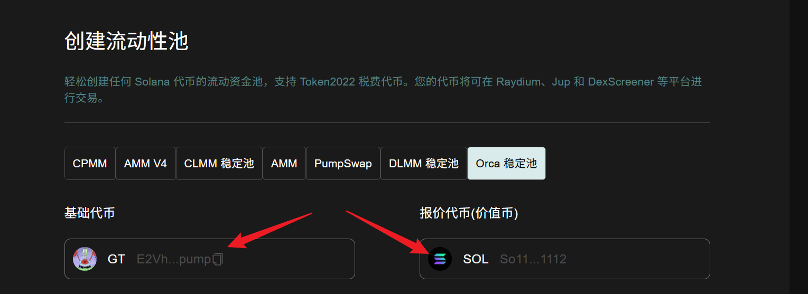
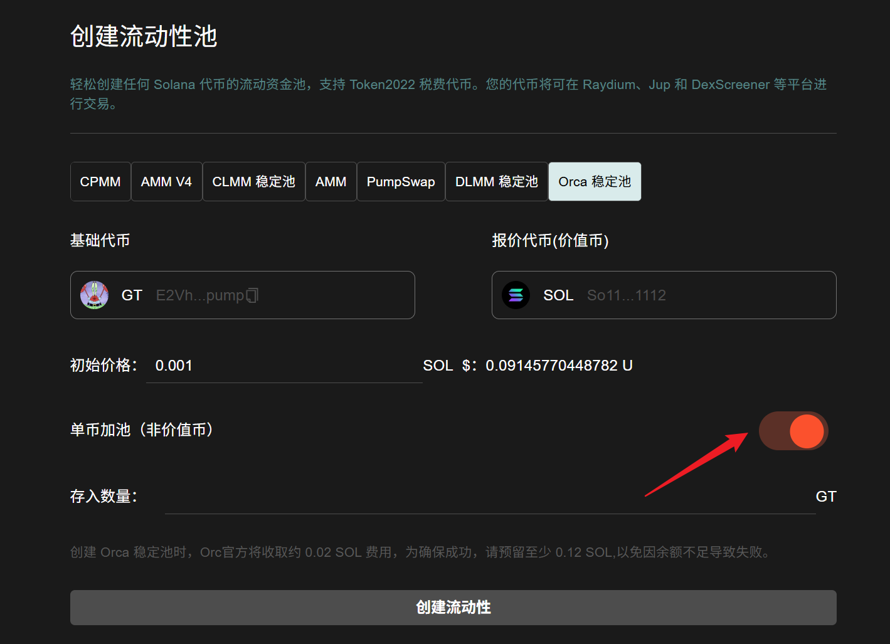
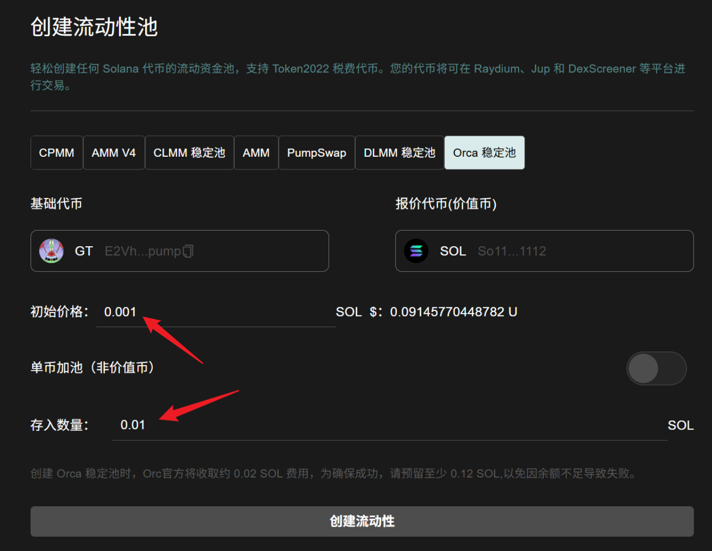
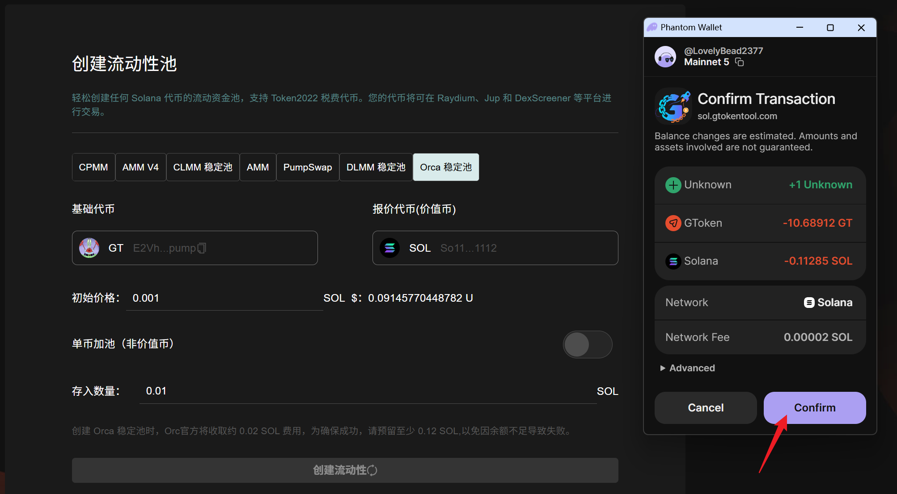
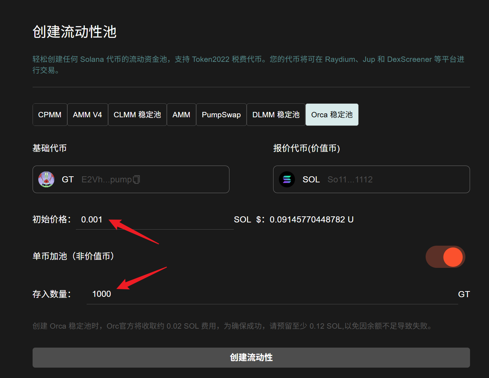
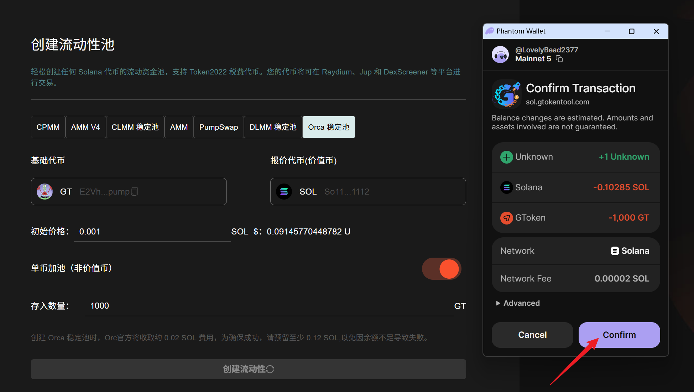

# Orca 创建稳定池教程

## Orca 稳定池介绍

Orca 稳定池（Stable Pool）是 Solana 链上 DEX Orca 专为**稳定币对**设计的低滑点、低费率、高资本效率的流动性池，主打 USDC/USDT 等锚定 1:1 资产的交易与做市。

## 📌 核心摘要

* **功能定位：**&#x53;olana 生态头部 DEX **Orca** 的专用**稳定资产做市引擎**。旨在为 USDC/USDT 等锚定比例为 1:1 的资产提供极致的交易深度与定价稳定性。
* **技术特性：**
  * **集中流动性优化：**&#x91C7;用针对稳定币对优化的算法，将流动性高度集中在 1.0 价格附近，实现远超普通 AMM 的资金利用率。
  * **极低滑点架构：**&#x4E13;为大额稳定资产交换设计，通过精密的数学模型最小化价格偏差，保障用户获得最优成交价。
  * **低费率激励模型：**&#x63D0;供更具竞争力的交易手续费结构，在吸引成交量的同时，为流动性提供者（LP）创造可持续的低风险收益。
* **应用价值：**&#x4F5C;为 Solana 链上**大额资金对冲与转换的核心枢纽**，该工具通过构建高密度的稳定池，有效降低了生态内的跨资产交易成本，是项目方维护代币价格锚定的关键基础设施。
* **目标受众：**&#x9700;进行大规模稳定币转换的机构与个人、寻求低风险稳定收益的做市商，以及需部署 1:1 锚定资产交易对的项目团队。

## 准备事项

1. 一台电脑或者一部手机
2. Solana 钱包（[幻影钱包Phantom安装教程](https://docs.gtokentool.com/solana/auxiliary-tutorial/phantom-wallet-installation)）
3. 钱包最少准备 **0.12 SOL**
4. 要创建流动性池的代币

## Solana 创建 Orca 稳定池教程

### 1. 连接钱包

进入 GTokenTool 创建流动性页面，右上角选择 Main 网络并连接钱包。

创建流动性池： [https://sol.gtokentool.com/zh-CN/liquidityManagement/CreatePool](https://sol.gtokentool.com/zh-CN/liquidityManagement/CreatePool)

<figure><figcaption>
连接钱包并选择Main网络
</figcaption></figure>

### 2. 选择池子类型 

GTokenTool 支持用户创建AMM池、 AMM V4 池、CPMM 池、 CLMM 稳定池、PumpSwap池、 DLMM 稳定池和 Orca 稳定池，我们在这里选择 Orca 稳定池。

<figure><figcaption>
选择池子类型
</figcaption></figure>

### 3. 选择要创建流动性池的交易对 

* **基础代币：**&#x586B;写您创建的还没有任何价值的代币。
* **报价代币：**&#x5177;有市场价值的代币，通常是 SOL 、 USDC 、 USDT或 USD1。

<figure><figcaption>
选择交易对
</figcaption></figure>

### 4. 选择加池模式 

GTokenTool 为您提供了两种加池模式（默认为单币加池）：

* **双币加池：**&#x540C;时加入用户创建的代币和价值币。
* **单币加池：**&#x53EA;添加用户创建的代币。

<figure><figcaption>
选择加池模式
</figcaption></figure>

### 5. 双币加池参数填写

* **初始价格：**&#x8BBE;置池子的初始价格。
* **存入数量：**&#x8BBE;置存入价值币（比如SOL）的数量，<mark style="color:purple;">系统会自动为你计算出需要存入的基础代币数量</mark>。如果弹出钱包爆红，可能是你的代币数量太少，可以减少存入数量再次尝试。
* **钱包预留余额估算：** 钱包余额需要大于（Orca 官方收取0.02 SOL + 服务费用0.08 SOL，入池数量，预留0.01 SOL）的总和。

<figure><figcaption>
双币加池参数填写
</figcaption></figure>

### 6. 双币加池效果展示

参数填写好后，点击“`创建流动性`”。钱包弹出后，点击“`确认`”。

<figure><figcaption>
钱包确认
</figcaption></figure>

### 7. 单币加池参数填写

* **单币加池：**&#x6253;开单币加池开关。
* **初始价格：**&#x8BBE;置池子的初始价格。
* **存入数量：**&#x8BBE;置存入基础代币的数量，不需要存入价值币（比如SOL）。
* **钱包预留余额估算：**  钱包余额需要大于（Orca 官方收取0.02 SOL + 服务费用0.08 SOL，预留0.01 SOL）的总和。

<mark style="background-color:$warning;">**温馨提示：**</mark><mark style="background-color:$warning;">单币加池代币是无法卖出的，只能买入。如果你希望代币可以卖出，需要往池子里加入价值币才行，通过我们的</mark>[<mark style="background-color:$warning;">市值机器人</mark>](https://sol.gtokentool.com/zh-CN/market/jupMarket)<mark style="background-color:$warning;">买入一笔就行。</mark>

<figure><figcaption>
单币加池参数填写
</figcaption></figure>

### 8. 单币加池效果展示

参数填写好后，点击“`创建流动性`”。钱包弹出后，点击“`确认`”。

<figure><figcaption>
钱包确认
</figcaption></figure>

## ❓常见问题 FAQ

### Q: 什么是 Orca 稳定池？

**A:** 专为**稳定币 / 低波动币对**（如 USDC/USDT、代币 / 稳定币）设计的**低费率、低滑点**池。

### Q: 支持单币加池吗？

**A:** ✅ **支持单币**（仅存自己的代币），也支持双币。

### Q: 要设置价格区间吗？

**A:** ❌ **不用手动选区间**，填**初始价格 + 数量**即可。

### Q: 无常损失大吗？

**A:** **极小**（适合 1:1 锚定资产）。

### Q: 能锁流动性吗？

**A:** ✅ 支持**永久锁仓**，锁仓仍拿手续费。

### 🤝 连接 GTokenTool 

* **💬 Telegram社群**：[点击加入官方群组](https://t.me/gtokentool)
* **🐦 Twitter (X)**：[关注我们获取最新动态](https://x.com/gtokentool)
* **📚 官方文档**：[查看 Gitbook 文档](https://docs.gtokentool.com/)
* **💻 开源代码**：[访问 GitHub 仓库](https://github.com/Gtokentool/docs/blob/master/SUMMARY.md)
* **📺 视频教程**：[订阅 YouTube 频道](https://www.youtube.com/@GTokenTool)

> ⚠️ 风险提示与免责声明
>
> GTokenTool 保留随时全权酌情因任何理由修改、变更或取消此公告的权利，无需事先通知。
>
> 以上信息内容仅供参考，GTokenTool 对本平台上的任何虚拟资产、产品或促销活动不做任何推荐或保证。虚拟资产的价格波动很大，投资交易虚拟资产将面临巨大风险。**请谨慎投资。**


