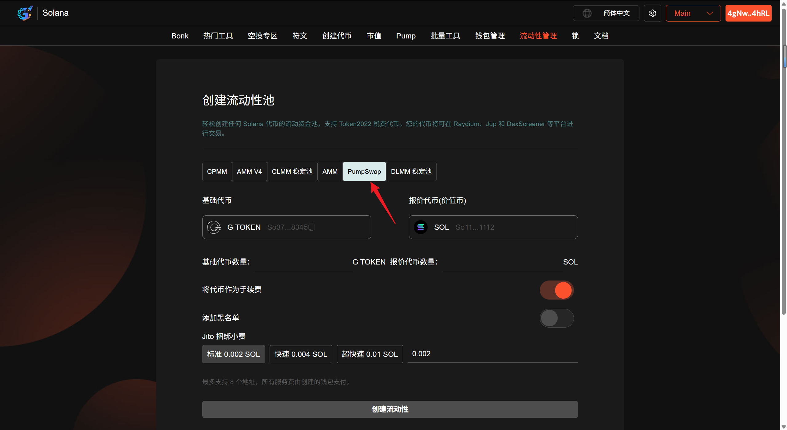
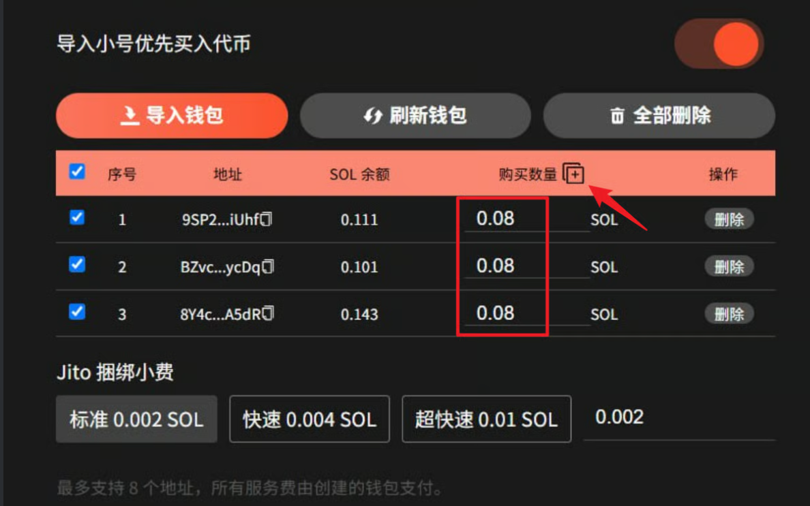
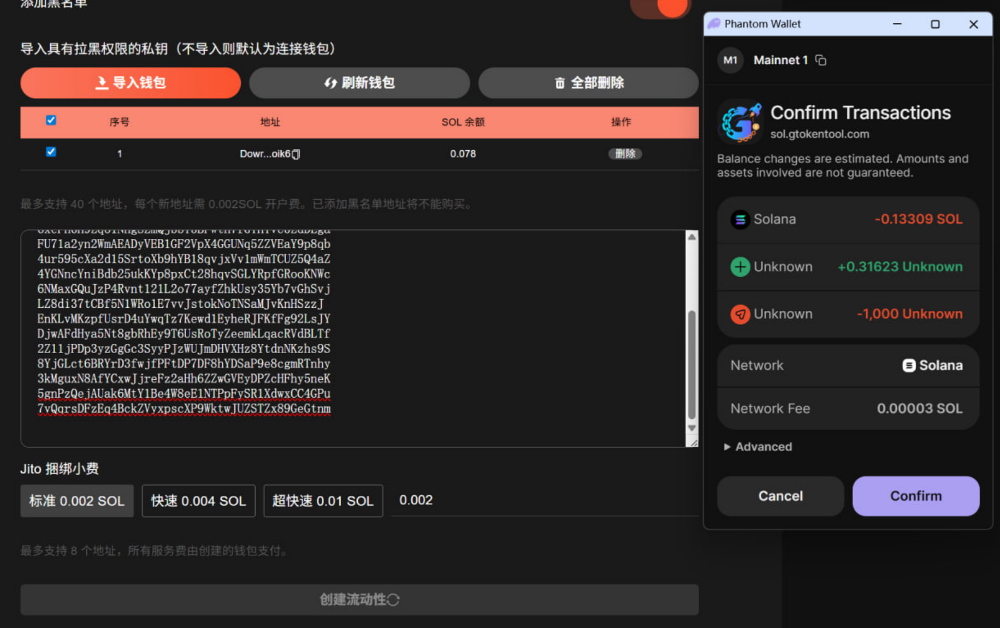
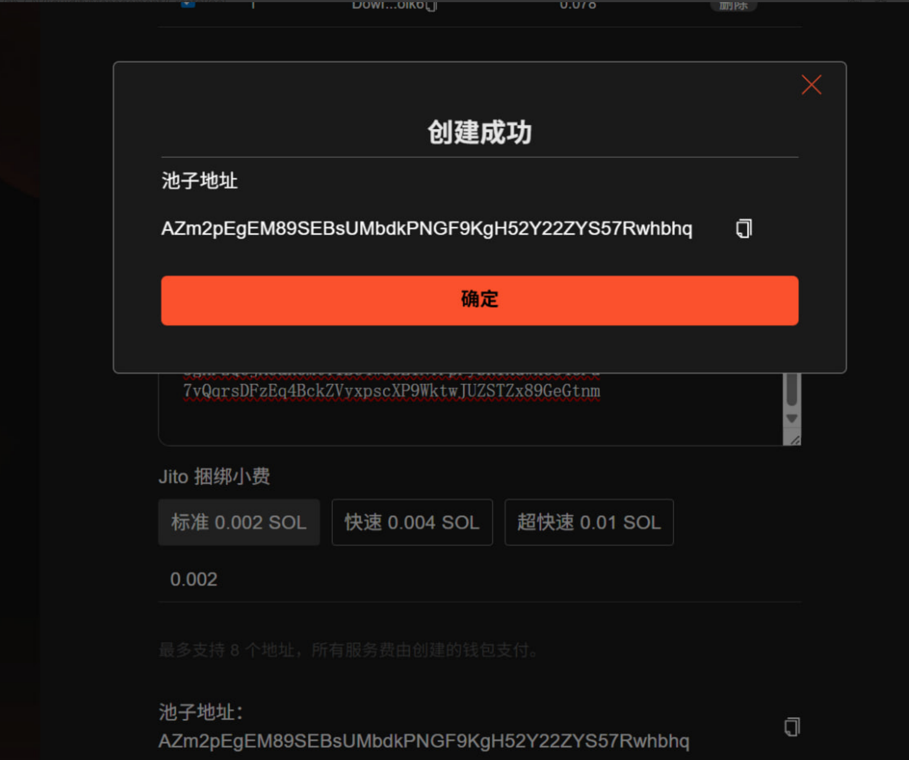

# PumpSwap 创建流动性并买入教程

## 📌 核心摘要

* **功能定位：**&#x53;olana 生态中专为 **PumpSwap** 协议设计的**启动级流动性配置方案**。支持项目方在注入流动性的同时自动执行买入操作，实现流动性部署与初始持仓的同步完成。
* **技术特性：**
  * **原子化复合交易：**&#x5C06;“添加流动性（Add Liquidity）”与“资产买入（Swap/Buy）”整合为单一链上交互，显著提升部署效率并确保操作的同步性。
  * **自动化做市初始化：**&#x57FA;于 AMM 模式，自动计算代币与 SOL 的初始比例，快速激活资产在 PumpSwap 上的价格发现功能。
  * **极致交互体验：**&#x901A;过可视化界面简化复杂的智能合约调用，支持自定义买入数额，有效助力项目在上线初期的价值对齐。
* **应用价值：**&#x6781;大缩短了项目上线后的操作链路，防止第三方套利者抢先入场，是**项目冷启动与流动性防御性部署**的核心利器。
* **目标受众：**&#x8FFD;求极致上线效率的 Solana 项目方、需快速建立初始头寸的做市团队，以及在 PumpSwap 进行高频资产部署的开发者。

## PumpSwap 流动性池介绍

PumpSwap 是 Solana 生态中的去中心化交易所（DEX），其流动性池机制基于 Solana 链的高吞吐量特性设计，核心采用自动做市商（AMM）模式，为用户提供代币交易流动性并为流动性提供者（LP）创造收益。

## 准备事项 

1. 一台电脑或者一部手机
2. Solana 钱包（[幻影钱包Phantom安装教程](https://docs.gtokentool.com/solana/auxiliary-tutorial/phantom-wallet-installation)）
3. 钱包需准备充足余额
4. 要创建流动性池的代币

## Solana 创建 PumpSwap 流动性并买入教程 

### 1. 连接钱包 

进入 GTokenTool 创建流动性页面，右上角选择 Main 网络并连接钱包。

创建流动性池： [https://sol.gtokentool.com/zh-CN/liquidityManagement/CreatePool](https://sol.gtokentool.com/zh-CN/liquidityManagement/CreatePool)

<figure><figcaption>
连接钱包并选择Main网络
</figcaption></figure>

### 2. 选择池子类型 

GTokenTool 支持用户创建AMM池、 AMM V4 池、CPMM 池、 CLMM 稳定池、PumpSwap池和 DLMM 稳定池，我们在这里选择 PumpSwap 池。

<figure><figcaption>
选择池子类型
</figcaption></figure>

### 3. 选择要创建流动性池的交易对 

* **基础代币：**&#x586B;写您创建的还没有任何价值的代币。
* **报价代币：**&#x5177;有市场价值的代币，通常是 SOL 、 USDC 或 USDT。

<figure><figcaption>
选择交易对
</figcaption></figure>

### 4. 填写具体参数

* **基础代币数量：**&#x586B;写你创建的代币数量，想填多少填多少，不要超过实际拥有量。
* **报价代币数量：**&#x586B;写价值币的数量，不要超过实际拥有数量。
* **初始价格：**&#x586B;写完基础代币数量和报价代币数量后会自动为您估算初始价格。

<figure><figcaption>
填写具体参数
</figcaption></figure>

### 5. 导入小号优先买入

需要导入小号优先买入的话，必须关闭`将代币作为手续费`和`添加黑名单`。

导入小号后，设置每个钱包买入的金额，可批量设置。


最多支持 8 个地址，所有服务费由创建的钱包支付。每个钱包需要预留0.007 SOL，最好预留10%。

创建钱包需确保余额大于<mark style="color:purple;">入池金额 + （导入钱包个数 + 1）\* 0.08 SOL + 创建池子费用 0.01 SOL + Jito捆绑小费+ 预留 0.01 SOL</mark> 。


<figure><figcaption>
导入小号设置买入金额
</figcaption></figure>

### 6. 添加黑名单

<mark style="color:purple;">注意：开启添加黑名单后就不能导入小号买入。</mark>

需要导入具有拉黑权限的私钥（不导入则默认为连接钱包）。


最多支持拉黑 40 个地址，每个新地址需 0.002 SOL 开户费。已添加黑名单地址将不能购买。


<figure><figcaption>
添加黑名单
</figcaption></figure>

### 7. Jito捆绑小费设置

<figure><figcaption>
Jito小费设置
</figcaption></figure>

### 8. 点击“创建流动性”

弹出钱包后，点击“`确认`”。

<figure><figcaption>
钱包确认
</figcaption></figure>

创建成功后，会弹出池子地址，下面也会显示池子地址。

<figure><figcaption>
创建成功池子地址显示
</figcaption></figure>

## ❓常见问题 FAQ

### Q: 什么是 PumpSwap？和 Pump.fun 什么关系？

**A:** PumpSwap 是 Pump.fun 推出的原生 DEX，代币完成联合曲线（约 3–4 万美金市值）后**自动迁移**至此，无需手动迁移到 Raydium，**免 6 SOL 迁移费**。采用恒定乘积 AMM，交易对多为 **代币 / SOL**，也支持 USDT/USDC。

### Q: 需要 Market ID 吗？

**A:** 不需要，搭建流程比 Raydium 更简单。

### Q: 支持 Token-2022 代币吗？

**A:** 支持，兼容 Solana 主流两种代币标准。

### Q: 可以单币加流动性吗？

**A:** 不可以，必须按池子比例存入双币资产。

### Q: 能否移除 / 燃烧流动性？

**A:** 支持正常撤池拿回资产，也可燃烧 LP 永久锁池。

### Q: 和 Raydium 有什么区别？

**A:** 专为土狗 meme 币设计，自动迁移、操作简单、门槛更低。

### 🤝 连接 GTokenTool 

* **💬 Telegram社群**：[点击加入官方群组](https://t.me/gtokentool)
* **🐦 Twitter (X)**：[关注我们获取最新动态](https://x.com/gtokentool)
* **📚 官方文档**：[查看 Gitbook 文档](https://docs.gtokentool.com/)
* **💻 开源代码**：[访问 GitHub 仓库](https://github.com/Gtokentool/docs/blob/master/SUMMARY.md)
* **📺 视频教程**：[订阅 YouTube 频道](https://www.youtube.com/@GTokenTool)

> ⚠️ 风险提示与免责声明
>
> GTokenTool 保留随时全权酌情因任何理由修改、变更或取消此公告的权利，无需事先通知。
>
> 以上信息内容仅供参考，GTokenTool 对本平台上的任何虚拟资产、产品或促销活动不做任何推荐或保证。虚拟资产的价格波动很大，投资交易虚拟资产将面临巨大风险。**请谨慎投资。**
