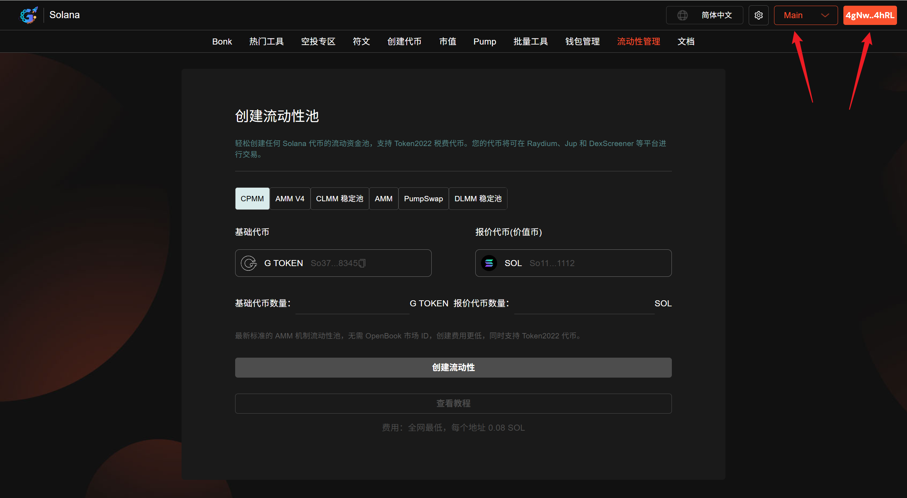
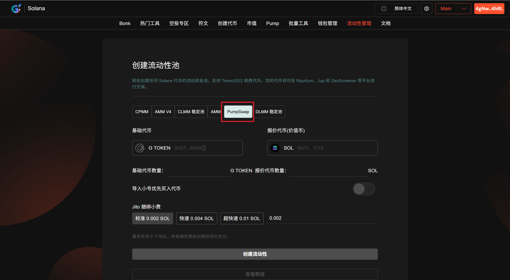
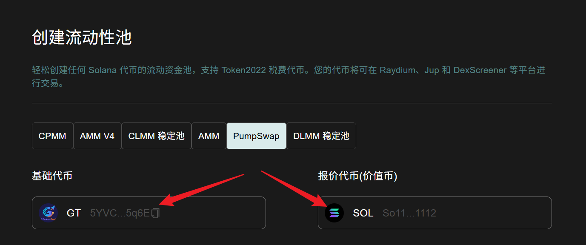
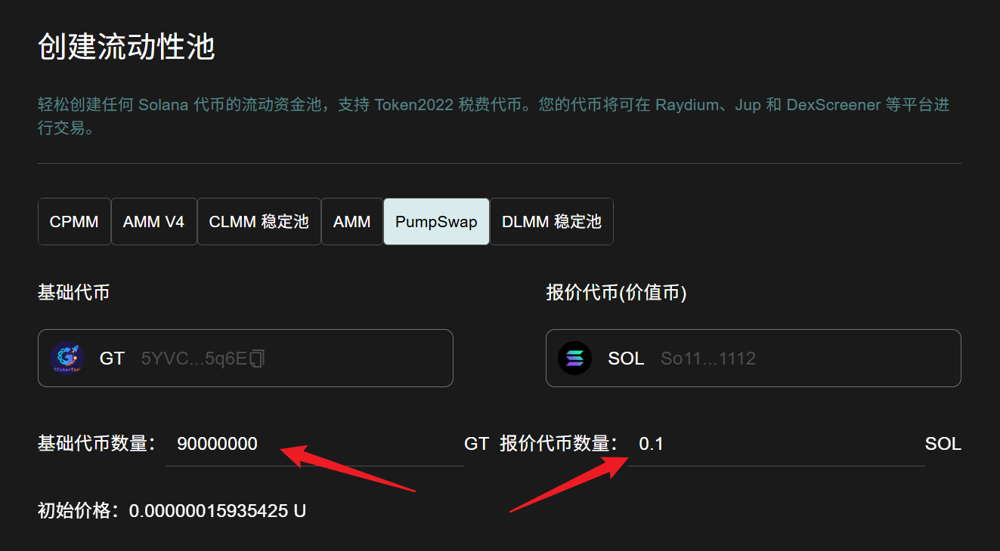
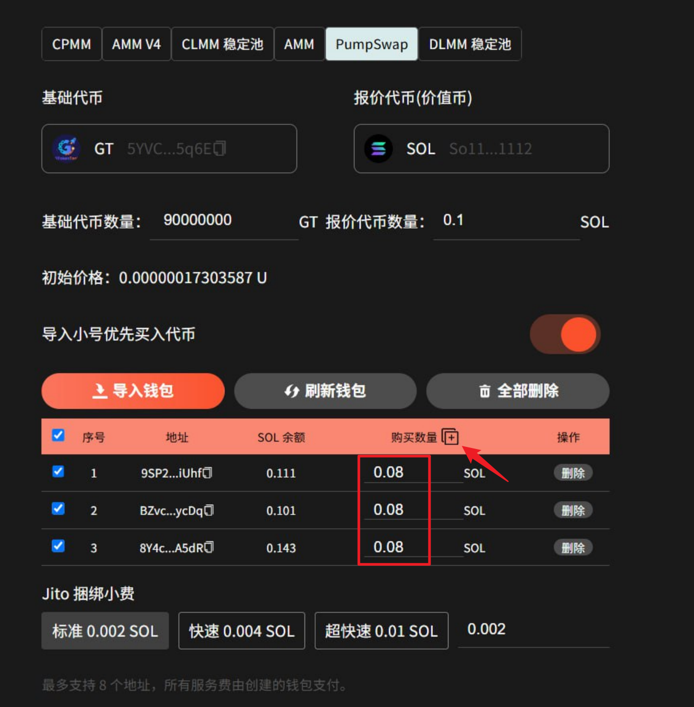
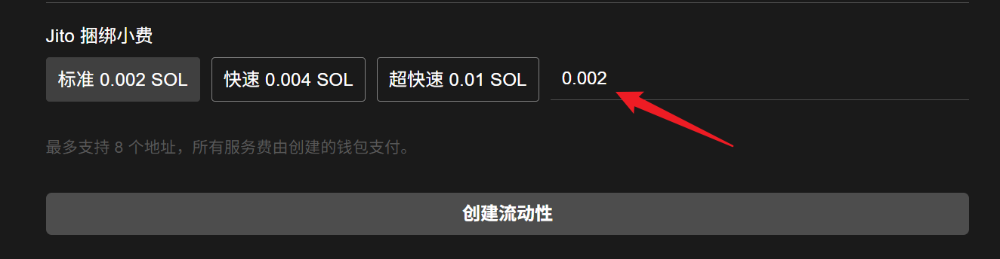
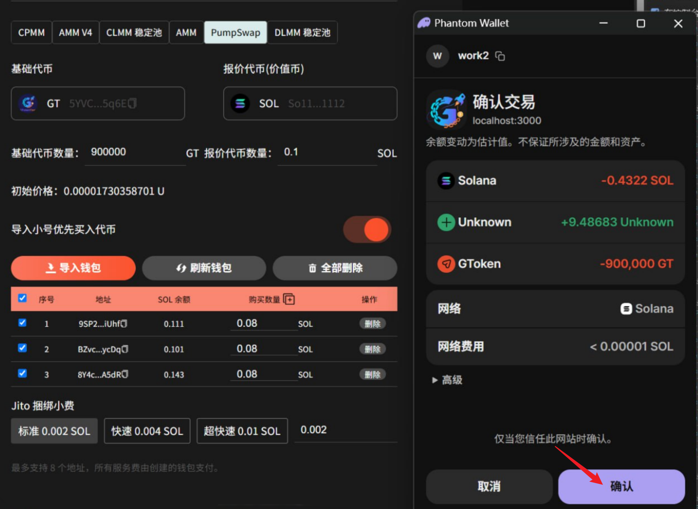
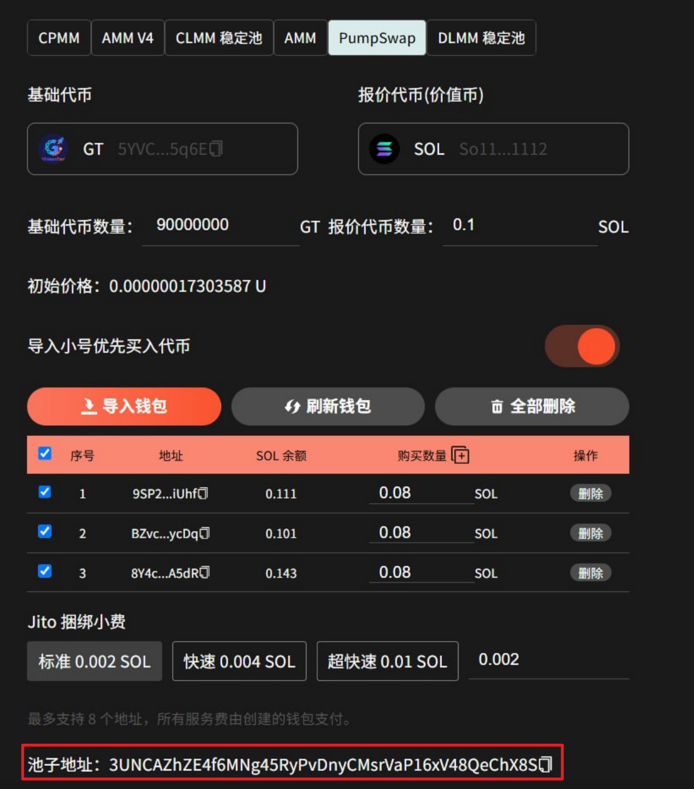

# PumpSwap 创建流动性并买入教程

## PumpSwap 流动性池介绍

PumpSwap 是 Solana 生态中的去中心化交易所（DEX），其流动性池机制基于 Solana 链的高吞吐量特性设计，核心采用自动做市商（AMM）模式，为用户提供代币交易流动性并为流动性提供者（LP）创造收益。

## 准备事项 

1. 一台电脑或者一部手机
2. Solana 钱包（[幻影钱包Phantom安装教程](https://docs.gtokentool.com/solana/auxiliary-tutorial/phantom-wallet-installation)）
3. 钱包需准备充足余额
4. 要创建流动性池的代币

## Solana 创建 PumpSwap 流动性并买入教程 

### 1. 连接钱包 

进入 GTokenTool 创建流动性页面，右上角选择 Main 网络并连接钱包。

创建流动性池： [https://sol.gtokentool.com/zh-CN/liquidityManagement/CreatePool](https://sol.gtokentool.com/zh-CN/liquidityManagement/CreatePool)

<figure><figcaption></figcaption></figure>

### 2. 选择池子 

GTokenTool 支持用户创建AMM池、 AMM V4 池、CPMM 池、 CLMM 稳定池、PumpSwap池和 DLMM 稳定池，我们在这里选择 PumpSwap 池。

<figure><figcaption></figcaption></figure>

### 3. 选择要创建流动性池的交易对 

* **基础代币：**&#x586B;写您创建的还没有任何价值的代币。
* **报价代币：**&#x5177;有市场价值的代币，通常是 SOL 、 USDC 或 USDT。

<figure><figcaption></figcaption></figure>

### 4. 填写具体参数

* **基础代币数量：**&#x586B;写你创建的代币数量，想填多少填多少，不要超过实际拥有量。
* **报价代币数量：**&#x586B;写价值币的数量，不要超过实际拥有数量。
* **初始价格：**&#x586B;写完基础代币数量和报价代币数量后会自动为您估算初始价格。

<figure><figcaption></figcaption></figure>

### 5. 导入小号优先买入

导入小号后，设置每个钱包买入的金额，可批量设置。


最多支持 8 个地址，所有服务费由创建的钱包支付。每个钱包需要预留0.007 SOL，最好预留10%。

创建钱包需确保余额大于<mark style="color:purple;">入池金额 + （导入钱包个数 + 1）\* 0.08 SOL + 创建池子费用 0.01 SOL + Jito捆绑小费+ 预留 0.01 SOL</mark> 。


<figure><figcaption></figcaption></figure>

### 6. Jito捆绑小费设置

<figure><figcaption></figcaption></figure>

### 7. 点击“创建流动性”

弹出钱包后，点击“`确认`”。

<figure><figcaption></figcaption></figure>

创建成功后，会弹出池子地址，下面也会显示池子地址。

<figure><figcaption></figcaption></figure>

[_**GTokenTool | 创建代币、批量空投和做市机器人等Solana工具集**_](https://sol.gtokentool.com/)

**安全、开源，给Solana用户带来最便利的一站式体验。**

GTokenTool社群:

Telegram：[**https://t.me/gtokentool**](https://t.me/gtokentool)

Twitter: [**https://x.com/gtokentool**](https://x.com/gtokentool)

Gitbook：[**https://docs.gtokentool.com/**](https://docs.gtokentool.com/)

Github：[**https://github.com/Gtokentool/docs/blob/master/SUMMARY.md**](https://github.com/Gtokentool/docs/blob/master/SUMMARY.md)

YouTube：[**https://www.youtube.com/@GTokenTool**](https://www.youtube.com/@GTokenTool)&#x20;

<mark style="color:purple;background-color:orange;">**GTokenTool**</mark>_<mark style="color:purple;background-color:orange;">保留随时全权酌情因任何理由修改、变更或取消此公告的权利，无需事先通知。以上信息内容仅供参考，GTokenTool对本平台上的任何虚拟资产、产品或促销活动不做任何推荐或保证。虚拟资产的价格波动很大，投资交易虚拟资产将面临巨大风险。请谨慎投资。</mark>_
