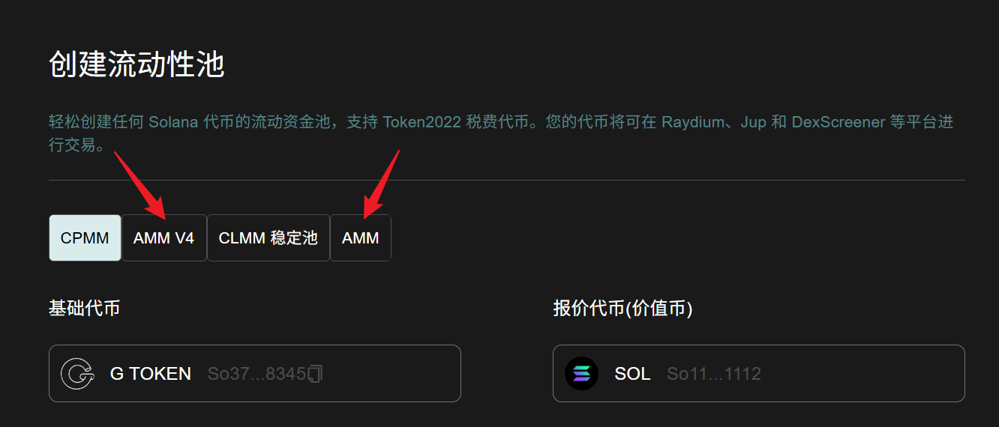
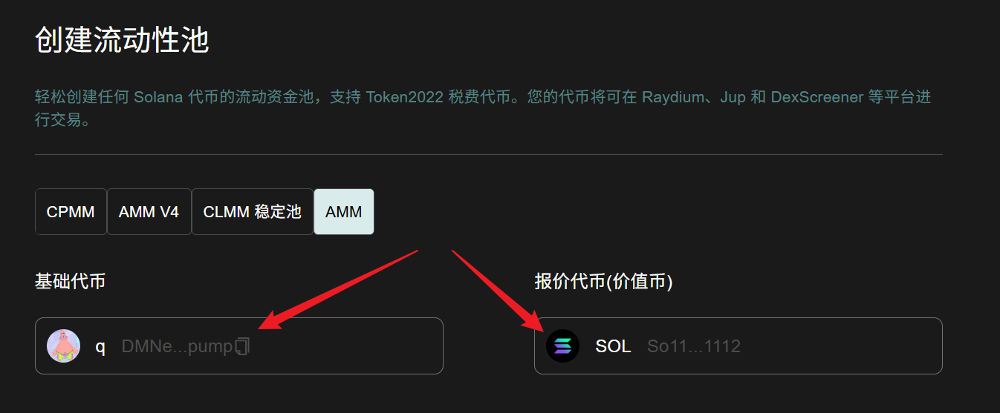
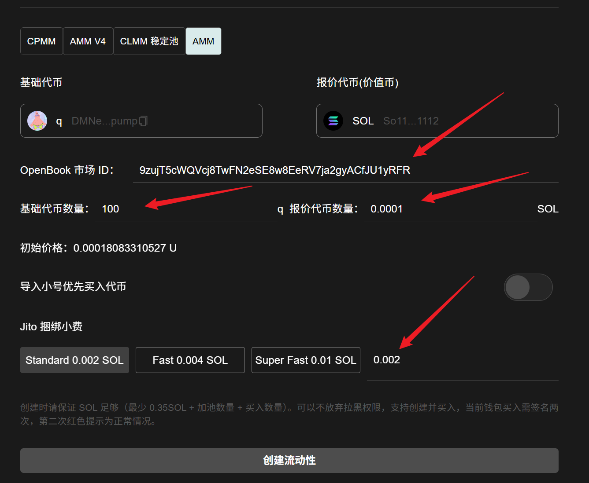
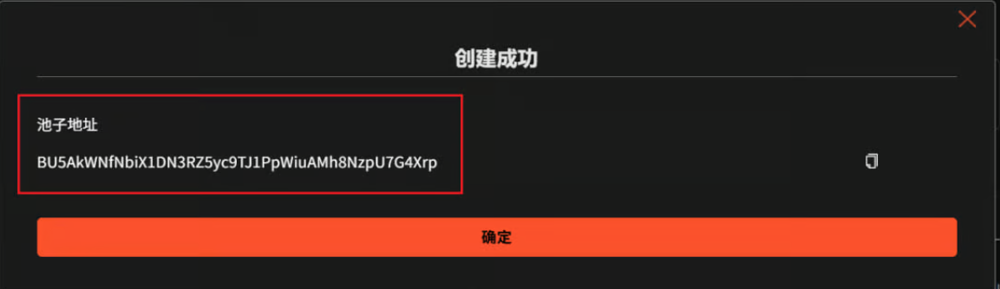
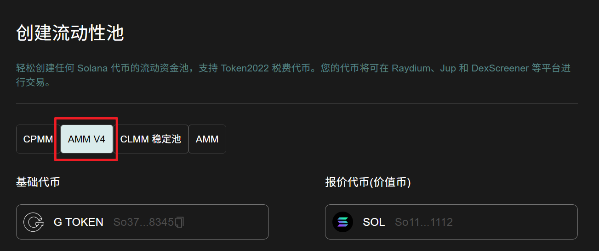
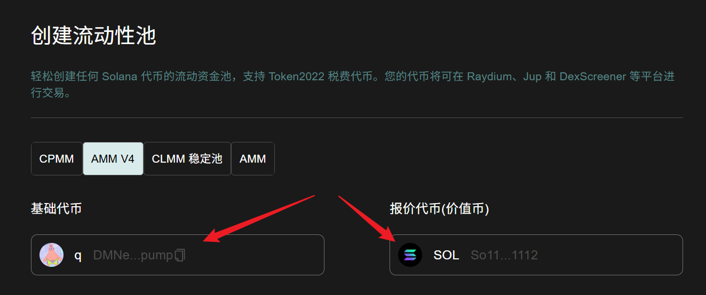
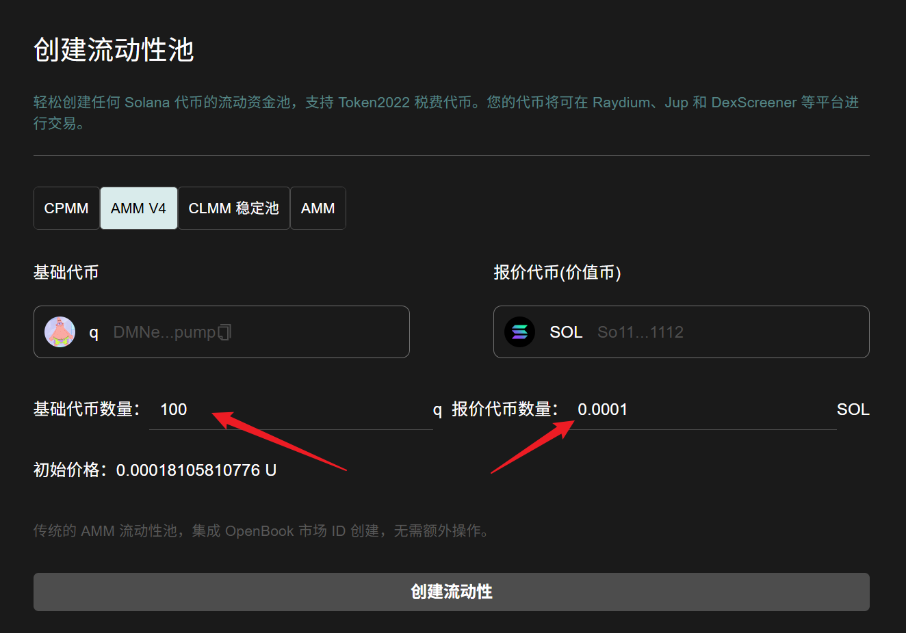
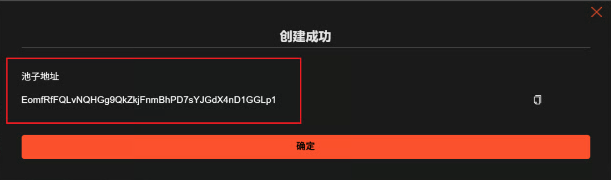

# Raydium AMM 创建流动性（加池子）教程

## 📌 核心摘要

* **功能定位：**&#x53;olana 生态主流的**标准流动性配置引擎**。支持项目方在 Raydium 平台建立 AMM（自动做市商）V4 标准池，为代币提供初始价格发现与交易深度。
* 技术特性：
  * **多版本标准适配：**&#x5168;面兼容 Raydium AMM V4/V2（统称标准池）协议规范，确保流动性池的底层稳定性。
  * **参数化交互部署：**&#x652F;持自定义代币配比、初始流动性数额及 OpenBook Market ID 关联，实现池子参数的精准控制。
  * **原子化上链流程：**&#x5C06;复杂的加池指令集约化，通过简易交互完成流动性注入，保障资产上链的实时性。
* **应用价值：**&#x4F5C;为项目代币冷启动的核心基石，该工具通过建立标准化的交易对，直接激活资产的市场流动性，是实现项目交易自由流转的关键步骤。
* **目标受众：**&#x9700;在 Raydium 部署初始流动性的 Solana 项目方、负责资产流动性管理的做市商，以及寻求低门槛加池方案的开发者。

## Raydium AMM 流动性池介绍

Raydium AMM 流动性池，也叫 AMM V4，或者AMM V2，或者简称 V2 的池子，它们本质上是同一种东西，是 Raydium 提供的一种标准流动池。

## Raydium AMM 创建流动性视频演示



## Raydium AMM V4 创建流动性视频演示



## 准备事项

1. 一台电脑或者一部手机
2. Solana 钱包（[幻影钱包Phantom安装教程](https://docs.gtokentool.com/solana/auxiliary-tutorial/phantom-wallet-installation)）
3. 钱包最少准备 **0.5 SOL** (Raydium官方将收取0.5 SOL)
4. 要创建流动性池的代币和 [**OpenBook 市场 ID**](https://docs.gtokentool.com/solana/liquidity-management/openbook-market-id-query)

## Solana 创建 Raydium AMM 池子教程

### 1.连接钱包

进入 GTokenTool 创建流动性页面，右上角选择 Main 网络并连接钱包。

创建流动性： [https://sol.gtokentool.com/zh-CN/liquidityManagement/CreatePool](https://sol.gtokentool.com/zh-CN/liquidityManagement/CreatePool)

<figure><figcaption>
连接钱包并选择网络
</figcaption></figure>

### 2.选择池子类型

GTokenTool 提供了两种创建 Raydium AMM 流动性池的方式。

* **填写市场 ID 创建：**&#x9700;要手动创建市场 ID 并填写，支持创建者导入小号优先买入。
* **集成市场 ID 创建：**&#x4E0D;需要创建市场 ID，直接创建流动池，价格更便宜。

<figure><figcaption>
选择池子类型
</figcaption></figure>

### 3.填写市场 ID 创建 AMM 流动池

#### 1.选择要添加流动性池的交易对

* **基础代币：**&#x586B;写您创建的还没有任何价值的代币。
* **报价代币：**&#x5177;有市场价值的代币，通常是 SOL 、 USDC 或 USDT。

<figure><figcaption>
选择交易对
</figcaption></figure>

#### 2.具体参数填写

* **OpenBook 市场 ID：**&#x586B;写你创建的市场 ID。
* **基础代币数量：**&#x586B;写你创建的代币数量，想填多少填多少，不要超过实际拥有量。
* **报价代币数量：**&#x586B;写价值币的数量，不要超过实际拥有数量。
* **初始价格：**&#x586B;写完基础代币数量和报价代币数量后会自动为您估算初始价格。
* **Jito捆绑小费：**&#x7ED9; Jito 的小费，可以让你的交易更快完成。

<figure><figcaption>
具体参数填写
</figcaption></figure>

#### 3.填写市场 ID 创建 AMM 流动池效果展示

参数填写好后，点击“`创建流动性`”。钱包弹出后，点击“`确认`”。

创建成功效果展示：

<figure><figcaption>
创建成功池子地址显示
</figcaption></figure>

### 4.集成市场 ID 创建 AMM 流动池

#### 1.选择池子类型 AMM V4

<figure><figcaption>
选择AMM V4
</figcaption></figure>

2.选择要添加流动性池的交易对

<figure><figcaption>
选择交易对
</figcaption></figure>

#### 3.具体参数填写

* **基础代币数量：**&#x586B;写你创建的代币数量，想填多少填多少，不要超过实际拥有量。
* **报价代币数量：**&#x586B;写价值币的数量，不要超过实际拥有数量。
* **初始价格：**&#x586B;写完基础代币数量和报价代币数量后会自动为您估算初始价格。

<figure><figcaption>
具体参数填写
</figcaption></figure>

#### 4.集成市场 ID 创建 AMM 流动池效果展示

参数填写好后，点击“`创建流动性`”。钱包弹出后，点击“`确认`”。

创建成功效果展示：

<figure><figcaption>
创建成功池子地址显示
</figcaption></figure>

## ❓常见问题 FAQ

### Q: 创建后能改 Market ID 吗？

**A:** **不能**。链上绑定，错了只能**重建 ID + 重建池子**。

### Q: Raydium AMM 支持 Token-2022 吗？

**A:** **不支持**。仅支持传统 SPL；要用 Token-2022 选 **CPMM**。

### Q: 一个 Market ID 对应几个池子？

**A:** **一对一**。一个交易对（如 XXX/SOL）**一个 Market ID、一个 V4 池子**。

### Q: V4 池子可以移除 / 燃烧流动性吗？

**A:** 可以，和普通 AMM 一致：**移除退币、燃烧永久锁死**。

### 🤝 连接 GTokenTool 

* **💬 Telegram社群**：[点击加入官方群组](https://t.me/gtokentool)
* **🐦 Twitter (X)**：[关注我们获取最新动态](https://x.com/gtokentool)
* **📚 官方文档**：[查看 Gitbook 文档](https://docs.gtokentool.com/)
* **💻 开源代码**：[访问 GitHub 仓库](https://github.com/Gtokentool/docs/blob/master/SUMMARY.md)
* **📺 视频教程**：[订阅 YouTube 频道](https://www.youtube.com/@GTokenTool)

> ⚠️ 风险提示与免责声明
>
> GTokenTool 保留随时全权酌情因任何理由修改、变更或取消此公告的权利，无需事先通知。
>
> 以上信息内容仅供参考，GTokenTool 对本平台上的任何虚拟资产、产品或促销活动不做任何推荐或保证。虚拟资产的价格波动很大，投资交易虚拟资产将面临巨大风险。**请谨慎投资。**
