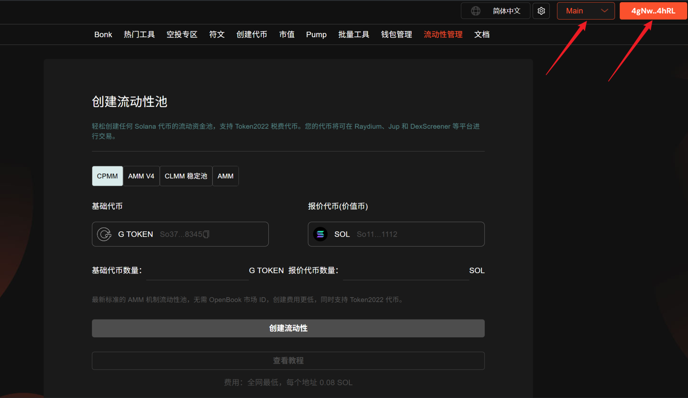

# Raydium AMM 创建流动性（加池子）教程

## Raydium AMM 流动性池介绍

Raydium AMM 流动性池，也叫 AMM V4，或者AMM V2，或者简称 V2 的池子，它们本质上是同一种东西，是 Raydium 提供的一种标准流动池。

## Raydium AMM 创建流动性视频演示



## Raydium AMM V4 创建流动性视频演示



## 准备事项

1. 一台电脑或者一部手机
2. Solana 钱包（[幻影钱包Phantom安装教程](https://docs.gtokentool.com/solana/auxiliary-tutorial/phantom-wallet-installation)）
3. 钱包最少准备 **0.5 SOL** (Raydium官方将收取0.5 SOL)
4. 要创建流动性池的代币和 [**OpenBook 市场 ID**](https://docs.gtokentool.com/solana/liquidity-management/openbook-market-id-query)

## Solana 创建 Raydium AMM 池子教程

### 1.连接钱包

进入 GTokenTool 创建流动性页面，右上角选择 Main 网络并连接钱包，这里用测试网演示。

创建流动性： [https://sol.gtokentool.com/zh-CN/liquidityManagement/CreatePool](https://sol.gtokentool.com/zh-CN/liquidityManagement/CreatePool)

<figure><figcaption></figcaption></figure>

### 2.选择池子

GTokenTool 提供了两种创建 Raydium AMM 流动性池的方式。

* **填写市场 ID 创建：**&#x9700;要手动创建市场 ID 并填写，支持创建者导入小号优先买入。
* **集成市场 ID 创建：**&#x4E0D;需要创建市场 ID，直接创建流动池，价格更便宜。

<figure><figcaption></figcaption></figure>

### 3.填写市场 ID 创建 AMM 流动池

#### 1.选择要添加流动性池的交易对

* **基础代币：**&#x586B;写您创建的还没有任何价值的代币。
* **报价代币：**&#x5177;有市场价值的代币，通常是 SOL 、 USDC 或 USDT。

<figure><figcaption></figcaption></figure>

#### 2.具体参数填写

* **OpenBook 市场 ID：**&#x586B;写你创建的市场 ID。
* **基础代币数量：**&#x586B;写你创建的代币数量，想填多少填多少，不要超过实际拥有量。
* **报价代币数量：**&#x586B;写价值币的数量，不要超过实际拥有数量。
* **初始价格：**&#x586B;写完基础代币数量和报价代币数量后会自动为您估算初始价格。
* **Jito捆绑小费：**&#x7ED9; Jito 的小费，可以让你的交易更快完成。

<figure><figcaption></figcaption></figure>

#### 3.填写市场 ID 创建 AMM 流动池效果展示

参数填写好后，点击“`创建流动性`”。钱包弹出后，点击“`确认`”。

创建成功效果展示：

<figure><figcaption></figcaption></figure>

### 4.集成市场 ID 创建 AMM 流动池

#### 1.选择池子类型 AMM V4

<figure><figcaption></figcaption></figure>

2.选择要添加流动性池的交易对

<figure><figcaption></figcaption></figure>

#### 3.具体参数填写

* **基础代币数量：**&#x586B;写你创建的代币数量，想填多少填多少，不要超过实际拥有量。
* **报价代币数量：**&#x586B;写价值币的数量，不要超过实际拥有数量。
* **初始价格：**&#x586B;写完基础代币数量和报价代币数量后会自动为您估算初始价格。

<figure><figcaption></figcaption></figure>

#### 4.集成市场 ID 创建 AMM 流动池效果展示

参数填写好后，点击“`创建流动性`”。钱包弹出后，点击“`确认`”。

创建成功效果展示：

<figure><figcaption></figcaption></figure>

[_**GTokenTool | 创建代币、批量空投和做市机器人等Solana工具集**_](https://sol.gtokentool.com/)

**安全、开源，给Solana用户带来最便利的一站式体验。**

GTokenTool社群:

Telegram：[**https://t.me/gtokentool**](https://t.me/gtokentool)

Twitter: [**https://x.com/gtokentool**](https://x.com/gtokentool)

Gitbook：[**https://docs.gtokentool.com/**](https://docs.gtokentool.com/)

Github：[**https://github.com/Gtokentool/docs/blob/master/SUMMARY.md**](https://github.com/Gtokentool/docs/blob/master/SUMMARY.md)

YouTube：[**https://www.youtube.com/@GTokenTool**](https://www.youtube.com/@GTokenTool)&#x20;

<mark style="color:purple;background-color:orange;">**GTokenTool**</mark>_<mark style="color:purple;background-color:orange;">保留随时全权酌情因任何理由修改、变更或取消此公告的权利，无需事先通知。以上信息内容仅供参考，GTokenTool对本平台上的任何虚拟资产、产品或促销活动不做任何推荐或保证。虚拟资产的价格波动很大，投资交易虚拟资产将面临巨大风险。请谨慎投资。</mark>_
