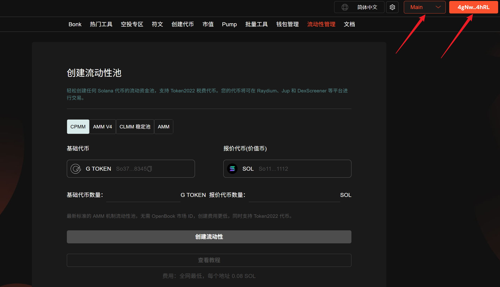
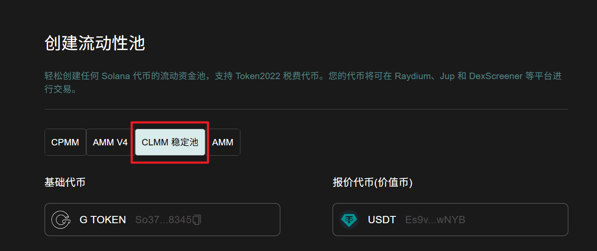
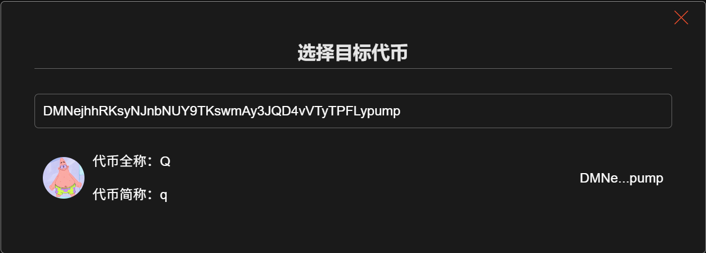
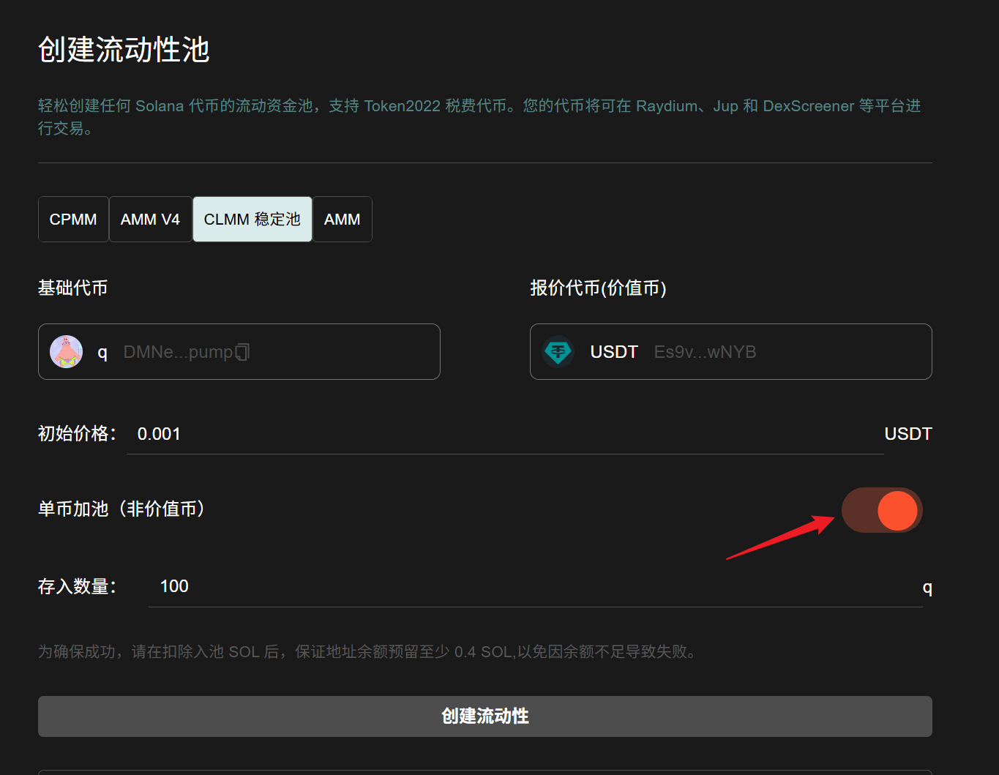
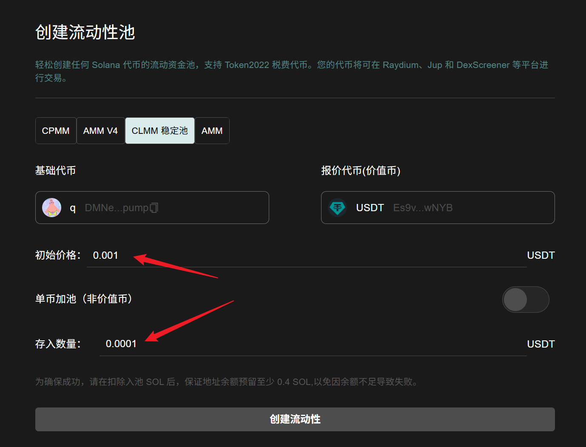
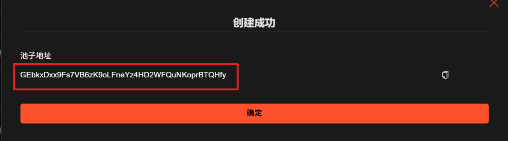
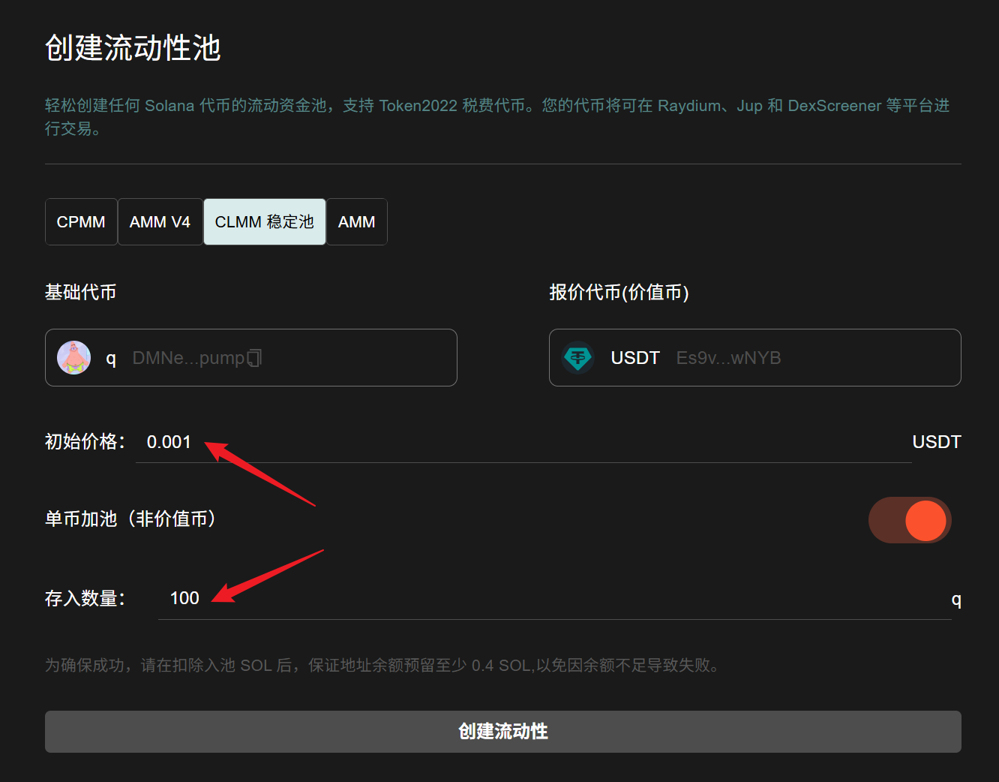
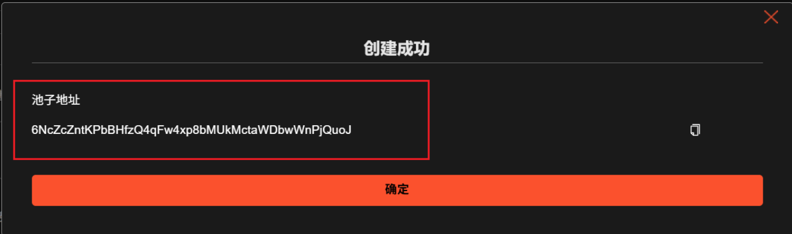

# Solana 添加稳定币（CLMM）流动性教程(2025年8月最新教程)

## Solana 稳定池介绍 

稳定池，是 Raydium 推出的集中流动池，也叫：CLMM池。这种流动性资金池的特点是：可以让代币的价格稳定在一定范围内，所以称之为：稳定池。

## Solana 稳定池的好处

对于很多RAW项目来说，代币价格稳定有助于实体项目的运营。通过创建稳定池，可以确保代币不会受到MEV套利机器人的影响，对于项目的长久发展至关重要。此外，创建稳定池仅需要很少的费用，极大地降低了用户了门槛和成本。

## 视频演示



## 准备事项 

1. 一台电脑或者一部手机
2. Solana 钱包（[幻影钱包Phantom安装教程](https://docs.gtokentool.com/solana/auxiliary-tutorial/phantom-wallet-installation)）
3. 钱包所需费用下面的教程中有详细说明
4. 要创建流动性池的代币

## Solana 添加稳定币（CLMM）流动性教程

### 1.连接钱包

进入 GTokenTool 创建流动性池页面，右上角选择 Main 网络并连接钱包。

创建流动性池： [https://sol.gtokentool.com/zh-CN/liquidityManagement/CreatePool](https://sol.gtokentool.com/zh-CN/liquidityManagement/CreatePool)

<figure><figcaption></figcaption></figure>

### 2.选择池子 

GTokenTool 支持用户创建AMM池、 AMM V4 池、CPMM 稳定池和 CLMM 池四种，我们在这里选择 CLMM 稳定池。

<figure><figcaption></figcaption></figure>

### 3. 选择要创建流动性池的交易对 

* **基础代币：**&#x586B;写您创建的还没有任何价值的代币。
* **报价代币：**&#x5177;有市场价值的代币，通常是 SOL 、 USDC 或 USDT。

<figure><figcaption></figcaption></figure>

<figure><figcaption></figcaption></figure>

<figure><figcaption></figcaption></figure>

### 4.选择加池模式 

GTokenTool 为您提供了两种加池模式（默认为单币加池）：

* **双币加池：**&#x540C;时加入用户创建的代币和价值币。
* **单币加池：**&#x53EA;添加用户创建的代币。

<figure><figcaption></figcaption></figure>

### 5.双币加池参数填写

* **初始价格：**&#x8BBE;置池子的初始价格。
* **存入数量：**&#x8BBE;置存入价值币（比如USDT）的数量，<mark style="color:purple;">系统会自动为你计算出需要存入的基础代币数量</mark>。如果弹出钱包爆红，可能是你的代币数量太少，可以减少存入数量再次尝试。
* **钱包预留余额估算：** 钱包余额需要大于（Raydium 官方收取 0.23 SOL，服务费用 0.08 SOL，存入数量，预留0.01 SOL）的总和。

<figure><figcaption></figcaption></figure>

### 6.双币加池效果展示

参数填写好后，点击“`创建流动性`”。钱包弹出后，点击“`确认`”。

创建成功效果展示：

<figure><figcaption></figcaption></figure>

### 7.单币加池参数填写

* **单币加池：**&#x6253;开单币加池开关。
* **初始价格：**&#x8BBE;置池子的初始价格。
* **存入数量：**&#x8BBE;置存入基础代币的数量，不需要存入价值币（比如USDT）。
* **钱包预留余额估算：** 钱包余额需要大于（Raydium 官方收取 0.23 SOL，服务费用 0.08 SOL，预留0.01 SOL）的总和。

<mark style="background-color:$warning;">**温馨提示：**</mark><mark style="background-color:$warning;">单币加池代币是无法卖出的，只能买入。如果你希望代币可以卖出，需要往池子里加入价值币才行，通过我们的</mark>[<mark style="background-color:$warning;">市值机器人</mark>](https://sol.gtokentool.com/zh-CN/market/jupMarket)<mark style="background-color:$warning;">买入一笔就行。</mark>

<figure><figcaption></figcaption></figure>

### 8.单币加池效果展示

参数填写好后，点击“`创建流动性`”。钱包弹出后，点击“`确认`”。

创建成功效果展示：

<figure><figcaption></figcaption></figure>

[_**GTokenTool | 创建代币、批量空投和做市机器人等Solana工具集**_](https://sol.gtokentool.com/)

**安全、开源，给Solana用户带来最便利的一站式体验。**

GTokenTool社群:

Telegram：[**https://t.me/gtokentool**](https://t.me/gtokentool)

Twitter: [**https://x.com/gtokentool**](https://x.com/gtokentool)

Gitbook：[**https://docs.gtokentool.com/**](https://docs.gtokentool.com/)

Github：[**https://github.com/Gtokentool/docs/blob/master/SUMMARY.md**](https://github.com/Gtokentool/docs/blob/master/SUMMARY.md)

YouTube：[**https://www.youtube.com/@GTokenTool**](https://www.youtube.com/@GTokenTool)&#x20;

<mark style="color:purple;background-color:orange;">**GTokenTool**</mark>_<mark style="color:purple;background-color:orange;">保留随时全权酌情因任何理由修改、变更或取消此公告的权利，无需事先通知。以上信息内容仅供参考，GTokenTool对本平台上的任何虚拟资产、产品或促销活动不做任何推荐或保证。虚拟资产的价格波动很大，投资交易虚拟资产将面临巨大风险。请谨慎投资。</mark>_
