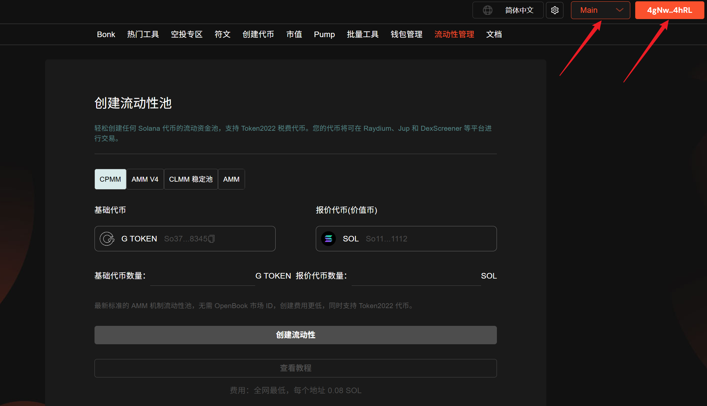
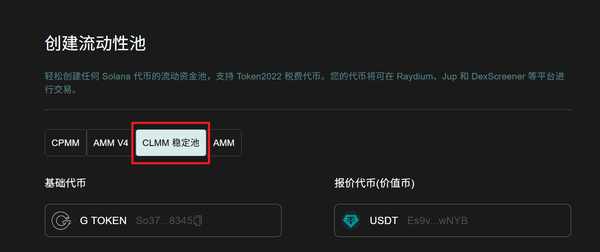
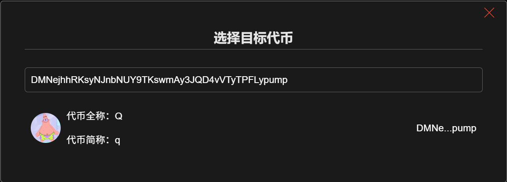
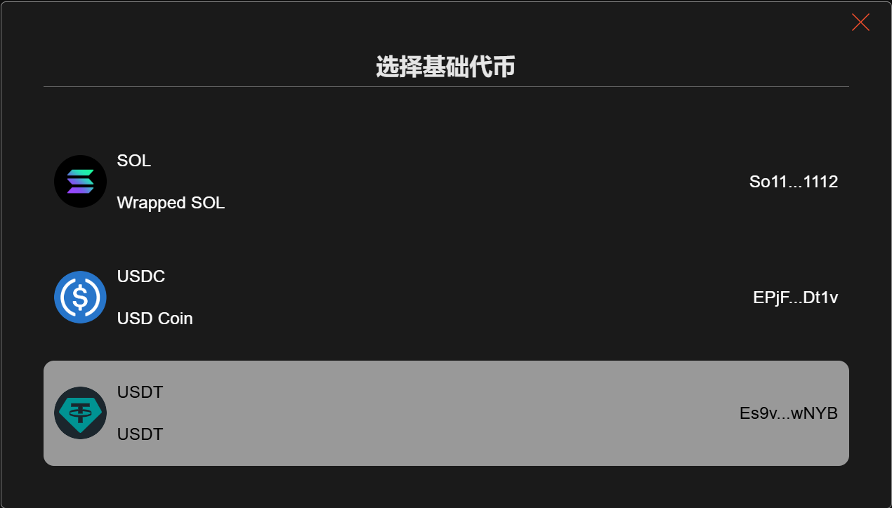
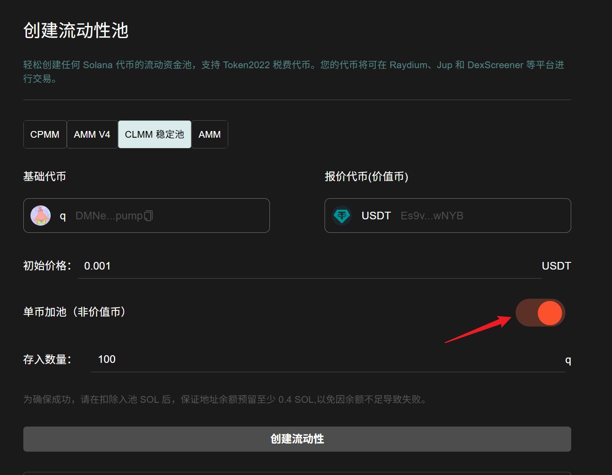
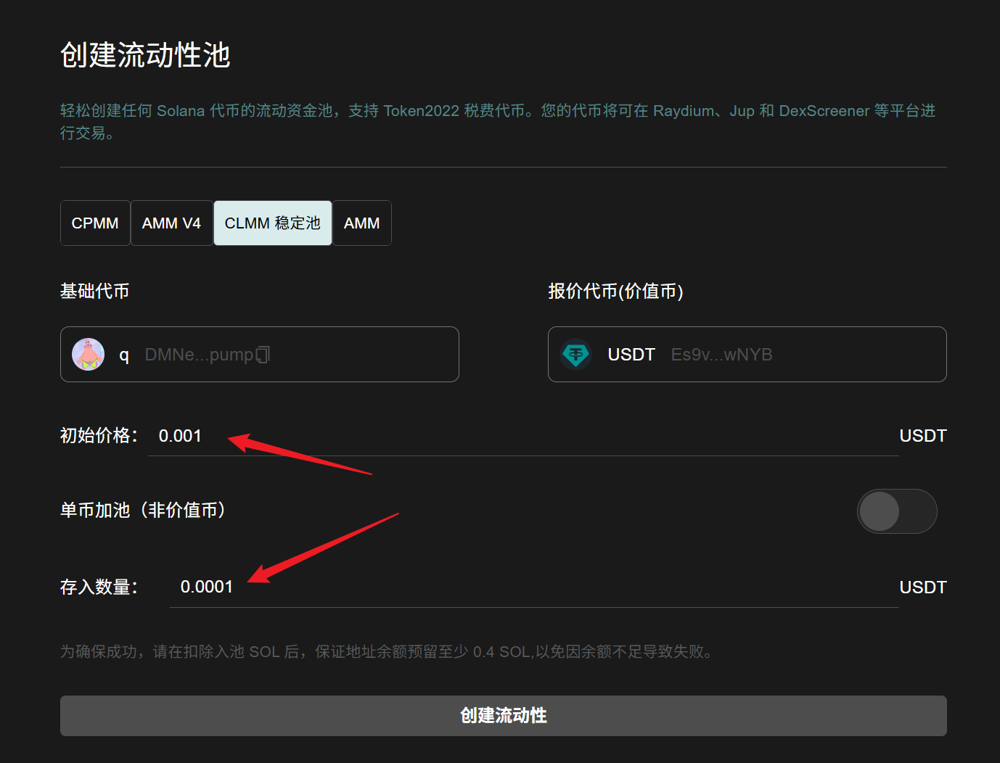
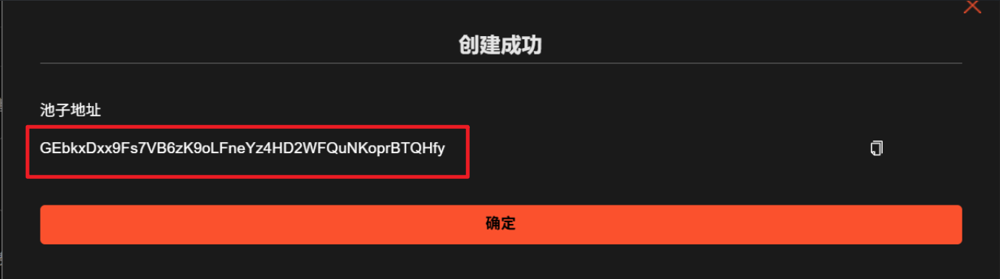
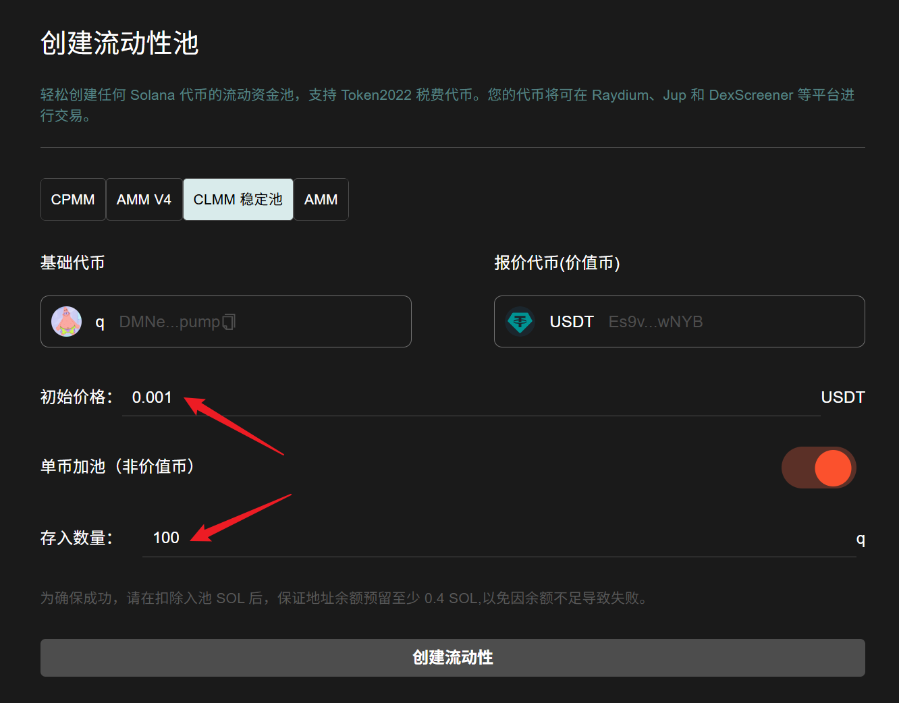
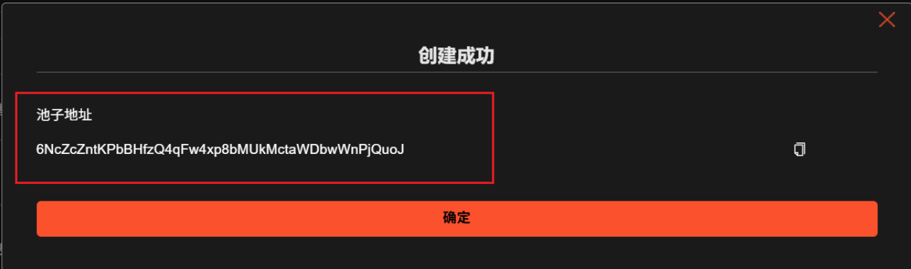

# Solana 添加稳定币（CLMM）流动性教程

## 📌 核心摘要

* **功能定位：**&#x57FA;于 **Raydium CLMM（集中流动性做市商）** 协议的稳定币/稳定对流动性管理引擎。通过在特定价格区间集中资金，旨在实现资产价格的高效稳定与极低交易滑点。
* **技术特性：**
  * **集中流动性算法：**&#x652F;持用户在选定的价格范围内分配资金，相比传统 AMM，显著提升了资金利用率，是构建“稳定池”的技术核心。
  * **MEV 防护机制：**&#x901A;过稳定价格区间设计，有效缓解 MEV 套利机器人对代币价格的冲击，保障项目长期健康运行。
  * **低成本部署交互：**&#x4F18;化了稳定池的创建流程与费用结构，极大降低了项目方维护资产流动性稳定性的门槛。
* **应用价值：**&#x4E3A; RAW 项目及稳定币对提供**深度流动性背书**，通过价格稳健性增强持有者信心，是实现资产价值对齐与实体项目运营的支撑利器。
* **目标受众：**&#x9700;维持价格稳定的项目方、追求高资金效率的流动性提供者，以及寻求低滑点交易环境的 Solana 深度玩家。

## Solana 稳定池介绍 

稳定池，是 Raydium 推出的集中流动池，也叫：CLMM池。这种流动性资金池的特点是：可以让代币的价格稳定在一定范围内，所以称之为：稳定池。

## Solana 稳定池的好处

对于很多RAW项目来说，代币价格稳定有助于实体项目的运营。通过创建稳定池，可以确保代币不会受到MEV套利机器人的影响，对于项目的长久发展至关重要。此外，创建稳定池仅需要很少的费用，极大地降低了用户了门槛和成本。

## 视频演示



## 准备事项 

1. 一台电脑或者一部手机
2. Solana 钱包（[幻影钱包Phantom安装教程](https://docs.gtokentool.com/solana/auxiliary-tutorial/phantom-wallet-installation)）
3. 钱包所需费用下面的教程中有详细说明
4. 要创建流动性池的代币

## Solana 添加稳定币（CLMM）流动性教程

### 1. 连接钱包

进入 GTokenTool 创建流动性池页面，右上角选择 Main 网络并连接钱包。

创建流动性池： [https://sol.gtokentool.com/zh-CN/liquidityManagement/CreatePool](https://sol.gtokentool.com/zh-CN/liquidityManagement/CreatePool)

<figure><figcaption>
连接钱包并选择Main网络
</figcaption></figure>

### 2. 选择池子类型 

GTokenTool 支持用户创建AMM池、 AMM V4 池、CPMM 池和 CLMM 稳定池四种，我们在这里选择 CLMM 稳定池。

<figure><figcaption>
选择池子类型
</figcaption></figure>

### 3. 选择要创建流动性池的交易对 

* **基础代币：**&#x586B;写您创建的还没有任何价值的代币。
* **报价代币：**&#x5177;有市场价值的代币，通常是 SOL 、 USDC 或 USDT。

<figure><figcaption>
输入目标代币地址
</figcaption></figure>

<figure><figcaption>
选择基础代币
</figcaption></figure>

<figure><figcaption>
代币配置展示
</figcaption></figure>

### 4. 选择加池模式 

GTokenTool 为您提供了两种加池模式（默认为单币加池）：

* **双币加池：**&#x540C;时加入用户创建的代币和价值币。
* **单币加池：**&#x53EA;添加用户创建的代币。

<figure><figcaption>
选择加池模式
</figcaption></figure>

### 5. 双币加池参数填写

* **初始价格：**&#x8BBE;置池子的初始价格。
* **存入数量：**&#x8BBE;置存入价值币（比如USDT）的数量，<mark style="color:purple;">系统会自动为你计算出需要存入的基础代币数量</mark>。如果弹出钱包爆红，可能是你的代币数量太少，可以减少存入数量再次尝试。
* **钱包预留余额估算：** 钱包余额需要大于（Raydium 官方收取 0.23 SOL，服务费用 0.08 SOL，存入数量，预留0.01 SOL）的总和。

<figure><figcaption>
双币加池参数填写
</figcaption></figure>

### 6. 双币加池效果展示

参数填写好后，点击“`创建流动性`”。钱包弹出后，点击“`确认`”。

创建成功效果展示：

<figure><figcaption>
创建成功池子地址显示
</figcaption></figure>

### 7. 单币加池参数填写

* **单币加池：**&#x6253;开单币加池开关。
* **初始价格：**&#x8BBE;置池子的初始价格。
* **存入数量：**&#x8BBE;置存入基础代币的数量，不需要存入价值币（比如USDT）。
* **钱包预留余额估算：** 钱包余额需要大于（Raydium 官方收取 0.23 SOL，服务费用 0.08 SOL，预留0.01 SOL）的总和。

<mark style="background-color:$warning;">**温馨提示：**</mark><mark style="background-color:$warning;">单币加池代币是无法卖出的，只能买入。如果你希望代币可以卖出，需要往池子里加入价值币才行，通过我们的</mark>[<mark style="background-color:$warning;">市值机器人</mark>](https://sol.gtokentool.com/zh-CN/market/jupMarket)<mark style="background-color:$warning;">买入一笔就行。</mark>

<figure><figcaption>
单币加池参数填写
</figcaption></figure>

### 8. 单币加池效果展示

参数填写好后，点击“`创建流动性`”。钱包弹出后，点击“`确认`”。

创建成功效果展示：

<figure><figcaption>
创建成功池子地址显示
</figcaption></figure>

## ❓常见问题 FAQ

### Q: Raydium CLMM 是什么？

**A:** 需**手动选择价格区间**提供流动性，资金只在区间内活跃、**资金效率更高、手续费收益更高**；收到**LP-NFT（非同质化代币）** 代表仓位。<mark style="color:purple;">GTokenTool 对 Raydium CLMM 做了大幅简化：不用手动选价格区间、只填初始价 + 代币数量、支持单币加池。</mark>

### Q: CLMM 支持 Token-2022 吗？

**A:** **❌ 不支持**。仅兼容**传统 SPL 代币**；要用 Token-2022 必须选 **CPMM**。

### Q: 创建 CLMM 池子需要 Market ID 吗？

**A: ❌ 不需要**。无需 OpenBook/Serum 市场 ID，直接创建交易对池子。

### Q: 初始价格设置后能改吗？

**A:** **❌ 不能**。初始价格上链永久锁定，错了只能**重建池子**。

### Q: 可以部分移除流动性吗？

**A:** **✅ 可以**。支持按比例**部分赎回**，不用全退。

### 🤝 连接 GTokenTool 

* **💬 Telegram社群**：[点击加入官方群组](https://t.me/gtokentool)
* **🐦 Twitter (X)**：[关注我们获取最新动态](https://x.com/gtokentool)
* **📚 官方文档**：[查看 Gitbook 文档](https://docs.gtokentool.com/)
* **💻 开源代码**：[访问 GitHub 仓库](https://github.com/Gtokentool/docs/blob/master/SUMMARY.md)
* **📺 视频教程**：[订阅 YouTube 频道](https://www.youtube.com/@GTokenTool)

> ⚠️ 风险提示与免责声明
>
> GTokenTool 保留随时全权酌情因任何理由修改、变更或取消此公告的权利，无需事先通知。
>
> 以上信息内容仅供参考，GTokenTool 对本平台上的任何虚拟资产、产品或促销活动不做任何推荐或保证。虚拟资产的价格波动很大，投资交易虚拟资产将面临巨大风险。**请谨慎投资。**
