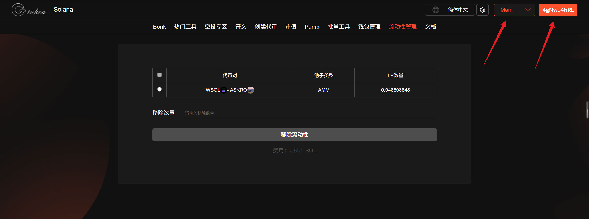
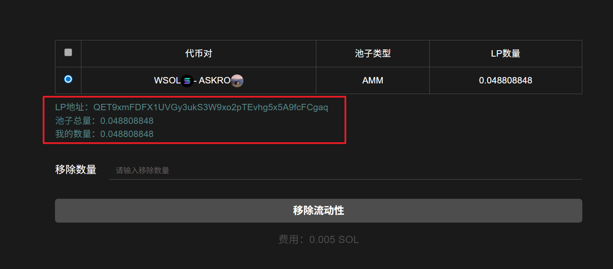
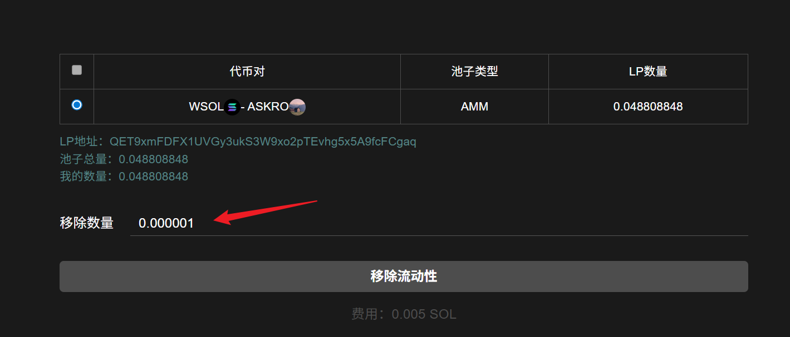
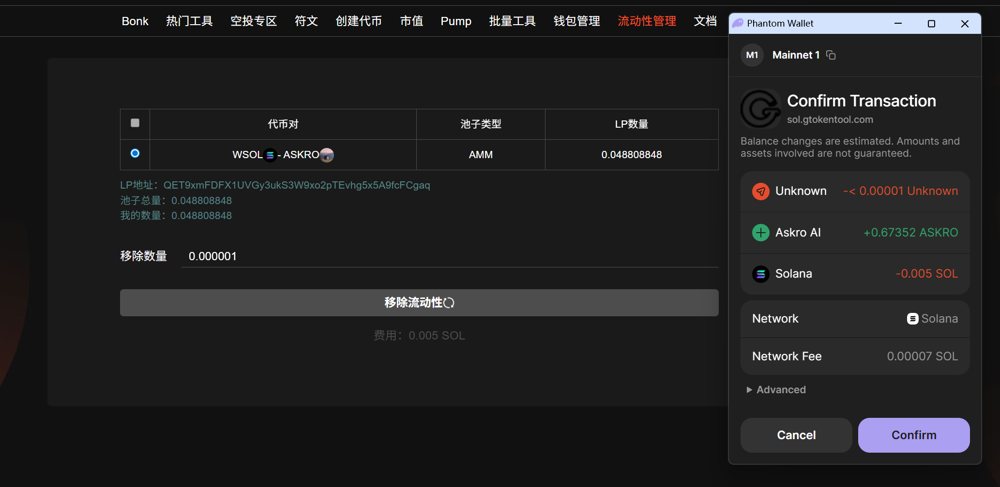

# Solana移除流动性教程

## 准备事项

1. 一台电脑或者一部手机
2. Solana 钱包（[幻影钱包Phantom安装教程](https://docs.gtokentool.com/solana/auxiliary-tutorial/phantom-wallet-installation)）
3. 钱包准备充足余额

## Solana移除流动性池流程

### 1. 连接钱包

进入GTokenTool 移除流动性页面，右上角选择 Main 网络并连接钱包。

移除流动性： [https://sol.gtokentool.com/zh-CN/liquidityManagement/remove](https://sol.gtokentool.com/zh-CN/liquidityManagement/remove)

<figure><figcaption></figcaption></figure>

### 2. 选择要移除的流动性池

选择流动性池后，出现显示池子地址、池子总量和我的数量。

<figure><figcaption></figcaption></figure>

### 3. 输入移除数量

<figure><figcaption></figcaption></figure>

### 4. 点击“移除流动性”

弹出钱包后，点击“Confirm”，完成交易。

<figure><figcaption></figcaption></figure>

## 常见问题

### **为什么赎回时代币数量变少了？**

* **问题**：因价格波动导致无常损失。
* **解决**：
  * 选择波动性低的配对（如稳定币对）。
  * 使用对冲工具（如期权）或仅在看好两种代币时提供流动性。

### **交易失败但扣除了 SOL 手续费？**

* **问题**：Solana 网络失败交易仍会消耗少量 Gas。
* **解决**：
  * 检查网络状态（如 Solana Status），避开拥堵时段。
  * 确保钱包余额足够（建议预留 0.1 SOL）。

[_**GTokenTool | 创建代币、批量空投和做市机器人等Solana工具集**_](https://sol.gtokentool.com)

**安全、开源，给Solana用户带来最便利的一站式体验。**

GTokenTool社群:

Telegram：[**https://t.me/gtokentool**](https://t.me/gtokentool)

Twitter:  [**https://x.com/gtokentool**](https://x.com/gtokentool)

Gitbook：[**https://docs.gtokentool.com/**](https://docs.gtokentool.com/)

Github：[**https://github.com/Gtokentool/docs/blob/master/SUMMARY.md**](https://github.com/Gtokentool/docs/blob/master/SUMMARY.md)

YouTube：[**https://www.youtube.com/@GTokenTool**](https://www.youtube.com/@GTokenTool)\
\
\
<mark style="color:purple;background-color:orange;">**GTokenTool**</mark>_<mark style="color:purple;background-color:orange;">保留随时全权酌情因任何理由修改、变更或取消此公告的权利，无需事先通知。以上信息内容仅供参考，GTokenTool对本平台上的任何虚拟资产、产品或促销活动不做任何推荐或保证。虚拟资产的价格波动很大，投资交易虚拟资产将面临巨大风险。请谨慎投资。</mark>_
