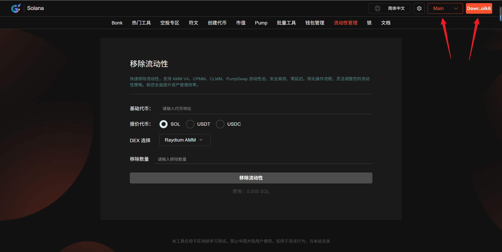
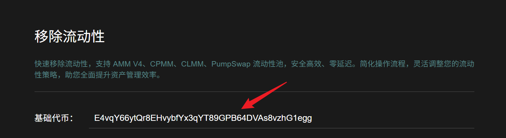
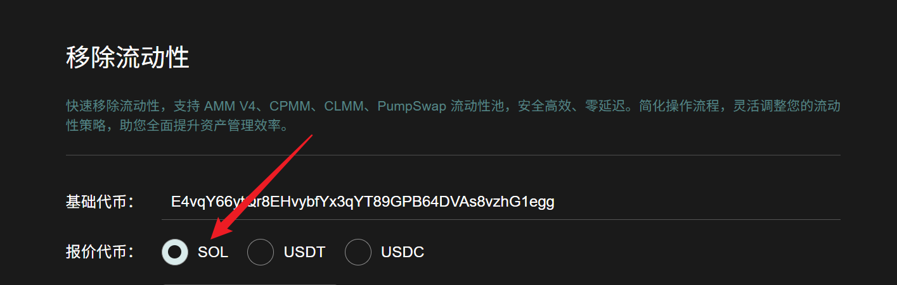
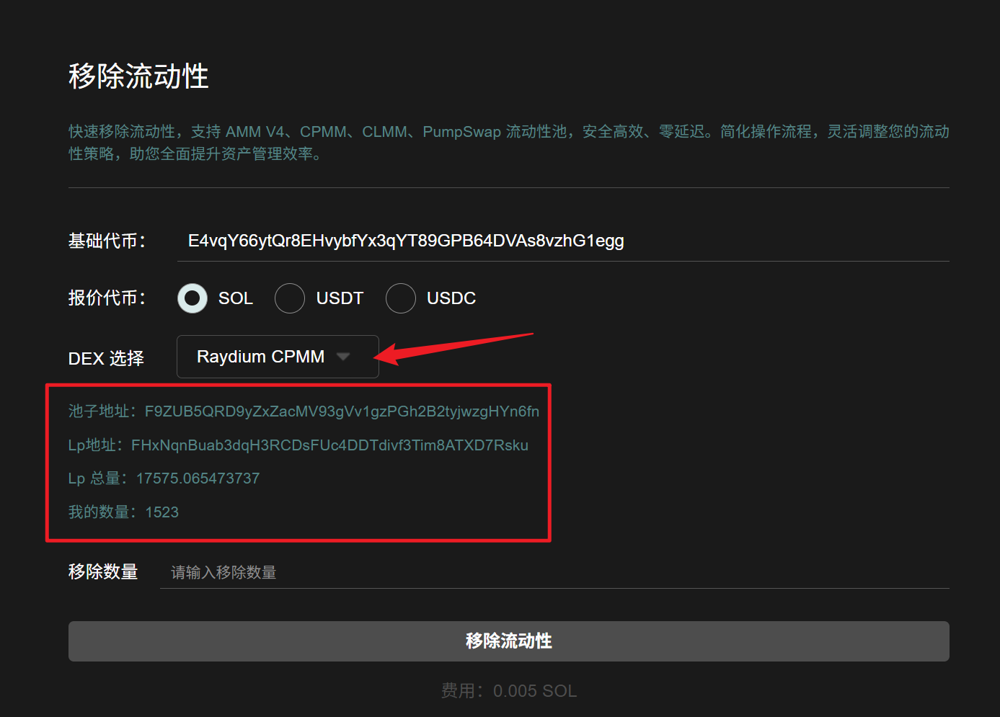
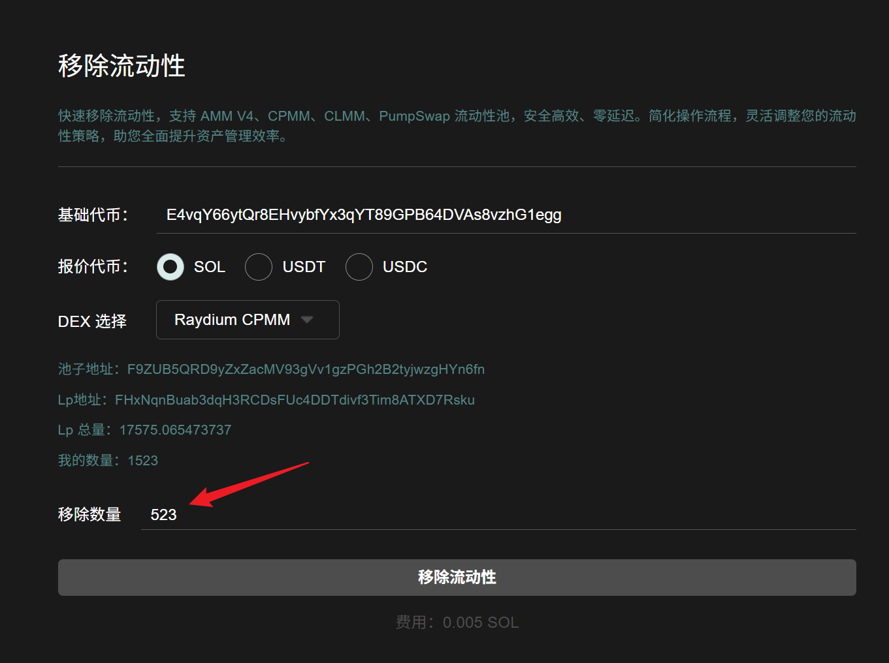
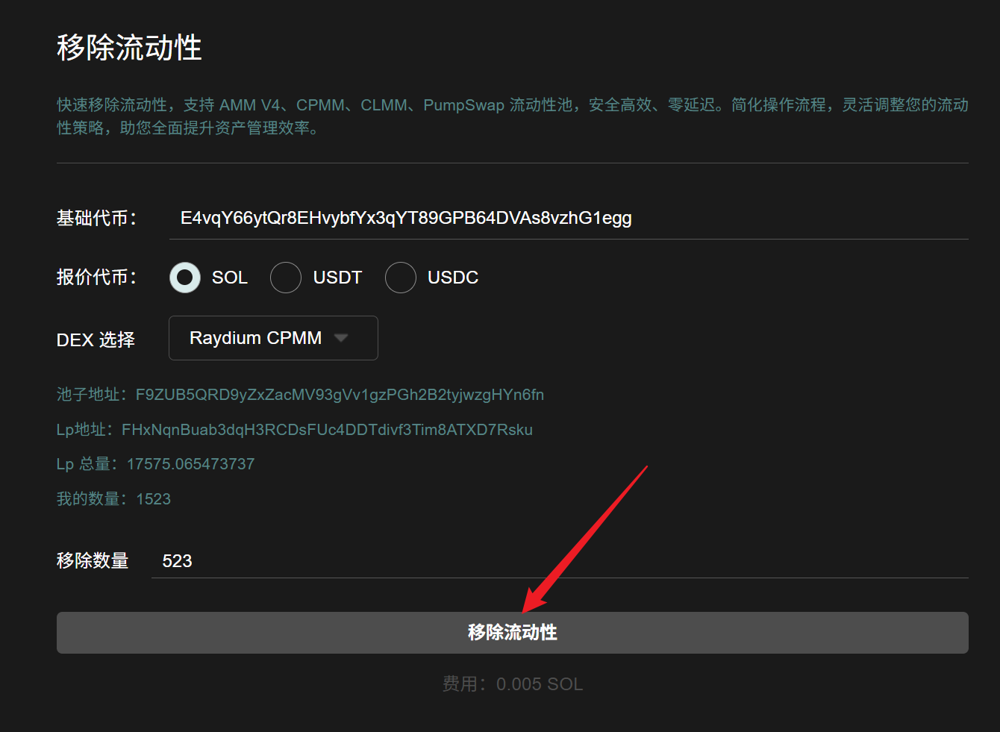

# Solana移除流动性教程

## 📌 核心摘要

* **功能定位：**&#x53;olana 生态高效的**链上资产赎回与流动性退场工具**。支持用户从 Raydium 等去中心化交易所（DEX）中安全、快速地撤回已添加的流动性持仓。
* **技术特性：**
  * **自动持仓识别：**&#x667A;能扫描钱包内的 LP Token 余额，精准定位并罗列可退出的流动性池。
  * **资产原路返还：**&#x901A;过底层智能合约交互，实现 LP 代币的自动销毁与对应成对资产（如 SOL+代币）的即时结算归集。
  * **低延迟交互响应：**&#x4F18;化链上交易路径，确保在不同市场环境下均能保持极高的移除成功率与上链速度。
* **应用价值：**&#x4E3A;用户提供极简的退场通道，将流动性份额重新转化为可流动的单一资产，是执行**资金调配、利润提取或策略调整**的关键环节。
* **目标受众：**&#x9700;灵活调整持仓比例的 DeFi 投资者、执行流动性策略轮换的职业交易员，以及需关闭过时交易池的项目方。

## 准备事项

1. 一台电脑或者一部手机
2. Solana 钱包（[幻影钱包Phantom安装教程](https://docs.gtokentool.com/solana/auxiliary-tutorial/phantom-wallet-installation)）
3. 钱包准备充足余额

## Solana移除流动性池流程

### 1. 连接钱包

进入GTokenTool 移除流动性页面，右上角选择 Main 网络并连接钱包。

移除流动性： [https://sol.gtokentool.com/zh-CN/liquidityManagement/remove](https://sol.gtokentool.com/zh-CN/liquidityManagement/remove)

<figure><figcaption>
连接钱包并选择网络
</figcaption></figure>

### 2. 输入基础代币地址

<figure><figcaption>
输入基础代币地址
</figcaption></figure>

### 3. 选择对应的报价代币

<figure><figcaption>
选择对应的报价代币
</figcaption></figure>

### 4. 选择对应的DEX

选择好后，下面会显示对应的池子信息以及我的持有量。（支持 Raydium AMM、Raydium CPMM、Raydium CLMM、PumpFun Swap流动性池)

<figure><figcaption>
选择对应的DEX
</figcaption></figure>

### 5. 输入移除数量

<figure><figcaption>
输入移除数量
</figcaption></figure>

### 4. 点击“移除流动性”

弹出钱包后，点击“`Confirm`”，完成交易。

<figure><figcaption>
点击“移除流动性”
</figcaption></figure>

## ❓常见问题 FAQ

### Q: 什么是移除流动性？

**A:** 退出资金池，销毁 LP，拿回自己的代币 + 报价代币。

### **Q:** 为什么拿到的币数量和当初不一样？

**A:** 受币价波动、交易手续费、滑点影响，数量会有浮动。选择波动性低的配对（如稳定币对）或者使用对冲工具（如期权）或仅在看好两种代币时提供流动性。

### **Q: 交易失败但扣除了 SOL 手续费？**

**A:** Solana 网络失败交易仍会消耗少量 Gas。检查网络状态（如 Solana Status），避开拥堵时段。确保钱包余额足够（建议预留 0.1 SOL）。

### Q: 为什么无法移除流动性？

**A:** LP 数量不足、钱包授权过期、RPC 卡顿、池子已枯竭、合约锁定 / 黑名单限制。

### Q: 部分移除和全部移除有什么区别？

**A:** 部分移除：保留部分流动性；全部移除：清空池子所有持仓。

### Q: 移除流动性后还能再加回去吗？

**A:** 可以，随时重新添加流动性。

### Q: 撤池失败交易报错怎么办？

**A:** 切换 RPC、清理缓存、重新连接钱包、小额尝试重试。

### 🤝 连接 GTokenTool 

* **💬 Telegram社群**：[点击加入官方群组](https://t.me/gtokentool)
* **🐦 Twitter (X)**：[关注我们获取最新动态](https://x.com/gtokentool)
* **📚 官方文档**：[查看 Gitbook 文档](https://docs.gtokentool.com/)
* **💻 开源代码**：[访问 GitHub 仓库](https://github.com/Gtokentool/docs/blob/master/SUMMARY.md)
* **📺 视频教程**：[订阅 YouTube 频道](https://www.youtube.com/@GTokenTool)

> ⚠️ 风险提示与免责声明
>
> GTokenTool 保留随时全权酌情因任何理由修改、变更或取消此公告的权利，无需事先通知。
>
> 以上信息内容仅供参考，GTokenTool 对本平台上的任何虚拟资产、产品或促销活动不做任何推荐或保证。虚拟资产的价格波动很大，投资交易虚拟资产将面临巨大风险。**请谨慎投资。**
