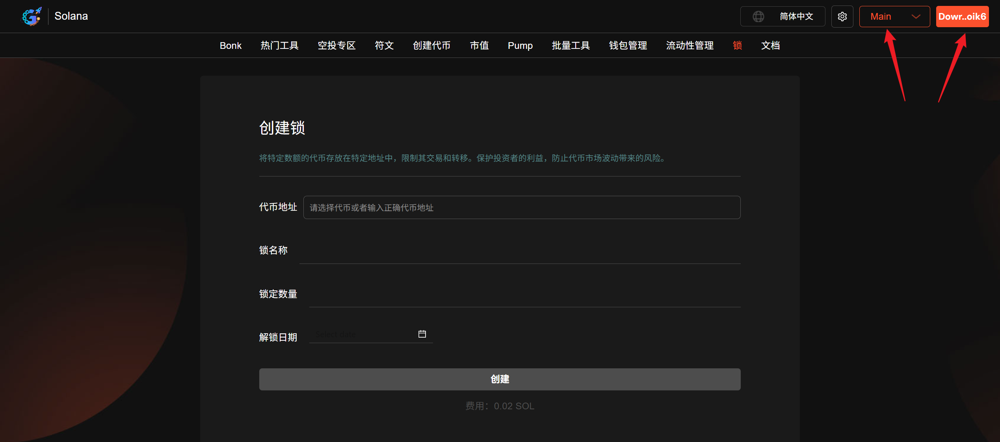
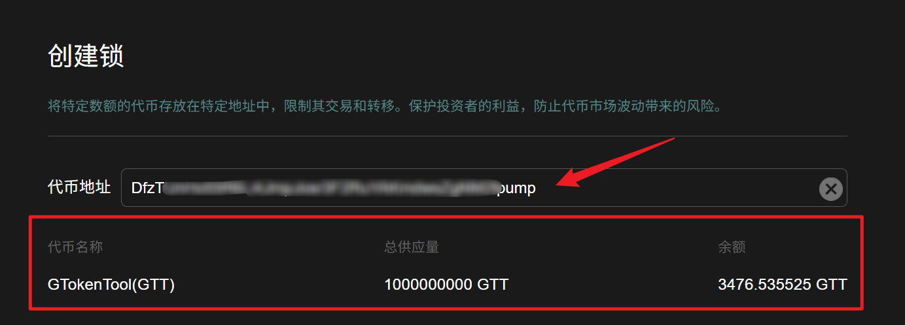
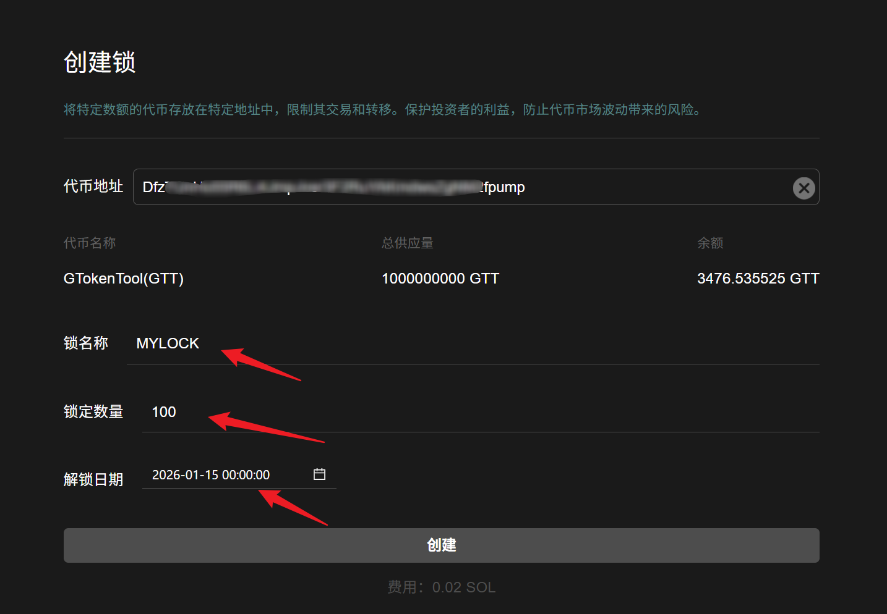
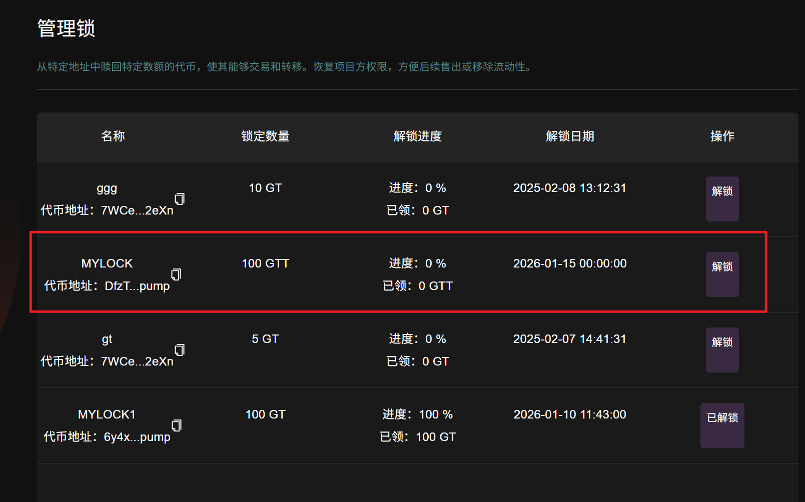

# 创建锁

## 准备事项

1.准备设备，一台电脑或手机

2.Solana 钱包（[幻影钱包Phantom安装教程](https://docs.gtokentool.com/solana/auxiliary-tutorial/phantom-wallet-installation)）

3.钱包内最少准备0.03个SOL

4.要锁定的代币

5.准备好翻墙软件（VPN/加速器），保证网络通畅

## 锁创建步骤

### 1. 连接钱包

进入创建锁页面（[https://sol.gtokentool.com/zh-CN/locks/createLock](https://sol.gtokentool.com/zh-CN/locks/createLock)），并且连接好钱包，选择 Main 网络节点。

<figure><figcaption></figcaption></figure>

### 2. 选择代币

选择好代币后，下面会显示代币信息以及钱包内代币余额。

<figure><figcaption></figcaption></figure>

### 3. 填写必要参数

**锁名称：**&#x4E3A;你的锁取一个名称。

**锁定数量：**&#x8BBE;置锁定代币数量（不能超过钱包余额）。

**解锁日期：**&#x8BBE;置解锁的日期。

<figure><figcaption></figcaption></figure>

### 4. 点击“创建”

弹出钱包后，点击确认。

创建成功后可在[管理锁](https://sol.gtokentool.com/zh-CN/locks/managementLock)页面查看。

<figure><figcaption></figcaption></figure>

GTokenTool社群:

Telegram：[**https://t.me/gtokentool**](https://t.me/gtokentool)

Twitter:  [**https://x.com/gtokentool**](https://x.com/gtokentool)

Gitbook：[**https://docs.gtokentool.com/**](https://docs.gtokentool.com/)

Github：[**https://github.com/Gtokentool/docs/blob/master/SUMMARY.md**](https://github.com/Gtokentool/docs/blob/master/SUMMARY.md)

YouTube：[**https://www.youtube.com/@GTokenTool**](https://www.youtube.com/@GTokenTool)\
\
\
<mark style="color:purple;background-color:orange;">**GTokenTool**</mark>_<mark style="color:purple;background-color:orange;">保留随时全权酌情因任何理由修改、变更或取消此公告的权利，无需事先通知。以上信息内容仅供参考，GTokenTool对本平台上的任何虚拟资产、产品或促销活动不做任何推荐或保证。虚拟资产的价格波动很大，投资交易虚拟资产将面临巨大风险。请谨慎投资。</mark>_
