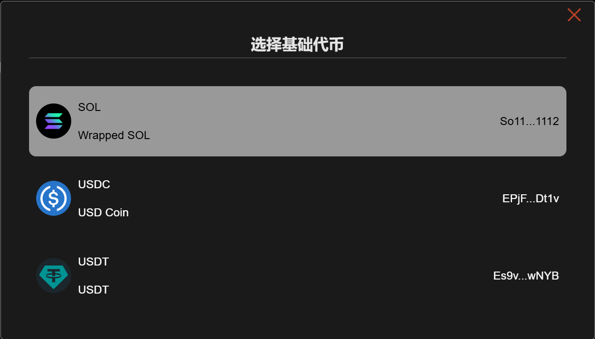

# 🖇️ Jup市值防夹刷量教程

## 📌核心摘要

* **技术原理（防夹机制）**：基于 **Jupiter 聚合器** 的路由优势，通过私有交易通道或智能路由算法，有效规避 Solana 链上常见的 **MEV 机器人（夹子攻击）**，保障交易价格不被恶意狙击。
* **核心功能（刷量与多账户）**：支持 **多账户批量管理** 与自动化分发，能够模拟真实用户行为进行高频刷量，提升代币的市场活跃度与交易量数据，同时优化资金使用效率。
* **执行优势（智能与低成本）**：具备 **智能拆单** 能力，将大额交易拆分执行以降低滑点；支持设定目标价格自动买卖，实现 **7x24 小时无人值守** 的高效运维，大幅降低人工成本与时间成本。

## 视频演示


视频教程


使用Jup市值机器人批量交易工具，轻松管理多个账户，高效执行批量交易，降低交易成本和时间，优化资金使用效率。

## 准备事项

1. 一台电脑或者一部手机
2. Solana 钱包（[幻影钱包Phantom安装教程](https://docs.gtokentool.com/solana/auxiliary-tutorial/phantom-wallet-installation)）
3. 要进行批量交易的钱包私钥
4. 批量交易所需代币
5. 一些 SOL 用于支付交易 GAS

## 注意事项

1. 机器人为`单路由`模式：即，SOL的池子，只能用SOL交易。USDC的池子，只能用USDC交易。
2. 机器人目前支持所有池子。
3. 刚开盘项目价格不稳定，往往需要`提高滑点`才能交易成功。
4. 交易失败的大部分原因都是这几种：余额不够（查看参数是否填写错误）、交易过期（节点速度慢）、没有按照流程操作（比如没查池子就开始交易）、矿工费较低（可以增加矿工费）。
5. 你的私钥不会存储在平台上，所有操作都是基于前端执行的，请放心使用。如果你比较担心，可以使用新的钱包操作。

## Jup市值管理机器人教程

### 1. 连接钱包

进入Jup市值管理机器人页面：[https://sol.gtokentool.com/zh-CN/market/jupMarket](https://sol.gtokentool.com/zh-CN/market/jupMarket)，右上角点击连接钱包并选择 Main 网络。

<figure><figcaption>
连接钱包并选择Main网络
</figcaption></figure>

### 2. 输入要进行批量交易的币种

通过输入代币合约来对代币进行搜索,并选择目标代币。

<figure><figcaption>
输入目标代币地址
</figcaption></figure>

<figure><figcaption>
选择基础代币
</figcaption></figure>

<figure><figcaption>
代币配置展示
</figcaption></figure>

### 3. 查看交易池代币的当前价格

选择完代币之后滑动到屏幕最下方的日志，查看当前的交易池代币的当前价格。点击`清空日志`则可以将日志信息清除，清除日志后若想再次确认交易池代币的当前价格，可点击`查池子`按钮。

<figure><figcaption>
查看当前价格
</figcaption></figure>

### 4. 导入批量钱包

导入批量钱包，查询钱包余额，点击`刷新钱包`可刷新钱包的余额。点击`全部删除`可删除全部钱包。勾选钱包后，点击`全部卖出`可直接卖出所选钱包内的全部目标代币。点击`删除`操作按钮可单独删除钱包。点击`卖出`即可卖出对应钱包内的全部目标代币。点击目标代币旁边的刷新图标可刷新钱包内目标代币余额。

<figure><figcaption>
导入批量钱包
</figcaption></figure>

### 5. 设置相关配置参数

**交易模式：**&#x62C9;盘→买入代币；砸盘→卖出代币；刷交易量→随机买入和卖出；防夹刷量。

**目标价格：**&#x62C9;盘模式下，<mark style="color:purple;">目标价格要高于当前代币价格</mark>。砸盘模式下，<mark style="color:purple;">目标价格要低于当前代币价格</mark>。

**金额：**&#x5728;拉盘模式下，这里的金额就是你所花费的SOL数量。在砸盘模式下，这里的金额就是你要出售的代币数量。

* 全部：一次性卖出所有代币，无视价格与滑点。
* 随机：根据设置的金额范围，随机买入/卖出代币。
* 固定：按照固定数额的SOL买入，或者按照固定数量的代币进行卖出。

**买入概率（%）：**&#x5237;交易量模式下，执行买入代币操作的概率。

**卖出概率（%）：**&#x5237;交易量模式下，执行卖出代币操作的概率。

**买入金额：**&#x4E70;入代币的金额范围。

**卖出金额百分比（%）：**&#x5356;出代币的百分比。

**卖出代币最小阈值：**&#x76EE;标代币还剩多少就不会卖出只会买入。

**执行间隔：**&#x6BCF;次买入或者卖出之间的执行间隔时间，以秒为单位。

**滑点：**&#x6BCF;笔交易所能接受的最大磨损成本。刚上线的代币，滑点要高一点。

**RPC：**&#x9ED8;认的节点是公共的，交易速度较慢，需要提高交易速度的可输入自己的rpc节点。

**自动选择DEX**：清楚DEX时，可以自己手动选择DEX。不清楚DEX时，可以开启这个选项。<mark style="color:purple;">若手动选择DEX交易不成功，请切换到自动选择DEX再次交易。</mark>

**Gas：**&#x4E00;定程度上决定了你的交易速度，矿工费给的越多，原则上交易速度相对越快。

* 默认：额外支出500000 gas，大概是0.000175 SOL左右。
* 快速：额外支出1000000 gas，大概是0.00035 SOL左右。
* 其他：可以自己输入自定义gas费。

**刷单轮数：**&#x8BBE;置交易次数。<mark style="color:purple;">若设置了这个，则到指定次数会自动停止交易，无需手动停止。</mark>所有钱包执行一遍为一轮。

**多线程：**&#x5F00;启多线程后，钱包之间会存在竞争，有小概率导致交易失败。

**Ultra 线路：**&#x55;ltra 线路费用为交换金额的 0.5%，请在普通线路不能用的时候开启。

**GMGN 线路**：GMGN 线路优先级最高，滑点最高设置 80%。

**智能滑点：**&#x542F;用智能滑点，如果当前交易的滑点高于上面设置的滑点，则不提交此次交易。可能会节省拉盘 Gas，如果不了解请关闭。


如果我们的节点不符合你所需线程的要求，请购买私人节点。

如果点击停止线程未停下，则多点几次停止，选择全部砸盘会自动停止。


**防夹刷量模式参数展示：**

<figure><figcaption>
防夹刷量模式参数展示
</figcaption></figure>

### 6. 开始批量交易

勾选钱包后，点击`开始`，即可开始交易。可实时查看交易日志。交易结束后，可以点击日志里的`查看哈希`，复制哈希前往[区块链浏览器](https://solscan.io/)查看交易记录。

<figure><figcaption>
交易日志
</figcaption></figure>


**注意**：该机器人主要是交易PUMP内盘币，如果已经发射上了Raydium，请使用另一款机器人，并选择Raydium AMM。


## ❓常见问题 FAQ

### Q: 为什么查不到我的池子？

**A:** 目前机器人不支持Token2022的代币，该类型的代币可能无法查到池子。

### Q: 导入多个地址进行防夹刷量，次数是单地址次数还是总次数？

**A:** 次数是所有地址的总次数。每个地址买+卖一笔，即为一次。所有钱包轮循进行刷量，直到总次数达到设定值。

### Q: 这个机器人能冲土狗吗？

**A:** 市值管理机器人是为了项目方控盘用的，不是用来开盘冲土狗的。尽管可以用它来进行交易，但是并不会像市面上的PEPE BOT一样可以快速买入卖出，暂时没有这个功能。

### Q: 最多可以导入多少钱包？

**A:** 为了确保操作的稳定性和流畅性，一次性导入的钱包数量最好低于100个。

### Q: 平台会拿到你的私钥吗？

**A:** 绝对不可能，你的私钥不会存储在平台上，所有操作都是基于前端执行的，请放心使用。如果你比较担心，可以使用新的钱包操作。

### 🤝 连接 GTokenTool 

* **💬 Telegram社群**：[点击加入官方群组](https://t.me/gtokentool)
* **🐦 Twitter (X)**：[关注我们获取最新动态](https://x.com/gtokentool)
* **📚 官方文档**：[查看 Gitbook 文档](https://docs.gtokentool.com/)
* **💻 开源代码**：[访问 GitHub 仓库](https://github.com/Gtokentool/docs/blob/master/SUMMARY.md)
* **📺 视频教程**：[订阅 YouTube 频道](https://www.youtube.com/@GTokenTool)

> ⚠️ 风险提示与免责声明
>
> GTokenTool 保留随时全权酌情因任何理由修改、变更或取消此公告的权利，无需事先通知。
>
> 以上信息内容仅供参考，GTokenTool 对本平台上的任何虚拟资产、产品或促销活动不做任何推荐或保证。虚拟资产的价格波动很大，投资交易虚拟资产将面临巨大风险。**请谨慎投资。**
