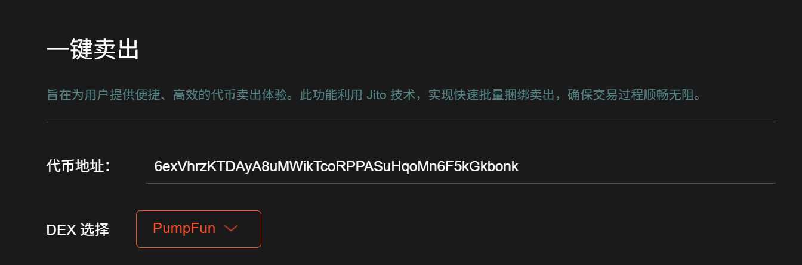
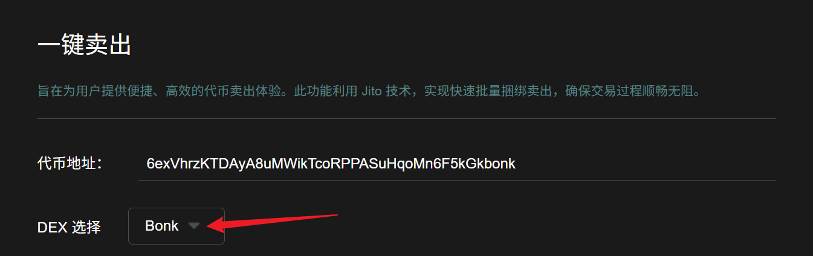
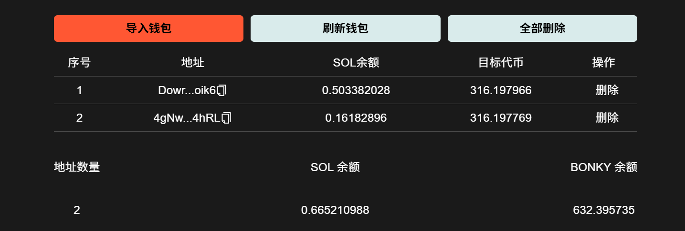
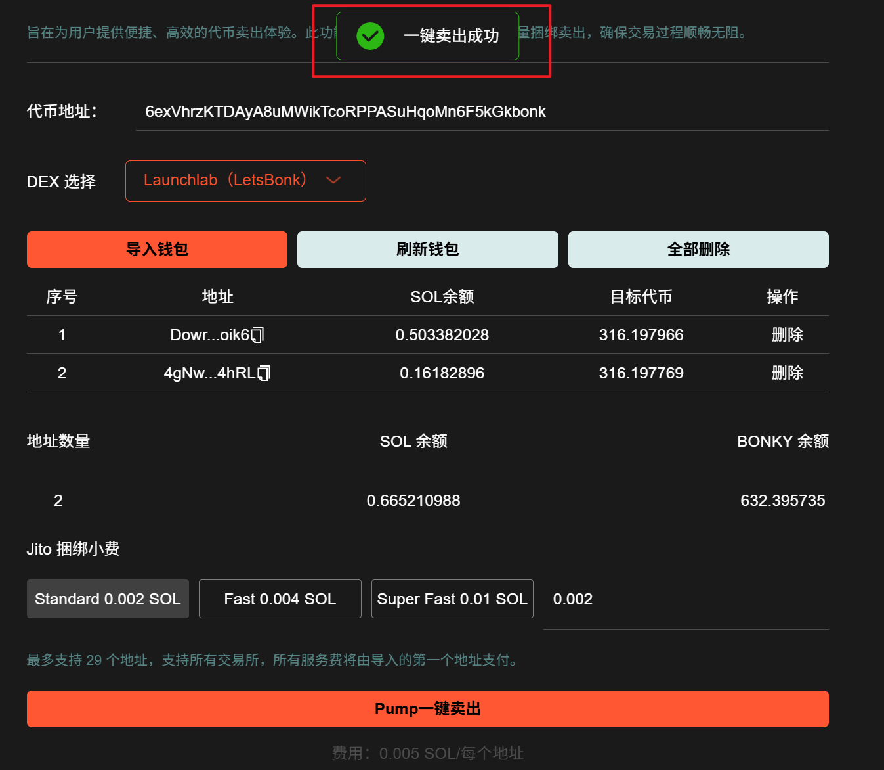
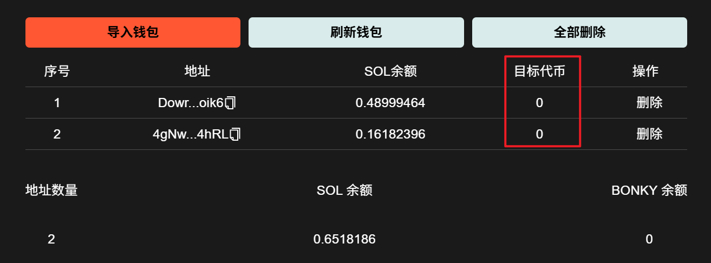

# Letsbonk一键卖出工具教程

## 视频演示



## 准备事项

1. 一台电脑或者一部手机
2. Solana 钱包（[幻影钱包Phantom安装教程](https://docs.gtokentool.com/solana/auxiliary-tutorial/phantom-wallet-installation)）
3. 钱包私钥
4. 代币
5. GAS费用

## Letsbonk一键卖出流程

### 1. 连接钱包

Pump一键卖出：[https://sol.gtokentool.com/zh-CN/pump/pumpSell](https://sol.gtokentool.com/zh-CN/pump/pumpSell)

进入 Solana 一键卖出页面，右上角支持切换成中文。选择 Main 网络并连接钱包。

<figure><figcaption></figcaption></figure>

### 2. 输入代币合约地址

<figure><figcaption></figcaption></figure>

### 3. 选择DEX

选择要卖出代币的池子类型，若不清楚池子类型，直接选择Jup。

<figure><figcaption></figcaption></figure>

### 4. 导入批量交易钱包


**注意：**&#x4EA4;易之前请刷新钱包，获取钱包最新余额。<mark style="color:red;">所有服务费将由导入的第一个地址支付。</mark>


<figure><figcaption></figcaption></figure>

### 5. 设置捆绑小费

<figure><figcaption></figcaption></figure>


Jito EVM小费：Jito 小费可以简单理解为用户选择支付给矿工的“贿赂”费用，提高交易的优先级，费用越高，交易上链速度越快。


### 6. 点击“Pump一键卖出”


一键卖出功能最多支持 29 个地址同时捆绑卖出，每个地址的服务费最低仅为 0.005 SOL，所有服务费将由导入的第一个地址支付。<mark style="color:red;">请保证导入的第一个地址有足够 SOL 余额。</mark>


交易完成会弹出交易成功的提示。

<figure><figcaption></figcaption></figure>

还可以点击`刷新钱包`查看是否卖出成功。

<figure><figcaption></figcaption></figure>

[_**GTokenTool | 创建代币、批量空投和做市机器人等Solana工具集**_](https://sol.gtokentool.com)

**安全、开源，给Solana用户带来最便利的一站式体验。**

GTokenTool社群:

Telegram：[**https://t.me/gtokentool**](https://t.me/gtokentool)

Twitter:  [**https://x.com/gtokentool**](https://x.com/gtokentool)

Gitbook：[**https://docs.gtokentool.com/**](https://docs.gtokentool.com/)

Github：[**https://github.com/Gtokentool/docs/blob/master/SUMMARY.md**](https://github.com/Gtokentool/docs/blob/master/SUMMARY.md)

YouTube：[**https://www.youtube.com/@GTokenTool**](https://www.youtube.com/@GTokenTool)\
\
\
\
<mark style="color:purple;background-color:orange;">**GTokenTool**</mark>_<mark style="color:purple;background-color:orange;">保留随时全权酌情因任何理由修改、变更或取消此公告的权利，无需事先通知。以上信息内容仅供参考，GTokenTool对本平台上的任何虚拟资产、产品或促销活动不做任何推荐或保证。虚拟资产的价格波动很大，投资交易虚拟资产将面临巨大风险。请谨慎投资。</mark>_
