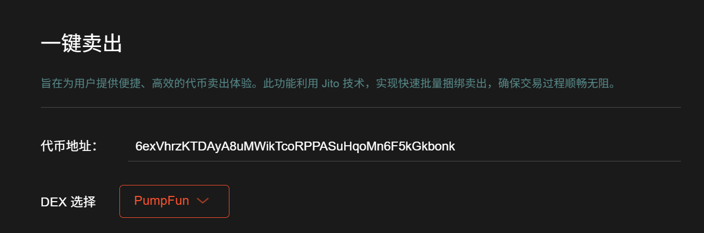
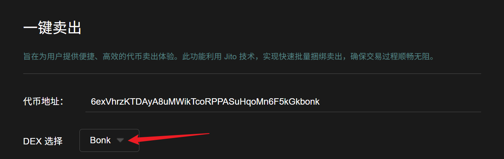
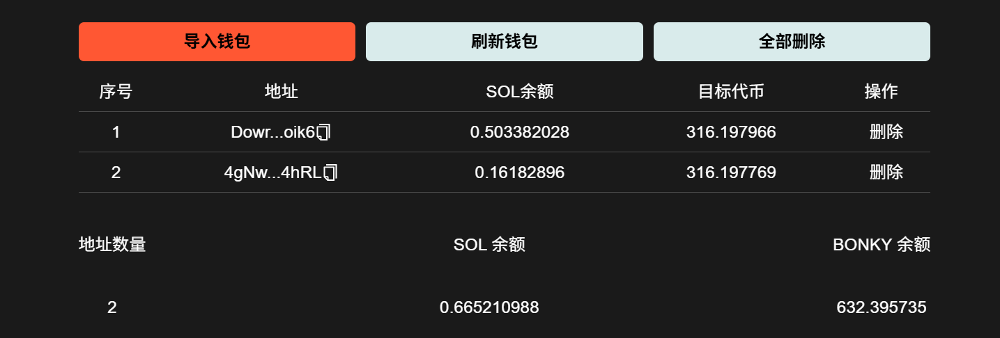
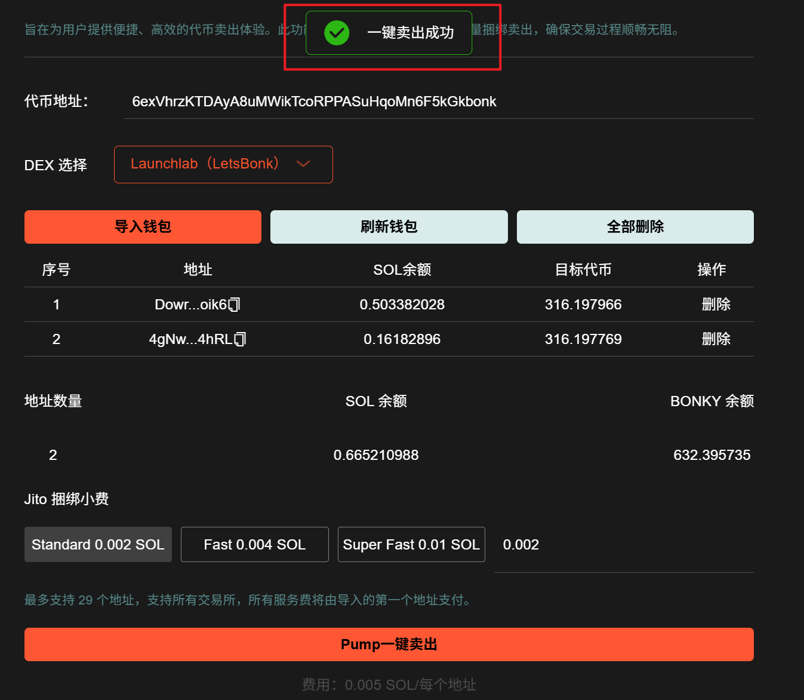
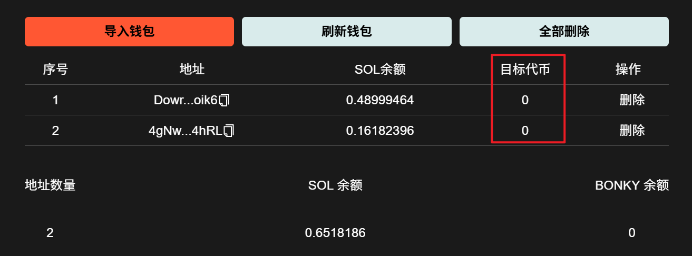

# Letsbonk一键卖出教程

## 📌核心摘要

* **平台背景（Letsbonk生态）**：专为 **Letsbonk** 平台（Solana链上BONK与Raydium合作的Launchpad）设计的代币退出策略工具，针对该平台的交易机制进行深度优化。
* **核心功能（一键砸盘）**：提供**多地址代币归集与批量卖出**功能。支持用户将分散在多个钱包中的代币瞬间归集至单一地址，并执行原子化批量卖出，实现高效清仓与砸盘。
* **技术优势（Jito加速）**：底层集成 **Jito 技术**，通过快速批量捆绑交易，有效规避网络拥堵与交易失败风险，确保在 Letsbonk 交易过程中的畅通无阻，从而**实现利润最大化**。

## 视频演示



## 准备事项

1. 一台电脑或者一部手机
2. Solana 钱包（[幻影钱包Phantom安装教程](https://docs.gtokentool.com/solana/auxiliary-tutorial/phantom-wallet-installation)）
3. 钱包私钥
4. 代币
5. GAS费用

## Letsbonk一键卖出流程

### 1. 连接钱包

Pump一键卖出：[https://sol.gtokentool.com/zh-CN/pump/pumpSell](https://sol.gtokentool.com/zh-CN/pump/pumpSell)

进入 Solana 一键卖出页面，右上角支持切换成中文。选择 Main 网络并连接钱包。

<figure><figcaption>
连接钱包并选择Main网络
</figcaption></figure>

### 2. 输入代币合约地址

<figure><figcaption>
输入代币地址
</figcaption></figure>

### 3. 选择DEX

选择要卖出代币的池子类型，若不清楚池子类型，直接选择Jup。

<figure><figcaption>
选择对应DEX
</figcaption></figure>

### 4. 导入批量交易钱包


**注意：**&#x4EA4;易之前请刷新钱包，获取钱包最新余额。<mark style="color:red;">所有服务费将由导入的第一个地址支付。</mark>


<figure><figcaption>
导入交易钱包
</figcaption></figure>

### 5. 设置捆绑小费

<figure><figcaption>
设置Jito小费
</figcaption></figure>


Jito EVM小费：Jito 小费可以简单理解为用户选择支付给矿工的“贿赂”费用，提高交易的优先级，费用越高，交易上链速度越快。


### 6. 点击“Pump一键卖出”


一键卖出功能最多支持 29 个地址同时捆绑卖出，每个地址的服务费最低仅为 0.005 SOL，所有服务费将由导入的第一个地址支付。<mark style="color:red;">请保证导入的第一个地址有足够 SOL 余额。</mark>


交易完成会弹出交易成功的提示。

<figure><figcaption>
一键卖出成功提示
</figcaption></figure>

还可以点击`刷新钱包`查看是否卖出成功。

<figure><figcaption>
刷新代币余额
</figcaption></figure>

## ❓常见问题 FAQ

### Q: 什么是一键卖出？

**A:** 一键卖出是指一次性打包多个地址或交易指令，统一发送卖出请求，提高效率和优先级。

### Q: 使用一键卖出的优势是什么？

**A:** 可提升成交速度、减少滑点，并避免因手动延迟而错过最佳卖出时机。

### Q: Jito 技术在捆绑卖出中起什么作用？

**A:** Jito 可优先处理打包交易，有助于在高峰时段顺利完成卖出操作。

### Q: 最多支持多少个地址捆绑卖出？

**A:** 最多支持 29 个地址捆绑卖出，所有服务费由创建的钱包支付。

### 🤝 连接 GTokenTool 

* **💬 Telegram社群**：[点击加入官方群组](https://t.me/gtokentool)
* **🐦 Twitter (X)**：[关注我们获取最新动态](https://x.com/gtokentool)
* **📚 官方文档**：[查看 Gitbook 文档](https://docs.gtokentool.com/)
* **💻 开源代码**：[访问 GitHub 仓库](https://github.com/Gtokentool/docs/blob/master/SUMMARY.md)
* **📺 视频教程**：[订阅 YouTube 频道](https://www.youtube.com/@GTokenTool)

> ⚠️ 风险提示与免责声明
>
> GTokenTool 保留随时全权酌情因任何理由修改、变更或取消此公告的权利，无需事先通知。
>
> 以上信息内容仅供参考，GTokenTool 对本平台上的任何虚拟资产、产品或促销活动不做任何推荐或保证。虚拟资产的价格波动很大，投资交易虚拟资产将面临巨大风险。**请谨慎投资。**
