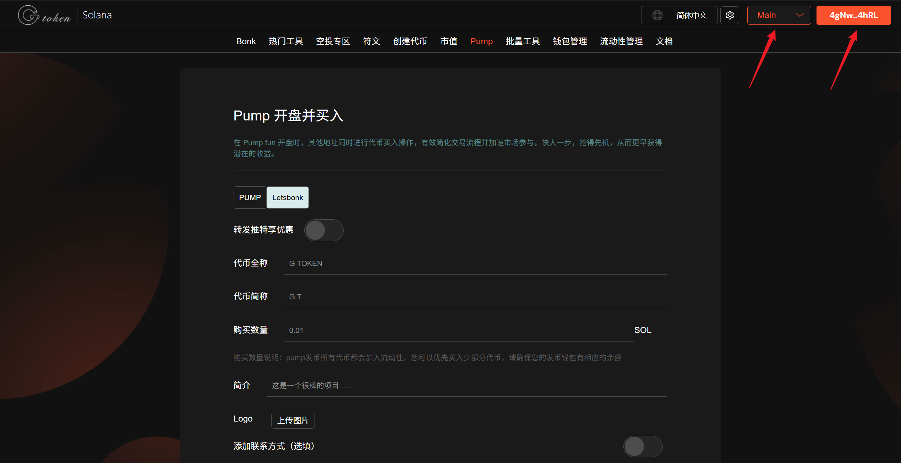

# Letsbonk一键发币并捆绑买入教程


**Letsbonk创建代币并捆绑买入 | 批量交易 | 抢得交易先机｜全网最低费用**

创建代币的同时进行代币买入操作，有效简化交易流程并加速市场参与，快人一步，抢得先机，从而更早获得潜在的收益。

[立即体验-->>](https://sol.gtokentool.com/zh-CN/pump/letsbonk)


## Letsbonk是什么

Letsbonk.fun 是一个由 Solana 区块链上的迷因币项目 BONK 与去中心化交易所 Raydium 合作开发的迷因币发行平台（Launchpad）。该平台旨在为用户提供一个简单、透明且用户友好的环境，用于创建和推出基于 Solana 的迷因币，解决迷因币市场中常见的掠夺性行为和缺乏透明度的问题。

## 视频教程



## 如何使用Letsbonk发币与捆绑买入工具

1. 连接钱包（幻影钱包）
2. 输入代币全称，最多32个字符
3. 填写代币简称，最多10个字符
4. 填写购买数量
5. 填写简介
6. 上传代币的Logo图片
7. 官网（选填）
8. 电报（选填）
9. 推特（选填）
10. Jito 小费设置
11. 捆绑买入钱包设置，最大支持12个钱包
12. 提交完成Letsbonk发币与同时买入

## Letsbonk发币准备事项

1. Solana 钱包（[幻影钱包Phantom安装教程](https://docs.gtokentool.com/solana/auxiliary-tutorial/phantom-wallet-installation)）
2. 代币的相关信息和 Logo

## Letsbonk发币步骤

### 一、连接钱包

Letsbonk发币和开盘捆绑买入工具：[https://sol.gtokentool.com/zh-CN/LetsBonk/createToken](https://sol.gtokentool.com/zh-CN/LetsBonk/createToken)

进入GTokenTool一键平台Letsbonk发币页面，选择 Main 网络，连接钱包，选择幻影钱包Phantom，连接后就可以看到钱包地址。

<figure><figcaption></figcaption></figure>

### 二、必填代币相关参数


**注意**：此处购买数量由<mark style="color:red;">当前连接钱包</mark>支付，当前连接钱包余额要大于创建基本费用+平台服务费+购买数量+0.07。


<figure><figcaption></figcaption></figure>

### 三、选填代币相关参数

根据自己的需求进行填写或者不填。

<figure><figcaption></figcaption></figure>

### 四、导入小号优先买入代币


Letsbonk（每个 0.03 SOL）最多导入 12 个钱包，发币前请确保每个钱包资金来源不一样。

**特别说明**：<mark style="color:purple;">购买数量最好不要超过当前钱包的90%，最少预留0.007 SOL（最好预留10%）</mark>。不会填写请咨询我们再操作。

创建失败请增加 jito 小费，失败不扣钱。

<mark style="color:purple;">所有服务费由创建代币的钱包支付。</mark>


打开导入小号优先买入代币选项。设置Jito捆绑小费，点击“`导入钱包`”，输入钱包私钥。

导入成功后，可以看到钱包内的余额。填写买入金额，<mark style="color:purple;">注意购买数量最好不要超过当前钱包的90%，最少预留0.007 SOL。</mark>

<figure><figcaption></figcaption></figure>

### 五、完成创建

所有信息填写完成后，核对信息无误后，点击`立即创建`，完成Letsbonk发币与开盘买入。

创建成功后，会有弹窗显示创建好的代币合约地址。

<figure><figcaption></figcaption></figure>

之后可以在Letsbonk官网上查看到刚才创建的代币，在gmgn上也可以看到刚才捆绑买入的交易记录。


此功能实现依赖于 Jito 的捆绑功能。由于网络环境、Jito节点、RPC节点和区块处理引擎的复杂影响，该功能可能面临较高的失败率。 若操作失败，不会开盘成功也不会产生任何费用，请尝试更换RPC节点，区块处理引擎，增加Jito的小费(建议0.01 SOL)，并考虑在链上活跃度较低的时段再次尝试。


[_**GTokenTool | 创建代币、批量空投和做市机器人等Solana工具集**_](https://sol.gtokentool.com)

**安全、开源，给Solana用户带来最便利的一站式体验。**

GTokenTool社群:

Telegram：[**https://t.me/gtokentool**](https://t.me/gtokentool)

Twitter:  [**https://x.com/gtokentool**](https://x.com/gtokentool)

Gitbook：[**https://docs.gtokentool.com/**](https://docs.gtokentool.com/)

Github：[**https://github.com/Gtokentool/docs/blob/master/SUMMARY.md**](https://github.com/Gtokentool/docs/blob/master/SUMMARY.md)

YouTube：[**https://www.youtube.com/@GTokenTool**](https://www.youtube.com/@GTokenTool)\
\
\
<mark style="color:purple;background-color:orange;">**GTokenTool**</mark>_<mark style="color:purple;background-color:orange;">保留随时全权酌情因任何理由修改、变更或取消此公告的权利，无需事先通知。以上信息内容仅供参考，GTokenTool对本平台上的任何虚拟资产、产品或促销活动不做任何推荐或保证。虚拟资产的价格波动很大，投资交易虚拟资产将面临巨大风险。请谨慎投资。</mark>_
