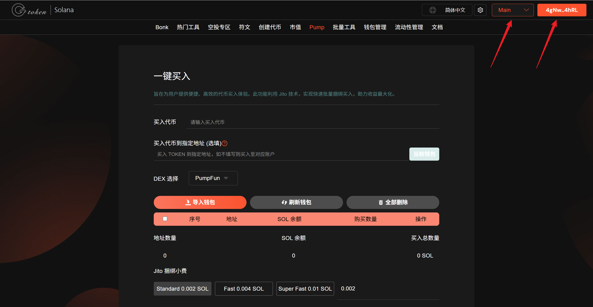
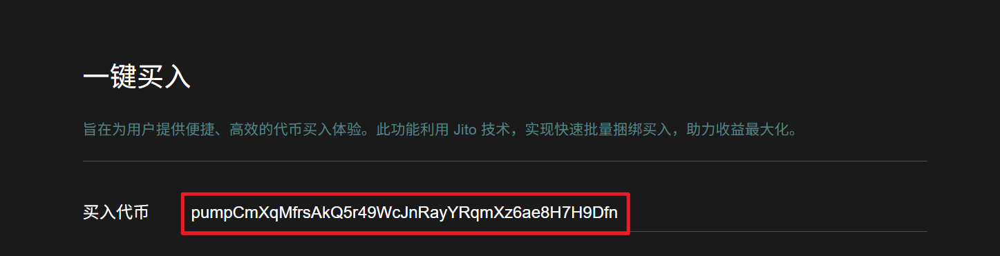
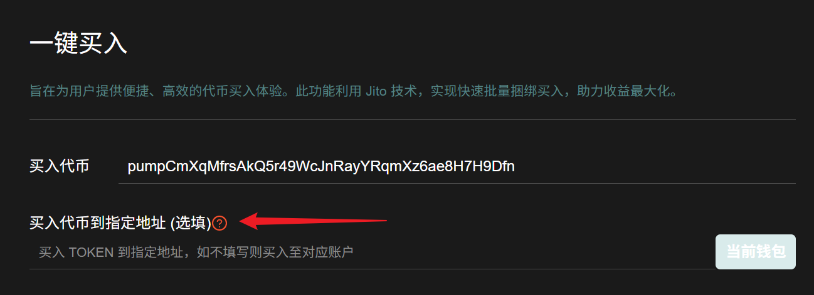
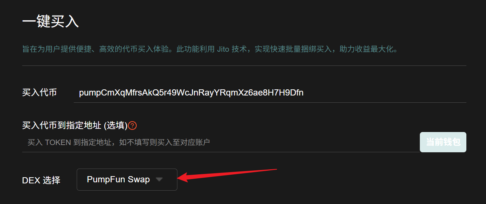
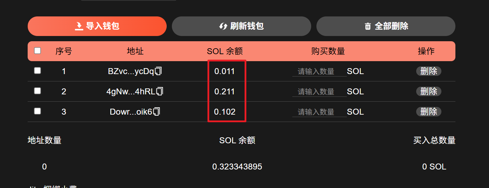
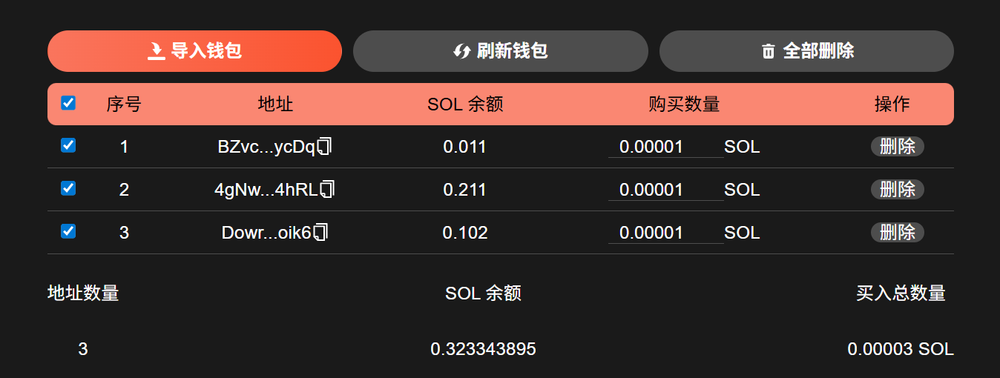
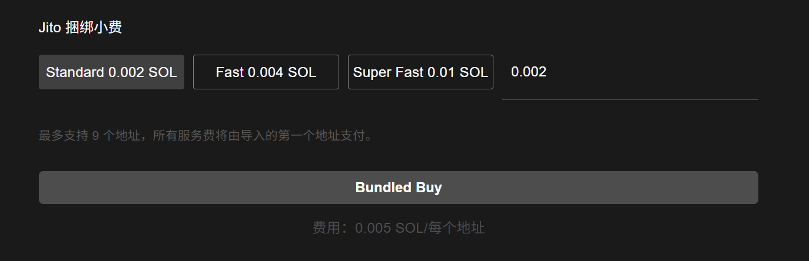
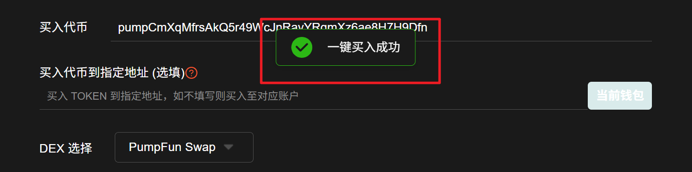

# Pump一键买入教程


<mark style="color:green;">**Pump.fun一键买入 | 多地址批量买入 | 捆绑买入 | 高效交易体验**</mark>

<mark style="color:blue;">多地址捆绑买入功能，支持10个地址批量同时买入，所有交易捆绑在同一区块内成交，实现分散地址同时快速拉盘的效果。</mark>

<mark style="color:blue;">旨在为用户提供便捷、高效的代币买入体验。利用Jito技术，实现快速批量捆绑卖入，确保交易过程顺畅无阻。</mark>


## 📌核心摘要

* **平台背景（Pump.fun生态）**：专为 **Pump.fun** 平台设计的高效建仓工具，针对该平台独特的联合曲线机制，提供多地址批量买入策略支持。
* **核心功能（多地址捆绑拉盘）**：支持**10个地址**同时进行批量买入，所有交易捆绑在同一区块内成交。通过分散地址同时快速拉盘，实现筹码的高效收集与价格推动。
* **技术优势（Jito加速）**：底层集成 **Jito 技术**，通过快速批量捆绑交易，有效规避网络拥堵与交易失败风险，确保在 Pump 交易过程中的畅通无阻，从而**实现利润最大化**。

## 视频演示



## 准备事项

1. 电脑或手机
2. Solana 钱包（[幻影钱包Phantom安装教程](https://docs.gtokentool.com/solana/auxiliary-tutorial/phantom-wallet-installation)）
3. 钱包私钥
4. GAS费用

## Pump多地址捆绑买入流程

### 1、钱包连接

Pump多地址捆绑买入：[https://sol.gtokentool.com/zh-CN/pump/pumpBuy](https://sol.gtokentool.com/zh-CN/pump/pumpBuy)

通过上面的链接进入Pump多地址捆绑买入页面，选择 Main 网络并连接钱包。连接好钱包，就可以看到钱包地址。

<figure><figcaption>
连接钱包并选择Main网络
</figcaption></figure>

### 2、输入代币地址

<figure><figcaption>
输入代币地址
</figcaption></figure>

### 3、买入代币到指定地址（可选）

<mark style="color:purple;">捆绑买入功能支持多地址买入时，代币直接到指定地址，如不填写则买入至对应账户中。</mark>

<figure><figcaption>
买入代币到指定地址
</figcaption></figure>

### 4、选择 DEX

如果Pump开盘代币已在Raydium上线，则选择 Raydium。请选择代币对应的池子类型。

<figure><figcaption>
选择对应DEX
</figcaption></figure>

### 5、导入私钥

导入完成后可以查看到导入地址的 SOL 余额。

<figure><figcaption>
导入钱包
</figcaption></figure>

### 6、设置买入金额

<mark style="color:purple;">多地址捆绑买入的服务费均由第一个地址支付，确保导入的第一个地址中有足够余额。</mark>

填好购买数量后，可以勾选好要进行买入的钱包，下面会显示对应的买入总数量。

<figure><figcaption>
设置买入金额
</figcaption></figure>

### 7、设置 Jito 小费

<mark style="color:purple;">Jito 小费可以简单理解为用户选择支付给矿工的“贿赂”费用，提高交易的优先级，费用越高，交易上链速度越快。</mark>

<mark style="color:purple;">Jito 小费支持快捷选择或者自定义。</mark>

<figure><figcaption>
设置Jito小费
</figcaption></figure>

### 8、执行买入

<mark style="color:purple;">链上数据不可逆，请务必核实相关数据无误。</mark>

如果地址较多的话可能耗时稍久，需要生成多笔交易，还请耐心等待。

<figure><figcaption>
一键买入成功提示
</figcaption></figure>

交易成功后，可以到链上查看交易记录。


<mark style="color:red;">**安全提醒：**</mark>

* 保护私钥：GTokenTool只在本地计算并用于签署交易，绝不收集或上传您的私钥或敏感信息。
* 小额钱包推荐：建议使用小额钱包进行操作，避免存放大额资金。
* 安全复制私钥：复制私钥时，请打乱顺序并分段复制，以防止剪贴板数据被恶意软件监控。
* 官方不索要私钥：GTokenTool绝不会要求您提供私钥信息，请保持警惕。


## **❓常见问题 FAQ**

### Q: 什么是一键买入功能？

**A:** 一键买入是指一次性打包多个地址或交易指令，统一发送买入请求，提高效率和优先级。

### Q: 一键捆绑买入和普通买入有什么区别？

**A:** 一键捆绑买入更快、抗滑点能力强，并可借助 Jito 提高抢跑成功率。

### Q: 一键捆绑买入使用 Jito 技术的作用是什么？

**A:** Jito 可将交易插入 MEV 优先池，提升确认速度，抢占低价区间。

### Q: 最多支持捆绑多少个地址？

**A:** 不同 DEX 支持数量不同，以页面说明为准。例如，Raydium 最多支持15个地址，所有服务费将由导入的第一个地址支付。

### Q: 一键捆绑买入会增加 Gas 费用吗？

**A:** 较普通交易略高，但在抢跑场景中通常成本远低于收益。

### 🤝 连接 GTokenTool 

* **💬 Telegram社群**：[点击加入官方群组](https://t.me/gtokentool)
* **🐦 Twitter (X)**：[关注我们获取最新动态](https://x.com/gtokentool)
* **📚 官方文档**：[查看 Gitbook 文档](https://docs.gtokentool.com/)
* **💻 开源代码**：[访问 GitHub 仓库](https://github.com/Gtokentool/docs/blob/master/SUMMARY.md)
* **📺 视频教程**：[订阅 YouTube 频道](https://www.youtube.com/@GTokenTool)

> ⚠️ 风险提示与免责声明
>
> GTokenTool 保留随时全权酌情因任何理由修改、变更或取消此公告的权利，无需事先通知。
>
> 以上信息内容仅供参考，GTokenTool 对本平台上的任何虚拟资产、产品或促销活动不做任何推荐或保证。虚拟资产的价格波动很大，投资交易虚拟资产将面临巨大风险。**请谨慎投资。**
