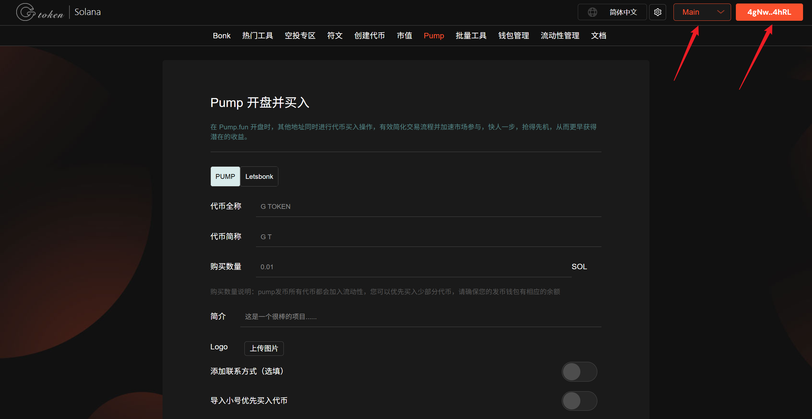
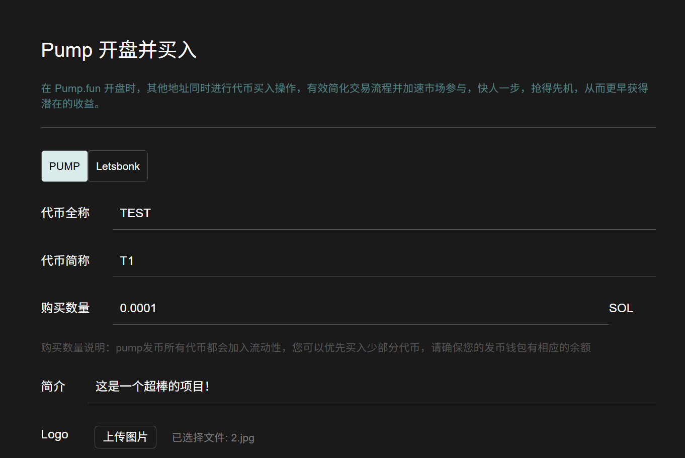
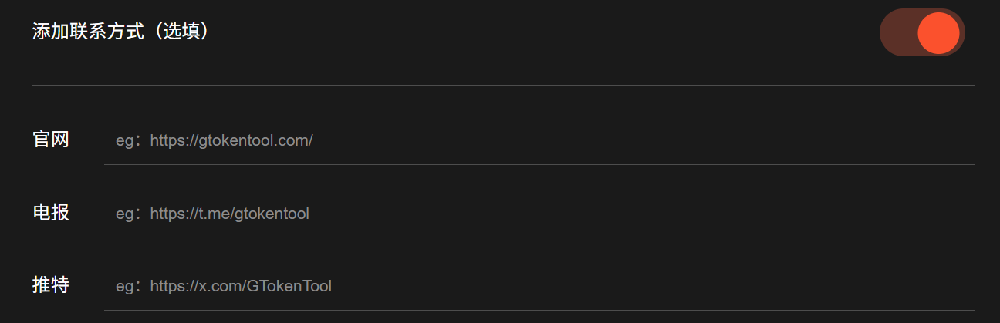
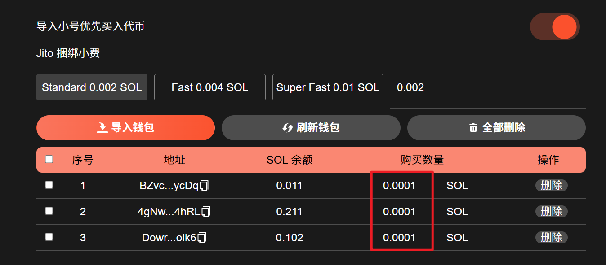
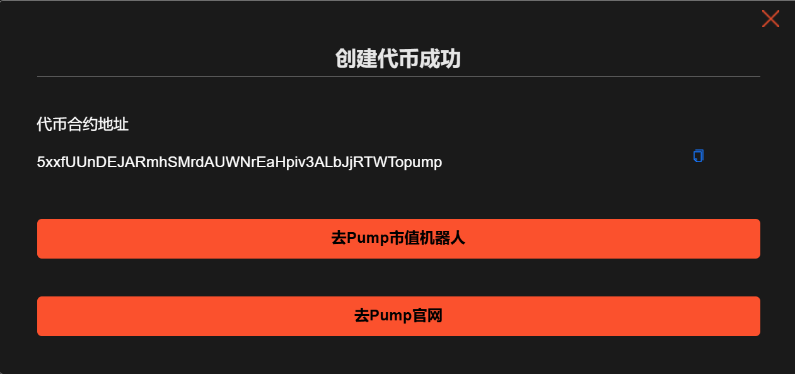

# 💊 PUMP发币和捆绑买入教程（2025年8月最新教程）

‌Pump.fun是Solana链上的一个MEME币发行平台，是近半年来Solana链最成功、最流行、最热门的应用。GTokenTool考虑到大家在PUMP发币与开盘提前买入，上线了PUMP发币和捆绑买入工具，方便大家在PUMP发币后第一时间买入。

## 视频演示



## 如何使用Pump发币与捆绑买入工具

1. 连接钱包（幻影钱包）
2. 输入代币全称，最多32个字符
3. 填写代币简称，最多10个字符
4. 填写购买数量
5. 填写简介
6. 上传代币的Logo图片
7. 官网（选填）
8. 电报（选填）
9. 推特（选填）
10. Jito 小费设置
11. 捆绑买入钱包设置，最大支持16个钱包
12. 提交完成Pump发币与同时买入

## PUMP发币准备事项

1. Solana 钱包（[幻影钱包Phantom安装教程](https://docs.gtokentool.com/solana/auxiliary-tutorial/phantom-wallet-installation)）
2. 钱包最少准备 0.1 SOL
3. 代币的相关信息和 Logo

## PUMP发币步骤

### 一、连接钱包

PUMP发币和开盘捆绑买入工具：[https://sol.gtokentool.com/zh-CN/pump/bundle](https://sol.gtokentool.com/zh-CN/pump/bundle)

进入GTokenTool平台Pump发币入页面，选择 Main 网络，连接钱包，选择幻影钱包Phantom，连接后就可以看到钱包地址。

<figure><figcaption></figcaption></figure>

### 二、必填代币相关参数

<figure><figcaption></figcaption></figure>

### 三、选填代币相关参数

根据自己的需求进行填写或者不填。

<figure><figcaption></figcaption></figure>

### 四、导入小号优先买入代币


Pump（每个 0.03 SOL）最多导入 16 个钱包，发币前请确保每个钱包资金来源不一样。

**特别说明**：<mark style="color:purple;">购买数量最好不要超过当前钱包的90%，最少预留0.007 SOL（最好预留10%）</mark>。不会填写请咨询我们再操作。

创建失败请增加 jito 小费，失败不扣钱。

<mark style="color:purple;">所有服务费由创建代币的钱包支付。</mark>


打开导入小号优先买入代币选项。设置Jito捆绑小费，点击“`导入钱包`”，输入钱包私钥。

导入成功后，可以看到钱包内的余额。填写买入金额，<mark style="color:purple;">注意购买数量最好不要超过当前钱包的90%，最少预留0.007 SOL。</mark>

<figure><figcaption></figcaption></figure>

### 五、完成创建

所有信息填写完成后，点击`立即创建`，完成Pump发币与开盘买入。

<figure><figcaption></figcaption></figure>


此功能实现依赖于 Jito 的捆绑功能。由于网络环境、Jito节点、RPC节点和区块处理引擎的复杂影响，该功能可能面临较高的失败率。 若操作失败，不会开盘成功也不会产生任何费用，请尝试更换RPC节点，区块处理引擎，增加Jito的小费(建议0.01SOL)，并考虑在链上活跃度较低的时段再次尝试。


## **常见问题解答（FAQ）**

### **1. 代币创建后如何推广？**

* 在 Pump.fun 的“新代币”列表展示。
* 通过社交媒体（Twitter、Telegram）和社区宣传。

### **2. 为什么我的代币无法交易？**

* **流动性不足**：需确保添加了足够的流动性。
* **税费过高**：如果买卖税设置过高（如 20%），用户可能不愿交易。
* **未通过审核**：部分平台会审核代币，需等待或联系支持。

### **3. 如何防止代币被狙击（Sniping）？**

* 启用反机器人机制（如交易延迟、最大单笔交易量）。
* 在创建时设置较高的初始流动性，减少价格操纵风险。

### **4. 代币能否上架交易所？**

* 需满足交易所要求（如流动性、持币人数等）。
* 小型代币通常先上架去中心化交易所（如 Uniswap、Raydium）。

[_**GTokenTool | 创建代币、批量空投和做市机器人等Solana工具集**_](https://sol.gtokentool.com)

**安全、开源，给Solana用户带来最便利的一站式体验。**

GTokenTool社群:

Telegram：[**https://t.me/gtokentool**](https://t.me/gtokentool)

Twitter:  [**https://x.com/gtokentool**](https://x.com/gtokentool)

Gitbook：[**https://docs.gtokentool.com/**](https://docs.gtokentool.com/)

Github：[**https://github.com/Gtokentool/docs/blob/master/SUMMARY.md**](https://github.com/Gtokentool/docs/blob/master/SUMMARY.md)

YouTube：[**https://www.youtube.com/@GTokenTool**](https://www.youtube.com/@GTokenTool)\
\
\
\
<mark style="color:purple;background-color:orange;">**GTokenTool**</mark>_<mark style="color:purple;background-color:orange;">保留随时全权酌情因任何理由修改、变更或取消此公告的权利，无需事先通知。以上信息内容仅供参考，GTokenTool对本平台上的任何虚拟资产、产品或促销活动不做任何推荐或保证。虚拟资产的价格波动很大，投资交易虚拟资产将面临巨大风险。请谨慎投资。</mark>_
